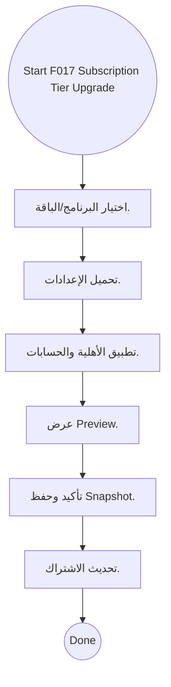
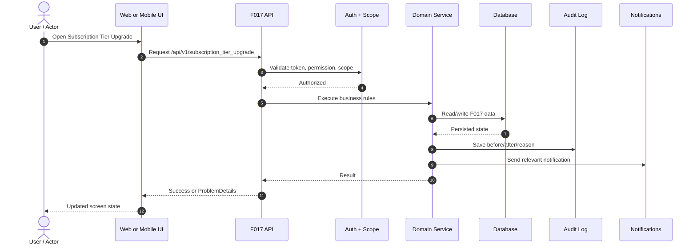
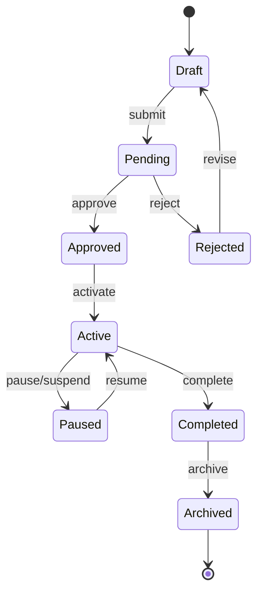
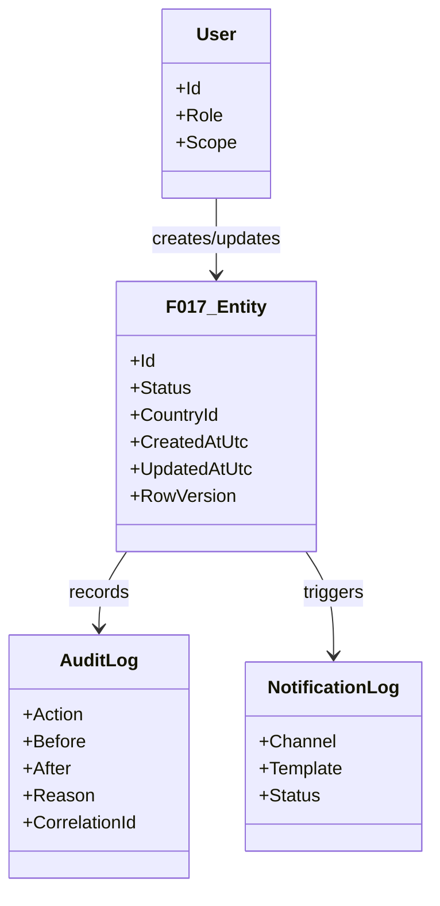

# F017 — Diagrams

> الرسومات بصيغة Mermaid ويمكن عرضها في GitHub أو أي محرر Markdown يدعم Mermaid.

## 1. Functional Flow

## 2. Sequence Diagram

## 3. State Diagram

## 4. Data Relationship Draft

