# M04 — المطاعم والتشغيل — التحليل الكامل

## Restaurant Operations

> Generated: 2026-06-15

## 1. الملخص التنفيذي
هذا الموديول يدير جاهزية المطعم وتشغيله اليومي: القوائم، الأسعار، المناطق، الطاقة، الطلبات اليومية، تأكيد 72 ساعة، الفواتير والباركود، التسليم للسائق، تقييمات المطعم، وإنهاء التعاقد.

## 2. نطاق الموديول
عدد الميزات داخل الموديول: **12**.

| ID | English | Arabic | Folder |
|---|---|---|---|
| F028 | Menu & Meal Management | إدارة القوائم والوجبات | [Folder](F028_menu_meal_management/README.md) |
| F029 | Restaurant Price Management | إدارة أسعار المطعم | [Folder](F029_restaurant_price_management/README.md) |
| F030 | Restaurant Service Regions | المناطق المخدومة | [Folder](F030_restaurant_service_regions/README.md) |
| F031 | Daily Capacity Management | الطاقة الاستيعابية اليومية | [Folder](F031_daily_capacity_management/README.md) |
| F032 | Busy Status Automation | حالة Busy التلقائية | [Folder](F032_busy_status_automation/README.md) |
| F033 | Restaurant Daily Orders | الطلبات اليومية للمطعم | [Folder](F033_restaurant_daily_orders/README.md) |
| F034 | Restaurant 72h Confirmation | تأكيد طلبات نافذة 72 ساعة | [Folder](F034_restaurant_72h_confirmation/README.md) |
| F035 | Invoices, Barcodes & Meal Labels | الفواتير والباركود وملصقات الوجبات | [Folder](F035_invoices_barcodes_meal_labels/README.md) |
| F036 | Order Handover to Driver | تسليم الطلب للسائق | [Folder](F036_order_handover_to_driver/README.md) |
| F037 | Restaurant Drivers Management | إدارة سائقي المطعم | [Folder](F037_restaurant_drivers_management/README.md) |
| F038 | Restaurant & Meal Ratings | تقييم المطعم والوجبة | [Folder](F038_restaurant_meal_ratings/README.md) |
| F039 | Restaurant Contract Termination | إنهاء تعاقد المطعم | [Folder](F039_restaurant_contract_termination/README.md) |

## 3. التحليل من ناحية Business
- المطعم ليس مجرد مورد، بل شريك تشغيل يومي داخل نموذج اشتراكات يحتاج التزامًا بالطاقة والجودة والمواعيد.
- اعتماد المطعم لا يكفي؛ يجب وجود Operational Readiness قبل الظهور في تقويم العملاء.
- الطاقة وحالة Busy يجب أن تمنع قبول طلبات لا يستطيع المطعم تنفيذها.
- تقييم المطعم وإنهاء التعاقد يجب أن يعتمدا على بيانات أداء موثقة وليس قرارات منفصلة.

## 4. التحليل من ناحية Logic / منطق التشغيل
- Menu وPriceList وCapacityRule تحتاج versioning حتى لا تتغير الطلبات المقفولة.
- Restaurant Daily Orders يجب أن ترتبط بقفل 72 ساعة والتأكيد خلال SLA واضح.
- Handover to Driver يجب أن يعتمد barcode/event حتى لا يحدث تسليم خاطئ.
- Busy automation يجب أن يكون قابلًا للتفسير ويقبل override موثقًا.

## 5. البيانات الأساسية المقترحة
- `Restaurant`
- `Menu`
- `Meal`
- `PriceList`
- `ServiceRegion`
- `CapacityRule`
- `DailyOrder`
- `HandoverEvent`

## 6. الاعتماد على الموديولات الأخرى
- M01 Identity
- M03 Calendar
- M05 Delivery
- M09 Restaurant Finance

## 7. أهم المخاطر
- مطعم غير جاهز يظهر للعملاء
- طلبات فوق الطاقة
- أسعار غير متزامنة
- تسليم خاطئ للسائق

## 8. ترتيب التنفيذ المقترح
- 1. F028
- 2. F029
- 3. F030
- 4. F031
- 5. F032
- 6. F034
- 7. F033
- 8. F035
- 9. F036
- 10. F037
- 11. F038
- 12. F039

## 9. Mermaid Overview

```mermaid
flowchart TD
    Core["12 Features"]
    F028["F028 Menu & Meal Management"]
    F029["F029 Restaurant Price Management"]
    F030["F030 Restaurant Service Regions"]
    F031["F031 Daily Capacity Management"]
    F032["F032 Busy Status Automation"]
    F033["F033 Restaurant Daily Orders"]
    F034["F034 Restaurant 72h Confirmation"]
    F035["F035 Invoices, Barcodes & Meal Labels"]
    F036["F036 Order Handover to Driver"]
    F037["F037 Restaurant Drivers Management"]
    F038["F038 Restaurant & Meal Ratings"]
    F039["F039 Restaurant Contract Termination"]
    Core --> F028
    Core --> F029
    Core --> F030
    Core --> F031
    Core --> F032
    Core --> F033
    Core --> F034
    Core --> F035
    Core --> F036
    Core --> F037
    Core --> F038
    Core --> F039
```

## 10. نقاط الضعف التفصيلية
راجع فهرس نقاط الضعف داخل الموديول:

[WEAKNESSES_INDEX.md](WEAKNESSES_INDEX.md)

## 11. توصية التنفيذ
ابدأ بالميزات التي تمسك القواعد والبيانات الأساسية، ثم انتقل للواجهات والحالات الاستثنائية. لا تبدأ تنفيذ واجهة نهائية قبل تثبيت state machine وAPI contract وdata model لكل ميزة حرجة.
