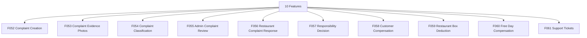

# M06 — الشكاوى والدعم — التحليل الكامل

## Complaints & Support

> Generated: 2026-06-15

## 1. الملخص التنفيذي
هذا الموديول يدير الشكاوى من لحظة الإنشاء وحتى القرار والتعويض أو الخصم. يشمل الأدلة، التصنيف، مراجعة الأدمن، رد المطعم، تحديد المسؤولية، تعويض العميل، خصم المطعم، اليوم المجاني، وتذاكر الدعم.

## 2. نطاق الموديول
عدد الميزات داخل الموديول: **10**.

| ID | English | Arabic | Folder |
|---|---|---|---|
| F052 | Complaint Creation | إنشاء شكوى | [Folder](F052_complaint_creation/README.md) |
| F053 | Complaint Evidence Photos | صور إثبات الشكوى | [Folder](F053_complaint_evidence_photos/README.md) |
| F054 | Complaint Classification | تصنيف الشكوى | [Folder](F054_complaint_classification/README.md) |
| F055 | Admin Complaint Review | مراجعة الأدمن للشكوى | [Folder](F055_admin_complaint_review/README.md) |
| F056 | Restaurant Complaint Response | رد المطعم على الشكوى | [Folder](F056_restaurant_complaint_response/README.md) |
| F057 | Responsibility Decision | تحديد المسؤولية | [Folder](F057_responsibility_decision/README.md) |
| F058 | Customer Compensation | تعويض العميل | [Folder](F058_customer_compensation/README.md) |
| F059 | Restaurant Box Deduction | خصم قيمة البوكس من المطعم | [Folder](F059_restaurant_box_deduction/README.md) |
| F060 | Free Day Compensation | إضافة يوم مجاني | [Folder](F060_free_day_compensation/README.md) |
| F061 | Support Tickets | تذاكر الدعم | [Folder](F061_support_tickets/README.md) |

## 3. التحليل من ناحية Business
- الشكاوى هي آلية حفظ الثقة بين العميل والمطعم والمنصة.
- سياسة التعويض والخصم يجب أن تكون عادلة وقابلة للتفسير.
- تصنيف الشكاوى يجب أن يوحد قرارات الدعم ويكشف المطاعم أو المناطق كثيرة المشاكل.
- التعويض والخصم يؤثران على المحاسبة ولا يجب التعامل معهما كتعليقات دعم فقط.

## 4. التحليل من ناحية Logic / منطق التشغيل
- Complaint lifecycle يجب أن يفرق بين Open, EvidenceSubmitted, UnderReview, RestaurantResponded, DecisionMade, Compensated, Closed.
- قرار المسؤولية يجب أن يكون immutable بعد الاعتماد إلا override.
- الأدلة يجب أن ترتبط بالشكوى ولا تحذف بعد القرار.
- كل تعويض أو خصم يجب أن ينتج business event للمحاسبة.

## 5. البيانات الأساسية المقترحة
- `Complaint`
- `ComplaintEvidence`
- `ComplaintClassification`
- `ResponsibilityDecision`
- `Compensation`
- `Deduction`
- `SupportTicket`

## 6. الاعتماد على الموديولات الأخرى
- M03 Calendar
- M04 Restaurants
- M05 Delivery
- M07 Accounting
- M08 Customer Finance
- M09 Restaurant Finance

## 7. أهم المخاطر
- تعويض غير عادل
- خصم غير موثق
- ضياع أدلة
- قرارات دعم متضاربة

## 8. ترتيب التنفيذ المقترح
- 1. F052
- 2. F053
- 3. F054
- 4. F055
- 5. F056
- 6. F057
- 7. F058
- 8. F059
- 9. F060
- 10. F061

## 9. Mermaid Overview

## 10. نقاط الضعف التفصيلية
راجع فهرس نقاط الضعف داخل الموديول:

[WEAKNESSES_INDEX.md](WEAKNESSES_INDEX.md)

## 11. توصية التنفيذ
ابدأ بالميزات التي تمسك القواعد والبيانات الأساسية، ثم انتقل للواجهات والحالات الاستثنائية. لا تبدأ تنفيذ واجهة نهائية قبل تثبيت state machine وAPI contract وdata model لكل ميزة حرجة.
