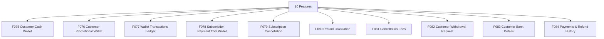

# M08 — النظام المالي للعميل — التحليل الكامل

## Customer Finance

> Generated: 2026-06-15

## 1. الملخص التنفيذي
هذا الموديول يدير محفظة العميل النقدية والترويجية، سجل الحركات، الدفع من المحفظة، الإلغاء، الاسترداد، رسوم الإلغاء، طلبات السحب، البيانات البنكية، وسجل المدفوعات والاستردادات.

## 2. نطاق الموديول
عدد الميزات داخل الموديول: **10**.

| ID | English | Arabic | Folder |
|---|---|---|---|
| F075 | Customer Cash Wallet | المحفظة النقدية | [Folder](F075_customer_cash_wallet/README.md) |
| F076 | Customer Promotional Wallet | المحفظة الترويجية | [Folder](F076_customer_promotional_wallet/README.md) |
| F077 | Wallet Transactions Ledger | سجل حركات المحفظة | [Folder](F077_wallet_transactions_ledger/README.md) |
| F078 | Subscription Payment from Wallet | دفع الاشتراك من المحفظة | [Folder](F078_subscription_payment_from_wallet/README.md) |
| F079 | Subscription Cancellation | إلغاء الاشتراك | [Folder](F079_subscription_cancellation/README.md) |
| F080 | Refund Calculation | حساب الاسترداد | [Folder](F080_refund_calculation/README.md) |
| F081 | Cancellation Fees | رسوم الإلغاء | [Folder](F081_cancellation_fees/README.md) |
| F082 | Customer Withdrawal Request | طلب سحب العميل | [Folder](F082_customer_withdrawal_request/README.md) |
| F083 | Customer Bank Details | البيانات البنكية للعميل | [Folder](F083_customer_bank_details/README.md) |
| F084 | Payments & Refund History | سجل المدفوعات والاستردادات | [Folder](F084_payments_refund_history/README.md) |

## 3. التحليل من ناحية Business
- محفظة العميل تمس الثقة مباشرة، وأي خطأ صغير قد يتحول إلى نزاع كبير.
- الرصيد النقدي والترويجي يجب أن يكونا منفصلين في الاستخدام والاسترداد.
- سياسة الإلغاء والاسترداد يجب أن تكون واضحة قبل الدفع.
- السحب والبيانات البنكية يحتاجان حوكمة وخصوصية عالية.

## 4. التحليل من ناحية Logic / منطق التشغيل
- Wallet ledger يجب أن يكون append-only.
- استخدام الرصيد يحتاج priority policy بين cash وpromo.
- Refund calculation يجب أن يعتمد على snapshot الاشتراك والأيام المستخدمة.
- Withdrawal request يحتاج حالات approval/payment/rejection واضحة.

## 5. البيانات الأساسية المقترحة
- `CustomerWallet`
- `WalletLedger`
- `WalletTransaction`
- `Refund`
- `CancellationFee`
- `WithdrawalRequest`
- `BankDetail`

## 6. الاعتماد على الموديولات الأخرى
- M02 Subscriptions
- M03 Calendar
- M07 Accounting
- M12 Admin Dashboard

## 7. أهم المخاطر
- رصيد خاطئ
- استرداد زائد
- استخدام خاطئ للرصيد الترويجي
- تسريب بيانات بنكية

## 8. ترتيب التنفيذ المقترح
- 1. F075
- 2. F076
- 3. F077
- 4. F078
- 5. F079
- 6. F080
- 7. F081
- 8. F082
- 9. F083
- 10. F084

## 9. Mermaid Overview

## 10. نقاط الضعف التفصيلية
راجع فهرس نقاط الضعف داخل الموديول:

[WEAKNESSES_INDEX.md](WEAKNESSES_INDEX.md)

## 11. توصية التنفيذ
ابدأ بالميزات التي تمسك القواعد والبيانات الأساسية، ثم انتقل للواجهات والحالات الاستثنائية. لا تبدأ تنفيذ واجهة نهائية قبل تثبيت state machine وAPI contract وdata model لكل ميزة حرجة.
