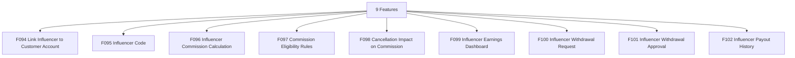

# M10 — نظام المؤثرين — التحليل الكامل

## Influencers

> Generated: 2026-06-15

## 1. الملخص التنفيذي
هذا الموديول يدير نظام المؤثرين: ربط المؤثر بالعميل، الأكواد، احتساب العمولة، شروط الاستحقاق، أثر الإلغاء، لوحة الأرباح، طلبات السحب، الموافقة على السحب، وسجل المدفوعات.

## 2. نطاق الموديول
عدد الميزات داخل الموديول: **9**.

| ID | English | Arabic | Folder |
|---|---|---|---|
| F094 | Link Influencer to Customer Account | ربط المؤثر بحساب العميل | [Folder](F094_link_influencer_to_customer_account/README.md) |
| F095 | Influencer Code | كود المؤثر | [Folder](F095_influencer_code/README.md) |
| F096 | Influencer Commission Calculation | حساب عمولة المؤثر | [Folder](F096_influencer_commission_calculation/README.md) |
| F097 | Commission Eligibility Rules | شروط استحقاق العمولة | [Folder](F097_commission_eligibility_rules/README.md) |
| F098 | Cancellation Impact on Commission | تأثير الإلغاء على العمولة | [Folder](F098_cancellation_impact_on_commission/README.md) |
| F099 | Influencer Earnings Dashboard | لوحة أرباح المؤثر | [Folder](F099_influencer_earnings_dashboard/README.md) |
| F100 | Influencer Withdrawal Request | طلب تحصيل المؤثر | [Folder](F100_influencer_withdrawal_request/README.md) |
| F101 | Influencer Withdrawal Approval | اعتماد تحصيل المؤثر | [Folder](F101_influencer_withdrawal_approval/README.md) |
| F102 | Influencer Payout History | سجل مدفوعات المؤثر | [Folder](F102_influencer_payout_history/README.md) |

## 3. التحليل من ناحية Business
- المؤثرون قناة نمو، لكنها قد تتحول إلى تكلفة عالية بدون attribution وشروط استحقاق دقيقة.
- العمولة يجب أن ترتبط بقيمة حقيقية مثل دفع العميل أو استمرار الاشتراك.
- أثر الإلغاء على العمولة يجب أن يكون واضحًا قبل الصرف.
- لوحة أرباح المؤثر يجب أن تفرق بين رصيد تقديري ورصيد قابل للسحب.

## 4. التحليل من ناحية Logic / منطق التشغيل
- Influencer code يجب أن يكون unique وله lifecycle.
- Commission eligibility يجب أن يمر بشروط واضحة.
- Cancellation impact يجب أن يوقف أو يعكس العمولة قبل الصرف.
- Withdrawal يجب أن يعتمد على available balance فقط.

## 5. البيانات الأساسية المقترحة
- `Influencer`
- `InfluencerCode`
- `ReferralAttribution`
- `Commission`
- `EligibilityRule`
- `WithdrawalRequest`
- `InfluencerPayout`

## 6. الاعتماد على الموديولات الأخرى
- M01 Identity
- M02 Subscriptions
- M07 Accounting

## 7. أهم المخاطر
- self-referral
- عمولات غير مستحقة
- نزاعات مؤثرين
- سحب رصيد غير مؤكد

## 8. ترتيب التنفيذ المقترح
- 1. F094
- 2. F095
- 3. F097
- 4. F096
- 5. F098
- 6. F099
- 7. F100
- 8. F101
- 9. F102

## 9. Mermaid Overview

## 10. نقاط الضعف التفصيلية
راجع فهرس نقاط الضعف داخل الموديول:

[WEAKNESSES_INDEX.md](WEAKNESSES_INDEX.md)

## 11. توصية التنفيذ
ابدأ بالميزات التي تمسك القواعد والبيانات الأساسية، ثم انتقل للواجهات والحالات الاستثنائية. لا تبدأ تنفيذ واجهة نهائية قبل تثبيت state machine وAPI contract وdata model لكل ميزة حرجة.
