# M11 — الحملات التشاركية — التحليل الكامل

## Collaborative Campaigns

> Generated: 2026-06-15

## 1. الملخص التنفيذي
هذا الموديول يدير الحملات التشاركية بين MealMate والمطاعم: إنشاء الحملة، توزيع الخصم، البرامج والباقات، انضمام المطاعم، الطاقة، سقف المشتركين، المراجعة، الاعتماد، الإطلاق، الإيقاف، الحسابات، والتقارير.

## 2. نطاق الموديول
عدد الميزات داخل الموديول: **15**.

| ID | English | Arabic | Folder |
|---|---|---|---|
| F103 | Collaborative Campaign Creation | إنشاء الحملة التشاركية | [Folder](F103_collaborative_campaign_creation/README.md) |
| F104 | Campaign Discount Split | توزيع خصم الحملة | [Folder](F104_campaign_discount_split/README.md) |
| F105 | Campaign Programs | برامج الحملة | [Folder](F105_campaign_programs/README.md) |
| F106 | Campaign Bundles | باقات الحملة | [Folder](F106_campaign_bundles/README.md) |
| F107 | Open Restaurant Enrollment | فتح انضمام المطاعم | [Folder](F107_open_restaurant_enrollment/README.md) |
| F108 | Restaurant Campaign Enrollment | انضمام المطعم للحملة | [Folder](F108_restaurant_campaign_enrollment/README.md) |
| F109 | Restaurant Campaign Capacity | طاقة المطعم داخل الحملة | [Folder](F109_restaurant_campaign_capacity/README.md) |
| F110 | Campaign Subscriber Cap | سقف مشتركي الحملة | [Folder](F110_campaign_subscriber_cap/README.md) |
| F111 | Campaign Capacity Review | مراجعة طاقة الحملة | [Folder](F111_campaign_capacity_review/README.md) |
| F112 | Campaign Restaurant Approval | اعتماد مطاعم الحملة | [Folder](F112_campaign_restaurant_approval/README.md) |
| F113 | Campaign Launch | إطلاق الحملة | [Folder](F113_campaign_launch/README.md) |
| F114 | Campaign Pause | إيقاف الحملة مؤقتًا | [Folder](F114_campaign_pause/README.md) |
| F115 | Increase Campaign Subscriber Cap | زيادة سقف المشتركين | [Folder](F115_increase_campaign_subscriber_cap/README.md) |
| F116 | Campaign Accounting | الحسابات المالية للحملة | [Folder](F116_campaign_accounting/README.md) |
| F117 | Campaign Reports | تقارير الحملة | [Folder](F117_campaign_reports/README.md) |

## 3. التحليل من ناحية Business
- الحملات تمس النمو والربحية والطاقة التشغيلية في نفس الوقت.
- توزيع الخصم يجب أن يحدد من يتحمل التكلفة: المنصة، المطعم، أو الاثنين.
- سقف المشتركين يجب أن يرتبط بالطاقة والميزانية وليس رقمًا يدويًا فقط.
- انضمام المطاعم للحملة يجب أن يراجع جاهزيتها وقدرتها قبل الإطلاق.

## 4. التحليل من ناحية Logic / منطق التشغيل
- Campaign lifecycle يجب أن يمر بـ Draft, EnrollmentOpen, UnderReview, Approved, Launched, Paused, Completed.
- زيادة السقف يجب أن تعيد فحص الطاقة والميزانية.
- إيقاف الحملة يجب أن يحدد أثره على العملاء الحاليين والجدد.
- Campaign accounting يجب أن ينتج events واضحة للمحاسبة.

## 5. البيانات الأساسية المقترحة
- `Campaign`
- `CampaignDiscountSplit`
- `CampaignBundle`
- `RestaurantEnrollment`
- `CampaignCapacity`
- `SubscriberCap`
- `CampaignAccounting`

## 6. الاعتماد على الموديولات الأخرى
- M02 Subscriptions
- M04 Restaurants
- M07 Accounting
- M09 Restaurant Finance
- M12 Admin Dashboard

## 7. أهم المخاطر
- حملة غير مربحة
- طاقة غير كافية
- خصم غير محسوب
- إطلاق قبل جاهزية المطاعم

## 8. ترتيب التنفيذ المقترح
- 1. F103
- 2. F104
- 3. F105
- 4. F106
- 5. F107
- 6. F108
- 7. F109
- 8. F110
- 9. F111
- 10. F112
- 11. F113
- 12. F114
- 13. F115
- 14. F116
- 15. F117

## 9. Mermaid Overview

```mermaid
flowchart TD
    Core["15 Features"]
    F103["F103 Collaborative Campaign Creation"]
    F104["F104 Campaign Discount Split"]
    F105["F105 Campaign Programs"]
    F106["F106 Campaign Bundles"]
    F107["F107 Open Restaurant Enrollment"]
    F108["F108 Restaurant Campaign Enrollment"]
    F109["F109 Restaurant Campaign Capacity"]
    F110["F110 Campaign Subscriber Cap"]
    F111["F111 Campaign Capacity Review"]
    F112["F112 Campaign Restaurant Approval"]
    F113["F113 Campaign Launch"]
    F114["F114 Campaign Pause"]
    F115["F115 Increase Campaign Subscriber Cap"]
    F116["F116 Campaign Accounting"]
    F117["F117 Campaign Reports"]
    Core --> F103
    Core --> F104
    Core --> F105
    Core --> F106
    Core --> F107
    Core --> F108
    Core --> F109
    Core --> F110
    Core --> F111
    Core --> F112
    Core --> F113
    Core --> F114
    Core --> F115
    Core --> F116
    Core --> F117
```

## 10. نقاط الضعف التفصيلية
راجع فهرس نقاط الضعف داخل الموديول:

[WEAKNESSES_INDEX.md](WEAKNESSES_INDEX.md)

## 11. توصية التنفيذ
ابدأ بالميزات التي تمسك القواعد والبيانات الأساسية، ثم انتقل للواجهات والحالات الاستثنائية. لا تبدأ تنفيذ واجهة نهائية قبل تثبيت state machine وAPI contract وdata model لكل ميزة حرجة.
