# M12 — لوحة تحكم الأدمن — التحليل الكامل

## Admin Dashboard

> Generated: 2026-06-15

## 1. الملخص التنفيذي
هذا الموديول هو مركز التحكم والمراقبة: نظرة عامة، الاعتمادات، العمليات، حالات 72 ساعة وBusy وHold، الشكاوى، المالية، تنبيهات الربحية، التقارير، الإعدادات، الصلاحيات، سجلات التدقيق، الإشعارات، وKPIs.

## 2. نطاق الموديول
عدد الميزات داخل الموديول: **15**.

| ID | English | Arabic | Folder |
|---|---|---|---|
| F118 | Admin Dashboard Overview | نظرة عامة للوحة الأدمن | [Folder](F118_admin_dashboard_overview/README.md) |
| F119 | Pending Approvals | الاعتمادات المعلقة | [Folder](F119_pending_approvals/README.md) |
| F120 | Operations Monitoring | متابعة التشغيل | [Folder](F120_operations_monitoring/README.md) |
| F121 | 72h Operations Monitoring | متابعة نافذة 72 ساعة | [Folder](F121_72h_operations_monitoring/README.md) |
| F122 | Busy Monitoring | متابعة حالات Busy | [Folder](F122_busy_monitoring/README.md) |
| F123 | Hold Cases Monitoring | متابعة حالات Hold | [Folder](F123_hold_cases_monitoring/README.md) |
| F124 | Complaints Center | مركز الشكاوى | [Folder](F124_complaints_center/README.md) |
| F125 | Finance Dashboard | لوحة المالية | [Folder](F125_finance_dashboard/README.md) |
| F126 | Profitability Alerts | تنبيهات الربحية | [Folder](F126_profitability_alerts/README.md) |
| F127 | Admin Reports | التقارير | [Folder](F127_admin_reports/README.md) |
| F128 | System Settings | إعدادات النظام | [Folder](F128_system_settings/README.md) |
| F129 | Roles & Permissions Administration | إدارة الأدوار والصلاحيات | [Folder](F129_roles_permissions_administration/README.md) |
| F130 | Audit Logs Viewer | عرض سجلات التدقيق | [Folder](F130_audit_logs_viewer/README.md) |
| F131 | Notifications Center | مركز الإشعارات | [Folder](F131_notifications_center/README.md) |
| F132 | KPI Dashboard | لوحة مؤشرات الأداء | [Folder](F132_kpi_dashboard/README.md) |

## 3. التحليل من ناحية Business
- لوحة الأدمن يجب أن تحول البيانات إلى قرارات، لا مجرد عرض أرقام.
- كل dashboard metric يحتاج owner وتعريف حساب ومصدر بيانات.
- الإعدادات والصلاحيات أخطر أجزاء اللوحة وتحتاج حوكمة ومراجعة.
- التنبيهات يجب أن تكون قابلة للتنفيذ ولها SLA ومسؤول.

## 4. التحليل من ناحية Logic / منطق التشغيل
- كل widget يحتاج refresh policy وتعريف calculation.
- أي action من الداشبورد يجب أن يمر عبر RBAC وAudit.
- Approvals وmonitoring يجب أن ترتبط بالموديولات الأصلية لا نسخ بيانات منفصلة.
- Reports يجب أن تفرق بين operational real-time وfinancial closed periods.

## 5. البيانات الأساسية المقترحة
- `DashboardWidget`
- `ApprovalQueue`
- `OperationalMetric`
- `FinanceMetric`
- `Alert`
- `ReportDefinition`
- `SystemSetting`
- `AuditView`

## 6. الاعتماد على الموديولات الأخرى
- All Modules
- M01 RBAC
- M07 Accounting
- M08/M09 Finance
- M06 Support

## 7. أهم المخاطر
- أرقام مضللة
- إعدادات خطرة بلا audit
- صلاحيات زائدة
- تنبيهات كثيرة بلا مسؤولية

## 8. ترتيب التنفيذ المقترح
- 1. F118
- 2. F119
- 3. F120
- 4. F121
- 5. F122
- 6. F123
- 7. F124
- 8. F125
- 9. F126
- 10. F127
- 11. F128
- 12. F129
- 13. F130
- 14. F131
- 15. F132

## 9. Mermaid Overview

```mermaid
flowchart TD
    Core["15 Features"]
    F118["F118 Admin Dashboard Overview"]
    F119["F119 Pending Approvals"]
    F120["F120 Operations Monitoring"]
    F121["F121 72h Operations Monitoring"]
    F122["F122 Busy Monitoring"]
    F123["F123 Hold Cases Monitoring"]
    F124["F124 Complaints Center"]
    F125["F125 Finance Dashboard"]
    F126["F126 Profitability Alerts"]
    F127["F127 Admin Reports"]
    F128["F128 System Settings"]
    F129["F129 Roles & Permissions Administration"]
    F130["F130 Audit Logs Viewer"]
    F131["F131 Notifications Center"]
    F132["F132 KPI Dashboard"]
    Core --> F118
    Core --> F119
    Core --> F120
    Core --> F121
    Core --> F122
    Core --> F123
    Core --> F124
    Core --> F125
    Core --> F126
    Core --> F127
    Core --> F128
    Core --> F129
    Core --> F130
    Core --> F131
    Core --> F132
```

## 10. نقاط الضعف التفصيلية
راجع فهرس نقاط الضعف داخل الموديول:

[WEAKNESSES_INDEX.md](WEAKNESSES_INDEX.md)

## 11. توصية التنفيذ
ابدأ بالميزات التي تمسك القواعد والبيانات الأساسية، ثم انتقل للواجهات والحالات الاستثنائية. لا تبدأ تنفيذ واجهة نهائية قبل تثبيت state machine وAPI contract وdata model لكل ميزة حرجة.
