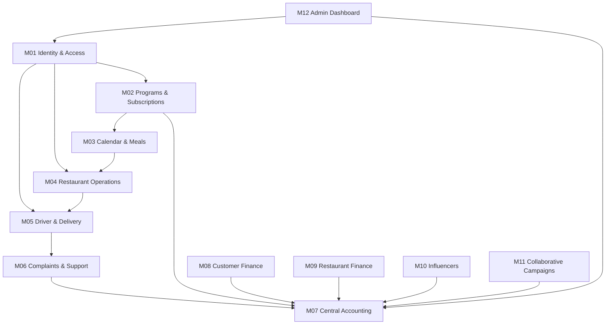

# MealMate — Project Analysis

## الملخص
MealMate هو نظام اشتراكات غذائية يعتمد على عدة محاور مترابطة: الحسابات والوصول، الاشتراكات، التقويم والوجبات، تشغيل المطاعم، التوصيل، الشكاوى، المحاسبة، المحافظ، مستحقات المطاعم، المؤثرين، الحملات، ولوحة الأدمن.

## النطاق
- عدد الموديولات: **12**
- عدد الميزات: **132**
- كل ميزة لها تحليل، معالجة فجوات، spec بعد التصليح، اختبارات قبول، وdiagrams.

## مبادئ التصحيح المعتمدة
- كل ميزة لها Business Owner وOperational Owner مقترحان.
- كل عملية حساسة مربوطة بـ RBAC + Scope + Audit.
- كل انتقال حالة يحتاج State Machine واضحة.
- كل API يحتاج request/response contract وProblemDetails.
- كل أثر مالي يتحول إلى Business Event ولا يعدل الأرصدة مباشرة.
- كل قرار قابل للمراجعة من خلال before/after/reason/correlation id.
- كل ميزة لها Acceptance Criteria واختبارات قابلة للتنفيذ.

## الاعتمادية العامة

