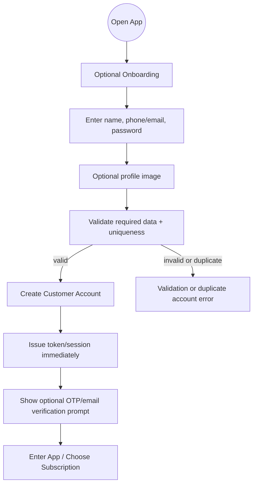
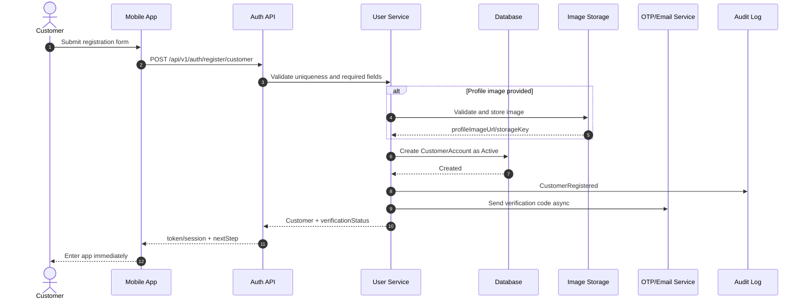
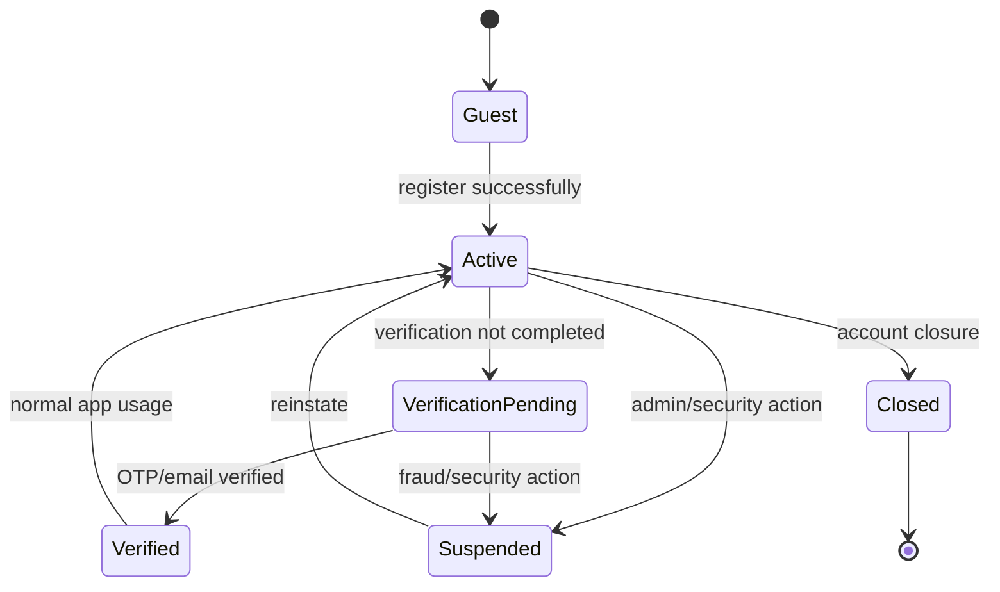
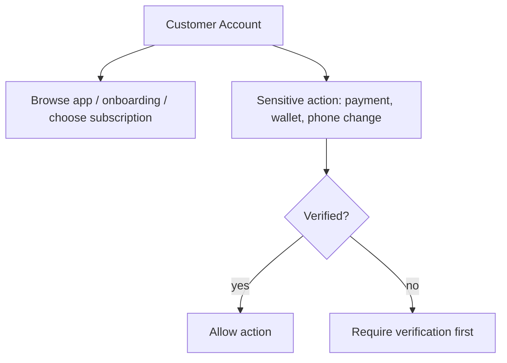
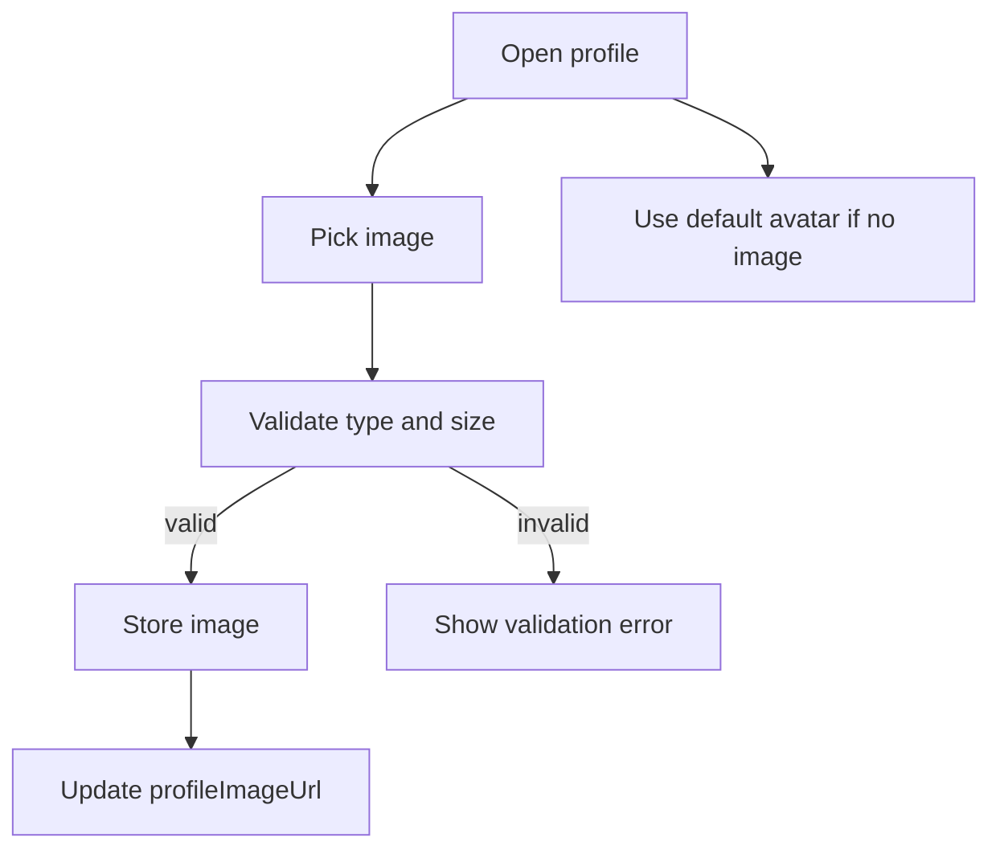

# F001 — Diagrams

## 1. Customer Registration Flow

```mermaid
flowchart TD
    Start(("Open App"))
    Onboarding["Optional Onboarding"]
    Register["Enter name, phone/email, password"]
    Photo["Optional profile image"]
    Validate["Validate required data + uniqueness"]
    Create["Create Customer Account"]
    Session["Issue token/session immediately"]
    VerifyPrompt["Show optional OTP/email verification prompt"]
    Home["Enter App / Choose Subscription"]
    Error["Validation or duplicate account error"]

    Start --> Onboarding
    Onboarding --> Register
    Register --> Photo
    Photo --> Validate
    Validate -->|valid| Create
    Validate -->|invalid or duplicate| Error
    Create --> Session
    Session --> VerifyPrompt
    VerifyPrompt --> Home
```

## 2. Sequence Diagram

```mermaid
sequenceDiagram
    autonumber
    actor Customer
    participant App as Mobile App
    participant Auth as Auth API
    participant UserSvc as User Service
    participant DB as Database
    participant Storage as Image Storage
    participant OTP as OTP/Email Service
    participant Audit as Audit Log

    Customer->>App: Submit registration form
    App->>Auth: POST /api/v1/auth/register/customer
    Auth->>UserSvc: Validate uniqueness and required fields
    alt Profile image provided
        UserSvc->>Storage: Validate and store image
        Storage-->>UserSvc: profileImageUrl/storageKey
    end
    UserSvc->>DB: Create CustomerAccount as Active
    DB-->>UserSvc: Created
    UserSvc->>Audit: CustomerRegistered
    UserSvc->>OTP: Send verification code async
    UserSvc-->>Auth: Customer + verificationStatus
    Auth-->>App: token/session + nextStep
    App-->>Customer: Enter app immediately
```

## 3. Customer State Diagram

```mermaid
stateDiagram-v2
    [*] --> Guest
    Guest --> Active: register successfully
    Active --> VerificationPending: verification not completed
    VerificationPending --> Verified: OTP/email verified
    Verified --> Active: normal app usage
    Active --> Suspended: admin/security action
    VerificationPending --> Suspended: fraud/security action
    Suspended --> Active: reinstate
    Active --> Closed: account closure
    Closed --> [*]
```

## 4. Access Rules

```mermaid
flowchart TD
    Customer["Customer Account"]
    PublicApp["Browse app / onboarding / choose subscription"]
    Sensitive["Sensitive action: payment, wallet, phone change"]
    Verified{"Verified?"}
    Allow["Allow action"]
    RequireOtp["Require verification first"]

    Customer --> PublicApp
    Customer --> Sensitive
    Sensitive --> Verified
    Verified -->|yes| Allow
    Verified -->|no| RequireOtp
```

## 5. Profile Image Flow

```mermaid
flowchart TD
    Profile["Open profile"]
    Pick["Pick image"]
    Validate["Validate type and size"]
    Store["Store image"]
    Update["Update profileImageUrl"]
    Placeholder["Use default avatar if no image"]
    Error["Show validation error"]

    Profile --> Pick
    Profile --> Placeholder
    Pick --> Validate
    Validate -->|valid| Store
    Validate -->|invalid| Error
    Store --> Update
```
