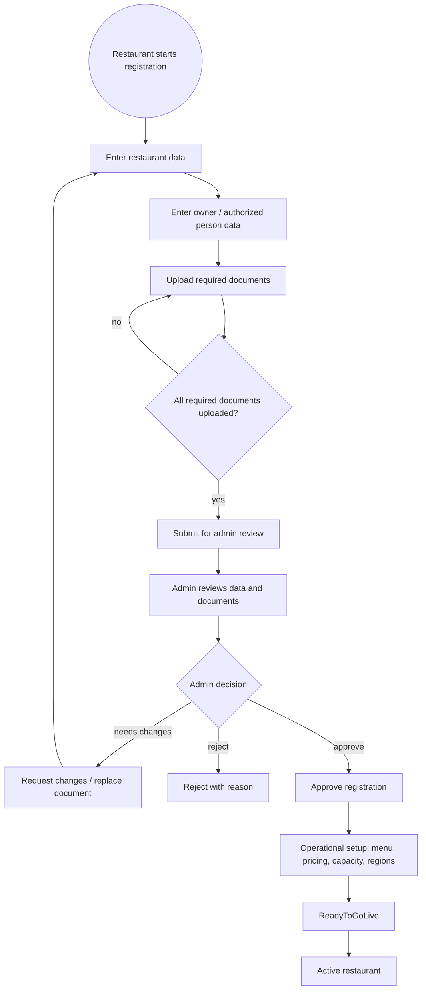
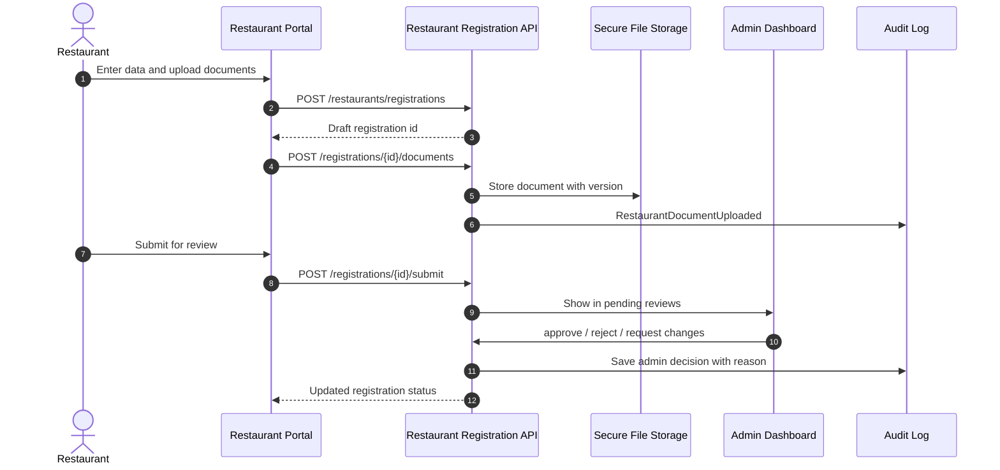
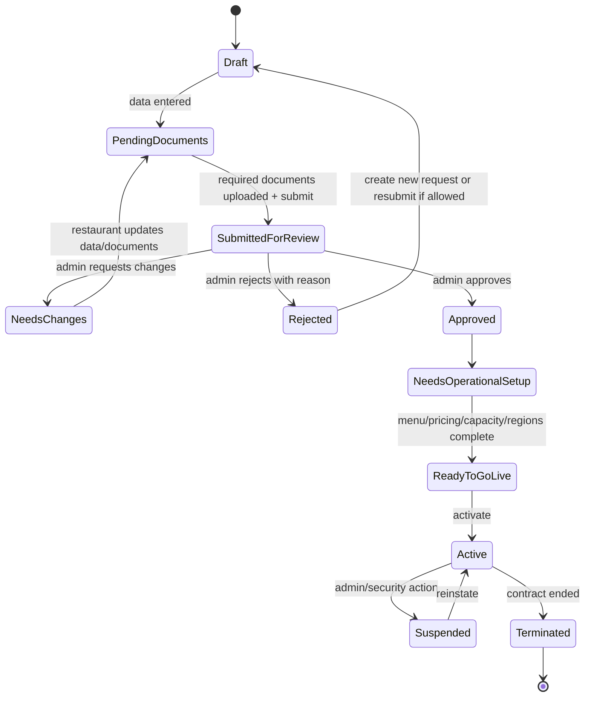
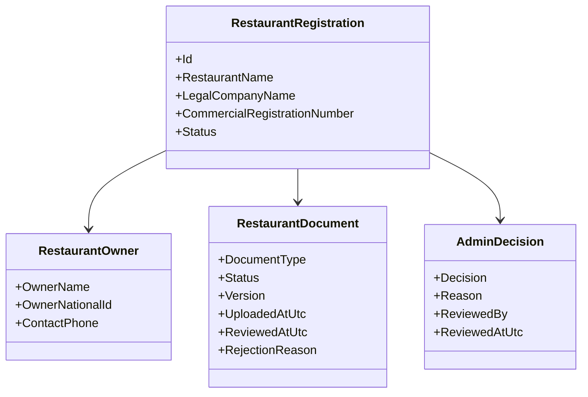

# F002 — Diagrams

## 1. Restaurant Registration Flow

```mermaid
flowchart TD
    Start(("Restaurant starts registration"))
    Data["Enter restaurant data"]
    Owner["Enter owner / authorized person data"]
    Docs["Upload required documents"]
    Check{"All required documents uploaded?"}
    Submit["Submit for admin review"]
    AdminReview["Admin reviews data and documents"]
    Decision{"Admin decision"}
    Changes["Request changes / replace document"]
    Reject["Reject with reason"]
    Approve["Approve registration"]
    Setup["Operational setup: menu, pricing, capacity, regions"]
    GoLive["ReadyToGoLive"]
    Active["Active restaurant"]

    Start --> Data
    Data --> Owner
    Owner --> Docs
    Docs --> Check
    Check -->|no| Docs
    Check -->|yes| Submit
    Submit --> AdminReview
    AdminReview --> Decision
    Decision -->|needs changes| Changes
    Changes --> Data
    Decision -->|reject| Reject
    Decision -->|approve| Approve
    Approve --> Setup
    Setup --> GoLive
    GoLive --> Active
```

## 2. Document Review Sequence

```mermaid
sequenceDiagram
    autonumber
    actor Restaurant
    participant Portal as Restaurant Portal
    participant API as Restaurant Registration API
    participant Storage as Secure File Storage
    participant Admin as Admin Dashboard
    participant Audit as Audit Log

    Restaurant->>Portal: Enter data and upload documents
    Portal->>API: POST /restaurants/registrations
    API-->>Portal: Draft registration id
    Portal->>API: POST /registrations/{id}/documents
    API->>Storage: Store document with version
    API->>Audit: RestaurantDocumentUploaded
    Restaurant->>Portal: Submit for review
    Portal->>API: POST /registrations/{id}/submit
    API->>Admin: Show in pending reviews
    Admin->>API: approve / reject / request changes
    API->>Audit: Save admin decision with reason
    API-->>Portal: Updated registration status
```

## 3. Restaurant Registration State Diagram

```mermaid
stateDiagram-v2
    [*] --> Draft
    Draft --> PendingDocuments: data entered
    PendingDocuments --> SubmittedForReview: required documents uploaded + submit
    SubmittedForReview --> NeedsChanges: admin requests changes
    NeedsChanges --> PendingDocuments: restaurant updates data/documents
    SubmittedForReview --> Rejected: admin rejects with reason
    Rejected --> Draft: create new request or resubmit if allowed
    SubmittedForReview --> Approved: admin approves
    Approved --> NeedsOperationalSetup
    NeedsOperationalSetup --> ReadyToGoLive: menu/pricing/capacity/regions complete
    ReadyToGoLive --> Active: activate
    Active --> Suspended: admin/security action
    Suspended --> Active: reinstate
    Active --> Terminated: contract ended
    Terminated --> [*]
```

## 4. Required Documents

```mermaid
classDiagram
    class RestaurantRegistration {
      +Id
      +RestaurantName
      +LegalCompanyName
      +CommercialRegistrationNumber
      +Status
    }
    class RestaurantOwner {
      +OwnerName
      +OwnerNationalId
      +ContactPhone
    }
    class RestaurantDocument {
      +DocumentType
      +Status
      +Version
      +UploadedAtUtc
      +ReviewedAtUtc
      +RejectionReason
    }
    class AdminDecision {
      +Decision
      +Reason
      +ReviewedBy
      +ReviewedAtUtc
    }

    RestaurantRegistration --> RestaurantOwner
    RestaurantRegistration --> RestaurantDocument
    RestaurantRegistration --> AdminDecision
```
