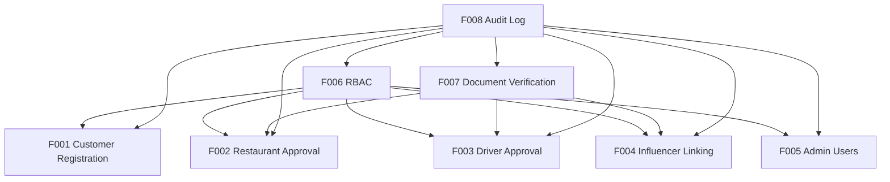
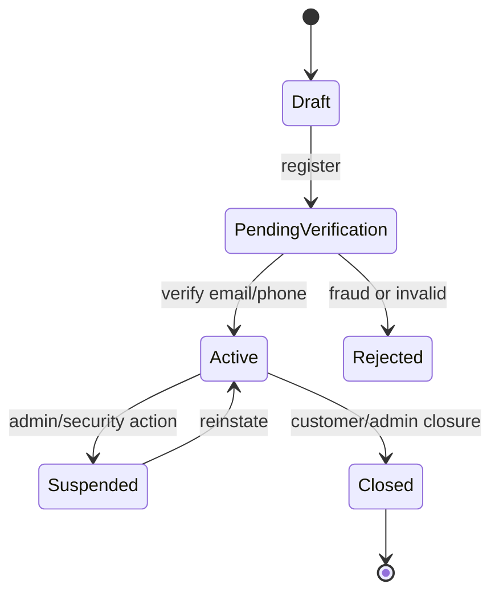
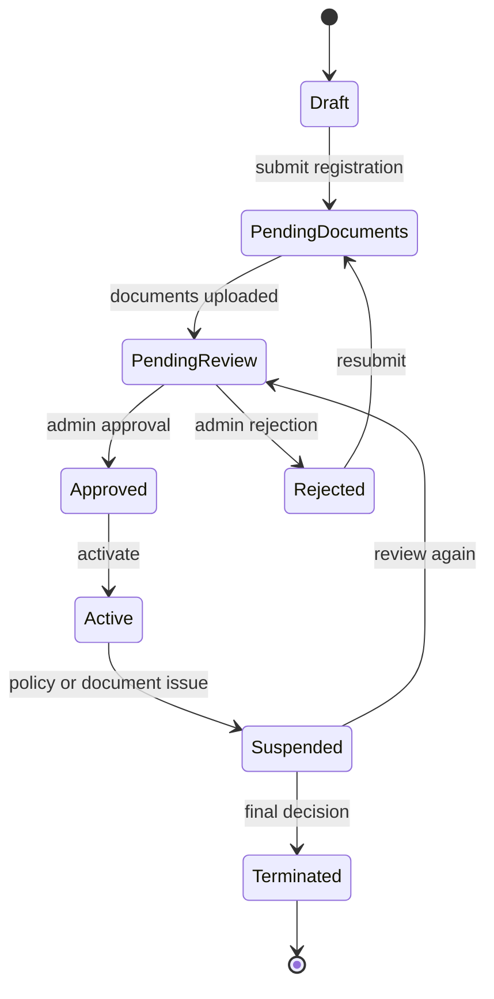
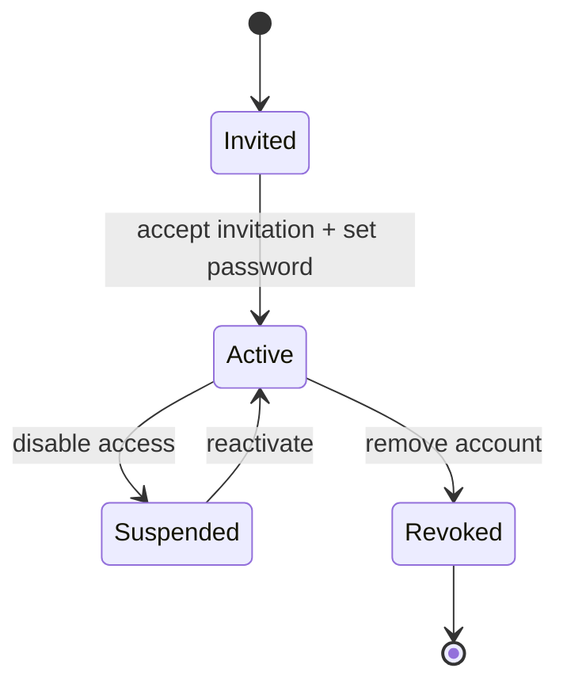
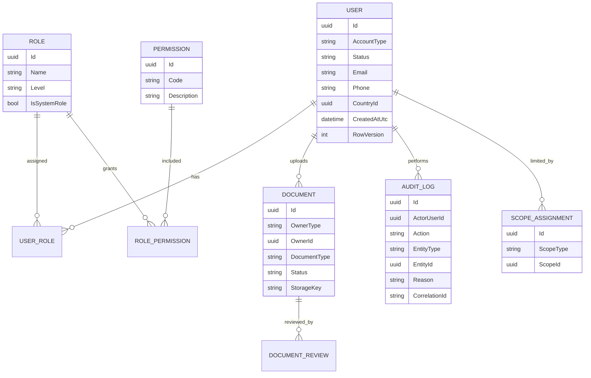

# M01 — التحليل الكامل لموديول إدارة الحسابات والوصول

## 1. الملخص التنفيذي
موديول **M01 Identity & Access** هو بوابة الدخول والتحكم في MealMate. نجاحه شرط أساسي لباقي الموديولات، لأنه يحدد من يدخل النظام، ما نوع حسابه، ما حالته، ما صلاحياته، وما الذي يستطيع الوصول إليه حسب الدولة والمنطقة والكيان المرتبط به.

الموديول لا يجب التعامل معه كـ "تسجيل دخول" فقط. هو طبقة أمن وتشغيل كاملة تشمل:
- تسجيل العملاء والمطاعم والسائقين والمؤثرين.
- اعتماد المطاعم والسائقين قبل تفعيلهم.
- إدارة مستخدمي الأدمن.
- RBAC مبني على Role + Permission + Scope.
- التحقق من الوثائق.
- سجل تدقيق مركزي لكل العمليات الحساسة.

## 2. تقييم الحالة الحالية
الحالة الحالية للتوثيق جيدة كبداية، لكنها ما زالت **Draft for Review** وتحتاج تحويلها من قالب عام إلى مواصفات تنفيذ دقيقة.

### نقاط القوة
- وجود 8 Features واضحة ومترابطة.
- وجود IDs ثابتة من F001 إلى F008.
- توحيد مفاهيم مهمة مثل Permission، Scope، AuditLog، Document.
- إدراج Idempotency وProblem Details وCorrelation ID كمعايير API.
- وجود قبول مبدئي بفكرة أن الـ Backend هو المصدر النهائي للحسابات.

### نقاط الضعف العامة
- ملفات الميزات متشابهة جدًا، ولا تفصل خصوصية كل Actor بشكل كاف.
- لا يوجد State Machine تفصيلي لكل نوع حساب.
- API contracts ناقصة: لا توجد request/response schemas أو error payloads.
- نموذج البيانات مذكور كأسماء كيانات فقط بدون علاقات أو قيود.
- الصلاحيات مكتوبة Feature-level، لكنها لا تكفي لتطبيق RBAC حقيقي.
- لا يوجد قرار واضح لـ SLA الاعتماد، Retention، وإجراءات الرفض/إعادة التقديم.

## 3. خريطة الميزات
| ID | الميزة | الغرض | الأولوية |
|---|---|---|---|
| F001 | Customer Registration, Login & Onboarding | تسجيل ودخول العميل وبدء التجربة | P0 |
| F002 | Restaurant Registration & Approval | تسجيل المطعم واعتماده قبل التشغيل | P0 |
| F003 | Driver Registration & Approval | تسجيل السائق واعتماد الوثائق والحالة | P0 |
| F004 | Influencer Registration & Account Linking | إنشاء وربط حساب المؤثر بكود/حساب عميل | P1 |
| F005 | Admin Users Management | إدارة حسابات الأدمن الداخلية | P0 |
| F006 | Roles, Permissions & Scopes (RBAC) | التحكم في الوصول والصلاحيات والنطاق | P0 |
| F007 | Document Verification | التحقق من الوثائق وربطها بالاعتماد | P0 |
| F008 | System Audit Log | تتبع كل العمليات الحساسة | P0 |

### روابط نقاط الضعف التفصيلية
| ID | ملف نقاط الضعف |
|---|---|
| F001 | [Customer Registration Weaknesses](F001_customer_registration_login_onboarding/01_weaknesses.md) |
| F002 | [Restaurant Registration Weaknesses](F002_restaurant_registration_approval/01_weaknesses.md) |
| F003 | [Driver Registration Weaknesses](F003_driver_registration_approval/01_weaknesses.md) |
| F004 | [Influencer Linking Weaknesses](F004_influencer_registration_account_linking/01_weaknesses.md) |
| F005 | [Admin Users Weaknesses](F005_admin_users_management/01_weaknesses.md) |
| F006 | [RBAC Weaknesses](F006_roles_permissions_scopes_rbac/01_weaknesses.md) |
| F007 | [Document Verification Weaknesses](F007_document_verification/01_weaknesses.md) |
| F008 | [Audit Log Weaknesses](F008_system_audit_log/01_weaknesses.md) |

## 4. التحليل الوظيفي حسب نوع المستخدم
### العميل
العميل يحتاج onboarding سريع، تسجيل بسيط، تحقق من الهاتف أو البريد، ثم دخول إلى الاشتراك والتقويم. لا يحتاج اعتماد أدمن قبل التفعيل، لكن يحتاج قيود أمان قوية على الحساب والمحفظة والبيانات الشخصية.

أهم المتطلبات:
- email/phone unique.
- password policy أو social login لاحقًا.
- OTP verification عند الحاجة.
- دعم اللغة والدولة والمنطقة.
- منع duplicate registration.
- rate limiting على login وOTP.

### المطعم
المطعم لا يجب أن يصبح Active بمجرد التسجيل. يحتاج مسار اعتماد يتضمن بيانات تجارية ووثائق ومناطق خدمة وحسابات مسؤولة.

أهم المتطلبات:
- حالة أولية `PendingReview`.
- رفع وثائق تجارية.
- مراجعة الأدمن.
- ربط المطعم بدولة ومناطق خدمة.
- إنشاء owner/admin account للمطعم.
- Audit كامل لقرار الاعتماد أو الرفض.

### السائق
السائق يشبه المطعم في الاعتماد، لكن مخاطره تشغيلية وأمنية أعلى لأنه يتعامل مع العملاء والتوصيل.

أهم المتطلبات:
- وثائق هوية ورخصة وبيانات وسيلة النقل.
- تحقق من المنطقة ونطاق العمل.
- حالات إيقاف مؤقت أو تعليق.
- عدم السماح باستلام طلبات قبل الاعتماد.
- ربطه بالمطعم أو المنصة حسب نموذج التشغيل.

### المؤثر
المؤثر يحتاج ربط واضح بين الحساب والكود والعمولات. خطورته الأساسية مالية، لأن التسجيل يؤثر لاحقًا على M10 Influencers.

أهم المتطلبات:
- influencer code unique.
- ربط آمن بحساب عميل أو قناة تسويق.
- منع إساءة استخدام الأكواد الذاتية.
- Audit لكل ربط أو فصل.
- فصل صلاحيات المؤثر عن صلاحيات العميل العادي.

### الأدمن
الأدمن أخطر Actor في الموديول. إدارة الأدمن يجب أن تكون محكومة بـ RBAC صارم وAudit إلزامي وربما 2FA.

أهم المتطلبات:
- لا يوجد أدمن عام بلا Scope واضح.
- Super Admin / Country Admin / Operations Admin / Finance Admin / Support Admin.
- كل تعديل صلاحيات يحتاج reason.
- منع المستخدم من رفع صلاحياته لنفسه.
- تسجيل before/after لكل تغيير.

## 5. العلاقات بين الميزات

الاستنتاج: **F006 وF008 هما العمود الفقري للموديول**. أي تنفيذ لباقي الميزات قبل حسم RBAC وAudit سيؤدي إلى إعادة عمل لاحقًا.

## 6. State Machine المقترحة
### حسابات العملاء

### المطاعم والسائقين

### مستخدمي الأدمن

## 7. نموذج البيانات المقترح

## 8. RBAC المقترح
| Role | Scope | أمثلة صلاحيات |
|---|---|---|
| Super Admin | Global | كل الصلاحيات مع Audit إلزامي |
| Country Admin | Country | إدارة مطاعم/سائقين/عملاء الدولة |
| Operations Admin | Country/Region | مراجعة تسجيل وتشغيل يومي |
| Finance Admin | Country | صلاحيات مالية فقط بدون إدارة أدوار |
| Support Admin | Country/Region | عرض وتحديث محدود لحالات الدعم |
| Restaurant Owner | Restaurant | إدارة بيانات المطعم والمستخدمين التابعين |
| Driver | Driver Profile/Region | عرض مهامه وملفه فقط |
| Customer | Own Account | حسابه واشتراكه ومحفظته فقط |
| Influencer | Own Account/Code | كوده وإحصائياته فقط |

قاعدة مهمة: **Permission بدون Scope لا تكفي**. مثلًا `F002.Approve` يجب أن تكون مقيدة بدولة أو منطقة، وإلا قد يعتمد أدمن مطعمًا خارج نطاقه.

## 9. API Design المقترح
### Authentication
- `POST /api/v1/auth/register/customer`
- `POST /api/v1/auth/login`
- `POST /api/v1/auth/refresh`
- `POST /api/v1/auth/logout`
- `POST /api/v1/auth/verify-otp`
- `POST /api/v1/auth/forgot-password`

### Registration & Approval
- `POST /api/v1/restaurants/registration`
- `GET /api/v1/restaurants/registrations`
- `POST /api/v1/restaurants/registrations/{id}/approve`
- `POST /api/v1/restaurants/registrations/{id}/reject`
- `POST /api/v1/drivers/registration`
- `POST /api/v1/drivers/registrations/{id}/approve`
- `POST /api/v1/drivers/registrations/{id}/reject`

### RBAC
- `GET /api/v1/admin/roles`
- `POST /api/v1/admin/roles`
- `PUT /api/v1/admin/roles/{id}`
- `POST /api/v1/admin/users/{id}/roles`
- `DELETE /api/v1/admin/users/{id}/roles/{roleId}`

### Documents
- `POST /api/v1/documents`
- `GET /api/v1/documents/{id}`
- `POST /api/v1/documents/{id}/approve`
- `POST /api/v1/documents/{id}/reject`

### Audit
- `GET /api/v1/audit-logs`
- `GET /api/v1/audit-logs/{id}`
- `GET /api/v1/audit-logs/entities/{entityType}/{entityId}`

## 10. أهم المخاطر
| الخطر | التأثير | المعالجة |
|---|---|---|
| RBAC غير محكم | تسريب أو تعديل بيانات خارج النطاق | Permission + Scope في كل API |
| اعتماد مطعم/سائق بدون وثائق صحيحة | مشاكل تشغيلية وقانونية | ربط F002/F003 بـ F007 |
| غياب Audit قوي | صعوبة التحقيق في النزاعات | F008 إلزامي لكل عملية حساسة |
| Duplicate accounts | تضارب في الاشتراكات والعمولات | unique email/phone/code + idempotency |
| Admin privilege escalation | اختراق داخلي | منع self-promotion وطلب reason |
| Session/token leakage | وصول غير مصرح | refresh token rotation وdevice sessions |
| بيانات شخصية مكشوفة | مخاطر خصوصية | masking وfield-level authorization |

## 11. نقاط الضعف التفصيلية
1. **F001 لا يفصل onboarding عن authentication**
   - الأفضل فصل رحلة التسويق/onboarding عن إنشاء الحساب والجلسات.

2. **F002/F003 لا يحددان الوثائق المطلوبة**
   - يجب تحديد document types حسب الدولة ونوع الحساب.

3. **F004 يحتاج ربط مالي وتسويقي**
   - لا يكفي إنشاء مؤثر؛ يجب ربطه لاحقًا بنظام العمولات M10.

4. **F005 يحتاج Governance**
   - من يضيف الأدمن؟ من يوافق؟ هل يوجد 2FA؟ هل يوجد maker-checker؟

5. **F006 يحتاج Permission Catalog**
   - يجب بناء قائمة صلاحيات موحدة لكل موديولات النظام وليس M01 فقط.

6. **F007 يحتاج workflow مستقل للرفض وإعادة الرفع**
   - رفض الوثيقة يجب أن يحمل سببًا واضحًا ويفتح resubmission.

7. **F008 يحتاج سياسة retention**
   - Audit Log لا يجب حذفه بسهولة، ويحتاج فلترة وبحث وأرشفة.

## 12. التحسينات المقترحة حسب الأولوية
### P0 — قبل أي تنفيذ جاد
- اعتماد State Machine لكل AccountType.
- بناء Permission Catalog كامل.
- تطبيق Scope checks داخل كل API.
- تحديد وثائق المطعم والسائق.
- تعريف Audit Event schema.
- إضافة OTP وRate Limiting.
- اعتماد idempotency في التسجيل وقرارات الاعتماد.

### P1 — قبل الإطلاق التجريبي
- Admin invitation flow.
- 2FA للأدمن.
- Device/session management.
- Document resubmission flow.
- Notification templates للقبول والرفض والاستكمال.
- Dashboard لمراجعة pending approvals.

### P2 — بعد الإطلاق
- Risk scoring للتسجيلات المشبوهة.
- Auto-verification لبعض الوثائق.
- Analytics لمسارات التسجيل والرفض.
- Periodic access review للأدمن.

## 13. معايير القبول على مستوى الموديول
1. لا يستطيع أي مستخدم الوصول لأي API بدون token صالح.
2. لا يكفي وجود Permission بدون Scope صحيح.
3. أي اعتماد أو رفض أو تعديل صلاحيات يسجل Audit Log.
4. المطعم والسائق لا يصبحان Active قبل اكتمال الوثائق والاعتماد.
5. منع الحسابات المكررة بالبريد أو الهاتف أو الكود.
6. كل rejection يحتوي reason واضح ومترجم.
7. كل عملية حساسة تدعم Correlation ID.
8. كل تعديل متزامن يستخدم RowVersion أو آلية منع تعارض.
9. بيانات العملاء والمطاعم والسائقين لا تظهر خارج Scope المستخدم.
10. كل endpoints ترجع ProblemDetails موحد عند الخطأ.

## 14. خطة اختبار الموديول
### Unit Tests
- password policy.
- permission matching.
- scope matching.
- state transitions.
- document status transitions.

### Integration Tests
- customer registration and login.
- restaurant registration to approval.
- driver registration to rejection and resubmission.
- admin role assignment.
- audit log creation.

### Security Tests
- access without token.
- valid permission with wrong scope.
- self privilege escalation.
- repeated OTP attempts.
- duplicate registration.

### Regression Tests
- تغيير صلاحية لا يكسر دخول المستخدم.
- تعليق حساب يمنع الجلسات الجديدة.
- رفض وثيقة لا يحذف التاريخ.
- إعادة اعتماد حساب تسجل Audit جديد.

## 15. توصية التنفيذ
ابدأ تنفيذ M01 بالترتيب التالي:
1. F006 Roles, Permissions & Scopes.
2. F008 System Audit Log.
3. F001 Customer Auth.
4. F007 Document Verification.
5. F002 Restaurant Registration & Approval.
6. F003 Driver Registration & Approval.
7. F005 Admin Users Management.
8. F004 Influencer Registration & Linking.

السبب: RBAC وAudit هما الأساس. بعدهما تسجيل العميل، ثم الوثائق، ثم اعتماد المطاعم والسائقين، ثم إدارة الأدمن والمؤثرين.

## 16. القرار النهائي
موديول M01 قابل للبناء، لكنه يحتاج قبل التنفيذ إلى **تفصيل أمني وتشغيلي أكبر**. أفضل مسار هو تحويل الملفات الثمانية من قالب عام إلى specs متخصصة، مع اعتماد هذا التحليل كمرجع موديول كامل.

## Blueprint Note
تم نقل هذا التحليل إلى نسخة المشروع المنظمة، وتستخدم ملفات الميزات داخله مواصفات مصححة بعد معالجة الفجوات.
