# M02 — البرامج والاشتراكات — التحليل الكامل

## Programs & Subscriptions

> Generated: 2026-06-15

## 1. الملخص التنفيذي
هذا الموديول يحوّل MealMate من تطبيق طلبات إلى منتج اشتراكات غذائية. هو مسؤول عن البرامج، الباقات، التصنيف، التسعير، إنشاء الاشتراك، التجديد، الترقية، العروض، والإحالات.

## 2. نطاق الموديول
عدد الميزات داخل الموديول: **10**.

| ID | English | Arabic | Folder |
|---|---|---|---|
| F009 | Nutrition Programs Management | إدارة البرامج الغذائية | [Folder](F009_nutrition_programs_management/README.md) |
| F010 | Bundles Management | إدارة الباقات | [Folder](F010_bundles_management/README.md) |
| F011 | Restaurant Bundle Pricing | تسعير باقات المطاعم | [Folder](F011_restaurant_bundle_pricing/README.md) |
| F012 | Dynamic Restaurant Classification | تصنيف المطاعم الديناميكي | [Folder](F012_dynamic_restaurant_classification/README.md) |
| F013 | Customer Subscription Pricing | تسعير اشتراك العميل | [Folder](F013_customer_subscription_pricing/README.md) |
| F014 | Subscription Creation | إنشاء الاشتراك | [Folder](F014_subscription_creation/README.md) |
| F015 | Family Subscription | الاشتراك العائلي | [Folder](F015_family_subscription/README.md) |
| F016 | Promo, Referral & Discount Codes | أكواد الخصم والإحالة | [Folder](F016_promo_referral_discount_codes/README.md) |
| F017 | Subscription Tier Upgrade | ترقية تصنيف الاشتراك | [Folder](F017_subscription_tier_upgrade/README.md) |
| F018 | Subscription Renewal | تجديد الاشتراك | [Folder](F018_subscription_renewal/README.md) |

## 3. التحليل من ناحية Business
- الهدف التجاري الأساسي هو بناء عروض اشتراك واضحة وقابلة للبيع والتجديد بدون نزاعات سعرية.
- أي غموض في العلاقة بين البرنامج والباقة والتصنيف والسعر سيؤثر مباشرة على conversion والربحية.
- العروض والإحالات والاشتراك العائلي يجب أن تكون مربوطة بسقف خصم وقواعد أهلية حتى لا تتحول إلى تكلفة نمو غير منضبطة.
- التسعير يجب أن يحفظ snapshot وقت الشراء حتى لا تتأثر الاشتراكات القديمة بتغيير الأسعار لاحقًا.

## 4. التحليل من ناحية Logic / منطق التشغيل
- Subscription lifecycle يجب أن يفرق بين Draft, PendingPayment, Active, Upgraded, Renewed, Cancelled, Expired.
- منطق الخصم يجب أن يطبق مرة واحدة وبترتيب واضح مع السعر الأساسي والتصنيف والعملة.
- الترقية والتجديد يجب أن يدعما idempotency حتى لا يتم تحصيل أو تحديث الاشتراك مرتين.
- كل قرار تسعير يجب أن يكون قابلًا لإعادة التفسير من خلال PricingRuleVersion وSubscriptionSnapshot.

## 5. البيانات الأساسية المقترحة
- `Program`
- `Bundle`
- `Subscription`
- `PricingRule`
- `DiscountCode`
- `ReferralCode`
- `SubscriptionSnapshot`
- `PaymentIntent`

## 6. الاعتماد على الموديولات الأخرى
- M03 Calendar & Meals
- M07 Central Accounting
- M08 Customer Finance
- M10 Influencers

## 7. أهم المخاطر
- نزاعات أسعار
- خصومات غير مربحة
- تجديدات خاطئة
- اشتراكات بدون snapshot مالي

## 8. ترتيب التنفيذ المقترح
- 1. F013
- 2. F014
- 3. F018
- 4. F016
- 5. F017
- 6. F015
- 7. F009
- 8. F010
- 9. F011
- 10. F012

## 9. Mermaid Overview

```mermaid
flowchart TD
    Core["10 Features"]
    F009["F009 Nutrition Programs Management"]
    F010["F010 Bundles Management"]
    F011["F011 Restaurant Bundle Pricing"]
    F012["F012 Dynamic Restaurant Classification"]
    F013["F013 Customer Subscription Pricing"]
    F014["F014 Subscription Creation"]
    F015["F015 Family Subscription"]
    F016["F016 Promo, Referral & Discount Codes"]
    F017["F017 Subscription Tier Upgrade"]
    F018["F018 Subscription Renewal"]
    Core --> F009
    Core --> F010
    Core --> F011
    Core --> F012
    Core --> F013
    Core --> F014
    Core --> F015
    Core --> F016
    Core --> F017
    Core --> F018
```

## 10. نقاط الضعف التفصيلية
راجع فهرس نقاط الضعف داخل الموديول:

[WEAKNESSES_INDEX.md](WEAKNESSES_INDEX.md)

## 11. توصية التنفيذ
ابدأ بالميزات التي تمسك القواعد والبيانات الأساسية، ثم انتقل للواجهات والحالات الاستثنائية. لا تبدأ تنفيذ واجهة نهائية قبل تثبيت state machine وAPI contract وdata model لكل ميزة حرجة.

## Blueprint Note
تم نقل هذا التحليل إلى نسخة المشروع المنظمة، وتستخدم ملفات الميزات داخله مواصفات مصححة بعد معالجة الفجوات.
