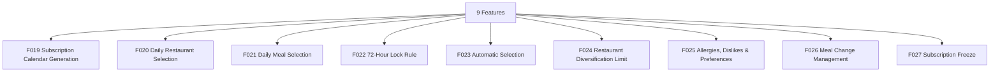

# M03 — التقويم والوجبات — التحليل الكامل

## Calendar & Meals

> Generated: 2026-06-15

## 1. الملخص التنفيذي
هذا الموديول هو قلب تجربة العميل اليومية. هو مسؤول عن تقويم الاشتراك، اختيار المطعم والوجبة، قفل 72 ساعة، الاختيار التلقائي، الحساسية، التفضيلات، والتجميد.

## 2. نطاق الموديول
عدد الميزات داخل الموديول: **9**.

| ID | English | Arabic | Folder |
|---|---|---|---|
| F019 | Subscription Calendar Generation | إنشاء تقويم الاشتراك | [Folder](F019_subscription_calendar_generation/README.md) |
| F020 | Daily Restaurant Selection | اختيار المطعم اليومي | [Folder](F020_daily_restaurant_selection/README.md) |
| F021 | Daily Meal Selection | اختيار الوجبة | [Folder](F021_daily_meal_selection/README.md) |
| F022 | 72-Hour Lock Rule | قاعدة قفل 72 ساعة | [Folder](F022_72_hour_lock_rule/README.md) |
| F023 | Automatic Selection | الاختيار التلقائي | [Folder](F023_automatic_selection/README.md) |
| F024 | Restaurant Diversification Limit | قاعدة التنويع والحد الأقصى | [Folder](F024_restaurant_diversification_limit/README.md) |
| F025 | Allergies, Dislikes & Preferences | الحساسية والتفضيلات | [Folder](F025_allergies_dislikes_preferences/README.md) |
| F026 | Meal Change Management | تغيير الوجبات | [Folder](F026_meal_change_management/README.md) |
| F027 | Subscription Freeze | تجميد الاشتراك | [Folder](F027_subscription_freeze/README.md) |

## 3. التحليل من ناحية Business
- القيمة التي يشتريها العميل هي انتظام الوجبات وسهولة الاختيار، وليس مجرد قائمة طعام.
- قاعدة 72 ساعة يجب شرحها تجاريًا بوضوح حتى لا يشعر العميل أن النظام يمنعه تعسفيًا.
- الحساسية والتفضيلات عنصر ثقة، وأي خطأ فيها قد يكون خطرًا صحيًا وليس مجرد UX issue.
- التجميد والتغيير يجب أن يوازنا بين مرونة العميل واستقرار تشغيل المطاعم.

## 4. التحليل من ناحية Logic / منطق التشغيل
- يجب تخزين كل مواعيد القفل UTC وعرضها حسب timezone الدولة.
- الاختيار التلقائي يحتاج ترتيب أولويات: سلامة الحساسية، نطاق المنطقة، التصنيف، الطاقة، التنويع، ثم fallback.
- CalendarDay يجب أن يصبح immutable بعد القفل إلا عبر override موثق.
- Freeze وMeal Change يجب أن ينتجا transitions لا تعدل التاريخ الماضي.

## 5. البيانات الأساسية المقترحة
- `SubscriptionCalendar`
- `CalendarDay`
- `MealSelection`
- `RestaurantSelection`
- `Allergy`
- `Preference`
- `FreezeRequest`

## 6. الاعتماد على الموديولات الأخرى
- M02 Programs & Subscriptions
- M04 Restaurant Operations
- M05 Delivery
- M08 Customer Finance

## 7. أهم المخاطر
- اختيار وجبة غير مناسبة
- تغيير بعد القفل
- تعارض timezone
- تجميد يؤثر على المحاسبة

## 8. ترتيب التنفيذ المقترح
- 1. F019
- 2. F022
- 3. F020
- 4. F021
- 5. F023
- 6. F025
- 7. F024
- 8. F026
- 9. F027

## 9. Mermaid Overview

## 10. نقاط الضعف التفصيلية
راجع فهرس نقاط الضعف داخل الموديول:

[WEAKNESSES_INDEX.md](WEAKNESSES_INDEX.md)

## 11. توصية التنفيذ
ابدأ بالميزات التي تمسك القواعد والبيانات الأساسية، ثم انتقل للواجهات والحالات الاستثنائية. لا تبدأ تنفيذ واجهة نهائية قبل تثبيت state machine وAPI contract وdata model لكل ميزة حرجة.

## Blueprint Note
تم نقل هذا التحليل إلى نسخة المشروع المنظمة، وتستخدم ملفات الميزات داخله مواصفات مصححة بعد معالجة الفجوات.
