# M05 — السائق والتوصيل — التحليل الكامل

## Driver & Delivery

> Generated: 2026-06-15

## 1. الملخص التنفيذي
هذا الموديول مسؤول عن ملف السائق، نطاق استلام الطلبات، إسناد الطلب، المسح بالباركود، التتبع اللحظي، الاتصال الآمن، الـ hold، المحاولة الثانية، تأكيد التسليم، والتقييم.

## 2. نطاق الموديول
عدد الميزات داخل الموديول: **12**.

| ID | English | Arabic | Folder |
|---|---|---|---|
| F040 | Driver Profile & Documents | ملف السائق ووثائقه | [Folder](F040_driver_profile_documents/README.md) |
| F041 | Geographic Order Reception Range | نطاق استقبال الطلبات | [Folder](F041_geographic_order_reception_range/README.md) |
| F042 | Driver Order Assignment | تعيين الطلب للسائق | [Folder](F042_driver_order_assignment/README.md) |
| F043 | Pickup Barcode Scan | مسح الباركود عند الاستلام | [Folder](F043_pickup_barcode_scan/README.md) |
| F044 | Real-Time Delivery Tracking | التتبع اللحظي | [Folder](F044_real_time_delivery_tracking/README.md) |
| F045 | Safe Contact | الاتصال الآمن | [Folder](F045_safe_contact/README.md) |
| F046 | Three-Kilometer Call Rule | قاعدة الاتصال عند 3 كم | [Folder](F046_three_kilometer_call_rule/README.md) |
| F047 | Delivery Hold | حالة Hold | [Folder](F047_delivery_hold/README.md) |
| F048 | Second Delivery Attempt | المحاولة الثانية | [Folder](F048_second_delivery_attempt/README.md) |
| F049 | Delivery Confirmation Scan | تأكيد التسليم بالمسح | [Folder](F049_delivery_confirmation_scan/README.md) |
| F050 | Driver Rating | تقييم السائق | [Folder](F050_driver_rating/README.md) |
| F051 | Driver Performance Statistics | إحصائيات وأداء السائق | [Folder](F051_driver_performance_statistics/README.md) |

## 3. التحليل من ناحية Business
- التوصيل هو آخر نقطة في تجربة العميل، وفشله يجعل كل الموديولات السابقة تبدو فاشلة.
- نطاق السائق وعلاقته بالمطعم أو المنصة يجب أن يكون واضحًا قبل الإسناد.
- الاتصال الآمن وقاعدة 3 كم تؤثر على الخصوصية والثقة.
- المحاولة الثانية والـ hold تحتاج سياسة واضحة حتى لا تتحول إلى نزاعات دعم.

## 4. التحليل من ناحية Logic / منطق التشغيل
- DeliveryTask يحتاج lifecycle واضح من assignment إلى pickup إلى in-transit إلى delivered أو failed.
- Barcode scan يجب أن يمنع استلام أو تسليم الطلب الخطأ.
- Tracking يجب أن يحدّث الحالة بدون كشف بيانات أكثر من اللازم.
- Second attempt وHold يجب أن يحددا من يملك القرار وما أثره على العميل والمطعم.

## 5. البيانات الأساسية المقترحة
- `DriverProfile`
- `DriverRegion`
- `DeliveryTask`
- `BarcodeScan`
- `TrackingEvent`
- `DeliveryAttempt`
- `DriverRating`

## 6. الاعتماد على الموديولات الأخرى
- M01 Identity
- M04 Restaurant Operations
- M06 Complaints
- M12 Admin Dashboard

## 7. أهم المخاطر
- تسليم خاطئ
- تسريب بيانات العميل
- إسناد خارج النطاق
- فشل تتبع أو تأكيد

## 8. ترتيب التنفيذ المقترح
- 1. F040
- 2. F041
- 3. F042
- 4. F043
- 5. F044
- 6. F049
- 7. F047
- 8. F048
- 9. F045
- 10. F046
- 11. F050
- 12. F051

## 9. Mermaid Overview

```mermaid
flowchart TD
    Core["12 Features"]
    F040["F040 Driver Profile & Documents"]
    F041["F041 Geographic Order Reception Range"]
    F042["F042 Driver Order Assignment"]
    F043["F043 Pickup Barcode Scan"]
    F044["F044 Real-Time Delivery Tracking"]
    F045["F045 Safe Contact"]
    F046["F046 Three-Kilometer Call Rule"]
    F047["F047 Delivery Hold"]
    F048["F048 Second Delivery Attempt"]
    F049["F049 Delivery Confirmation Scan"]
    F050["F050 Driver Rating"]
    F051["F051 Driver Performance Statistics"]
    Core --> F040
    Core --> F041
    Core --> F042
    Core --> F043
    Core --> F044
    Core --> F045
    Core --> F046
    Core --> F047
    Core --> F048
    Core --> F049
    Core --> F050
    Core --> F051
```

## 10. نقاط الضعف التفصيلية
راجع فهرس نقاط الضعف داخل الموديول:

[WEAKNESSES_INDEX.md](WEAKNESSES_INDEX.md)

## 11. توصية التنفيذ
ابدأ بالميزات التي تمسك القواعد والبيانات الأساسية، ثم انتقل للواجهات والحالات الاستثنائية. لا تبدأ تنفيذ واجهة نهائية قبل تثبيت state machine وAPI contract وdata model لكل ميزة حرجة.

## Blueprint Note
تم نقل هذا التحليل إلى نسخة المشروع المنظمة، وتستخدم ملفات الميزات داخله مواصفات مصححة بعد معالجة الفجوات.
