# M07 — النظام المالي والمحاسبي المركزي — التحليل الكامل

## Central Accounting

> Generated: 2026-06-15

## 1. الملخص التنفيذي
هذا الموديول هو مصدر الحقيقة المالي في MealMate. يشمل شجرة الحسابات، الإعدادات المالية، القيود التلقائية، الإيراد المؤجل، الاعتراف اليومي بالإيراد، مستحقات المطاعم والمؤثرين، بوابات الدفع، الضرائب، المصروفات، التسويات، التقارير، والتدقيق المالي.

## 2. نطاق الموديول
عدد الميزات داخل الموديول: **13**.

| ID | English | Arabic | Folder |
|---|---|---|---|
| F062 | Chart of Accounts | شجرة الحسابات | [Folder](F062_chart_of_accounts/README.md) |
| F063 | Central Financial Settings | الإعدادات المالية المركزية | [Folder](F063_central_financial_settings/README.md) |
| F064 | Automatic Journal Entries | القيود المحاسبية التلقائية | [Folder](F064_automatic_journal_entries/README.md) |
| F065 | Deferred Revenue | الإيراد المؤجل | [Folder](F065_deferred_revenue/README.md) |
| F066 | Daily Revenue Recognition | الاعتراف اليومي بالإيراد | [Folder](F066_daily_revenue_recognition/README.md) |
| F067 | Restaurant Payables | مستحقات المطاعم | [Folder](F067_restaurant_payables/README.md) |
| F068 | Influencer Payables | مستحقات المؤثرين | [Folder](F068_influencer_payables/README.md) |
| F069 | Payment Gateways | بوابات الدفع | [Folder](F069_payment_gateways/README.md) |
| F070 | Taxes | الضرائب | [Folder](F070_taxes/README.md) |
| F071 | Operating Expenses | المصروفات التشغيلية | [Folder](F071_operating_expenses/README.md) |
| F072 | Financial Settlements | التسويات المالية | [Folder](F072_financial_settlements/README.md) |
| F073 | Financial Reports | التقارير المالية | [Folder](F073_financial_reports/README.md) |
| F074 | Financial Audit Trail | سجل التدقيق المالي | [Folder](F074_financial_audit_trail/README.md) |

## 3. التحليل من ناحية Business
- أي رقم مالي في المنصة يجب أن يكون قابلًا للتفسير من خلال قيود وأحداث واضحة.
- الإيراد المؤجل والاعتراف اليومي مهمان جدًا لأن MealMate نموذج اشتراكات وليس بيعًا لحظيًا فقط.
- تعدد الدول والعملات والضرائب يجب أن يكون جزءًا من التصميم وليس إضافة لاحقة.
- التقارير المالية يجب أن تعتمد على إقفالات وsnapshots لا حسابات متغيرة في لحظة العرض.

## 4. التحليل من ناحية Logic / منطق التشغيل
- كل financial event يجب أن ينتج JournalEntry بنظام double-entry.
- لا يسمح بحذف حركة مالية؛ التصحيح يكون بقيد عكسي.
- Revenue recognition يجب أن يعتمد على أيام الخدمة الفعلية وحالة الاشتراك.
- Payables وsettlements تحتاج reconciliation قبل الدفع.

## 5. البيانات الأساسية المقترحة
- `ChartOfAccount`
- `FinancialSetting`
- `JournalEntry`
- `LedgerEntry`
- `RevenueRecognition`
- `Payable`
- `TaxRule`
- `Settlement`

## 6. الاعتماد على الموديولات الأخرى
- M02 Subscriptions
- M06 Complaints
- M08 Customer Finance
- M09 Restaurant Finance
- M10 Influencers
- M11 Campaigns

## 7. أهم المخاطر
- فروقات مالية
- اعتراف إيراد خاطئ
- ضرائب غير صحيحة
- تعديل أرصدة بدون أثر

## 8. ترتيب التنفيذ المقترح
- 1. F062
- 2. F063
- 3. F064
- 4. F065
- 5. F066
- 6. F067
- 7. F068
- 8. F069
- 9. F070
- 10. F072
- 11. F073
- 12. F074
- 13. F071

## 9. Mermaid Overview

```mermaid
flowchart TD
    Core["13 Features"]
    F062["F062 Chart of Accounts"]
    F063["F063 Central Financial Settings"]
    F064["F064 Automatic Journal Entries"]
    F065["F065 Deferred Revenue"]
    F066["F066 Daily Revenue Recognition"]
    F067["F067 Restaurant Payables"]
    F068["F068 Influencer Payables"]
    F069["F069 Payment Gateways"]
    F070["F070 Taxes"]
    F071["F071 Operating Expenses"]
    F072["F072 Financial Settlements"]
    F073["F073 Financial Reports"]
    F074["F074 Financial Audit Trail"]
    Core --> F062
    Core --> F063
    Core --> F064
    Core --> F065
    Core --> F066
    Core --> F067
    Core --> F068
    Core --> F069
    Core --> F070
    Core --> F071
    Core --> F072
    Core --> F073
    Core --> F074
```

## 10. نقاط الضعف التفصيلية
راجع فهرس نقاط الضعف داخل الموديول:

[WEAKNESSES_INDEX.md](WEAKNESSES_INDEX.md)

## 11. توصية التنفيذ
ابدأ بالميزات التي تمسك القواعد والبيانات الأساسية، ثم انتقل للواجهات والحالات الاستثنائية. لا تبدأ تنفيذ واجهة نهائية قبل تثبيت state machine وAPI contract وdata model لكل ميزة حرجة.

## Blueprint Note
تم نقل هذا التحليل إلى نسخة المشروع المنظمة، وتستخدم ملفات الميزات داخله مواصفات مصححة بعد معالجة الفجوات.
