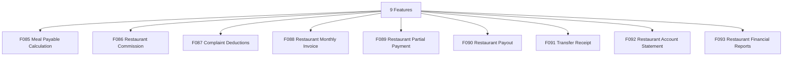

# M09 — النظام المالي للمطعم — التحليل الكامل

## Restaurant Finance

> Generated: 2026-06-15

## 1. الملخص التنفيذي
هذا الموديول يدير مستحقات المطاعم: حساب مستحق الوجبة، العمولة، خصومات الشكاوى، الفاتورة الشهرية، الدفعات الجزئية، السداد، إيصال التحويل، كشف الحساب، والتقارير المالية.

## 2. نطاق الموديول
عدد الميزات داخل الموديول: **9**.

| ID | English | Arabic | Folder |
|---|---|---|---|
| F085 | Meal Payable Calculation | حساب مستحق الوجبة | [Folder](F085_meal_payable_calculation/README.md) |
| F086 | Restaurant Commission | عمولة المطعم | [Folder](F086_restaurant_commission/README.md) |
| F087 | Complaint Deductions | خصومات الشكاوى | [Folder](F087_complaint_deductions/README.md) |
| F088 | Restaurant Monthly Invoice | الفاتورة الشهرية للمطعم | [Folder](F088_restaurant_monthly_invoice/README.md) |
| F089 | Restaurant Partial Payment | الدفعة الجزئية | [Folder](F089_restaurant_partial_payment/README.md) |
| F090 | Restaurant Payout | سداد مستحقات المطعم | [Folder](F090_restaurant_payout/README.md) |
| F091 | Transfer Receipt | إيصال التحويل | [Folder](F091_transfer_receipt/README.md) |
| F092 | Restaurant Account Statement | كشف حساب المطعم | [Folder](F092_restaurant_account_statement/README.md) |
| F093 | Restaurant Financial Reports | تقارير المطعم المالية | [Folder](F093_restaurant_financial_reports/README.md) |

## 3. التحليل من ناحية Business
- ثقة المطاعم تعتمد على وضوح المستحقات والخصومات والدفعات.
- العمولة يجب أن تكون قابلة للتفسير لكل وجبة أو اشتراك.
- خصومات الشكاوى يجب أن ترتبط بقرار مسؤولية واضح.
- الفاتورة الشهرية يجب أن تمنع النزاع من خلال تفصيل كل بند.

## 4. التحليل من ناحية Logic / منطق التشغيل
- Meal payable يجب أن يعتمد على snapshot وقت الطلب.
- Commission calculation يجب أن تكون versioned.
- Partial payouts تحتاج reconciliation واضح.
- Account statement يجب أن يعرض فترة مقفلة وليس أرقامًا متغيرة.

## 5. البيانات الأساسية المقترحة
- `MealPayable`
- `RestaurantCommission`
- `ComplaintDeduction`
- `RestaurantInvoice`
- `RestaurantPayout`
- `TransferReceipt`
- `AccountStatement`

## 6. الاعتماد على الموديولات الأخرى
- M04 Restaurant Operations
- M06 Complaints
- M07 Accounting

## 7. أهم المخاطر
- نزاعات مستحقات
- خصومات غير مبررة
- دفعات مكررة
- كشف حساب غير مطابق

## 8. ترتيب التنفيذ المقترح
- 1. F085
- 2. F086
- 3. F088
- 4. F090
- 5. F092
- 6. F087
- 7. F089
- 8. F091
- 9. F093

## 9. Mermaid Overview

## 10. نقاط الضعف التفصيلية
راجع فهرس نقاط الضعف داخل الموديول:

[WEAKNESSES_INDEX.md](WEAKNESSES_INDEX.md)

## 11. توصية التنفيذ
ابدأ بالميزات التي تمسك القواعد والبيانات الأساسية، ثم انتقل للواجهات والحالات الاستثنائية. لا تبدأ تنفيذ واجهة نهائية قبل تثبيت state machine وAPI contract وdata model لكل ميزة حرجة.

## Blueprint Note
تم نقل هذا التحليل إلى نسخة المشروع المنظمة، وتستخدم ملفات الميزات داخله مواصفات مصححة بعد معالجة الفجوات.
