# الأدمن — Flowcharts (Mermaid MD)

> **الدور:** الأدمن | **المنصة:** Angular — لوحة ويب

> ملف Markdown فيه **Mermaid flowcharts** — يفتح في GitHub / Cursor / VS Code Preview.

---

## الفلو الكامل للميزات


---

## فهرس

- [F01 — التسجيل واعتماد الحسابات والدخول](#f01---) (7 لوحة)
- [F02 — إدارة نموذج الاشتراك (المدد/البرامج/الباقات)](#f02---) (7 لوحة)
- [F03 — إدارة تصنيف المطاعم (Basic/Platinum/Elite)](#f03---basic-platinum-elite-) (6 لوحة)
- [F04 — إدارة التسعير والعمولات الديناميكية](#f04---) (7 لوحة)
- [F06 — قاعدة 72 ساعة وتأكيد المطعم واستثناءات الأدمن](#f06---48-) (7 لوحة)
- [F07 — ضبط الاختيار التلقائي والتوزيع العادل](#f07---) (7 لوحة)
- [F08 — مراقبة الطاقة الاستيعابية و Busy](#f08---busy) (7 لوحة)
- [F10 — إدارة الإلغاء والاسترداد](#f10---) (7 لوحة)
- [F11 — إدارة التجميد](#f11---) (7 لوحة)
- [F12 — إعداد الفواتير والباركود والملصقات](#f12---) (7 لوحة)
- [F13 — مراقبة التوصيل والتتبع](#f13---) (7 لوحة)
- [F14 — متابعة الاتصال وحالة Hold](#f14---hold) (7 لوحة)
- [F15 — متابعة التقييمات والإحصائيات](#f15---) (6 لوحة)
- [F16 — إدارة الشكاوى والمحفظة والتعويضات](#f16---) (7 لوحة)
- [F17 — إدارة الولاء والمكافآت](#f17---) (7 لوحة)
- [F18 — إدارة الإحالات والبرومو كود](#f18---) (7 لوحة)
- [F19 — متابعة الاشتراك العائلي](#f19---) (7 لوحة)
- [F20 — إدارة الإعلانات والمزايدات](#f20---) (7 لوحة)
- [F21 — إدارة المناطق والتغطية](#f21---) (7 لوحة)
- [F22 — مراجعة واعتماد وثائق المطاعم](#f22---) (7 لوحة)
- [F23 — إدارة السائقين العامين والتحقق](#f23---) (7 لوحة)
- [F24 — اعتماد القوائم والوجبات](#f24---) (7 لوحة)
- [F25 — إدارة سياسة إنهاء التعاقد](#f25---) (7 لوحة)
- [F26 — النظام المحاسبي والتسويات](#f26---) (7 لوحة)
- [F27 — التقارير ومؤشرات الأداء KPI](#f27---kpi) (7 لوحة)
- [F28 — التوسع الدولي و Multi-Tenancy (Super Admin / Country Admin)](#f28---multi-tenancy-super-admin-country-admin-) (7 لوحة)
- [F29 — إدارة تعدد اللغات](#f29---) (7 لوحة)
- [F30 — إدارة قنوات التواصل (واتساب/سوشيال)](#f30---) (7 لوحة)
- [F31 — سياسات حماية الخصوصية](#f31---) (7 لوحة)

---

# الميزات (29 | 201 لوحات)

## F01 — التسجيل واعتماد الحسابات والدخول

**الهدف:** يضمن الأدمن أن كل حساب يدخل المنصة موثّق ومعتمد: مراجعة طلبات المطاعم والسائقين قبل تفعيلها، وإدارة حسابات العملاء (تفعيل/تعطيل)، بحيث لا يظهر أي مطعم أو يعمل أي سائق قبل موافقته الصريحة.

### Flowchart

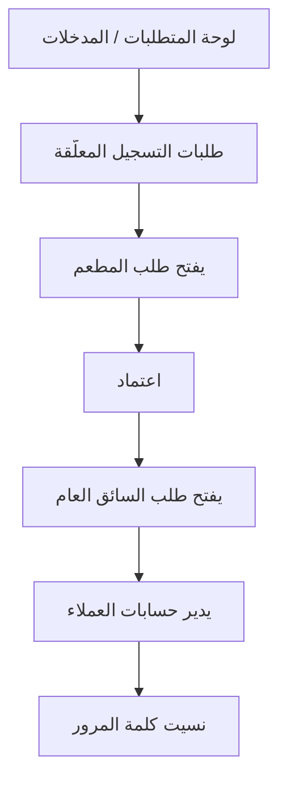

### لوحات — العنوان والمحتويات

#### **لوحة المتطلبات / المدخلات** _(مستنتجة)_

1. لوحة تحكم ويب (Angular) بصلاحيات الأدمن داخل نطاق دولته.
2. طلب تسجيل مطعم يتضمّن بيانات الشركة الرسمية + الوثائق المرفوعة (راجع F22).
3. طلب تسجيل سائق عام يتضمّن البيانات الشخصية والرخصة وبيانات المركبة (راجع F23).
4. قائمة العملاء المسجّلين عبر التطبيق (Email/Phone + كلمة المرور + المنطقة + الموافقة على الشروط).

#### **طلبات التسجيل المعلّقة** _(مستنتجة)_

1. مطاعم
2. سائقون عامّون

#### **يفتح طلب المطعم** _(مستنتجة)_

1. يراجع البيانات الرسمية والوثائق
2. ويتحقق من اكتمالها وصلاحية تواريخها

#### **اعتماد** _(مستنتجة)_

1. (تفعيل الحساب وإظهاره للعملاء) أو رفض/طلب استكمال مع ذكر السبب

#### **يفتح طلب السائق العام** _(مستنتجة)_

1. يتحقق من الرخصة ووثيقة المركبة ثم يمنح الموافقة النهائية للتفعيل

#### **يدير حسابات العملاء** _(مستنتجة)_

1. بحث
2. تفعيل
3. أو تعطيل حساب عند الحاجة (إساءة استخدام/طلب العميل)

#### **نسيت كلمة المرور** _(مستنتجة)_

1. يتابع سجل الدخول والصلاحيات
2. ويعالج طلبات  الاستثنائية إن لزم

---

## F02 — إدارة نموذج الاشتراك (المدد/البرامج/الباقات)

**الهدف:** يتحكم الأدمن ديناميكيًا في العمود الفقري لنموذج الاشتراك: مدد الاشتراك، البرامج الغذائية، والباقات، بحيث يضيف/يعدّل/يلغي أي عنصر من لوحة التحكم دون الحاجة لتغيير برمجي.

### Flowchart

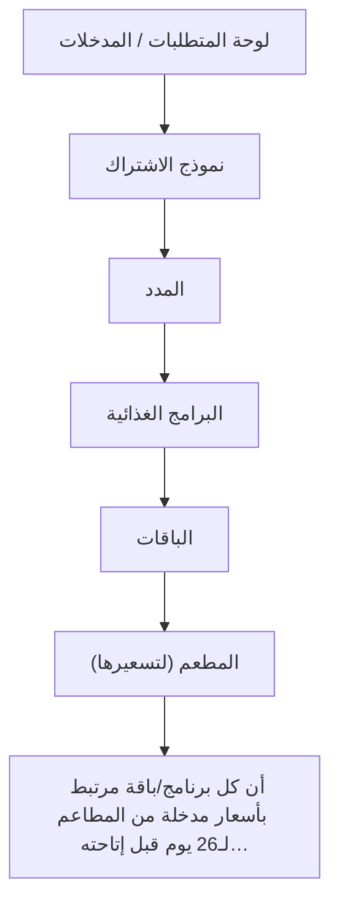

### لوحات — العنوان والمحتويات

#### **لوحة المتطلبات / المدخلات** _(مستنتجة)_

1. صلاحية إدارة الكتالوج في لوحة الأدمن.
2. تعريف مدد الاشتراك: شهري (26 يوم عمل بدون الجمعة)، أسبوعين (12 يوم)، أسبوع (6 أيام)، مخصص (من يوم واحد فأكثر).
3. قائمة البرامج الغذائية المطلوبة: نزول وزن، ضخامة عضلية، محافظة، كيتو.
4. قائمة الباقات: باقة كاملة (إفطار + وجبتان رئيسيتان + سناك + سلطة)، باقة الغداء (وجبة رئيسية + سلطة)، باقة مخصصة (مزيج يحدده الأدمن).

#### **نموذج الاشتراك** _(مستنتجة)_

1. يفتح الأدمن قسم  في لوحة التحكم

#### **المدد** _(مستنتجة)_

1. يفعّل/يعطّل كل مدة ويضبط عدد أيامها ونسبة عمولتها المرتبطة (تُستخدم في F04)

#### **البرامج الغذائية** _(مستنتجة)_

1. يضيف برنامجًا جديدًا (اسم
2. وصف
3. لغتان) أو يعدّل/يلغي القائمة

#### **الباقات** _(مستنتجة)_

1. يعرّف مكوّنات كل باقة
2. ويُنشئ الباقة المخصصة كمزيج من العناصر

#### **المطعم (لتسعيرها)** _(مستنتجة)_

1. يحفظ ويعتمد النشر
2. تنعكس الخيارات فورًا في تطبيق العميل وفي لوحة المطعم (لتسعيرها)

#### **أن كل برنامج/باقة مرتبط بأسعار مدخلة من المطاعم لـ26 يوم قبل إتاحته…** _(مستنتجة)_

1. يتابع أن كل برنامج/باقة مرتبط بأسعار مدخلة من المطاعم لـ26 يوم قبل إتاحته للاشتراك

---

## F03 — إدارة تصنيف المطاعم (Basic/Platinum/Elite)

**الهدف:** يضبط الأدمن الحدود السعرية للتصنيفات الثلاثة، فيصنّف النظام كل مطعم **تلقائيًا** حسب سعر اشتراكه لـ26 يومًا. التصنيف داخلي بين الأدمن وشركات المطاعم ويحدد جودة/سعر البوكس الذي يراه العميل.

### Flowchart

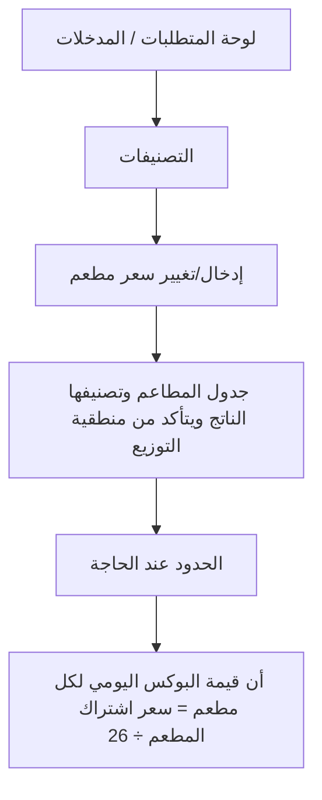

### لوحات — العنوان والمحتويات

#### **لوحة المتطلبات / المدخلات** _(مستنتجة)_

1. سعر اشتراك كل مطعم لمدة 26 يومًا (مدخل من المطعم لكل برنامج/باقة).
2. الحدود السعرية التي يضعها الأدمن لكل تصنيف.
3. مثال للحدود (ديناميكية): Basic < 100 د.ك | Platinum < 150 د.ك | Elite < 200 د.ك.

#### **التصنيفات** _(مستنتجة)_

1. يفتح الأدمن قسم  ويحدد الحد السعري الأعلى لكل تصنيف

#### **إدخال/تغيير سعر مطعم** _(مستنتجة)_

1. عند إدخال/تغيير سعر مطعم
2. يحسب النظام تلقائيًا التصنيف بمقارنة سعر 26 يومًا بالحدود

#### **جدول المطاعم وتصنيفها الناتج ويتأكد من منطقية التوزيع** _(مستنتجة)_

1. يراجع الأدمن جدول المطاعم وتصنيفها الناتج ويتأكد من منطقية التوزيع

#### **الحدود عند الحاجة** _(مستنتجة)_

1. يعدّل الحدود عند الحاجة → يعيد النظام تصنيف كل المطاعم المتأثرة فورًا

#### **أن قيمة البوكس اليومي لكل مطعم = سعر اشتراك المطعم ÷ 26** _(مستنتجة)_

1. يتحقق أن قيمة البوكس اليومي لكل مطعم = سعر اشتراك المطعم (26 يوم) ÷ 26

---

## F04 — إدارة التسعير والعمولات الديناميكية

**الهدف:** يتحكم الأدمن في كل نسب وحدود التسعير: عمولة المدة (التي تُحمّل على العميل)، والعمولة الديناميكية لكل مطعم (التي تُخصم من سعر البوكس المتفق عليه)، بينما يحدّث النظام المتوسطات تلقائيًا.

### Flowchart

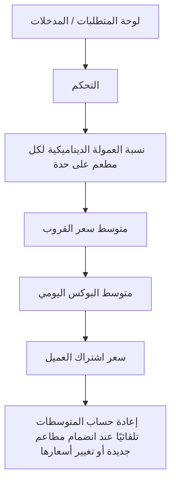

### لوحات — العنوان والمحتويات

#### **لوحة المتطلبات / المدخلات** _(مستنتجة)_

1. أسعار المطاعم لـ26 يومًا داخل كل تصنيف (لحساب متوسط القروب).
2. **max_commission** و **min_commission** (يضبطهما أدمن فقط) — عمولة MealMate بالاستيفاء الخطي حسب أيام الاشتراك؛ راجع [`00_commission_interpolation_algorithm.md`](../00_commission_interpolation_algorithm.md).
3. نسبة عمولة ديناميكية لكل مطعم (مثال: مطعم A 15%، مطعم B 20%).

#### **التحكم** _(مستنتجة)_

1. يضبط الأدمن **max_commission** و **min_commission** من لوحة التحكم (النظام يحسب commission بالاستيفاء الخطي لكل مدة).

#### **نسبة العمولة الديناميكية لكل مطعم على حدة** _(مستنتجة)_

1. يحدد نسبة العمولة الديناميكية لكل مطعم على حدة

#### **متوسط سعر القروب** _(مستنتجة)_

1. يحسب النظام تلقائيًا  لكل تصنيف (مع الالتزام بالبرنامج والباقة)

#### **متوسط البوكس اليومي** _(مستنتجة)_

1. يشتق  = متوسط القروب لـ26 يوم ÷ 26

#### **سعر اشتراك العميل** _(مستنتجة)_

1. يحسب  = (متوسط البوكس اليومي × أيام الاشتراك) × (1
2. نسبة عمولة المدة)

#### **إعادة حساب المتوسطات تلقائيًا عند انضمام مطاعم جديدة أو تغيير أسعارها** _(مستنتجة)_

1. يتابع الأدمن إعادة حساب المتوسطات تلقائيًا عند انضمام مطاعم جديدة أو تغيير أسعارها

---

## F06 — قاعدة 72 ساعة وتأكيد المطعم واستثناءات الأدمن

**الهدف:** يشرف الأدمن على تطبيق قاعدة 72 ساعة (قفل العميل) وتأكيد المطعم خلال 24h وإشعار التوصيل عند −24h، ويملك **وحده** صلاحية الاستثناء في الحالات الطارئة عبر واتساب لضمان عدم تضرر العميل دون كسر الانضباط التشغيلي.

### Flowchart

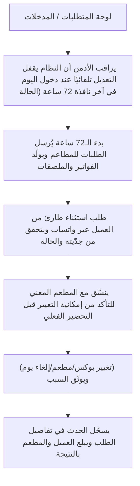

### لوحات — العنوان والمحتويات

#### **لوحة المتطلبات / المدخلات** _(مستنتجة)_

1. اشتراك نشط للعميل وأيام مجدولة في التقويم.
2. طلب استثناء عاجل وارد من العميل عبر قناة واتساب الأدمن (راجع F30).
3. صلاحية تعديل الطلبات داخل النافذة المحجوزة (للأدمن فقط).

#### **يراقب الأدمن أن النظام يقفل التعديل تلقائيًا عند دخول اليوم في آخر نافذة 72 ساعة (الحالة** _(مستنتجة)_

1. قيد التحضير)

#### **بدء الـ72 ساعة يُرسل الطلبات للمطاعم ويولّد الفواتير والملصقات** _(مستنتجة)_

1. يتأكد أن النظام عند بدء الـ72 ساعة يُرسل الطلبات للمطاعم ويولّد الفواتير والملصقات (راجع F12)

#### **طلب استثناء طارئ من العميل عبر واتساب ويتحقق من جدّيته والحالة** _(مستنتجة)_

1. يستقبل طلب استثناء طارئ من العميل عبر واتساب ويتحقق من جدّيته والحالة

#### **ينسّق مع المطعم المعني للتأكد من إمكانية التغيير قبل التحضير الفعلي** _(مستنتجة)_

1. ينسّق مع المطعم المعني للتأكد من إمكانية التغيير قبل التحضير الفعلي

#### **(تغيير بوكس/مطعم/إلغاء يوم) ويوثّق السبب** _(مستنتجة)_

1. ينفّذ التعديل الاستثنائي من اللوحة (تغيير بوكس/مطعم/إلغاء يوم) ويوثّق السبب

#### **يسجّل الحدث في تفاصيل الطلب ويبلغ العميل والمطعم بالنتيجة** _(مستنتجة)_

1. يسجّل الحدث في تفاصيل الطلب ويبلغ العميل والمطعم بالنتيجة

---

## F07 — ضبط الاختيار التلقائي والتوزيع العادل

**الهدف:** يضبط الأدمن منطق الاختيار التلقائي الذي يعمل عند عدم اختيار العميل قبل 72 ساعة، ويتأكد من عدالة التوزيع بين المطاعم عبر معادلة الكوتا، مع آلية Fallback تمنع بقاء العميل بلا وجبة.

### Flowchart

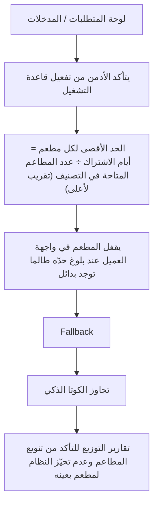

### لوحات — العنوان والمحتويات

#### **لوحة المتطلبات / المدخلات** _(مستنتجة)_

1. بيانات حساسية العميل وعدم إعجابه (Allergies/Dislikes) مفعّلة (شرط لدقة الاختيار).
2. عدد المطاعم المتاحة في كل تصنيف ومنطقة.
3. حدود الطاقة الاستيعابية اليومية للمطاعم (راجع F08).

#### **يتأكد الأدمن من تفعيل قاعدة التشغيل** _(مستنتجة)_

1. عند عدم اختيار العميل قبل 72 ساعة → اختيار تلقائي عشوائي ضمن القيود

#### **الحد الأقصى لكل مطعم = أيام الاشتراك ÷ عدد المطاعم المتاحة في التصنيف (تقريب لأعلى)** _(مستنتجة)_

_لا توجد عناصر._

#### **يقفل المطعم في واجهة العميل عند بلوغ حدّه طالما توجد بدائل** _(مستنتجة)_

1. يتحقق أن النظام يقفل المطعم في واجهة العميل عند بلوغ حدّه طالما توجد بدائل

#### **Fallback** _(مستنتجة)_

1. يراجع منطق  عند عدم توفر مطعم مطابق
2. يُفتح عدد الأيام المسموحة لهذا الطلب فقط ويُختار عشوائيًا من المتاح

#### **تجاوز الكوتا الذكي** _(مستنتجة)_

1. يراقب  عند انشغال كل المطاعم (Busy) لضمان توفر بدائل

#### **تقارير التوزيع للتأكد من تنويع المطاعم وعدم تحيّز النظام لمطعم بعينه** _(مستنتجة)_

1. يتابع تقارير التوزيع للتأكد من تنويع المطاعم وعدم تحيّز النظام لمطعم بعينه

---

## F08 — مراقبة الطاقة الاستيعابية و Busy

**الهدف:** يراقب الأدمن إجمالي الطاقة الاستيعابية اليومية للمطاعم وحالات Busy، ويضمن ألّا يتجاوز عدد المشتركين الطاقة المتاحة، مع مرونة الكوتا في الأيام المزدحمة لضمان توفر بدائل للعميل.

### Flowchart

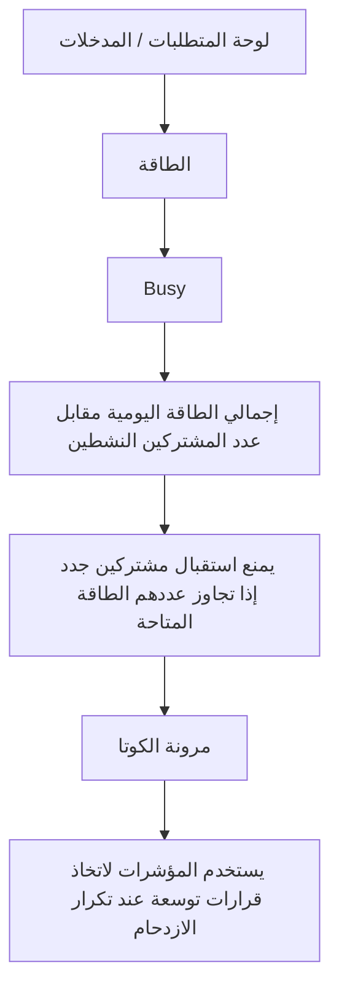

### لوحات — العنوان والمحتويات

#### **لوحة المتطلبات / المدخلات** _(مستنتجة)_

1. حد البوكسات اليومي الأقصى المُدخل من كل مطعم في لوحته.
2. عدد الطلبات المؤكدة لحظيًا لكل مطعم/يوم.
3. إجمالي الطاقة اليومية = مجموع حدود كل المطاعم في المنطقة/التصنيف.

#### **الطاقة** _(مستنتجة)_

1. الحد اليومي لكل مطعم مقابل الطلبات المؤكدة

#### **Busy** _(مستنتجة)_

1. يتأكد أن النظام يحوّل المطعم تلقائيًا إلى  عند بلوغ حدّه ويمنع اختياره لذلك اليوم

#### **إجمالي الطاقة اليومية مقابل عدد المشتركين النشطين** _(مستنتجة)_

1. يتابع إجمالي الطاقة اليومية مقابل عدد المشتركين النشطين

#### **يمنع استقبال مشتركين جدد إذا تجاوز عددهم الطاقة المتاحة** _(مستنتجة)_

1. يتأكد أن النظام يمنع استقبال مشتركين جدد إذا تجاوز عددهم الطاقة المتاحة

#### **مرونة الكوتا** _(مستنتجة)_

1. إتاحة مطعم بلغ حدّه لضمان بدائل

#### **يستخدم المؤشرات لاتخاذ قرارات توسعة عند تكرار الازدحام** _(مستنتجة)_

1. يستخدم المؤشرات لاتخاذ قرارات توسعة (جذب مطاعم جديدة) عند تكرار الازدحام

---

## F10 — إدارة الإلغاء والاسترداد

**الهدف:** يشرف الأدمن على عمليات إلغاء الاشتراك والاسترداد الآلي، ويتأكد من صحة المبالغ المحسوبة، ويتابع تحويلها للعميل أو إضافتها للمحفظة خلال المدة المحددة.

### Flowchart

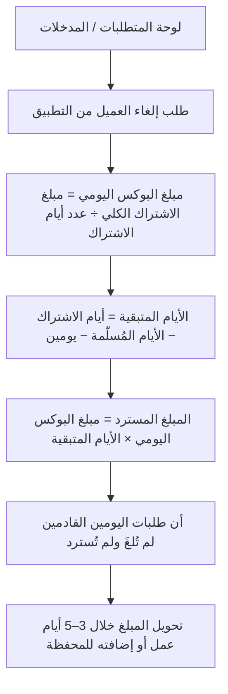

### لوحات — العنوان والمحتويات

#### **لوحة المتطلبات / المدخلات** _(مستنتجة)_

1. اشتراك نشط للعميل تم دفعه.
2. عدد الأيام المُسلّمة فعليًا حتى لحظة الإلغاء.
3. مبلغ الاشتراك الكلي وعدد أيام الاشتراك.

#### **طلب إلغاء العميل من التطبيق** _(مستنتجة)_

1. يستقبل النظام طلب إلغاء العميل من التطبيق ويحسب المسترد آليًا

#### **مبلغ البوكس اليومي = مبلغ الاشتراك الكلي ÷ عدد أيام الاشتراك** _(مستنتجة)_

_لا توجد عناصر._

#### **الأيام المتبقية = أيام الاشتراك − الأيام المُسلّمة − يومين** _(مستنتجة)_

_لا توجد عناصر._

#### **المبلغ المسترد = مبلغ البوكس اليومي × الأيام المتبقية** _(مستنتجة)_

_لا توجد عناصر._

#### **أن طلبات اليومين القادمين لم تُلغَ ولم تُسترد** _(مستنتجة)_

1. يتأكد أن طلبات اليومين القادمين لم تُلغَ ولم تُسترد
2. وأن باقي الطلبات أُلغيت تلقائيًا

#### **تحويل المبلغ خلال 3–5 أيام عمل أو إضافته للمحفظة** _(مستنتجة)_

1. يتابع تحويل المبلغ خلال 3–5 أيام عمل أو إضافته للمحفظة
2. ويعالج الحالات العالقة

---

## F11 — إدارة التجميد

**الهدف:** يتحكم الأدمن في سياسة تجميد الاشتراك: يضبط المدة الافتراضية، ويعرض قائمة المشتركين المجمّدين، وينهي التجميد يدويًا عند اللزوم، بما يحافظ على حقوق العميل دون إلغاء اشتراكه.

### Flowchart

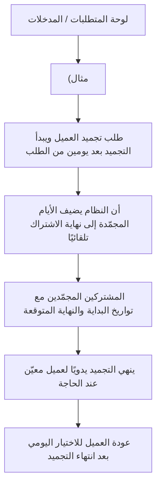

### لوحات — العنوان والمحتويات

#### **لوحة المتطلبات / المدخلات** _(مستنتجة)_

1. اشتراك نشط للعميل.
2. المدة الافتراضية للتجميد (أسبوع كقيمة افتراضية، قابلة للتعديل).
3. قاعدة بدء التجميد بعد يومين من الطلب (لأن طلبات اليومين محجوزة).

#### **(مثال** _(مستنتجة)_

1. أسبوع → 10 أيام)

#### **طلب تجميد العميل ويبدأ التجميد بعد يومين من الطلب** _(مستنتجة)_

1. يستقبل النظام طلب تجميد العميل ويبدأ التجميد بعد يومين من الطلب

#### **أن النظام يضيف الأيام المجمّدة إلى نهاية الاشتراك تلقائيًا** _(مستنتجة)_

1. يتأكد الأدمن أن النظام يضيف الأيام المجمّدة إلى نهاية الاشتراك تلقائيًا

#### **المشتركين المجمّدين مع تواريخ البداية والنهاية المتوقعة** _(مستنتجة)_

1. يعرض قائمة المشتركين المجمّدين مع تواريخ البداية والنهاية المتوقعة

#### **ينهي التجميد يدويًا لعميل معيّن عند الحاجة** _(مستنتجة)_

1. ينهي التجميد يدويًا لعميل معيّن عند الحاجة (طلب العميل/سبب تشغيلي)

#### **عودة العميل للاختيار اليومي بعد انتهاء التجميد** _(مستنتجة)_

1. يتابع عودة العميل للاختيار اليومي بعد انتهاء التجميد

---

## F12 — إعداد الفواتير والباركود والملصقات

**الهدف:** يضبط الأدمن نظام الفواتير الاحترافي والباركود وملصقات الوجبات التي تُولَّد تلقائيًا عند بدء نافذة 72 ساعة، ويضمن صحة محتواها باللغتين لتسهيل الاستلام والتسليم.

### Flowchart

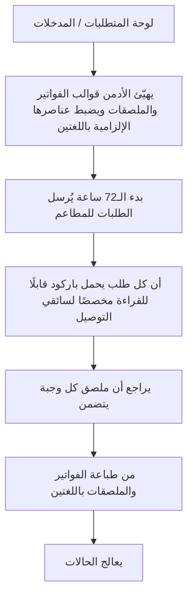

### لوحات — العنوان والمحتويات

#### **لوحة المتطلبات / المدخلات** _(مستنتجة)_

1. قوالب الفاتورة والملصق (لوجو التطبيق + لوجو المطعم).
2. بيانات الوجبة الغذائية (سعرات، بروتين، كارب، دهون) واسمها وملاحظات الحساسية.
3. إعداد توليد باركود فريد لكل طلب قابل للقراءة من تطبيق السائق.

#### **يهيّئ الأدمن قوالب الفواتير والملصقات ويضبط عناصرها الإلزامية باللغتين** _(مستنتجة)_

1. يهيّئ الأدمن قوالب الفواتير والملصقات ويضبط عناصرها الإلزامية باللغتين

#### **بدء الـ72 ساعة يُرسل الطلبات للمطاعم** _(مستنتجة)_

1. يتأكد أن النظام عند بدء الـ72 ساعة يُرسل الطلبات للمطاعم مع فاتورة احترافية تفصيلية

#### **أن كل طلب يحمل باركود قابلًا للقراءة مخصصًا لسائقي التوصيل** _(مستنتجة)_

1. يتحقق أن كل طلب يحمل باركود قابلًا للقراءة مخصصًا لسائقي التوصيل

#### **يراجع أن ملصق كل وجبة يتضمن** _(مستنتجة)_

1. اللوجوين
2. البيانات الغذائية
3. اسم الوجبة
4. ملاحظات الحساسية

#### **من طباعة الفواتير والملصقات باللغتين** _(مستنتجة)_

1. يتأكد من طباعة الفواتير والملصقات باللغتين (عربي/إنجليزي)

#### **يعالج الحالات** _(مستنتجة)_

1. يعالج الحالات التي تتطلب إعادة إصدار فاتورة/ملصق بعد استثناء أدمن (راجع F06)

---

## F13 — مراقبة التوصيل والتتبع

**الهدف:** يراقب الأدمن دورة حياة التوصيل لحظيًا من تحضير المطعم حتى التسليم، ويتدخل عند التعثّر، إذ تنعكس حالة كل طلب فورًا لدى جميع الأطراف (العميل، المطعم، الأدمن).

### Flowchart

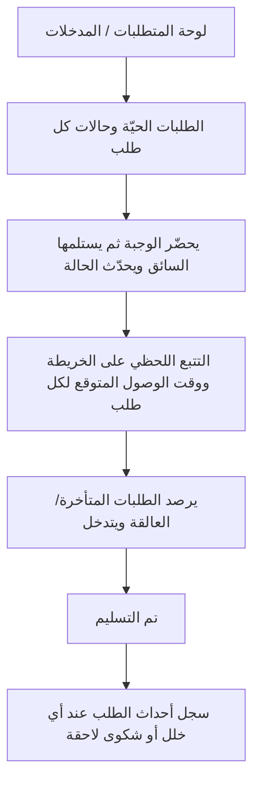

### لوحات — العنوان والمحتويات

#### **لوحة المتطلبات / المدخلات** _(مستنتجة)_

1. طلبات مؤكدة دخلت نافذة التحضير (راجع F06/F12).
2. سائق معتمد ومفعّل مُسنَد للطلب (راجع F23).
3. تكامل الخرائط والتتبع (Google Maps) لعرض المواقع والـ ETA.

#### **الطلبات الحيّة وحالات كل طلب** _(مستنتجة)_

1. تحضير ← استلام السائق ← في الطريق ← تم التسليم

#### **يحضّر الوجبة ثم يستلمها السائق ويحدّث الحالة** _(مستنتجة)_

1. يتأكد أن المطعم يحضّر الوجبة ثم يستلمها السائق ويحدّث الحالة (مع مسح الباركود)

#### **التتبع اللحظي على الخريطة ووقت الوصول المتوقع لكل طلب** _(مستنتجة)_

1. يراقب التتبع اللحظي على الخريطة ووقت الوصول المتوقع لكل طلب

#### **يرصد الطلبات المتأخرة/العالقة ويتدخل** _(مستنتجة)_

1. يرصد الطلبات المتأخرة/العالقة ويتدخل (إعادة إسناد
2. تواصل
3. تصعيد)

#### **تم التسليم** _(مستنتجة)_

1. يتحقق من تحديث الحالة النهائية  وانعكاسها لكل الأطراف

#### **سجل أحداث الطلب عند أي خلل أو شكوى لاحقة** _(مستنتجة)_

1. يراجع سجل أحداث الطلب (Timeline) عند أي خلل أو شكوى لاحقة

---

## F14 — متابعة الاتصال وحالة Hold

**الهدف:** يتابع الأدمن حالات عدم رد العميل وتحويل الطلب إلى Hold، ويراقب الاستثناء الحسّاس المتمثل في إظهار رقم العميل بعد فشل محاولتين، مع توثيق كامل لكل حدث.

### Flowchart

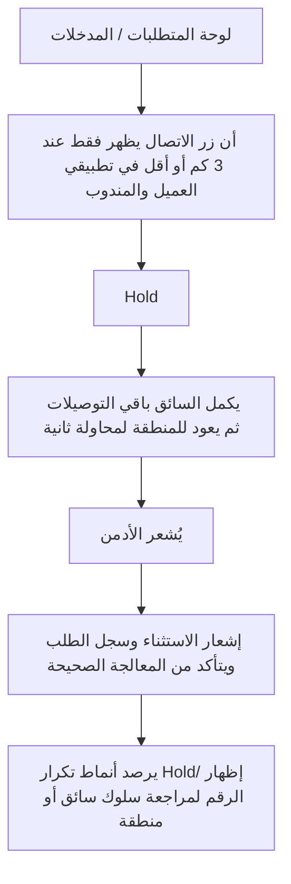

### لوحات — العنوان والمحتويات

#### **لوحة المتطلبات / المدخلات** _(مستنتجة)_

1. طلب في الطريق ووصول السائق لنطاق 3 كم (شرط ظهور زر الاتصال).
2. سجل محاولات الاتصال (ناجحة/فاشلة) مع الأسباب والأوقات.
3. سياسة الخصوصية: أرقام مقنّعة، اتصال داخل التطبيق، رسائل مشفّرة.

#### **أن زر الاتصال يظهر فقط عند 3 كم أو أقل في تطبيقي العميل والمندوب** _(مستنتجة)_

1. يتأكد الأدمن أن زر الاتصال يظهر فقط عند 3 كم أو أقل في تطبيقي العميل والمندوب

#### **Hold** _(مستنتجة)_

1. يسجّل السائق محاولة فاشلة ويحوّل الطلب إلى  (سبب
2. وقت)

#### **يكمل السائق باقي التوصيلات ثم يعود للمنطقة لمحاولة ثانية** _(مستنتجة)_

1. يكمل السائق باقي التوصيلات ثم يعود للمنطقة لمحاولة ثانية مع إشعار العميل

#### **يُشعر الأدمن** _(مستنتجة)_

1. يُظهر النظام رقم العميل كاستثناء
2. يسجّل الحدث

#### **إشعار الاستثناء وسجل الطلب ويتأكد من المعالجة الصحيحة** _(مستنتجة)_

1. يراجع الأدمن إشعار الاستثناء وسجل الطلب (Timeline) ويتأكد من المعالجة الصحيحة

#### **يرصد أنماط تكرار Hold/إظهار الرقم لمراجعة سلوك سائق أو منطقة** _(مستنتجة)_

1. يرصد أنماط تكرار Hold/إظهار الرقم لمراجعة سلوك سائق أو منطقة

---

## F15 — متابعة التقييمات والإحصائيات

**الهدف:** يتابع الأدمن الإحصائيات الكلية للتقييمات (جودة الوجبة، سرعة التوصيل، المطعم عمومًا)، ويستخدمها كمؤشر جودة لاتخاذ قرارات بشأن المطاعم والسائقين.

### Flowchart

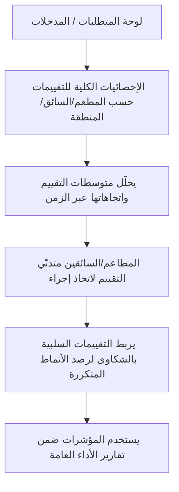

### لوحات — العنوان والمحتويات

#### **لوحة المتطلبات / المدخلات** _(مستنتجة)_

1. طلبات مكتملة («تم التسليم») تتيح للعميل التقييم.
2. تقييمات العملاء (نجوم + تعليق) عبر التطبيق، بشكل سريع (<30 ثانية).
3. ربط كل تقييم بالطلب والمطعم والسائق المعنيين.

#### **الإحصائيات الكلية للتقييمات حسب المطعم/السائق/المنطقة** _(مستنتجة)_

1. يفتح الأدمن لوحة الإحصائيات الكلية للتقييمات حسب المطعم/السائق/المنطقة

#### **يحلّل متوسطات التقييم واتجاهاتها عبر الزمن** _(مستنتجة)_

1. يحلّل متوسطات التقييم واتجاهاتها عبر الزمن

#### **المطاعم/السائقين متدنّي التقييم لاتخاذ إجراء** _(مستنتجة)_

1. يحدد المطاعم/السائقين متدنّي التقييم لاتخاذ إجراء (تنبيه/مراجعة)

#### **يربط التقييمات السلبية بالشكاوى لرصد الأنماط المتكررة** _(مستنتجة)_

1. يربط التقييمات السلبية بالشكاوى (F16) لرصد الأنماط المتكررة

#### **يستخدم المؤشرات ضمن تقارير الأداء العامة** _(مستنتجة)_

1. يستخدم المؤشرات ضمن تقارير الأداء العامة (راجع F27)

---

## F16 — إدارة الشكاوى والمحفظة والتعويضات

**الهدف:** يدير الأدمن شكاوى العملاء على الوجبات (مع صور إلزامية)، ويؤكد صحتها، ويفعّل التعويض الآلي، ويتأكد من خصم قيمة البوكس من مستحقات المطعم وإعادة ضبط الكوتا لحماية جودة التوزيع.

### Flowchart

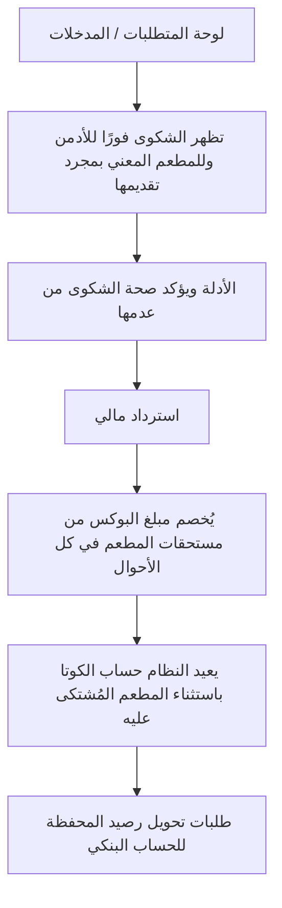

### لوحات — العنوان والمحتويات

#### **لوحة المتطلبات / المدخلات** _(مستنتجة)_

1. شكوى عميل على وجبة (نقص مكونات، وجبة خاطئة...) **مع صور إلزامية**.
2. بيانات الطلب والمطعم المعني وقيمة البوكس.
3. إعدادات المحفظة الرقمية وقنوات التحويل البنكي.

#### **تظهر الشكوى فورًا للأدمن وللمطعم المعني بمجرد تقديمها** _(مستنتجة)_

1. تظهر الشكوى فورًا للأدمن وللمطعم المعني بمجرد تقديمها مع الصور

#### **الأدلة ويؤكد صحة الشكوى من عدمها** _(مستنتجة)_

1. يراجع الأدمن الأدلة (الصور
2. تفاصيل الطلب) ويؤكد صحة الشكوى من عدمها

#### **استرداد مالي** _(مستنتجة)_

1. يُشعر النظام العميل ليختار بين  (قيمة البوكس للمحفظة) أو تمديد اشتراك (يوم إضافي)
2. مع تنفيذ فوري آلي

#### **يُخصم مبلغ البوكس من مستحقات المطعم في كل الأحوال** _(مستنتجة)_

1. يُخصم مبلغ البوكس من مستحقات المطعم في كل الأحوال (راجع F26)

#### **يعيد النظام حساب الكوتا باستثناء المطعم المُشتكى عليه** _(مستنتجة)_

1. يعيد النظام حساب الكوتا باستثناء المطعم المُشتكى عليه (فتح اللمت للمطاعم الجيدة)

#### **طلبات تحويل رصيد المحفظة للحساب البنكي** _(مستنتجة)_

1. يتابع طلبات تحويل رصيد المحفظة للحساب البنكي (خلال 21 يوم عمل)

---

## F17 — إدارة الولاء والمكافآت

**الهدف:** يضبط الأدمن قواعد نظام النقاط والاستبدال: متى يكسب العميل نقاطًا وكم، وكيف يستبدلها، بما يحفّز الاشتراك والتجديد والتفاعل دون الإضرار بالاقتصاد المالي للمنصة.

### Flowchart

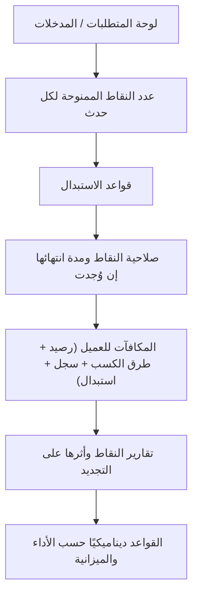

### لوحات — العنوان والمحتويات

#### **لوحة المتطلبات / المدخلات** _(مستنتجة)_

1. أحداث كسب النقاط: الاشتراك، التجديد، الطلب، التقييم، الإحالة.
2. جدول قيمة النقاط لكل حدث وقواعد الاستبدال والانتهاء.
3. ميزانية/سقف المكافآت ضمن الخطة المالية.

#### **عدد النقاط الممنوحة لكل حدث** _(مستنتجة)_

1. يحدد الأدمن عدد النقاط الممنوحة لكل حدث (اشتراك/تجديد/طلب/تقييم/إحالة)

#### **قواعد الاستبدال** _(مستنتجة)_

1. يضبط قواعد الاستبدال (قيمة النقطة
2. الحد الأدنى للاستبدال
3. المكافآت المتاحة)

#### **صلاحية النقاط ومدة انتهائها إن وُجدت** _(مستنتجة)_

1. يضبط صلاحية النقاط ومدة انتهائها إن وُجدت

#### **المكافآت للعميل (رصيد + طرق الكسب + سجل + استبدال)** _(مستنتجة)_

1. ينشر القواعد فتظهر في شاشة المكافآت للعميل (رصيد
2. طرق الكسب
3. سجل
4. استبدال)

#### **تقارير النقاط وأثرها على التجديد** _(مستنتجة)_

1. يتابع تقارير النقاط (مكتسبة/مستخدمة/منتهية) وأثرها على التجديد

#### **القواعد ديناميكيًا حسب الأداء والميزانية** _(مستنتجة)_

1. يعدّل القواعد ديناميكيًا حسب الأداء والميزانية

---

## F18 — إدارة الإحالات والبرومو كود

**الهدف:** ينشئ الأدمن ويدير روابط الإحالة وأكواد الخصم المرتبطة بالحملات والمؤثرين، ويحتسب العمولات/المكافآت، ويتابع تقارير الاستخدام لقياس فعالية كل حملة.

### Flowchart

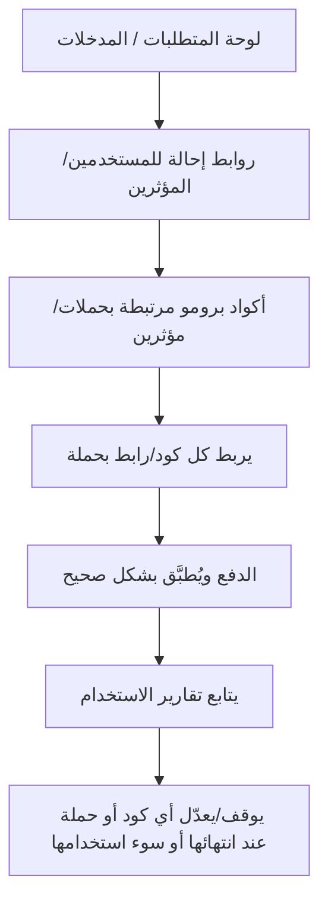

### لوحات — العنوان والمحتويات

#### **لوحة المتطلبات / المدخلات** _(مستنتجة)_

1. قائمة المؤثرين/الحملات وقنوات التوزيع.
2. قواعد الإحالة (مكافأة المُحيل والمُحال) وقواعد البرومو كود (نسبة/قيمة الخصم، الصلاحية، سقف الاستخدام).

#### **روابط إحالة للمستخدمين/المؤثرين** _(مستنتجة)_

1. ينشئ الأدمن روابط إحالة للمستخدمين/المؤثرين مع احتساب عمولة أو مكافأة

#### **أكواد برومو مرتبطة بحملات/مؤثرين** _(مستنتجة)_

1. ينشئ أكواد برومو مرتبطة بحملات/مؤثرين (نسبة/قيمة
2. تاريخ صلاحية
3. حد استخدام)

#### **يربط كل كود/رابط بحملة** _(مستنتجة)_

1. يربط كل كود/رابط بحملة لتتبع أدائها

#### **الدفع ويُطبَّق بشكل صحيح** _(مستنتجة)_

1. يتأكد أن البرومو كود يظهر للعميل في شاشة الدفع ويُطبَّق بشكل صحيح

#### **يتابع تقارير الاستخدام** _(مستنتجة)_

1. عدد المدعوين
2. المكافآت
3. مرات استخدام الأكواد
4. أثرها على المبيعات

#### **يوقف/يعدّل أي كود أو حملة عند انتهائها أو سوء استخدامها** _(مستنتجة)_

1. يوقف/يعدّل أي كود أو حملة عند انتهائها أو سوء استخدامها

---

## F19 — متابعة الاشتراك العائلي

**الهدف:** يتابع الأدمن آلية الاشتراك العائلي حيث يضيف مدير العائلة أفرادًا بحسابات منفصلة، ويتأكد من صحة الصلاحيات والحصص وعمليات الفصل/الترقية لحسابات مستقلة.

### Flowchart

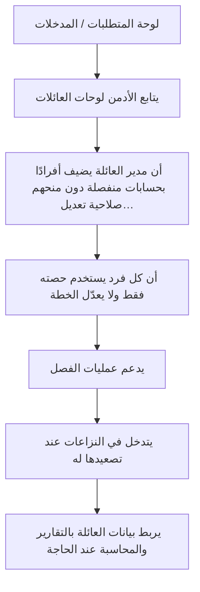

### لوحات — العنوان والمحتويات

#### **لوحة المتطلبات / المدخلات** _(مستنتجة)_

1. اشتراك رئيسي يديره «مدير العائلة».
2. أفراد عائلة بحسابات منفصلة مرتبطة بالاشتراك الرئيسي.
3. قواعد الحصص والصلاحيات (الفرد يستخدم حصته فقط ولا يعدّل الخطة).

#### **يتابع الأدمن لوحات العائلات** _(مستنتجة)_

1. عدد الأفراد
2. حالاتهم
3. الطلبات المرتبطة

#### **أن مدير العائلة يضيف أفرادًا بحسابات منفصلة دون منحهم صلاحية تعديل…** _(مستنتجة)_

1. يتأكد أن مدير العائلة يضيف أفرادًا بحسابات منفصلة دون منحهم صلاحية تعديل الاشتراك الرئيسي

#### **أن كل فرد يستخدم حصته فقط ولا يعدّل الخطة** _(مستنتجة)_

1. يراقب أن كل فرد يستخدم حصته فقط ولا يعدّل الخطة

#### **يدعم عمليات الفصل** _(مستنتجة)_

1. تأكيد → اختيار تحويل لحساب مستقل أو ترقية لاشتراك فردي → رسالة نجاح

#### **يتدخل في النزاعات عند تصعيدها له** _(مستنتجة)_

1. يتدخل في النزاعات (حصص/فصل) عند تصعيدها له

#### **يربط بيانات العائلة بالتقارير والمحاسبة عند الحاجة** _(مستنتجة)_

1. يربط بيانات العائلة بالتقارير والمحاسبة عند الحاجة

---

## F20 — إدارة الإعلانات والمزايدات

**الهدف:** يدير الأدمن منظومة الإعلانات المدفوعة للمطاعم بنظام مزايدة على أماكن محددة لكل منطقة، بحيث تظهر للعميل من مطاعم تخدم منطقته فقط دون إزعاج أو إخفاء معلومات أساسية.

### Flowchart

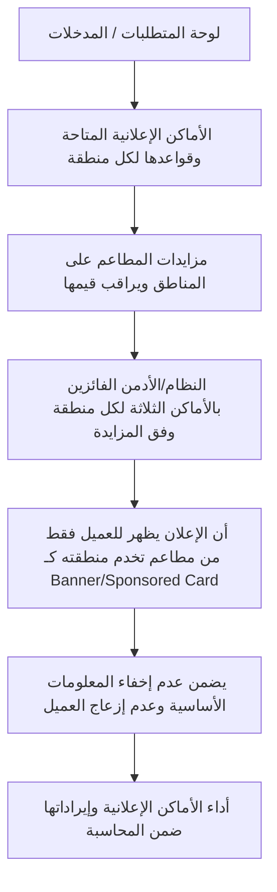

### لوحات — العنوان والمحتويات

#### **لوحة المتطلبات / المدخلات** _(مستنتجة)_

1. تعريف الأماكن الإعلانية: الرئيسية (بانر)، قائمة المطاعم (Sponsored)، صفحة المنطقة (مزايدة)، تفاصيل المطعم (Highlight).
2. عدد الأماكن لكل منطقة: 3 أماكن إعلانية للفائزين.
3. مزايدات المطاعم على المناطق التي تخدمها.

#### **الأماكن الإعلانية المتاحة وقواعدها لكل منطقة** _(مستنتجة)_

1. يعرّف الأدمن الأماكن الإعلانية المتاحة وقواعدها لكل منطقة

#### **مزايدات المطاعم على المناطق ويراقب قيمها** _(مستنتجة)_

1. يستقبل مزايدات المطاعم على المناطق ويراقب قيمها

#### **النظام/الأدمن الفائزين بالأماكن الثلاثة لكل منطقة وفق المزايدة** _(مستنتجة)_

1. يحدد النظام/الأدمن الفائزين بالأماكن الثلاثة لكل منطقة وفق المزايدة

#### **أن الإعلان يظهر للعميل فقط من مطاعم تخدم منطقته كـ Banner/Sponsored Card** _(مستنتجة)_

1. يتأكد أن الإعلان يظهر للعميل فقط من مطاعم تخدم منطقته كـ Banner/Sponsored Card

#### **يضمن عدم إخفاء المعلومات الأساسية وعدم إزعاج العميل** _(مستنتجة)_

1. يضمن عدم إخفاء المعلومات الأساسية وعدم إزعاج العميل

#### **أداء الأماكن الإعلانية وإيراداتها ضمن المحاسبة** _(مستنتجة)_

1. يتابع أداء الأماكن الإعلانية وإيراداتها ضمن المحاسبة (F26)

---

## F21 — إدارة المناطق والتغطية

**الهدف:** يدير الأدمن المحافظات والمناطق والتغطية الجغرافية، ويضبط ما يظهر لكل عميل/سائق حسب موقعه، بحيث يرى العميل فقط ما هو متاح في دولته/منطقته.

### Flowchart

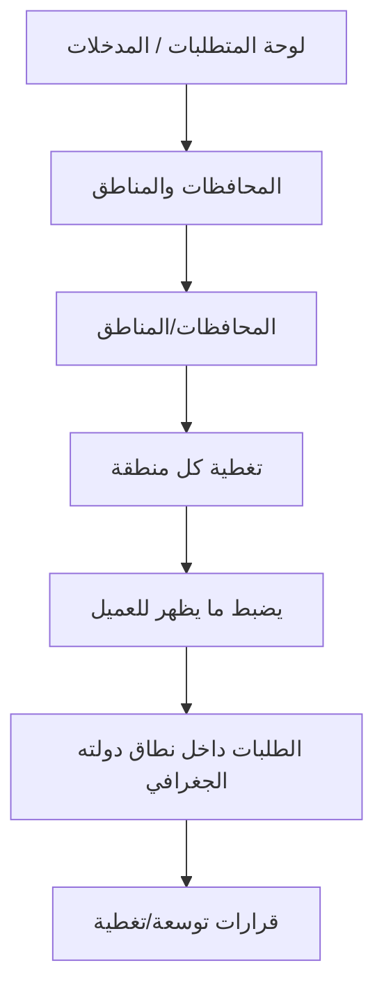

### لوحات — العنوان والمحتويات

#### **لوحة المتطلبات / المدخلات** _(مستنتجة)_

1. تعريف المحافظات والمناطق داخل نطاق الدولة.
2. اختيارات المطاعم للمحافظات/المناطق التي تخدمها.
3. ربط العملات والباقات المتاحة بكل منطقة (يتقاطع مع F28).

#### **المحافظات والمناطق** _(مستنتجة)_

1. يعرّف الأدمن المحافظات والمناطق ويفعّلها داخل نطاق دولته

#### **المحافظات/المناطق** _(مستنتجة)_

1. يتأكد أن المطعم يختار المحافظات/المناطق التي يخدمها (اختيار محافظة كاملة = كل مناطقها)

#### **تغطية كل منطقة** _(مستنتجة)_

1. يراقب تغطية كل منطقة (عدد المطاعم/السائقين المتاحين) لتفادي الفجوات

#### **يضبط ما يظهر للعميل** _(مستنتجة)_

1. فقط المطاعم/الباقات/العملات المتاحة في منطقته

#### **الطلبات داخل نطاق دولته الجغرافي** _(مستنتجة)_

1. يتأكد أن المندوب يستقبل فقط الطلبات داخل نطاق دولته الجغرافي مع خرائط محلية

#### **قرارات توسعة/تغطية** _(مستنتجة)_

1. يتخذ قرارات توسعة/تغطية بناءً على الفجوات والطلب

---

## F22 — مراجعة واعتماد وثائق المطاعم

**الهدف:** يراجع الأدمن ويعتمد وثائق المطاعم (السجل التجاري، عقد التأسيس، الترخيص...)، ويتابع تواريخ انتهائها والتنبيهات الآلية، ويضمن إيقاف المطاعم منتهية الوثائق حماية للامتثال.

### Flowchart

```mermaid
flowchart TD
  f22_s1["لوحة المتطلبات / المدخلات"]
  f22_s2["طلب تسجيل/تحديث وثائق المطعم"]
  f22_s3["كل وثيقة ويتحقق من صحتها واكتمالها وصلاحية تاريخها"]
  f22_s4["يعتمد الوثائق أو يطلب استكمالًا/تصحيحًا"]
  f22_s5["التنبيه الآلي قبل انتهاء الوثيقة بشهرين لطلب نسخة جديدة"]
  f22_s6["أنه قبل الانتهاء بشهر يوقف النظام استقبال الطلبات الجديدة ويخفي المطعم…"]
  f22_s7["يعيد التفعيل بعد رفع المطعم نسخة محدّثة واعتمادها"]
  f22_s1 --> f22_s2
  f22_s2 --> f22_s3
  f22_s3 --> f22_s4
  f22_s4 --> f22_s5
  f22_s5 --> f22_s6
  f22_s6 --> f22_s7
```

### لوحات — العنوان والمحتويات

#### **لوحة المتطلبات / المدخلات** _(مستنتجة)_

1. بيانات المطعم/الشركة/المالك + الوثائق المرفوعة (السجل التجاري، عقد التأسيس، ترخيص الشركة...).
2. تاريخ إصدار وانتهاء كل وثيقة.
3. إعدادات التنبيهات الزمنية (شهرين/شهر قبل الانتهاء).

#### **طلب تسجيل/تحديث وثائق المطعم** _(مستنتجة)_

1. يستقبل الأدمن طلب تسجيل/تحديث وثائق المطعم مع تواريخها

#### **كل وثيقة ويتحقق من صحتها واكتمالها وصلاحية تاريخها** _(مستنتجة)_

1. يراجع كل وثيقة ويتحقق من صحتها واكتمالها وصلاحية تاريخها

#### **يعتمد الوثائق أو يطلب استكمالًا/تصحيحًا** _(مستنتجة)_

1. يعتمد الوثائق (فيظهر المطعم/يستمر) أو يطلب استكمالًا/تصحيحًا

#### **التنبيه الآلي قبل انتهاء الوثيقة بشهرين لطلب نسخة جديدة** _(مستنتجة)_

1. يتابع التنبيه الآلي قبل انتهاء الوثيقة بشهرين لطلب نسخة جديدة

#### **أنه قبل الانتهاء بشهر يوقف النظام استقبال الطلبات الجديدة ويخفي المطعم…** _(مستنتجة)_

1. يتأكد أنه قبل الانتهاء بشهر يوقف النظام استقبال الطلبات الجديدة ويخفي المطعم ووجباته مؤقتًا

#### **يعيد التفعيل بعد رفع المطعم نسخة محدّثة واعتمادها** _(مستنتجة)_

1. يعيد التفعيل بعد رفع المطعم نسخة محدّثة واعتمادها

---

## F23 — إدارة السائقين العامين والتحقق

**الهدف:** يدير الأدمن السائقين العامين (التابعين للمنصة)، ويتحقق من وثائقهم، ويمنح الموافقة النهائية لتفعيل أي سائق، ويراقب صلاحية رخصهم باستمرار لضمان عدم توصيل أي طلب إلا عبر سائق معتمد.

### Flowchart

```mermaid
flowchart TD
  f23_s1["لوحة المتطلبات / المدخلات"]
  f23_s2["طلب السائق العام"]
  f23_s3["من الوثائق وصحتها وصلاحيتها"]
  f23_s4["موافقة الأدمن النهائية"]
  f23_s5["السائق بعد الموافقة النهائية فيصبح قابلًا للإسناد"]
  f23_s6["باستمرار تاريخ انتهاء الرخصة وأي وثيقة حرجة"]
  f23_s7["أي سائق تنتهي رخصته أو يخالف"]
  f23_s1 --> f23_s2
  f23_s2 --> f23_s3
  f23_s3 --> f23_s4
  f23_s4 --> f23_s5
  f23_s5 --> f23_s6
  f23_s6 --> f23_s7
```

### لوحات — العنوان والمحتويات

#### **لوحة المتطلبات / المدخلات** _(مستنتجة)_

1. بيانات السائق الكاملة: شخصية (اسم، هاتف، بريد)، رخصة (رقم، انتهاء، صورة)، مركبة (نوع، لون، لوحة، رقم محرك، وثيقة، صور).
2. نوع السائق: عام (يديره الأدمن) أو تابع لمطعم (يديره المطعم بموافقة الأدمن النهائية).

#### **طلب السائق العام** _(مستنتجة)_

1. يستقبل الأدمن طلب السائق العام مع وثائقه الكاملة

#### **من الوثائق وصحتها وصلاحيتها** _(مستنتجة)_

1. يتحقق من الوثائق (الرخصة
2. وثيقة المركبة) وصحتها وصلاحيتها

#### **موافقة الأدمن النهائية** _(مستنتجة)_

1. يتحقق المطعم أولًا ثم تأتي

#### **السائق بعد الموافقة النهائية فيصبح قابلًا للإسناد** _(مستنتجة)_

1. يفعّل السائق بعد الموافقة النهائية فيصبح قابلًا للإسناد

#### **باستمرار تاريخ انتهاء الرخصة وأي وثيقة حرجة** _(مستنتجة)_

1. يراقب باستمرار تاريخ انتهاء الرخصة وأي وثيقة حرجة

#### **أي سائق تنتهي رخصته أو يخالف** _(مستنتجة)_

1. يعطّل أي سائق تنتهي رخصته أو يخالف
2. فيمنع النظام إسناد أي طلب له

---

## F24 — اعتماد القوائم والوجبات

**الهدف:** يعتمد الأدمن إضافات وتعديلات الوجبات قبل ظهورها للعملاء، ويدير طلبات إلغاء الوجبات وفق سياسة الـ30 يومًا، بما يضمن جودة المحتوى ودقّة بياناته باللغتين.

### Flowchart

```mermaid
flowchart TD
  f24_s1["لوحة المتطلبات / المدخلات"]
  f24_s2["طلب إضافة وجبة جديدة من المطعم"]
  f24_s3["المكونات والسعر والبيانات الغذائية واكتمالها باللغتين"]
  f24_s4["طلبات تعديل المكونات/السعر ويعتمدها قبل سريانها على العملاء"]
  f24_s5["30 يومًا"]
  f24_s6["أن الوجبة المُلغاة تختفي فورًا عن العملاء الجدد وتبقى لمن اختارها مسبقًا"]
  f24_s7["أن كل المحتوى مُدخل باللغتين قبل النشر"]
  f24_s1 --> f24_s2
  f24_s2 --> f24_s3
  f24_s3 --> f24_s4
  f24_s4 --> f24_s5
  f24_s5 --> f24_s6
  f24_s6 --> f24_s7
```

### لوحات — العنوان والمحتويات

#### **لوحة المتطلبات / المدخلات** _(مستنتجة)_

1. وجبة جديدة/تعديل من المطعم (مكونات، سعر، بيانات غذائية باللغتين).
2. طلب إلغاء وجبة من المطعم (إن وُجد).
3. سياسة الاعتماد ومدد الالتزام (30 يومًا للإلغاء).

#### **طلب إضافة وجبة جديدة من المطعم** _(مستنتجة)_

1. يستقبل الأدمن طلب إضافة وجبة جديدة من المطعم

#### **المكونات والسعر والبيانات الغذائية واكتمالها باللغتين** _(مستنتجة)_

1. يراجع المكونات والسعر والبيانات الغذائية واكتمالها باللغتين
2. ثم يعتمدها أو يرفضها

#### **طلبات تعديل المكونات/السعر ويعتمدها قبل سريانها على العملاء** _(مستنتجة)_

1. يراجع طلبات تعديل المكونات/السعر ويعتمدها قبل سريانها على العملاء

#### **30 يومًا** _(مستنتجة)_

1. يعتمد الأدمن الطلب
2. فيلتزم المطعم بتوفيرها للطلبات القائمة 30 يومًا

#### **أن الوجبة المُلغاة تختفي فورًا عن العملاء الجدد وتبقى لمن اختارها مسبقًا** _(مستنتجة)_

1. يتأكد أن الوجبة المُلغاة تختفي فورًا عن العملاء الجدد وتبقى لمن اختارها مسبقًا

#### **أن كل المحتوى مُدخل باللغتين قبل النشر** _(مستنتجة)_

1. يتابع أن كل المحتوى مُدخل باللغتين قبل النشر

---

## F25 — إدارة سياسة إنهاء التعاقد

**الهدف:** يدير الأدمن طلبات إنهاء تعاقد المطاعم بما يضمن عدم تعطّل اشتراكات العملاء الحاليين، عبر إلزام المطعم بتوفير الطلبات القائمة والمجدولة لمدة لا تقل عن 30 يومًا.

### Flowchart

```mermaid
flowchart TD
  f25_s1["لوحة المتطلبات / المدخلات"]
  f25_s2["طلب إنهاء التعاقد من المطعم ويراجع التزاماته الجارية"]
  f25_s3["والمجدولة 30 يومًا على الأقل من تاريخ الطلب"]
  f25_s4["يخطط لمرحلة انتقالية"]
  f25_s5["يضمن منح العملاء الحاليين فرصة اختيار مطاعم بديلة للأيام القادمة"]
  f25_s6["المتاحة"]
  f25_s7["يُنهي التعاقد رسميًا بعد انقضاء المدة وتسوية المستحقات"]
  f25_s1 --> f25_s2
  f25_s2 --> f25_s3
  f25_s3 --> f25_s4
  f25_s4 --> f25_s5
  f25_s5 --> f25_s6
  f25_s6 --> f25_s7
```

### لوحات — العنوان والمحتويات

#### **لوحة المتطلبات / المدخلات** _(مستنتجة)_

1. «طلب إنهاء تعاقد» مقدّم من المطعم.
2. قائمة الطلبات القائمة والمجدولة المرتبطة بالمطعم.
3. بدائل المطاعم المتاحة للعملاء المتأثرين في نفس التصنيف/المنطقة.

#### **طلب إنهاء التعاقد من المطعم ويراجع التزاماته الجارية** _(مستنتجة)_

1. يستقبل الأدمن طلب إنهاء التعاقد من المطعم ويراجع التزاماته الجارية

#### **والمجدولة 30 يومًا على الأقل من تاريخ الطلب** _(مستنتجة)_

1. يتأكد من التزام المطعم بتوفير كل الطلبات القائمة والمجدولة 30 يومًا على الأقل من تاريخ الطلب

#### **يخطط لمرحلة انتقالية** _(مستنتجة)_

1. إخفاء المطعم عن الاشتراكات الجديدة مع إبقائه للطلبات القائمة

#### **يضمن منح العملاء الحاليين فرصة اختيار مطاعم بديلة للأيام القادمة** _(مستنتجة)_

1. يضمن منح العملاء الحاليين فرصة اختيار مطاعم بديلة للأيام القادمة

#### **المتاحة** _(مستنتجة)_

1. يراقب إعادة حساب الكوتا/التوزيع بعد خروج المطعم من  تدريجيًا

#### **يُنهي التعاقد رسميًا بعد انقضاء المدة وتسوية المستحقات** _(مستنتجة)_

1. يُنهي التعاقد رسميًا بعد انقضاء المدة وتسوية المستحقات (F26)

---

## F26 — النظام المحاسبي والتسويات

**الهدف:** يدير الأدمن التسويات المالية بين التطبيق والمطاعم على أساس البوكسات الفعلية المُسلّمة، ويتابع الإيرادات والمدفوعات والعمولات والاستردادات والتقارير المالية الشاملة.

### Flowchart

```mermaid
flowchart TD
  f26_s1["لوحة المتطلبات / المدخلات"]
  f26_s2["يجمّع النظام البوكسات المُسلّمة فعليًا لكل مطعم خلال فترة التسوية"]
  f26_s3["صافي مستحق البوكس = سعر البوكس المتفق عليه − (سعر البوكس × نسبة العمولة الديناميكية)"]
  f26_s4["إجمالي المستحقات = − رسوم اشتراك المطعم"]
  f26_s5["يخصم أي مبالغ شكاوى محقّة"]
  f26_s6["يعتمد التسوية ويصرف المستحقات للمطعم"]
  f26_s7["يتابع تقارير"]
  f26_s1 --> f26_s2
  f26_s2 --> f26_s3
  f26_s3 --> f26_s4
  f26_s4 --> f26_s5
  f26_s5 --> f26_s6
  f26_s6 --> f26_s7
```

### لوحات — العنوان والمحتويات

#### **لوحة المتطلبات / المدخلات** _(مستنتجة)_

1. عدد البوكسات الفعلية المُسلّمة لكل مطعم.
2. سعر البوكس المتفق عليه ونسبة العمولة الديناميكية للمطعم (راجع F04).
3. رسوم اشتراك المطعم (مبلغ ثابت شهري/سنوي) إن كانت مستحقة.

#### **يجمّع النظام البوكسات المُسلّمة فعليًا لكل مطعم خلال فترة التسوية** _(مستنتجة)_

1. يجمّع النظام البوكسات المُسلّمة فعليًا لكل مطعم خلال فترة التسوية

#### **صافي مستحق البوكس = سعر البوكس المتفق عليه − (سعر البوكس × نسبة العمولة الديناميكية)** _(مستنتجة)_

1. يحسب الأدمن

#### **إجمالي المستحقات = − رسوم اشتراك المطعم** _(مستنتجة)_

1. يحسب إجمالي المستحقات = (صافي البوكس × عدد البوكسات المُسلّمة) − رسوم اشتراك المطعم (إن استحقت)

#### **يخصم أي مبالغ شكاوى محقّة** _(مستنتجة)_

1. يخصم أي مبالغ شكاوى محقّة (قيمة بوكس مخصومة من المطعم
2. راجع F16)

#### **يعتمد التسوية ويصرف المستحقات للمطعم** _(مستنتجة)_

1. يعتمد التسوية ويصرف المستحقات للمطعم
2. ويسجّل العملية

#### **يتابع تقارير** _(مستنتجة)_

1. الإيرادات
2. مدفوعات العملاء
3. مستحقات المطاعم
4. العمولات
5. الاستردادات

---

## F27 — التقارير ومؤشرات الأداء KPI

**الهدف:** يوفّر للأدمن لوحة مؤشرات شاملة لقياس صحة المنصة: الاشتراكات، الطلبات، الإيرادات، أداء المطاعم والسائقين، والدول، لاتخاذ قرارات تشغيلية وتوسعية مبنية على بيانات.

### Flowchart

```mermaid
flowchart TD
  f27_s1["لوحة المتطلبات / المدخلات"]
  f27_s2["المؤشرات الرئيسية ويختار الفترة الزمنية والنطاق"]
  f27_s3["مؤشرات الاشتراكات والطلبات"]
  f27_s4["الإيرادات والعمولات والاستردادات"]
  f27_s5["يحلّل أداء المطاعم والسائقين"]
  f27_s6["يقارن أداء الدول/المناطق (للـ Super Admin"]
  f27_s7["يصدّر التقارير ويستخدمها في قرارات التسعير/التغطية/الاستمرارية"]
  f27_s1 --> f27_s2
  f27_s2 --> f27_s3
  f27_s3 --> f27_s4
  f27_s4 --> f27_s5
  f27_s5 --> f27_s6
  f27_s6 --> f27_s7
```

### لوحات — العنوان والمحتويات

#### **لوحة المتطلبات / المدخلات** _(مستنتجة)_

1. بيانات لحظية/مجمّعة من كل الأنظمة (اشتراكات، طلبات، تسويات، تقييمات، شكاوى).
2. صلاحية الوصول حسب النطاق: Country Admin (دولته) / Super Admin (كل الدول).

#### **المؤشرات الرئيسية ويختار الفترة الزمنية والنطاق** _(مستنتجة)_

1. يفتح الأدمن لوحة المؤشرات الرئيسية ويختار الفترة الزمنية والنطاق

#### **مؤشرات الاشتراكات والطلبات** _(مستنتجة)_

1. يتابع مؤشرات الاشتراكات (جديدة/مجدّدة/ملغاة/مجمّدة) والطلبات (مؤكدة/مُسلّمة)

#### **الإيرادات والعمولات والاستردادات** _(مستنتجة)_

1. يراقب الإيرادات والعمولات والاستردادات (يتقاطع مع F26)

#### **يحلّل أداء المطاعم والسائقين** _(مستنتجة)_

1. يحلّل أداء المطاعم (مبيعات
2. تقييم
3. شكاوى) والسائقين (إنجاز
4. تقييم
5. زمن)

#### **يقارن أداء الدول/المناطق (للـ Super Admin** _(مستنتجة)_

1. كل الدول أو دولة على حدة)

#### **يصدّر التقارير ويستخدمها في قرارات التسعير/التغطية/الاستمرارية** _(مستنتجة)_

1. يصدّر التقارير ويستخدمها في قرارات التسعير/التغطية/الاستمرارية

---

## F28 — التوسع الدولي و Multi-Tenancy (Super Admin / Country Admin)

**الهدف:** ينظّم هذا التدفق التوسع الدولي عبر طبقتين من الأدمن: **Super Admin** يدير الدول والإعدادات العالمية والرقابة الشاملة، و**Country Admin** يدير دولته فقط، مع عزل تام لبيانات كل دولة.

### Flowchart

```mermaid
flowchart TD
  f28_s1["لوحة المتطلبات / المدخلات"]
  f28_s2["Super Admin"]
  f28_s3["Super Admin"]
  f28_s4["Super Admin"]
  f28_s5["Country Admin"]
  f28_s6["يتأكد الطرفان من عزل البيانات"]
  f28_s7["Super Admin"]
  f28_s1 --> f28_s2
  f28_s2 --> f28_s3
  f28_s3 --> f28_s4
  f28_s4 --> f28_s5
  f28_s5 --> f28_s6
  f28_s6 --> f28_s7
```

### لوحات — العنوان والمحتويات

#### **لوحة المتطلبات / المدخلات** _(مستنتجة)_

1. صلاحيات مفصولة: Super Admin (عالمي) مقابل Country Admin (نطاق دولة واحدة).
2. إعدادات كل دولة: العملة، بوابات الدفع المحلية، اللغات.
3. بنية عزل بيانات تضمن خصوصية وأداء كل دولة.

#### **Super Admin** _(مستنتجة)_

1. يضيف/يفعّل دولة جديدة ويضبط إعداداتها الأساسية (عملة
2. لغات
3. بوابة دفع)

#### **Super Admin** _(مستنتجة)_

1. يعيّن Country Admin لكل دولة ويمنحه صلاحيات نطاقه فقط

#### **Super Admin** _(مستنتجة)_

1. يراقب تقارير الأداء/الإيرادات/المشتركين لكل الدول أو دولة على حدة
2. ويضبط الإعدادات العالمية

#### **Country Admin** _(مستنتجة)_

1. المطاعم
2. السائقين
3. العمولات
4. الاشتراكات
5. الشكاوى (كل الميزات F01–F31 ضمن نطاقه)

#### **يتأكد الطرفان من عزل البيانات** _(مستنتجة)_

1. لا تداخل بين بيانات الدول ولا بين العمليات البنكية

#### **Super Admin** _(مستنتجة)_

1. يخصّص اللغات/اللهجات لكل دولة (يتقاطع مع F29)

---

## F29 — إدارة تعدد اللغات

**الهدف:** يدير الأدمن دعم تعدد اللغات (العربية RTL والإنجليزية LTR) عبر المنصة، ويتأكد من إدخال المحتوى الديناميكي باللغتين، ويضيف لغات/لهجات لكل دولة جديدة حسب الحاجة.

### Flowchart

```mermaid
flowchart TD
  f29_s1["لوحة المتطلبات / المدخلات"]
  f29_s2["الرئيسية"]
  f29_s3["أن المطاعم تُدخل المحتوى الديناميكي باللغتين قبل اعتماده"]
  f29_s4["إرسال الإشعارات والرسائل بلغة العميل المختارة"]
  f29_s5["أن الفواتير والملصقات تُطبع باللغتين"]
  f29_s6["لغات/لهجات جديدة عند إطلاق دولة جديدة ويربطها بإعداداتها"]
  f29_s7["اكتمال الترجمات ويعالج النواقص قبل النشر"]
  f29_s1 --> f29_s2
  f29_s2 --> f29_s3
  f29_s3 --> f29_s4
  f29_s4 --> f29_s5
  f29_s5 --> f29_s6
  f29_s6 --> f29_s7
```

### لوحات — العنوان والمحتويات

#### **لوحة المتطلبات / المدخلات** _(مستنتجة)_

1. حزم الترجمة الثابتة للواجهات (عربي/إنجليزي).
2. محتوى ديناميكي من المطاعم (أسماء الوجبات/المكونات/البيانات الغذائية) باللغتين.
3. إعداد لغة افتراضية لكل دولة (يتقاطع مع F28).

#### **الرئيسية** _(مستنتجة)_

1. يفعّل الأدمن اللغات المدعومة ويضبط زر التبديل الواضح في القائمة الرئيسية

#### **أن المطاعم تُدخل المحتوى الديناميكي باللغتين قبل اعتماده** _(مستنتجة)_

1. يتأكد أن المطاعم تُدخل المحتوى الديناميكي باللغتين قبل اعتماده (راجع F24)

#### **إرسال الإشعارات والرسائل بلغة العميل المختارة** _(مستنتجة)_

1. يضبط إرسال الإشعارات والرسائل بلغة العميل المختارة

#### **أن الفواتير والملصقات تُطبع باللغتين** _(مستنتجة)_

1. يتأكد أن الفواتير والملصقات تُطبع باللغتين (راجع F12)

#### **لغات/لهجات جديدة عند إطلاق دولة جديدة ويربطها بإعداداتها** _(مستنتجة)_

1. يضيف لغات/لهجات جديدة عند إطلاق دولة جديدة ويربطها بإعداداتها

#### **اكتمال الترجمات ويعالج النواقص قبل النشر** _(مستنتجة)_

1. يراجع اكتمال الترجمات ويعالج النواقص قبل النشر

---

## F30 — إدارة قنوات التواصل (واتساب/سوشيال)

**الهدف:** يدير الأدمن قنوات التواصل مع العملاء: زر واتساب العائم للدعم، واستقبال الحالات الاستثنائية (تغيير داخل 72 ساعة)، وروابط السوشيال ميديا، باعتبارها نقطة التماس المباشر للطوارئ والاستفسارات.

### Flowchart

```mermaid
flowchart TD
  f30_s1["لوحة المتطلبات / المدخلات"]
  f30_s2["زر واتساب العائم ليظهر في كل صفحات التطبيق للدعم المباشر"]
  f30_s3["عبر واتساب طلبات الحالات الاستثنائية مثل التغيير"]
  f30_s4["عند صحته (راجع F06) ويوثّقه"]
  f30_s5["يجيب الاستفسارات العاجلة ويوجّه العميل للمسار الصحيح"]
  f30_s6["الجانبية والتذييل ويحدّثها"]
  f30_s7["جودة الدعم وزمن الاستجابة كمؤشر خدمة"]
  f30_s1 --> f30_s2
  f30_s2 --> f30_s3
  f30_s3 --> f30_s4
  f30_s4 --> f30_s5
  f30_s5 --> f30_s6
  f30_s6 --> f30_s7
```

### لوحات — العنوان والمحتويات

#### **لوحة المتطلبات / المدخلات** _(مستنتجة)_

1. رقم/حساب واتساب الأدمن للدعم الفني.
2. روابط حسابات السوشيال (Instagram، Twitter/X، Snapchat/TikTok).
3. سياسة معالجة الحالات الاستثنائية (تتقاطع مع F06).

#### **زر واتساب العائم ليظهر في كل صفحات التطبيق للدعم المباشر** _(مستنتجة)_

1. يضبط الأدمن زر واتساب العائم ليظهر في كل صفحات التطبيق للدعم المباشر

#### **عبر واتساب طلبات الحالات الاستثنائية مثل التغيير** _(مستنتجة)_

1. يستقبل عبر واتساب طلبات الحالات الاستثنائية مثل التغيير داخل نافذة 72 ساعة

#### **عند صحته (راجع F06) ويوثّقه** _(مستنتجة)_

1. يتحقق من الطلب وينفّذ الاستثناء من اللوحة عند صحته (راجع F06) ويوثّقه

#### **يجيب الاستفسارات العاجلة ويوجّه العميل للمسار الصحيح** _(مستنتجة)_

1. يجيب الاستفسارات العاجلة ويوجّه العميل للمسار الصحيح

#### **الجانبية والتذييل ويحدّثها** _(مستنتجة)_

1. يضبط روابط السوشيال في القائمة الجانبية والتذييل ويحدّثها

#### **جودة الدعم وزمن الاستجابة كمؤشر خدمة** _(مستنتجة)_

1. يتابع جودة الدعم وزمن الاستجابة كمؤشر خدمة

---

## F31 — سياسات حماية الخصوصية

**الهدف:** يضبط الأدمن سياسات حماية الخصوصية والأمان عبر المنصة: فصل تطبيق السائق، تقييد المعلومات المرئية لكل طرف، الاتصال الآمن، وتأمين البيانات وفق المعايير، مع رقابة على الاستثناءات.

### Flowchart

```mermaid
flowchart TD
  f31_s1["لوحة المتطلبات / المدخلات"]
  f31_s2["أن تطبيق السائق منفصل تمامًا"]
  f31_s3["يضبط ما يراه المطعم"]
  f31_s4["أن الاتصال داخل التطبيق فقط بأرقام مقنّعة ورسائل مشفّرة"]
  f31_s5["أن إظهار الرقم الحقيقي استثناء موثّق بإشعار للأدمن"]
  f31_s6["يتحقق من تطبيق معايير الأمان"]
  f31_s7["سجلات الوصول والاستثناءات بشكل دوري"]
  f31_s1 --> f31_s2
  f31_s2 --> f31_s3
  f31_s3 --> f31_s4
  f31_s4 --> f31_s5
  f31_s5 --> f31_s6
  f31_s6 --> f31_s7
```

### لوحات — العنوان والمحتويات

#### **لوحة المتطلبات / المدخلات** _(مستنتجة)_

1. بنية فصل تطبيق السائق عن تطبيقي العميل والمطعم.
2. إعدادات إخفاء/تقنيع البيانات لكل طرف.
3. معايير الأمان: تشفير، حماية CSRF/SQLi/XSS، نسخ احتياطي يومي، PCI DSS للدفع.

#### **أن تطبيق السائق منفصل تمامًا** _(مستنتجة)_

1. يتأكد الأدمن أن تطبيق السائق منفصل تمامًا
2. ويرى الموقع الجغرافي فقط (Lat/Long) دون اسم/رقم العميل

#### **يضبط ما يراه المطعم** _(مستنتجة)_

1. عدد البوكسات ونوعها (بدون اسم العميل)
2. الموقع العام
3. وقت التوصيل المطلوب فقط

#### **أن الاتصال داخل التطبيق فقط بأرقام مقنّعة ورسائل مشفّرة** _(مستنتجة)_

1. يتأكد أن الاتصال داخل التطبيق فقط بأرقام مقنّعة ورسائل مشفّرة

#### **أن إظهار الرقم الحقيقي استثناء موثّق بإشعار للأدمن** _(مستنتجة)_

1. يراقب أن إظهار الرقم الحقيقي استثناء موثّق بإشعار للأدمن (راجع F14)

#### **يتحقق من تطبيق معايير الأمان** _(مستنتجة)_

1. تشفير البيانات الحساسة
2. حماية CSRF/SQLi/XSS
3. نسخ احتياطي يومي
4. PCI DSS

#### **سجلات الوصول والاستثناءات بشكل دوري** _(مستنتجة)_

1. يراجع سجلات الوصول والاستثناءات بشكل دوري

---

