# الأدمن — Lifecycle Flowcharts (تفصيلي)

> **الدور:** الأدمن | **المنصة:** Super Admin / Country Admin — Angular

> **ملف مستقل كامل** — دورة حياة + flowcharts + شاشات/لوحات + خطوات workflow + قواعد.

> افتح **Preview** (`Ctrl+Shift+V`) لرؤية Mermaid.

---

## 1. دورة الحياة الكاملة

### 1.1 خريطة الميزات (Flowchart)

```mermaid
flowchart TB
 subgraph p1["الدخول والإعداد"]
 p1_feat1["التسجيل واعتماد الحسابات والدخول"]
 p1_feat2["إدارة المناطق والتغطية"]
 p1_feat1 --> p1_feat2
 end
 subgraph p2["ضبط المنصة"]
 p2_feat1["إدارة نموذج الاشتراك (المدد/البرامج/الباقات)"]
 p2_feat2["إدارة تصنيف المطاعم (Basic/Platinum/Elite)"]
 p2_feat3["إدارة التسعير والعمولات الديناميكية"]
 p2_feat4["إعداد الفواتير والباركود والملصقات"]
 p2_feat5["إدارة الولاء والمكافآت"]
 p2_feat6["إدارة الإحالات والبرومو كود"]
 p2_feat7["متابعة الاشتراك العائلي"]
 p2_feat8["إدارة تعدد اللغات"]
 p2_feat9["إدارة قنوات التواصل (واتساب/سوشيال)"]
 p2_feat10["سياسات حماية الخصوصية"]
 p2_feat1 --> p2_feat2
 p2_feat2 --> p2_feat3
 p2_feat3 --> p2_feat4
 p2_feat4 --> p2_feat5
 p2_feat5 --> p2_feat6
 p2_feat6 --> p2_feat7
 p2_feat7 --> p2_feat8
 p2_feat8 --> p2_feat9
 p2_feat9 --> p2_feat10
 end
 subgraph p3["الاعتماد"]
 p3_feat1["مراجعة واعتماد وثائق المطاعم"]
 p3_feat2["إدارة السائقين العامين والتحقق"]
 p3_feat3["اعتماد القوائم والوجبات"]
 p3_feat1 --> p3_feat2
 p3_feat2 --> p3_feat3
 end
 subgraph p4["التشغيل اليومي"]
 p4_feat1["قاعدة 72 ساعة وتأكيد المطعم واستثناءات الأدمن"]
 p4_feat2["ضبط الاختيار التلقائي والتوزيع العادل"]
 p4_feat3["مراقبة الطاقة الاستيعابية و Busy"]
 p4_feat4["مراقبة التوصيل والتتبع"]
 p4_feat5["متابعة الاتصال وحالة Hold"]
 p4_feat6["متابعة التقييمات والإحصائيات"]
 p4_feat1 --> p4_feat2
 p4_feat2 --> p4_feat3
 p4_feat3 --> p4_feat4
 p4_feat4 --> p4_feat5
 p4_feat5 --> p4_feat6
 end
 subgraph p5["الشكاوى والمالية"]
 p5_feat1["إدارة الإلغاء والاسترداد"]
 p5_feat2["إدارة التجميد"]
 p5_feat3["إدارة الشكاوى والمحفظة والتعويضات"]
 p5_feat4["النظام المحاسبي والتسويات"]
 p5_feat1 --> p5_feat2
 p5_feat2 --> p5_feat3
 p5_feat3 --> p5_feat4
 end
 subgraph p6["التقارير والسياسات"]
 p6_feat1["إدارة الإعلانات والمزايدات"]
 p6_feat2["إدارة سياسة إنهاء التعاقد"]
 p6_feat3["التقارير ومؤشرات الأداء KPI"]
 p6_feat1 --> p6_feat2
 p6_feat2 --> p6_feat3
 end
 p1_feat2 --> p2_feat1
 p2_feat10 --> p3_feat1
 p3_feat3 --> p4_feat1
 p4_feat6 --> p5_feat1
 p5_feat4 --> p6_feat1
 p6_feat3 -->|دورة تشغيل| p4_feat1
```

### 1.2 مسار الشاشات/اللوحات الكامل (Flowchart)

```mermaid
flowchart TD
 p1_f01_s1["لوحة المتطلبات / المدخلات"]
 p1_f01_s2["طلبات التسجيل المعلّقة"]
 p1_f01_s3["يفتح طلب المطعم"]
 p1_f01_s4["اعتماد"]
 p1_f01_s5["يفتح طلب السائق العام"]
 p1_f01_s6["يدير حسابات العملاء"]
 p1_f01_s7["نسيت كلمة المرور"]
 p1_f01_s1 --> p1_f01_s2
 p1_f01_s2 --> p1_f01_s3
 p1_f01_s3 --> p1_f01_s4
 p1_f01_s4 --> p1_f01_s5
 p1_f01_s5 --> p1_f01_s6
 p1_f01_s6 --> p1_f01_s7
 p1_f21_s1["لوحة المتطلبات / المدخلات"]
 p1_f21_s2["المحافظات والمناطق"]
 p1_f21_s3["المحافظات/المناطق"]
 p1_f21_s4["تغطية كل منطقة"]
 p1_f21_s5["يضبط ما يظهر للعميل"]
 p1_f21_s6["الطلبات داخل نطاق دولته الجغرافي"]
 p1_f21_s7["قرارات توسعة/تغطية"]
 p1_f21_s1 --> p1_f21_s2
 p1_f21_s2 --> p1_f21_s3
 p1_f21_s3 --> p1_f21_s4
 p1_f21_s4 --> p1_f21_s5
 p1_f21_s5 --> p1_f21_s6
 p1_f21_s6 --> p1_f21_s7
 p1_f01_s7 --> p1_f21_s1
 p2_f02_s1["لوحة المتطلبات / المدخلات"]
 p2_f02_s2["نموذج الاشتراك"]
 p2_f02_s3["المدد"]
 p2_f02_s4["البرامج الغذائية"]
 p2_f02_s5["الباقات"]
 p2_f02_s6["المطعم (لتسعيرها)"]
 p2_f02_s7["أن كل برنامج/باقة مرتبط بأسعار مدخلة من المطاعم لـ"]
 p2_f02_s1 --> p2_f02_s2
 p2_f02_s2 --> p2_f02_s3
 p2_f02_s3 --> p2_f02_s4
 p2_f02_s4 --> p2_f02_s5
 p2_f02_s5 --> p2_f02_s6
 p2_f02_s6 --> p2_f02_s7
 p1_f21_s7 --> p2_f02_s1
 p2_f03_s1["لوحة المتطلبات / المدخلات"]
 p2_f03_s2["البوكس اليومي"]
 p2_f03_s3["μ و σ لكل مجموعة برنامج/باقة"]
 p2_f03_s4["≥2 مطاعم"]
 p2_f03_s5["مطعم واحد"]
 p2_f03_s6["أدمن يراجع الجدول — أي تغيير سعر"]
 p2_f03_s1 --> p2_f03_s2
 p2_f03_s2 --> p2_f03_s3
 p2_f03_s3 --> p2_f03_s4
 p2_f03_s4 --> p2_f03_s5
 p2_f03_s5 --> p2_f03_s6
 p2_f02_s7 --> p2_f03_s1
 p2_f04_s1["لوحة المتطلبات / المدخلات"]
 p2_f04_s2["التحكم (النظام يحسب commission بالاستيفاء الخطي لك"]
 p2_f04_s3["نسبة العمولة الديناميكية لكل مطعم على حدة"]
 p2_f04_s4["متوسط سعر القروب"]
 p2_f04_s5["متوسط البوكس اليومي"]
 p2_f04_s6["commission(days)"]
 p2_f04_s7["يطبّق خصم المشترك وعمولة المؤثر عند الحاجة"]
 p2_f04_s1 --> p2_f04_s2
 p2_f04_s2 --> p2_f04_s3
 p2_f04_s3 --> p2_f04_s4
 p2_f04_s4 --> p2_f04_s5
 p2_f04_s5 --> p2_f04_s6
 p2_f04_s6 --> p2_f04_s7
 p2_f03_s6 --> p2_f04_s1
 p2_f12_s1["لوحة المتطلبات / المدخلات"]
 p2_f12_s2["يهيّئ الأدمن قوالب الفواتير والملصقات ويضبط عناصره"]
 p2_f12_s3["−24h"]
 p2_f12_s4["أن كل طلب يحمل باركود قابلًا للقراءة مخصصًا لسائقي"]
 p2_f12_s5["يراجع أن ملصق كل وجبة يتضمن"]
 p2_f12_s6["من طباعة الفواتير والملصقات باللغتين"]
 p2_f12_s7["يعالج الحالات"]
 p2_f12_s1 --> p2_f12_s2
 p2_f12_s2 --> p2_f12_s3
 p2_f12_s3 --> p2_f12_s4
 p2_f12_s4 --> p2_f12_s5
 p2_f12_s5 --> p2_f12_s6
 p2_f12_s6 --> p2_f12_s7
 p2_f04_s7 --> p2_f12_s1
 p2_f17_s1["لوحة المتطلبات / المدخلات"]
 p2_f17_s2["عدد النقاط الممنوحة لكل حدث"]
 p2_f17_s3["قواعد الاستبدال"]
 p2_f17_s4["صلاحية النقاط ومدة انتهائها إن وُجدت"]
 p2_f17_s5["المكافآت للعميل (رصيد + طرق الكسب + سجل + استبدال)"]
 p2_f17_s6["تقارير النقاط وأثرها على التجديد"]
 p2_f17_s7["القواعد ديناميكيًا حسب الأداء والميزانية"]
 p2_f17_s1 --> p2_f17_s2
 p2_f17_s2 --> p2_f17_s3
 p2_f17_s3 --> p2_f17_s4
 p2_f17_s4 --> p2_f17_s5
 p2_f17_s5 --> p2_f17_s6
 p2_f17_s6 --> p2_f17_s7
 p2_f12_s7 --> p2_f17_s1
 p2_f18_s1["لوحة المتطلبات / المدخلات"]
 p2_f18_s2["روابط إحالة للمستخدمين/المؤثرين"]
 p2_f18_s3["أكواد برومو مرتبطة بحملات/مؤثرين"]
 p2_f18_s4["يربط كل كود/رابط بحملة"]
 p2_f18_s5["الدفع ويُطبَّق بشكل صحيح"]
 p2_f18_s6["يتابع تقارير الاستخدام"]
 p2_f18_s7["يوقف/يعدّل أي كود أو حملة عند انتهائها أو سوء استخ"]
 p2_f18_s1 --> p2_f18_s2
 p2_f18_s2 --> p2_f18_s3
 p2_f18_s3 --> p2_f18_s4
 p2_f18_s4 --> p2_f18_s5
 p2_f18_s5 --> p2_f18_s6
 p2_f18_s6 --> p2_f18_s7
 p2_f17_s7 --> p2_f18_s1
 p2_f19_s1["لوحة المتطلبات / المدخلات"]
 p2_f19_s2["يتابع الأدمن لوحات العائلات"]
 p2_f19_s3["أن مدير العائلة يضيف أفرادًا بحسابات منفصلة دون من"]
 p2_f19_s4["أن كل فرد يستخدم حصته فقط ولا يعدّل الخطة"]
 p2_f19_s5["يدعم عمليات الفصل"]
 p2_f19_s6["يتدخل في النزاعات عند تصعيدها له"]
 p2_f19_s7["يربط بيانات العائلة بالتقارير والمحاسبة عند الحاجة"]
 p2_f19_s1 --> p2_f19_s2
 p2_f19_s2 --> p2_f19_s3
 p2_f19_s3 --> p2_f19_s4
 p2_f19_s4 --> p2_f19_s5
 p2_f19_s5 --> p2_f19_s6
 p2_f19_s6 --> p2_f19_s7
 p2_f18_s7 --> p2_f19_s1
 p2_f29_s1["لوحة المتطلبات / المدخلات"]
 p2_f29_s2["الرئيسية"]
 p2_f29_s3["أن المطاعم تُدخل المحتوى الديناميكي باللغتين قبل ا"]
 p2_f29_s4["إرسال الإشعارات والرسائل بلغة العميل المختارة"]
 p2_f29_s5["أن الفواتير والملصقات تُطبع باللغتين"]
 p2_f29_s6["لغات/لهجات جديدة عند إطلاق دولة جديدة ويربطها بإعد"]
 p2_f29_s7["اكتمال الترجمات ويعالج النواقص قبل النشر"]
 p2_f29_s1 --> p2_f29_s2
 p2_f29_s2 --> p2_f29_s3
 p2_f29_s3 --> p2_f29_s4
 p2_f29_s4 --> p2_f29_s5
 p2_f29_s5 --> p2_f29_s6
 p2_f29_s6 --> p2_f29_s7
 p2_f19_s7 --> p2_f29_s1
 p2_f30_s1["لوحة المتطلبات / المدخلات"]
 p2_f30_s2["زر واتساب العائم ليظهر في كل صفحات التطبيق للدعم ا"]
 p2_f30_s3["عبر واتساب طلبات الحالات الاستثنائية مثل التغيير"]
 p2_f30_s4["عند صحته ويوثّقه"]
 p2_f30_s5["يجيب الاستفسارات العاجلة ويوجّه العميل للمسار الصح"]
 p2_f30_s6["الجانبية والتذييل ويحدّثها"]
 p2_f30_s7["جودة الدعم وزمن الاستجابة كمؤشر خدمة"]
 p2_f30_s1 --> p2_f30_s2
 p2_f30_s2 --> p2_f30_s3
 p2_f30_s3 --> p2_f30_s4
 p2_f30_s4 --> p2_f30_s5
 p2_f30_s5 --> p2_f30_s6
 p2_f30_s6 --> p2_f30_s7
 p2_f29_s7 --> p2_f30_s1
 p2_f31_s1["لوحة المتطلبات / المدخلات"]
 p2_f31_s2["أن تطبيق السائق منفصل تمامًا"]
 p2_f31_s3["يضبط ما يراه المطعم"]
 p2_f31_s4["أن الاتصال داخل التطبيق فقط بأرقام مقنّعة ورسائل م"]
 p2_f31_s5["أن إظهار الرقم الحقيقي استثناء موثّق بإشعار للأدمن"]
 p2_f31_s6["يتحقق من تطبيق معايير الأمان"]
 p2_f31_s7["سجلات الوصول والاستثناءات بشكل دوري"]
 p2_f31_s1 --> p2_f31_s2
 p2_f31_s2 --> p2_f31_s3
 p2_f31_s3 --> p2_f31_s4
 p2_f31_s4 --> p2_f31_s5
 p2_f31_s5 --> p2_f31_s6
 p2_f31_s6 --> p2_f31_s7
 p2_f30_s7 --> p2_f31_s1
 p3_f22_s1["لوحة المتطلبات / المدخلات"]
 p3_f22_s2["طلب تسجيل/تحديث وثائق المطعم"]
 p3_f22_s3["كل وثيقة ويتحقق من صحتها واكتمالها وصلاحية تاريخها"]
 p3_f22_s4["يعتمد الوثائق أو يطلب استكمالًا/تصحيحًا"]
 p3_f22_s5["التنبيه الآلي قبل انتهاء الوثيقة بشهرين لطلب نسخة"]
 p3_f22_s6["أنه قبل الانتهاء بشهر يوقف النظام استقبال الطلبات"]
 p3_f22_s7["يعيد التفعيل بعد رفع المطعم نسخة محدّثة واعتمادها"]
 p3_f22_s1 --> p3_f22_s2
 p3_f22_s2 --> p3_f22_s3
 p3_f22_s3 --> p3_f22_s4
 p3_f22_s4 --> p3_f22_s5
 p3_f22_s5 --> p3_f22_s6
 p3_f22_s6 --> p3_f22_s7
 p2_f31_s7 --> p3_f22_s1
 p3_f23_s1["لوحة المتطلبات / المدخلات"]
 p3_f23_s2["طلب السائق العام"]
 p3_f23_s3["من الوثائق وصحتها وصلاحيتها"]
 p3_f23_s4["موافقة الأدمن النهائية"]
 p3_f23_s5["السائق بعد الموافقة النهائية فيصبح قابلًا للإسناد"]
 p3_f23_s6["باستمرار تاريخ انتهاء الرخصة وأي وثيقة حرجة"]
 p3_f23_s7["أي سائق تنتهي رخصته أو يخالف"]
 p3_f23_s1 --> p3_f23_s2
 p3_f23_s2 --> p3_f23_s3
 p3_f23_s3 --> p3_f23_s4
 p3_f23_s4 --> p3_f23_s5
 p3_f23_s5 --> p3_f23_s6
 p3_f23_s6 --> p3_f23_s7
 p3_f22_s7 --> p3_f23_s1
 p3_f24_s1["لوحة المتطلبات / المدخلات"]
 p3_f24_s2["طلب إضافة وجبة جديدة من المطعم"]
 p3_f24_s3["المكونات والسعر والبيانات الغذائية واكتمالها باللغ"]
 p3_f24_s4["طلبات تعديل المكونات/السعر ويعتمدها قبل سريانها عل"]
 p3_f24_s5["30 يومًا"]
 p3_f24_s6["أن الوجبة المُلغاة تختفي فورًا عن العملاء الجدد وت"]
 p3_f24_s7["أن كل المحتوى مُدخل باللغتين قبل النشر"]
 p3_f24_s1 --> p3_f24_s2
 p3_f24_s2 --> p3_f24_s3
 p3_f24_s3 --> p3_f24_s4
 p3_f24_s4 --> p3_f24_s5
 p3_f24_s5 --> p3_f24_s6
 p3_f24_s6 --> p3_f24_s7
 p3_f23_s7 --> p3_f24_s1
 p4_f06_s1["لوحة المتطلبات / المدخلات"]
 p4_f06_s2["−72h"]
 p4_f06_s3["تأكيد المطعم"]
 p4_f06_s4["عدم التأكيد"]
 p4_f06_s5["24 الساعة المتبقية"]
 p4_f06_s6["−24h"]
 p4_f06_s7["مع توثيق السبب"]
 p4_f06_s1 --> p4_f06_s2
 p4_f06_s2 --> p4_f06_s3
 p4_f06_s3 --> p4_f06_s4
 p4_f06_s4 --> p4_f06_s5
 p4_f06_s5 --> p4_f06_s6
 p4_f06_s6 --> p4_f06_s7
 p3_f24_s7 --> p4_f06_s1
 p4_f07_s1["لوحة المتطلبات / المدخلات"]
 p4_f07_s2["يتأكد الأدمن من تفعيل قاعدة التشغيل"]
 p4_f07_s3["Limit = max(round_up(N ÷ المدة), 2)"]
 p4_f07_s4["يقفل المطعم في واجهة العميل عند بلوغ حدّه طالما تو"]
 p4_f07_s5["Fallback"]
 p4_f07_s6["تجاوز الكوتا الذكي"]
 p4_f07_s7["تقارير التوزيع للتأكد من تنويع المطاعم وعدم تحيّز"]
 p4_f07_s1 --> p4_f07_s2
 p4_f07_s2 --> p4_f07_s3
 p4_f07_s3 --> p4_f07_s4
 p4_f07_s4 --> p4_f07_s5
 p4_f07_s5 --> p4_f07_s6
 p4_f07_s6 --> p4_f07_s7
 p4_f06_s7 --> p4_f07_s1
 p4_f08_s1["لوحة المتطلبات / المدخلات"]
 p4_f08_s2["الطاقة"]
 p4_f08_s3["Busy"]
 p4_f08_s4["إجمالي الطاقة اليومية مقابل عدد المشتركين النشطين"]
 p4_f08_s5["يمنع استقبال مشتركين جدد إذا تجاوز عددهم الطاقة ال"]
 p4_f08_s6["مرونة الكوتا"]
 p4_f08_s7["يستخدم المؤشرات لاتخاذ قرارات توسعة عند تكرار الاز"]
 p4_f08_s1 --> p4_f08_s2
 p4_f08_s2 --> p4_f08_s3
 p4_f08_s3 --> p4_f08_s4
 p4_f08_s4 --> p4_f08_s5
 p4_f08_s5 --> p4_f08_s6
 p4_f08_s6 --> p4_f08_s7
 p4_f07_s7 --> p4_f08_s1
 p4_f13_s1["لوحة المتطلبات / المدخلات"]
 p4_f13_s2["الطلبات الحيّة وحالات كل طلب"]
 p4_f13_s3["يحضّر الوجبة ثم يستلمها السائق ويحدّث الحالة"]
 p4_f13_s4["التتبع اللحظي على الخريطة ووقت الوصول المتوقع لكل"]
 p4_f13_s5["يرصد الطلبات المتأخرة/العالقة ويتدخل"]
 p4_f13_s6["تم التسليم"]
 p4_f13_s7["سجل أحداث الطلب عند أي خلل أو شكوى لاحقة"]
 p4_f13_s1 --> p4_f13_s2
 p4_f13_s2 --> p4_f13_s3
 p4_f13_s3 --> p4_f13_s4
 p4_f13_s4 --> p4_f13_s5
 p4_f13_s5 --> p4_f13_s6
 p4_f13_s6 --> p4_f13_s7
 p4_f08_s7 --> p4_f13_s1
 p4_f14_s1["لوحة المتطلبات / المدخلات"]
 p4_f14_s2["أن زر الاتصال يظهر فقط عند 3 كم أو أقل في تطبيقي ا"]
 p4_f14_s3["Hold"]
 p4_f14_s4["يكمل السائق باقي التوصيلات ثم يعود للمنطقة لمحاولة"]
 p4_f14_s5["يُشعر الأدمن"]
 p4_f14_s6["إشعار الاستثناء وسجل الطلب ويتأكد من المعالجة الصح"]
 p4_f14_s7["يرصد أنماط تكرار Hold/إظهار الرقم لمراجعة سلوك سائ"]
 p4_f14_s1 --> p4_f14_s2
 p4_f14_s2 --> p4_f14_s3
 p4_f14_s3 --> p4_f14_s4
 p4_f14_s4 --> p4_f14_s5
 p4_f14_s5 --> p4_f14_s6
 p4_f14_s6 --> p4_f14_s7
 p4_f13_s7 --> p4_f14_s1
 p4_f15_s1["لوحة المتطلبات / المدخلات"]
 p4_f15_s2["الإحصائيات الكلية للتقييمات حسب المطعم/السائق/المن"]
 p4_f15_s3["يحلّل متوسطات التقييم واتجاهاتها عبر الزمن"]
 p4_f15_s4["المطاعم/السائقين متدنّي التقييم لاتخاذ إجراء"]
 p4_f15_s5["يربط التقييمات السلبية بالشكاوى لرصد الأنماط المتك"]
 p4_f15_s6["يستخدم المؤشرات ضمن تقارير الأداء العامة"]
 p4_f15_s1 --> p4_f15_s2
 p4_f15_s2 --> p4_f15_s3
 p4_f15_s3 --> p4_f15_s4
 p4_f15_s4 --> p4_f15_s5
 p4_f15_s5 --> p4_f15_s6
 p4_f14_s7 --> p4_f15_s1
 p5_f10_s1["طلب الإلغاء"]
 p5_f10_s2["يتحقق الأدمن من المعادلة"]
 p5_f10_s3["إذا متبقي = 0"]
 p5_f10_s4["التحويل أو إضافة المحفظة"]
 p5_f10_s1 --> p5_f10_s2
 p5_f10_s2 --> p5_f10_s3
 p5_f10_s3 --> p5_f10_s4
 p4_f15_s6 --> p5_f10_s1
 p5_f11_s1["لوحة المتطلبات / المدخلات"]
 p5_f11_s2["(مثال"]
 p5_f11_s3["طلب تجميد العميل ويبدأ التجميد بعد يومين من الطلب"]
 p5_f11_s4["أن النظام يضيف الأيام المجمّدة إلى نهاية الاشتراك"]
 p5_f11_s5["المشتركين المجمّدين مع تواريخ البداية والنهاية الم"]
 p5_f11_s6["ينهي التجميد يدويًا لعميل معيّن عند الحاجة"]
 p5_f11_s7["عودة العميل للاختيار اليومي بعد انتهاء التجميد"]
 p5_f11_s1 --> p5_f11_s2
 p5_f11_s2 --> p5_f11_s3
 p5_f11_s3 --> p5_f11_s4
 p5_f11_s4 --> p5_f11_s5
 p5_f11_s5 --> p5_f11_s6
 p5_f11_s6 --> p5_f11_s7
 p5_f10_s4 --> p5_f11_s1
 p5_f16_s1["لوحة المتطلبات / المدخلات"]
 p5_f16_s2["تظهر الشكوى فورًا للأدمن وللمطعم المعني بمجرد تقدي"]
 p5_f16_s3["الأدلة ويؤكد صحة الشكوى من عدمها"]
 p5_f16_s4["استرداد مالي"]
 p5_f16_s5["يُخصم مبلغ البوكس من مستحقات المطعم في كل الأحوال"]
 p5_f16_s6["يعيد النظام حساب الكوتا باستثناء المطعم المُشتكى ع"]
 p5_f16_s7["طلبات تحويل رصيد المحفظة للحساب البنكي"]
 p5_f16_s1 --> p5_f16_s2
 p5_f16_s2 --> p5_f16_s3
 p5_f16_s3 --> p5_f16_s4
 p5_f16_s4 --> p5_f16_s5
 p5_f16_s5 --> p5_f16_s6
 p5_f16_s6 --> p5_f16_s7
 p5_f11_s7 --> p5_f16_s1
 p5_f26_s1["لوحة المتطلبات / المدخلات"]
 p5_f26_s2["يجمّع النظام البوكسات المُسلّمة فعليًا لكل مطعم خل"]
 p5_f26_s3["صافي مستحق البوكس = سعر البوكس المتفق عليه − (سعر"]
 p5_f26_s4["إجمالي المستحقات = − رسوم اشتراك المطعم"]
 p5_f26_s5["يخصم أي مبالغ شكاوى محقّة"]
 p5_f26_s6["يعتمد التسوية ويصرف المستحقات للمطعم"]
 p5_f26_s7["يتابع تقارير"]
 p5_f26_s1 --> p5_f26_s2
 p5_f26_s2 --> p5_f26_s3
 p5_f26_s3 --> p5_f26_s4
 p5_f26_s4 --> p5_f26_s5
 p5_f26_s5 --> p5_f26_s6
 p5_f26_s6 --> p5_f26_s7
 p5_f16_s7 --> p5_f26_s1
 p6_f20_s1["لوحة المتطلبات / المدخلات"]
 p6_f20_s2["الأماكن الإعلانية المتاحة وقواعدها لكل منطقة"]
 p6_f20_s3["مزايدات المطاعم على المناطق ويراقب قيمها"]
 p6_f20_s4["النظام/الأدمن الفائزين بالأماكن الثلاثة لكل منطقة"]
 p6_f20_s5["أن الإعلان يظهر للعميل فقط من مطاعم تخدم منطقته كـ"]
 p6_f20_s6["يضمن عدم إخفاء المعلومات الأساسية وعدم إزعاج العمي"]
 p6_f20_s7["أداء الأماكن الإعلانية وإيراداتها ضمن المحاسبة"]
 p6_f20_s1 --> p6_f20_s2
 p6_f20_s2 --> p6_f20_s3
 p6_f20_s3 --> p6_f20_s4
 p6_f20_s4 --> p6_f20_s5
 p6_f20_s5 --> p6_f20_s6
 p6_f20_s6 --> p6_f20_s7
 p5_f26_s7 --> p6_f20_s1
 p6_f25_s1["لوحة المتطلبات / المدخلات"]
 p6_f25_s2["طلب إنهاء التعاقد من المطعم ويراجع التزاماته الجار"]
 p6_f25_s3["والمجدولة 30 يومًا على الأقل من تاريخ الطلب"]
 p6_f25_s4["يخطط لمرحلة انتقالية"]
 p6_f25_s5["يضمن منح العملاء الحاليين فرصة اختيار مطاعم بديلة"]
 p6_f25_s6["المتاحة"]
 p6_f25_s7["يُنهي التعاقد رسميًا بعد انقضاء المدة وتسوية المست"]
 p6_f25_s1 --> p6_f25_s2
 p6_f25_s2 --> p6_f25_s3
 p6_f25_s3 --> p6_f25_s4
 p6_f25_s4 --> p6_f25_s5
 p6_f25_s5 --> p6_f25_s6
 p6_f25_s6 --> p6_f25_s7
 p6_f20_s7 --> p6_f25_s1
 p6_f27_s1["لوحة المتطلبات / المدخلات"]
 p6_f27_s2["المؤشرات الرئيسية ويختار الفترة الزمنية والنطاق"]
 p6_f27_s3["مؤشرات الاشتراكات والطلبات"]
 p6_f27_s4["الإيرادات والعمولات والاستردادات"]
 p6_f27_s5["يحلّل أداء المطاعم والسائقين"]
 p6_f27_s6["يقارن أداء الدول/المناطق (للـ Super Admin"]
 p6_f27_s7["يصدّر التقارير ويستخدمها في قرارات التسعير/التغطية"]
 p6_f27_s8["الإنذار المبكر للربحية"]
 p6_f27_s1 --> p6_f27_s2
 p6_f27_s2 --> p6_f27_s3
 p6_f27_s3 --> p6_f27_s4
 p6_f27_s4 --> p6_f27_s5
 p6_f27_s5 --> p6_f27_s6
 p6_f27_s6 --> p6_f27_s7
 p6_f27_s7 --> p6_f27_s8
 p6_f25_s7 --> p6_f27_s1
```

### تفاصيل دورة الحياة (نص)

#### المرحلة 1: **الدخول والإعداد**

**الميزات:** التسجيل واعتماد الحسابات والدخول · إدارة المناطق والتغطية

**عدد لوحات:** 14

**الخطوات الرئيسية:**

1. مراجعة طلبات تسجيل — اعتماد/رفض
2. رسم المناطق وربط المطاعم

**لوحات في هذه المرحلة:**

- **التسجيل واعتماد الحسابات والدخول:** لوحة المتطلبات / المدخلات → طلبات التسجيل المعلّقة → يفتح طلب المطعم → اعتماد → يفتح طلب السائق العام → يدير حسابات العملاء → نسيت كلمة المرور
- **إدارة المناطق والتغطية:** لوحة المتطلبات / المدخلات → المحافظات والمناطق → المحافظات/المناطق → تغطية كل منطقة → يضبط ما يظهر للعميل → الطلبات داخل نطاق دولته الجغرافي → قرارات توسعة/تغطية

#### المرحلة 2: **ضبط المنصة**

**الميزات:** إدارة نموذج الاشتراك (المدد/البرامج/الباقات) · إدارة تصنيف المطاعم (Basic/Platinum/Elite) · إدارة التسعير والعمولات الديناميكية · إعداد الفواتير والباركود والملصقات · إدارة الولاء والمكافآت · إدارة الإحالات والبرومو كود · متابعة الاشتراك العائلي · إدارة تعدد اللغات · إدارة قنوات التواصل (واتساب/سوشيال) · سياسات حماية الخصوصية

**عدد لوحات:** 69

**الخطوات الرئيسية:**

3. مدد + برامج + باقات
4. حدود Basic/Platinum/Elite
5. عمولات + معادلات التسعير
6. فواتير/باركود، ولاء، لغات، خصوصية (, –)

**لوحات في هذه المرحلة:**

- **إدارة نموذج الاشتراك (المدد/البرامج/الباقات):** لوحة المتطلبات / المدخلات → نموذج الاشتراك → المدد → البرامج الغذائية → الباقات → المطعم (لتسعيرها) → أن كل برنامج/باقة مرتبط بأسعار مدخلة من المطاعم لـ26 يوم قبل إتاحته…
- **إدارة تصنيف المطاعم (Basic/Platinum/Elite):** لوحة المتطلبات / المدخلات → البوكس اليومي → **μ** و **σ** لكل مجموعة برنامج/باقة → ≥2 مطاعم → مطعم واحد → أدمن يراجع الجدول — أي تغيير سعر
- **إدارة التسعير والعمولات الديناميكية:** لوحة المتطلبات / المدخلات → التحكم (النظام يحسب commission بالاستيفاء الخطي لكل مدة) → نسبة العمولة الديناميكية لكل مطعم على حدة → متوسط سعر القروب → متوسط البوكس اليومي → commission(days) → يطبّق خصم المشترك وعمولة المؤثر عند الحاجة
- **إعداد الفواتير والباركود والملصقات:** لوحة المتطلبات / المدخلات → يهيّئ الأدمن قوالب الفواتير والملصقات ويضبط عناصرها الإلزامية باللغتين → −24h → أن كل طلب يحمل باركود قابلًا للقراءة مخصصًا لسائقي التوصيل → يراجع أن ملصق كل وجبة يتضمن → من طباعة الفواتير والملصقات باللغتين → يعالج الحالات
- **إدارة الولاء والمكافآت:** لوحة المتطلبات / المدخلات → عدد النقاط الممنوحة لكل حدث → قواعد الاستبدال → صلاحية النقاط ومدة انتهائها إن وُجدت → المكافآت للعميل (رصيد + طرق الكسب + سجل + استبدال) → تقارير النقاط وأثرها على التجديد → القواعد ديناميكيًا حسب الأداء والميزانية
- **إدارة الإحالات والبرومو كود:** لوحة المتطلبات / المدخلات → روابط إحالة للمستخدمين/المؤثرين → أكواد برومو مرتبطة بحملات/مؤثرين → يربط كل كود/رابط بحملة → الدفع ويُطبَّق بشكل صحيح → يتابع تقارير الاستخدام → يوقف/يعدّل أي كود أو حملة عند انتهائها أو سوء استخدامها
- **متابعة الاشتراك العائلي:** لوحة المتطلبات / المدخلات → يتابع الأدمن لوحات العائلات → أن مدير العائلة يضيف أفرادًا بحسابات منفصلة دون منحهم صلاحية تعديل… → أن كل فرد يستخدم حصته فقط ولا يعدّل الخطة → يدعم عمليات الفصل → يتدخل في النزاعات عند تصعيدها له → يربط بيانات العائلة بالتقارير والمحاسبة عند الحاجة
- **إدارة تعدد اللغات:** لوحة المتطلبات / المدخلات → الرئيسية → أن المطاعم تُدخل المحتوى الديناميكي باللغتين قبل اعتماده → إرسال الإشعارات والرسائل بلغة العميل المختارة → أن الفواتير والملصقات تُطبع باللغتين → لغات/لهجات جديدة عند إطلاق دولة جديدة ويربطها بإعداداتها → اكتمال الترجمات ويعالج النواقص قبل النشر
- **إدارة قنوات التواصل (واتساب/سوشيال):** لوحة المتطلبات / المدخلات → زر واتساب العائم ليظهر في كل صفحات التطبيق للدعم المباشر → عبر واتساب طلبات الحالات الاستثنائية مثل التغيير → عند صحته ويوثّقه → يجيب الاستفسارات العاجلة ويوجّه العميل للمسار الصحيح → الجانبية والتذييل ويحدّثها → جودة الدعم وزمن الاستجابة كمؤشر خدمة
- **سياسات حماية الخصوصية:** لوحة المتطلبات / المدخلات → أن تطبيق السائق منفصل تمامًا → يضبط ما يراه المطعم → أن الاتصال داخل التطبيق فقط بأرقام مقنّعة ورسائل مشفّرة → أن إظهار الرقم الحقيقي استثناء موثّق بإشعار للأدمن → يتحقق من تطبيق معايير الأمان → سجلات الوصول والاستثناءات بشكل دوري

#### المرحلة 3: **الاعتماد**

**الميزات:** مراجعة واعتماد وثائق المطاعم · إدارة السائقين العامين والتحقق · اعتماد القوائم والوجبات

**عدد لوحات:** 21

**الخطوات الرئيسية:**

7. وثائق مطاعم + تنبيه انتهاء
8. اعتماد سائق
9. اعتماد قوائم/وجبات

**لوحات في هذه المرحلة:**

- **مراجعة واعتماد وثائق المطاعم:** لوحة المتطلبات / المدخلات → طلب تسجيل/تحديث وثائق المطعم → كل وثيقة ويتحقق من صحتها واكتمالها وصلاحية تاريخها → يعتمد الوثائق أو يطلب استكمالًا/تصحيحًا → التنبيه الآلي قبل انتهاء الوثيقة بشهرين لطلب نسخة جديدة → أنه قبل الانتهاء بشهر يوقف النظام استقبال الطلبات الجديدة ويخفي المطعم… → يعيد التفعيل بعد رفع المطعم نسخة محدّثة واعتمادها
- **إدارة السائقين العامين والتحقق:** لوحة المتطلبات / المدخلات → طلب السائق العام → من الوثائق وصحتها وصلاحيتها → موافقة الأدمن النهائية → السائق بعد الموافقة النهائية فيصبح قابلًا للإسناد → باستمرار تاريخ انتهاء الرخصة وأي وثيقة حرجة → أي سائق تنتهي رخصته أو يخالف
- **اعتماد القوائم والوجبات:** لوحة المتطلبات / المدخلات → طلب إضافة وجبة جديدة من المطعم → المكونات والسعر والبيانات الغذائية واكتمالها باللغتين → طلبات تعديل المكونات/السعر ويعتمدها قبل سريانها على العملاء → 30 يومًا → أن الوجبة المُلغاة تختفي فورًا عن العملاء الجدد وتبقى لمن اختارها مسبقًا → أن كل المحتوى مُدخل باللغتين قبل النشر

#### المرحلة 4: **التشغيل اليومي**

**الميزات:** قاعدة 72 ساعة وتأكيد المطعم واستثناءات الأدمن · ضبط الاختيار التلقائي والتوزيع العادل · مراقبة الطاقة الاستيعابية و Busy · مراقبة التوصيل والتتبع · متابعة الاتصال وحالة Hold · متابعة التقييمات والإحصائيات

**عدد لوحات:** 41

**الخطوات الرئيسية:**

10. قفل 48h + إرسال للمطاعم + فواتير
11. اختيار تلقائي + كوتا + Fallback
12. مراقبة Busy
13. تتبع + Hold + تقييمات

**لوحات في هذه المرحلة:**

- **قاعدة 72 ساعة وتأكيد المطعم واستثناءات الأدمن:** لوحة المتطلبات / المدخلات → −72h → تأكيد المطعم → عدم التأكيد → 24 الساعة المتبقية → −24h → مع توثيق السبب
- **ضبط الاختيار التلقائي والتوزيع العادل:** لوحة المتطلبات / المدخلات → يتأكد الأدمن من تفعيل قاعدة التشغيل → Limit = max(round_up(N ÷ المدة), 2) → يقفل المطعم في واجهة العميل عند بلوغ حدّه طالما توجد بدائل → Fallback → تجاوز الكوتا الذكي → تقارير التوزيع للتأكد من تنويع المطاعم وعدم تحيّز النظام لمطعم بعينه
- **مراقبة الطاقة الاستيعابية و Busy:** لوحة المتطلبات / المدخلات → الطاقة → Busy → إجمالي الطاقة اليومية مقابل عدد المشتركين النشطين → يمنع استقبال مشتركين جدد إذا تجاوز عددهم الطاقة المتاحة → مرونة الكوتا → يستخدم المؤشرات لاتخاذ قرارات توسعة عند تكرار الازدحام
- **مراقبة التوصيل والتتبع:** لوحة المتطلبات / المدخلات → الطلبات الحيّة وحالات كل طلب → يحضّر الوجبة ثم يستلمها السائق ويحدّث الحالة → التتبع اللحظي على الخريطة ووقت الوصول المتوقع لكل طلب → يرصد الطلبات المتأخرة/العالقة ويتدخل → تم التسليم → سجل أحداث الطلب عند أي خلل أو شكوى لاحقة
- **متابعة الاتصال وحالة Hold:** لوحة المتطلبات / المدخلات → أن زر الاتصال يظهر فقط عند 3 كم أو أقل في تطبيقي العميل والمندوب → Hold → يكمل السائق باقي التوصيلات ثم يعود للمنطقة لمحاولة ثانية → يُشعر الأدمن → إشعار الاستثناء وسجل الطلب ويتأكد من المعالجة الصحيحة → يرصد أنماط تكرار Hold/إظهار الرقم لمراجعة سلوك سائق أو منطقة
- **متابعة التقييمات والإحصائيات:** لوحة المتطلبات / المدخلات → الإحصائيات الكلية للتقييمات حسب المطعم/السائق/المنطقة → يحلّل متوسطات التقييم واتجاهاتها عبر الزمن → المطاعم/السائقين متدنّي التقييم لاتخاذ إجراء → يربط التقييمات السلبية بالشكاوى لرصد الأنماط المتكررة → يستخدم المؤشرات ضمن تقارير الأداء العامة

#### المرحلة 5: **الشكاوى والمالية**

**الميزات:** إدارة الإلغاء والاسترداد · إدارة التجميد · إدارة الشكاوى والمحفظة والتعويضات · النظام المحاسبي والتسويات

**عدد لوحات:** 25

**الخطوات الرئيسية:**

14. شكوى → تعويض → خصم من المطعم
15. إلغاء + استرداد | تجميد
16. تسوية: صافي = سعر − (سعر×%عمولة)

**لوحات في هذه المرحلة:**

- **إدارة الإلغاء والاسترداد:** طلب الإلغاء → يتحقق الأدمن من المعادلة → إذا متبقي = 0 → التحويل أو إضافة المحفظة
- **إدارة التجميد:** لوحة المتطلبات / المدخلات → (مثال → طلب تجميد العميل ويبدأ التجميد بعد يومين من الطلب → أن النظام يضيف الأيام المجمّدة إلى نهاية الاشتراك تلقائيًا → المشتركين المجمّدين مع تواريخ البداية والنهاية المتوقعة → ينهي التجميد يدويًا لعميل معيّن عند الحاجة → عودة العميل للاختيار اليومي بعد انتهاء التجميد
- **إدارة الشكاوى والمحفظة والتعويضات:** لوحة المتطلبات / المدخلات → تظهر الشكوى فورًا للأدمن وللمطعم المعني بمجرد تقديمها → الأدلة ويؤكد صحة الشكوى من عدمها → استرداد مالي → يُخصم مبلغ البوكس من مستحقات المطعم في كل الأحوال → يعيد النظام حساب الكوتا باستثناء المطعم المُشتكى عليه → طلبات تحويل رصيد المحفظة للحساب البنكي
- **النظام المحاسبي والتسويات:** لوحة المتطلبات / المدخلات → يجمّع النظام البوكسات المُسلّمة فعليًا لكل مطعم خلال فترة التسوية → صافي مستحق البوكس = سعر البوكس المتفق عليه − (سعر البوكس × نسبة العمولة الديناميكية) → **إجمالي المستحقات = − رسوم اشتراك المطعم ** → يخصم أي مبالغ شكاوى محقّة → يعتمد التسوية ويصرف المستحقات للمطعم → يتابع تقارير

#### المرحلة 6: **التقارير والسياسات**

**الميزات:** إدارة الإعلانات والمزايدات · إدارة سياسة إنهاء التعاقد · التقارير ومؤشرات الأداء KPI

**عدد لوحات:** 22

**الخطوات الرئيسية:**

17. KPI وتقارير
18. إعلانات | Exit Policy
19. ↺ العودة للتشغيل اليومي

**لوحات في هذه المرحلة:**

- **إدارة الإعلانات والمزايدات:** لوحة المتطلبات / المدخلات → الأماكن الإعلانية المتاحة وقواعدها لكل منطقة → مزايدات المطاعم على المناطق ويراقب قيمها → النظام/الأدمن الفائزين بالأماكن الثلاثة لكل منطقة وفق المزايدة → أن الإعلان يظهر للعميل فقط من مطاعم تخدم منطقته كـ Banner/Sponsored Card → يضمن عدم إخفاء المعلومات الأساسية وعدم إزعاج العميل → أداء الأماكن الإعلانية وإيراداتها ضمن المحاسبة
- **إدارة سياسة إنهاء التعاقد:** لوحة المتطلبات / المدخلات → طلب إنهاء التعاقد من المطعم ويراجع التزاماته الجارية → والمجدولة 30 يومًا على الأقل من تاريخ الطلب → يخطط لمرحلة انتقالية → يضمن منح العملاء الحاليين فرصة اختيار مطاعم بديلة للأيام القادمة → المتاحة → يُنهي التعاقد رسميًا بعد انقضاء المدة وتسوية المستحقات
- **التقارير ومؤشرات الأداء KPI:** لوحة المتطلبات / المدخلات → المؤشرات الرئيسية ويختار الفترة الزمنية والنطاق → مؤشرات الاشتراكات والطلبات → الإيرادات والعمولات والاستردادات → يحلّل أداء المطاعم والسائقين → يقارن أداء الدول/المناطق (للـ Super Admin → يصدّر التقارير ويستخدمها في قرارات التسعير/التغطية/الاستمرارية → الإنذار المبكر للربحية


---

## 2. الحلقة التشغيلية


---

## 3. تفاصيل المراحل (Flowcharts + شاشات + Workflow)

### المرحلة 1: **الدخول والإعداد** — 2 ميزة | 14 لوحات

**الميزات:** التسجيل واعتماد الحسابات والدخول · إدارة المناطق والتغطية

#### ملخص المرحلة

1. مراجعة طلبات تسجيل — اعتماد/رفض
2. رسم المناطق وربط المطاعم

#### Flowchart شامل للمرحلة

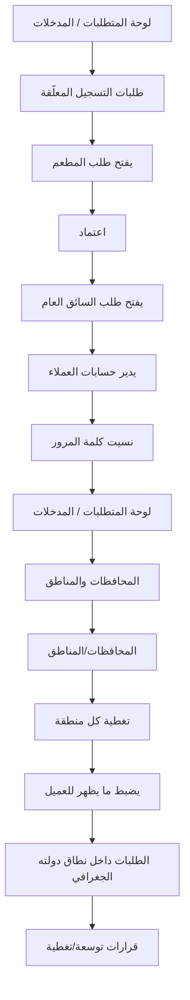

#### تفاصيل كل ميزة

#### **التسجيل واعتماد الحسابات والدخول**

**الهدف:** يضمن الأدمن أن كل حساب يدخل المنصة موثّق ومعتمد: مراجعة طلبات المطاعم والسائقين قبل تفعيلها، وإدارة حسابات العملاء (تفعيل/تعطيل)، بحيث لا يظهر أي مطعم أو يعمل أي سائق قبل موافقته الصريحة.

**Flowchart:**

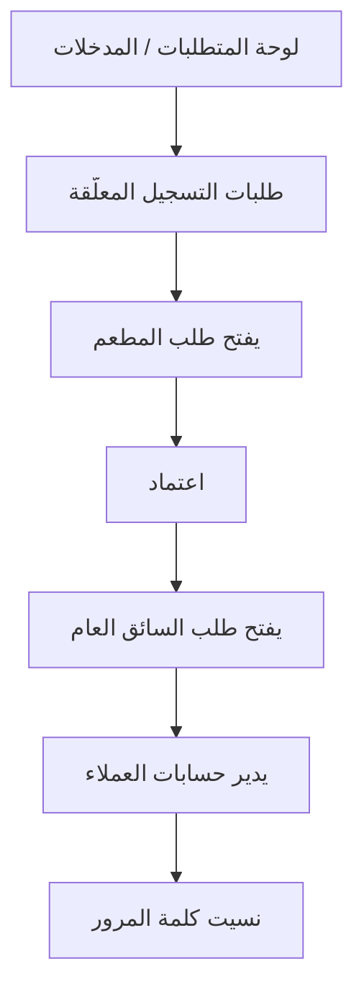

**لوحات — العنوان والمحتويات:**

#### **لوحة المتطلبات / المدخلات** _(مستنتجة)_

1. لوحة تحكم ويب (Angular) بصلاحيات الأدمن داخل نطاق دولته.
2. طلب تسجيل مطعم يتضمّن بيانات الشركة الرسمية + الوثائق المرفوعة .
3. طلب تسجيل سائق عام يتضمّن البيانات الشخصية والرخصة وبيانات المركبة .
4. قائمة العملاء المسجّلين عبر التطبيق (Email/Phone + كلمة المرور + المنطقة + الموافقة على الشروط).

#### **طلبات التسجيل المعلّقة** _(مستنتجة)_

1. مطاعم
2. سائقون عامّون

#### **يفتح طلب المطعم** _(مستنتجة)_

1. يراجع البيانات الرسمية والوثائق
2. ويتحقق من اكتمالها وصلاحية تواريخها

#### **اعتماد** _(مستنتجة)_

1. (تفعيل الحساب وإظهاره للعملاء) أو رفض/طلب استكمال مع ذكر السبب

#### **يفتح طلب السائق العام** _(مستنتجة)_

1. يتحقق من الرخصة ووثيقة المركبة ثم يمنح الموافقة النهائية للتفعيل

#### **يدير حسابات العملاء** _(مستنتجة)_

1. بحث
2. تفعيل
3. أو تعطيل حساب عند الحاجة (إساءة استخدام/طلب العميل)

#### **نسيت كلمة المرور** _(مستنتجة)_

1. يتابع سجل الدخول والصلاحيات
2. ويعالج طلبات الاستثنائية إن لزم

**خطوات Workflow:**

1. يفتح الأدمن قائمة «طلبات التسجيل المعلّقة» مقسّمة إلى: مطاعم، سائقون عامّون
2. يفتح طلب المطعم: يراجع البيانات الرسمية والوثائق، ويتحقق من اكتمالها وصلاحية تواريخها
3. يتخذ قرارًا: **اعتماد** (تفعيل الحساب وإظهاره للعملاء) أو **رفض/طلب استكمال** مع ذكر السبب
4. يفتح طلب السائق العام: يتحقق من الرخصة ووثيقة المركبة ثم يمنح الموافقة النهائية للتفعيل
5. يدير حسابات العملاء: بحث، تفعيل، أو تعطيل حساب عند الحاجة (إساءة استخدام/طلب العميل)
6. يتابع سجل الدخول والصلاحيات، ويعالج طلبات «نسيت كلمة المرور» الاستثنائية إن لزم

**حالات واستثناءات:**

1. وثائق ناقصة أو منتهية → يبقى الحساب «قيد المراجعة» ولا يُفعّل، مع إشعار صاحب الطلب بالسبب
2. محاولة مطعم/سائق العمل قبل الاعتماد → ممنوع نظاميًا (الحساب غير ظاهر/غير قابل للإسناد)
3. تعطيل حساب عميل له اشتراك نشط → يجب معالجة الاشتراك (إلغاء/تجميد) قبل أو مع التعطيل
4. Social Login للعميل مدعوم لاحقًا ولا يغيّر منطق الاعتماد للمطاعم والسائقين

#### **إدارة المناطق والتغطية**

**الهدف:** يدير الأدمن المحافظات والمناطق والتغطية الجغرافية، ويضبط ما يظهر لكل عميل/سائق حسب موقعه، بحيث يرى العميل فقط ما هو متاح في دولته/منطقته.

**Flowchart:**

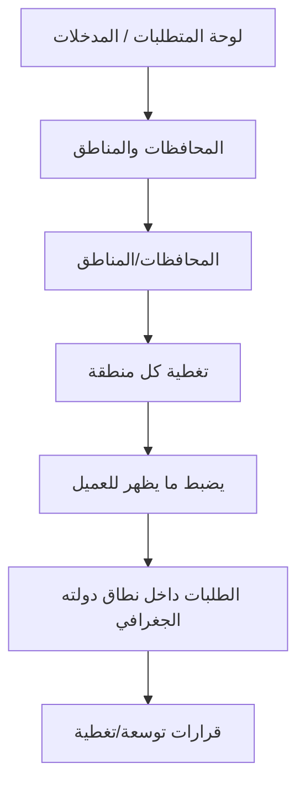

**لوحات — العنوان والمحتويات:**

#### **لوحة المتطلبات / المدخلات** _(مستنتجة)_

1. تعريف المحافظات والمناطق داخل نطاق الدولة.
2. اختيارات المطاعم للمحافظات/المناطق التي تخدمها.
3. ربط العملات والباقات المتاحة بكل منطقة (يتقاطع مع ).

#### **المحافظات والمناطق** _(مستنتجة)_

1. يعرّف الأدمن المحافظات والمناطق ويفعّلها داخل نطاق دولته

#### **المحافظات/المناطق** _(مستنتجة)_

1. يتأكد أن المطعم يختار المحافظات/المناطق التي يخدمها (اختيار محافظة كاملة = كل مناطقها)

#### **تغطية كل منطقة** _(مستنتجة)_

1. يراقب تغطية كل منطقة (عدد المطاعم/السائقين المتاحين) لتفادي الفجوات

#### **يضبط ما يظهر للعميل** _(مستنتجة)_

1. فقط المطاعم/الباقات/العملات المتاحة في منطقته

#### **الطلبات داخل نطاق دولته الجغرافي** _(مستنتجة)_

1. يتأكد أن المندوب يستقبل فقط الطلبات داخل نطاق دولته الجغرافي مع خرائط محلية

#### **قرارات توسعة/تغطية** _(مستنتجة)_

1. يتخذ قرارات توسعة/تغطية بناءً على الفجوات والطلب

**خطوات Workflow:**

1. يعرّف الأدمن المحافظات والمناطق ويفعّلها داخل نطاق دولته
2. يتأكد أن المطعم يختار المحافظات/المناطق التي يخدمها (اختيار محافظة كاملة = كل مناطقها)
3. يراقب تغطية كل منطقة (عدد المطاعم/السائقين المتاحين) لتفادي الفجوات
4. يضبط ما يظهر للعميل: فقط المطاعم/الباقات/العملات المتاحة في منطقته
5. يتأكد أن المندوب يستقبل فقط الطلبات داخل نطاق دولته الجغرافي مع خرائط محلية
6. يتخذ قرارات توسعة/تغطية بناءً على الفجوات والطلب

**حالات واستثناءات:**

1. منطقة بلا مطاعم كافية → تظهر محدودية الخيارات؛ يعالجها الأدمن بجذب مطاعم
2. مطعم يلغي تغطية منطقة عليها اشتراكات → معالجة الاشتراكات المتأثرة وتوفير بدائل
3. تداخل حدود مناطق → ضبط دقيق لتفادي ازدواج/ثغرات التغطية

---

### المرحلة 2: **ضبط المنصة** — 10 ميزة | 69 لوحات

**الميزات:** إدارة نموذج الاشتراك (المدد/البرامج/الباقات) · إدارة تصنيف المطاعم (Basic/Platinum/Elite) · إدارة التسعير والعمولات الديناميكية · إعداد الفواتير والباركود والملصقات · إدارة الولاء والمكافآت · إدارة الإحالات والبرومو كود · متابعة الاشتراك العائلي · إدارة تعدد اللغات · إدارة قنوات التواصل (واتساب/سوشيال) · سياسات حماية الخصوصية

#### ملخص المرحلة

1. مدد + برامج + باقات
2. حدود Basic/Platinum/Elite
3. عمولات + معادلات التسعير
4. فواتير/باركود، ولاء، لغات، خصوصية (, –)

#### Flowchart شامل للمرحلة

```mermaid
flowchart TD
 p2_f02_s1["لوحة المتطلبات / المدخلات"]
 p2_f02_s2["نموذج الاشتراك"]
 p2_f02_s3["المدد"]
 p2_f02_s4["البرامج الغذائية"]
 p2_f02_s5["الباقات"]
 p2_f02_s6["المطعم (لتسعيرها)"]
 p2_f02_s7["أن كل برنامج/باقة مرتبط بأسعار مدخلة من المطاعم لـ"]
 p2_f02_s1 --> p2_f02_s2
 p2_f02_s2 --> p2_f02_s3
 p2_f02_s3 --> p2_f02_s4
 p2_f02_s4 --> p2_f02_s5
 p2_f02_s5 --> p2_f02_s6
 p2_f02_s6 --> p2_f02_s7
 p2_f03_s1["لوحة المتطلبات / المدخلات"]
 p2_f03_s2["البوكس اليومي"]
 p2_f03_s3["μ و σ لكل مجموعة برنامج/باقة"]
 p2_f03_s4["≥2 مطاعم"]
 p2_f03_s5["مطعم واحد"]
 p2_f03_s6["أدمن يراجع الجدول — أي تغيير سعر"]
 p2_f03_s1 --> p2_f03_s2
 p2_f03_s2 --> p2_f03_s3
 p2_f03_s3 --> p2_f03_s4
 p2_f03_s4 --> p2_f03_s5
 p2_f03_s5 --> p2_f03_s6
 p2_f02_s7 --> p2_f03_s1
 p2_f04_s1["لوحة المتطلبات / المدخلات"]
 p2_f04_s2["التحكم (النظام يحسب commission بالاستيفاء الخطي لك"]
 p2_f04_s3["نسبة العمولة الديناميكية لكل مطعم على حدة"]
 p2_f04_s4["متوسط سعر القروب"]
 p2_f04_s5["متوسط البوكس اليومي"]
 p2_f04_s6["commission(days)"]
 p2_f04_s7["يطبّق خصم المشترك وعمولة المؤثر عند الحاجة"]
 p2_f04_s1 --> p2_f04_s2
 p2_f04_s2 --> p2_f04_s3
 p2_f04_s3 --> p2_f04_s4
 p2_f04_s4 --> p2_f04_s5
 p2_f04_s5 --> p2_f04_s6
 p2_f04_s6 --> p2_f04_s7
 p2_f03_s6 --> p2_f04_s1
 p2_f12_s1["لوحة المتطلبات / المدخلات"]
 p2_f12_s2["يهيّئ الأدمن قوالب الفواتير والملصقات ويضبط عناصره"]
 p2_f12_s3["−24h"]
 p2_f12_s4["أن كل طلب يحمل باركود قابلًا للقراءة مخصصًا لسائقي"]
 p2_f12_s5["يراجع أن ملصق كل وجبة يتضمن"]
 p2_f12_s6["من طباعة الفواتير والملصقات باللغتين"]
 p2_f12_s7["يعالج الحالات"]
 p2_f12_s1 --> p2_f12_s2
 p2_f12_s2 --> p2_f12_s3
 p2_f12_s3 --> p2_f12_s4
 p2_f12_s4 --> p2_f12_s5
 p2_f12_s5 --> p2_f12_s6
 p2_f12_s6 --> p2_f12_s7
 p2_f04_s7 --> p2_f12_s1
 p2_f17_s1["لوحة المتطلبات / المدخلات"]
 p2_f17_s2["عدد النقاط الممنوحة لكل حدث"]
 p2_f17_s3["قواعد الاستبدال"]
 p2_f17_s4["صلاحية النقاط ومدة انتهائها إن وُجدت"]
 p2_f17_s5["المكافآت للعميل (رصيد + طرق الكسب + سجل + استبدال)"]
 p2_f17_s6["تقارير النقاط وأثرها على التجديد"]
 p2_f17_s7["القواعد ديناميكيًا حسب الأداء والميزانية"]
 p2_f17_s1 --> p2_f17_s2
 p2_f17_s2 --> p2_f17_s3
 p2_f17_s3 --> p2_f17_s4
 p2_f17_s4 --> p2_f17_s5
 p2_f17_s5 --> p2_f17_s6
 p2_f17_s6 --> p2_f17_s7
 p2_f12_s7 --> p2_f17_s1
 p2_f18_s1["لوحة المتطلبات / المدخلات"]
 p2_f18_s2["روابط إحالة للمستخدمين/المؤثرين"]
 p2_f18_s3["أكواد برومو مرتبطة بحملات/مؤثرين"]
 p2_f18_s4["يربط كل كود/رابط بحملة"]
 p2_f18_s5["الدفع ويُطبَّق بشكل صحيح"]
 p2_f18_s6["يتابع تقارير الاستخدام"]
 p2_f18_s7["يوقف/يعدّل أي كود أو حملة عند انتهائها أو سوء استخ"]
 p2_f18_s1 --> p2_f18_s2
 p2_f18_s2 --> p2_f18_s3
 p2_f18_s3 --> p2_f18_s4
 p2_f18_s4 --> p2_f18_s5
 p2_f18_s5 --> p2_f18_s6
 p2_f18_s6 --> p2_f18_s7
 p2_f17_s7 --> p2_f18_s1
 p2_f19_s1["لوحة المتطلبات / المدخلات"]
 p2_f19_s2["يتابع الأدمن لوحات العائلات"]
 p2_f19_s3["أن مدير العائلة يضيف أفرادًا بحسابات منفصلة دون من"]
 p2_f19_s4["أن كل فرد يستخدم حصته فقط ولا يعدّل الخطة"]
 p2_f19_s5["يدعم عمليات الفصل"]
 p2_f19_s6["يتدخل في النزاعات عند تصعيدها له"]
 p2_f19_s7["يربط بيانات العائلة بالتقارير والمحاسبة عند الحاجة"]
 p2_f19_s1 --> p2_f19_s2
 p2_f19_s2 --> p2_f19_s3
 p2_f19_s3 --> p2_f19_s4
 p2_f19_s4 --> p2_f19_s5
 p2_f19_s5 --> p2_f19_s6
 p2_f19_s6 --> p2_f19_s7
 p2_f18_s7 --> p2_f19_s1
 p2_f29_s1["لوحة المتطلبات / المدخلات"]
 p2_f29_s2["الرئيسية"]
 p2_f29_s3["أن المطاعم تُدخل المحتوى الديناميكي باللغتين قبل ا"]
 p2_f29_s4["إرسال الإشعارات والرسائل بلغة العميل المختارة"]
 p2_f29_s5["أن الفواتير والملصقات تُطبع باللغتين"]
 p2_f29_s6["لغات/لهجات جديدة عند إطلاق دولة جديدة ويربطها بإعد"]
 p2_f29_s7["اكتمال الترجمات ويعالج النواقص قبل النشر"]
 p2_f29_s1 --> p2_f29_s2
 p2_f29_s2 --> p2_f29_s3
 p2_f29_s3 --> p2_f29_s4
 p2_f29_s4 --> p2_f29_s5
 p2_f29_s5 --> p2_f29_s6
 p2_f29_s6 --> p2_f29_s7
 p2_f19_s7 --> p2_f29_s1
 p2_f30_s1["لوحة المتطلبات / المدخلات"]
 p2_f30_s2["زر واتساب العائم ليظهر في كل صفحات التطبيق للدعم ا"]
 p2_f30_s3["عبر واتساب طلبات الحالات الاستثنائية مثل التغيير"]
 p2_f30_s4["عند صحته ويوثّقه"]
 p2_f30_s5["يجيب الاستفسارات العاجلة ويوجّه العميل للمسار الصح"]
 p2_f30_s6["الجانبية والتذييل ويحدّثها"]
 p2_f30_s7["جودة الدعم وزمن الاستجابة كمؤشر خدمة"]
 p2_f30_s1 --> p2_f30_s2
 p2_f30_s2 --> p2_f30_s3
 p2_f30_s3 --> p2_f30_s4
 p2_f30_s4 --> p2_f30_s5
 p2_f30_s5 --> p2_f30_s6
 p2_f30_s6 --> p2_f30_s7
 p2_f29_s7 --> p2_f30_s1
 p2_f31_s1["لوحة المتطلبات / المدخلات"]
 p2_f31_s2["أن تطبيق السائق منفصل تمامًا"]
 p2_f31_s3["يضبط ما يراه المطعم"]
 p2_f31_s4["أن الاتصال داخل التطبيق فقط بأرقام مقنّعة ورسائل م"]
 p2_f31_s5["أن إظهار الرقم الحقيقي استثناء موثّق بإشعار للأدمن"]
 p2_f31_s6["يتحقق من تطبيق معايير الأمان"]
 p2_f31_s7["سجلات الوصول والاستثناءات بشكل دوري"]
 p2_f31_s1 --> p2_f31_s2
 p2_f31_s2 --> p2_f31_s3
 p2_f31_s3 --> p2_f31_s4
 p2_f31_s4 --> p2_f31_s5
 p2_f31_s5 --> p2_f31_s6
 p2_f31_s6 --> p2_f31_s7
 p2_f30_s7 --> p2_f31_s1
```

#### تفاصيل كل ميزة

#### **إدارة نموذج الاشتراك (المدد/البرامج/الباقات)**

**الهدف:** يتحكم الأدمن ديناميكيًا في العمود الفقري لنموذج الاشتراك: مدد الاشتراك، البرامج الغذائية، والباقات، بحيث يضيف/يعدّل/يلغي أي عنصر من لوحة التحكم دون الحاجة لتغيير برمجي.

**Flowchart:**

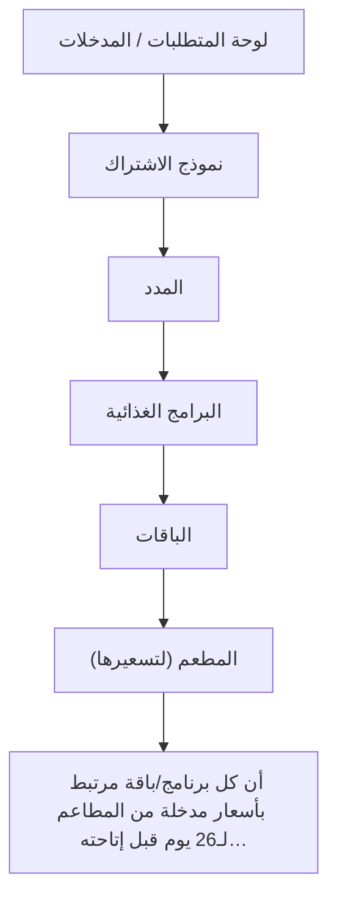

**لوحات — العنوان والمحتويات:**

#### **لوحة المتطلبات / المدخلات** _(مستنتجة)_

1. صلاحية إدارة الكتالوج في لوحة الأدمن.
2. تعريف مدد الاشتراك: شهري (26 يوم عمل بدون الجمعة)، أسبوعين (12 يوم)، أسبوع (6 أيام)، مخصص (من يوم واحد فأكثر).
3. قائمة البرامج الغذائية المطلوبة: نزول وزن، ضخامة عضلية، محافظة، كيتو.
4. قائمة الباقات: باقة كاملة (إفطار + وجبتان رئيسيتان + سناك + سلطة)، باقة الغداء (وجبة رئيسية + سلطة)، باقة مخصصة (مزيج يحدده الأدمن).

#### **نموذج الاشتراك** _(مستنتجة)_

1. يفتح الأدمن قسم في لوحة التحكم

#### **المدد** _(مستنتجة)_

1. يفعّل/يعطّل كل مدة ويضبط عدد أيامها ونسبة عمولتها المرتبطة (تُستخدم في )

#### **البرامج الغذائية** _(مستنتجة)_

1. يضيف برنامجًا جديدًا (اسم
2. وصف
3. لغتان) أو يعدّل/يلغي القائمة

#### **الباقات** _(مستنتجة)_

1. يعرّف مكوّنات كل باقة
2. ويُنشئ الباقة المخصصة كمزيج من العناصر

#### **المطعم (لتسعيرها)** _(مستنتجة)_

1. يحفظ ويعتمد النشر
2. تنعكس الخيارات فورًا في تطبيق العميل وفي لوحة المطعم (لتسعيرها)

#### **أن كل برنامج/باقة مرتبط بأسعار مدخلة من المطاعم لـ26 يوم قبل إتاحته…** _(مستنتجة)_

1. يتابع أن كل برنامج/باقة مرتبط بأسعار مدخلة من المطاعم لـ26 يوم قبل إتاحته للاشتراك

**خطوات Workflow:**

1. يفتح الأدمن قسم «نموذج الاشتراك» في لوحة التحكم
2. **المدد:** يفعّل/يعطّل كل مدة ويضبط عدد أيامها ونسبة عمولتها المرتبطة (تُستخدم في )
3. **البرامج الغذائية:** يضيف برنامجًا جديدًا (اسم + وصف + لغتان) أو يعدّل/يلغي القائمة
4. **الباقات:** يعرّف مكوّنات كل باقة، ويُنشئ الباقة المخصصة كمزيج من العناصر
5. يحفظ ويعتمد النشر؛ تنعكس الخيارات فورًا في تطبيق العميل وفي لوحة المطعم (لتسعيرها)
6. يتابع أن كل برنامج/باقة مرتبط بأسعار مدخلة من المطاعم لـ26 يوم قبل إتاحته للاشتراك

**حالات واستثناءات:**

1. إلغاء برنامج/باقة عليها اشتراكات نشطة → يجب الاحتفاظ بها للمشتركين الحاليين وإخفاؤها عن الجدد فقط
2. برنامج بلا أسعار مدخلة من أي مطعم → لا يُتاح للاختيار حتى تتوفر أسعار
3. تعديل مكوّنات باقة لا يؤثر على الاشتراكات الجارية ضمن نافذة 72 ساعة

#### **إدارة تصنيف المطاعم (Basic/Platinum/Elite)**

**الهدف:** يُصنِّف النظام كل مطعم **تلقائيًا وديناميكيًا** بدون تدخل بشري. راجع [`00_restaurant_classification_algorithm.md`](../00_restaurant_classification_algorithm.md).

**Flowchart:**

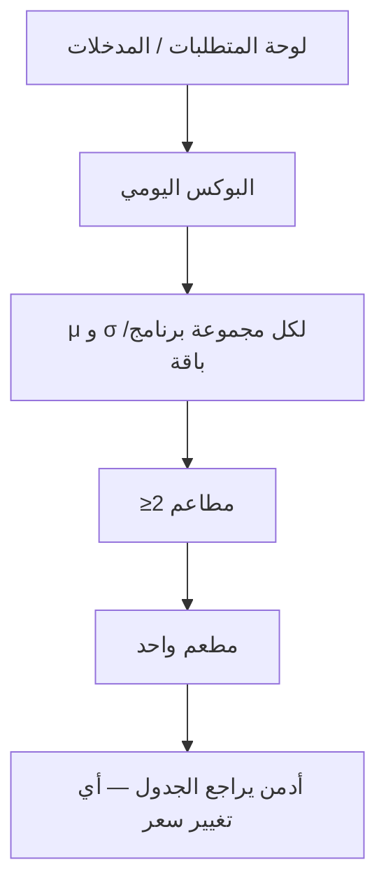

**لوحات — العنوان والمحتويات:**

#### **لوحة المتطلبات / المدخلات** _(مستنتجة)_

1. أسعار اشتراك 26 يوم لكل مطعم (لكل برنامج/باقة).
2. (اختياري) أدمن يضبط الحدود المرجعية لمطعم واحد: 4.5 و 6 د.ك/يوم.

#### **البوكس اليومي** _(مستنتجة)_

1. يدخل كل مطعم أسعار 26 يوم → النظام يحسب = السعر ÷ 26

#### **μ** و **σ** لكل مجموعة برنامج/باقة** _(مستنتجة)_

1. يحسب النظام μ و σ لكل مجموعة برنامج/باقة

#### **≥2 مطاعم** _(مستنتجة)_

1. تصنيف = Basic إذا ≤ μ−0.5σ · Elite إذا ≥ μ
2. 0.5σ · وإلا Platinum

#### **مطعم واحد** _(مستنتجة)_

1. تصنيف بالحدود 4.5/6 د.ك/يوم

#### **أدمن يراجع الجدول — أي تغيير سعر** _(مستنتجة)_

1. أدمن يراجع الجدول — أي تغيير سعر → إعادة تصنيف فورية

**خطوات Workflow:**

1. يدخل كل مطعم أسعار 26 يوم → النظام يحسب **البوكس اليومي** = السعر ÷ 26
2. يحسب النظام **μ** و **σ** لكل مجموعة برنامج/باقة
3. **≥2 مطاعم:** تصنيف = Basic إذا ≤ μ−0.5σ · Elite إذا ≥ μ+0.5σ · وإلا Platinum
4. **مطعم واحد:** تصنيف بالحدود 4.5/6 د.ك/يوم
5. أدمن يراجع الجدول — أي تغيير سعر → إعادة تصنيف فورية

**حالات واستثناءات:**

1. أي تغيير سعر → إعادة تصنيف كل مطاعم في نفس البرنامج/الباقة لكنه لا يكسر اشتراكات نشطة ضمن نافذة 72 ساعة
2. مطعم بلا سعر مدخل → لا يُصنّف ولا يظهر للعملاء

#### **إدارة التسعير والعمولات الديناميكية**

**الهدف:** يتحكم الأدمن في كل نسب وحدود التسعير: عمولة المدة (التي تُحمّل على العميل)، والعمولة الديناميكية لكل مطعم (التي تُخصم من سعر البوكس المتفق عليه)، بينما يحدّث النظام المتوسطات تلقائيًا.

**Flowchart:**

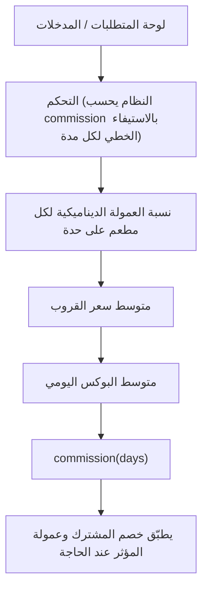

**لوحات — العنوان والمحتويات:**

#### **لوحة المتطلبات / المدخلات** _(مستنتجة)_

1. أسعار المطاعم لـ26 يومًا داخل كل تصنيف (لحساب متوسط القروب).
2. **max_commission** و **min_commission** (يضبطهما أدمن فقط) — راجع [`00_commission_interpolation_algorithm.md`](../00_commission_interpolation_algorithm.md).
3. نسبة عمولة ديناميكية لكل مطعم (مثال: مطعم A 15%، مطعم B 20%).

#### **التحكم (النظام يحسب commission بالاستيفاء الخطي لكل مدة)** _(مستنتجة)_

1. يضبط الأدمن max_commission و min_commission من لوحة التحكم (النظام يحسب commission بالاستيفاء الخطي لكل مدة)

#### **نسبة العمولة الديناميكية لكل مطعم على حدة** _(مستنتجة)_

1. يحدد نسبة العمولة الديناميكية لكل مطعم على حدة

#### **متوسط سعر القروب** _(مستنتجة)_

1. يحسب النظام تلقائيًا لكل تصنيف — من مطاعم ذلك التصنيف فقط (Basic من Basic
2. Platinum من Platinum بدون Basic
3. Elite من Elite) مع الالتزام بالبرنامج والباقة

#### **متوسط البوكس اليومي** _(مستنتجة)_

1. يشتق = متوسط القروب لـ26 يوم ÷ 26

#### **commission(days)** _(مستنتجة)_

1. يحسب بالاستيفاء الخطي → السعر الأساسي = `round_up`((متوسط التكلفة × (1
2. R)) × أيام) — راجع [`00_accounting_requirements.md`](../00_accounting_requirements.md)

#### **يطبّق خصم المشترك وعمولة المؤثر عند الحاجة** _(مستنتجة)_

1. يطبّق خصم المشترك (d=10%) وعمولة المؤثر (a=10%) عند الحاجة
2. يتابع إعادة حساب المتوسطات

**خطوات Workflow:**

1. يضبط الأدمن **max_commission** و **min_commission** من لوحة التحكم (النظام يحسب commission بالاستيفاء الخطي لكل مدة)
2. يحدد نسبة العمولة الديناميكية لكل مطعم على حدة
3. يحسب النظام تلقائيًا **متوسط سعر القروب** لكل تصنيف — **من مطاعم ذلك التصنيف فقط** (Basic من Basic، Platinum من Platinum بدون Basic، Elite من Elite) مع الالتزام بالبرنامج والباقة
4. يشتق **متوسط البوكس اليومي** = متوسط القروب لـ26 يوم ÷ 26
5. يحسب **commission(days)** بالاستيفاء الخطي → **السعر الأساسي** = `round_up`((متوسط التكلفة × (1+R)) × أيام) — راجع [`00_accounting_requirements.md`](../00_accounting_requirements.md)
6. يطبّق خصم المشترك (d=10%) وعمولة المؤثر (a=10%) عند الحاجة؛ يتابع إعادة حساب المتوسطات

**حالات واستثناءات:**

1. انضمام مطعم جديد أو تغيير سعره → تحديث فوري لمتوسط القروب وسعر **الاشتراكات الجديدة** فقط
2. **الاشتراكات النشطة لا يتغير سعرها بأثر رجعي** عند تعديل النسب أو الأسعار
3. **الفاتورة الشهرية** توضّح أي أسعار معدّلة + **تاريخ اشتراك العميل** الأصلي
4. تصنيف بلا مطاعم كافية → متوسط غير ممثّل؛ ينبّه الأدمن قبل إتاحته

#### **إعداد الفواتير والباركود والملصقات**

**الهدف:** يضبط الأدمن نظام الفواتير الاحترافي والباركود وملصقات الوجبات التي تُولَّد تلقائيًا عند −24h، ويضمن صحة محتواها باللغتين لتسهيل الاستلام والتسليم.

**Flowchart:**

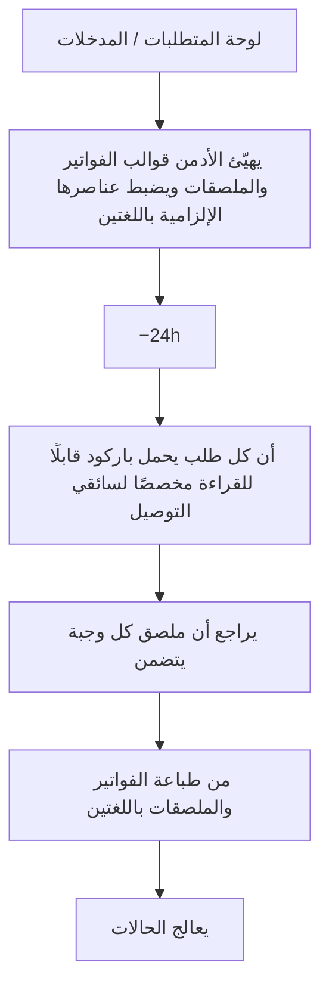

**لوحات — العنوان والمحتويات:**

#### **لوحة المتطلبات / المدخلات** _(مستنتجة)_

1. قوالب الفاتورة والملصق (لوجو التطبيق + لوجو المطعم).
2. بيانات الوجبة الغذائية (سعرات، بروتين، كارب، دهون) واسمها وملاحظات الحساسية.
3. إعداد توليد باركود فريد لكل طلب قابل للقراءة من تطبيق السائق.

#### **يهيّئ الأدمن قوالب الفواتير والملصقات ويضبط عناصرها الإلزامية باللغتين** _(مستنتجة)_

1. يهيّئ الأدمن قوالب الفواتير والملصقات ويضبط عناصرها الإلزامية باللغتين

#### **−24h** _(مستنتجة)_

1. يتأكد أن النظام عند قبل التوصيل يُرسل الطلبات للمطاعم مع فاتورة احترافية تفصيلية

#### **أن كل طلب يحمل باركود قابلًا للقراءة مخصصًا لسائقي التوصيل** _(مستنتجة)_

1. يتحقق أن كل طلب يحمل باركود قابلًا للقراءة مخصصًا لسائقي التوصيل

#### **يراجع أن ملصق كل وجبة يتضمن** _(مستنتجة)_

1. اللوجوين
2. البيانات الغذائية
3. اسم الوجبة
4. ملاحظات الحساسية

#### **من طباعة الفواتير والملصقات باللغتين** _(مستنتجة)_

1. يتأكد من طباعة الفواتير والملصقات باللغتين (عربي/إنجليزي)

#### **يعالج الحالات** _(مستنتجة)_

1. يعالج الحالات التي تتطلب إعادة إصدار فاتورة/ملصق بعد استثناء أدمن 

**خطوات Workflow:**

1. يهيّئ الأدمن قوالب الفواتير والملصقات ويضبط عناصرها الإلزامية باللغتين
2. يتأكد أن النظام عند **−24h** قبل التوصيل يُرسل الطلبات للمطاعم مع فاتورة احترافية تفصيلية
3. يتحقق أن كل طلب يحمل باركود قابلًا للقراءة مخصصًا لسائقي التوصيل
4. يراجع أن ملصق كل وجبة يتضمن: اللوجوين، البيانات الغذائية، اسم الوجبة، ملاحظات الحساسية
5. يتأكد من طباعة الفواتير والملصقات باللغتين (عربي/إنجليزي)
6. يعالج الحالات التي تتطلب إعادة إصدار فاتورة/ملصق بعد استثناء أدمن

**حالات واستثناءات:**

1. تعديل استثنائي على طلب بعد الإصدار → إبطال الفاتورة/الملصق القديم وإعادة الإصدار
2. باركود تالف/غير مقروء → آلية إعادة توليد ومطابقة يدوية عند الاستلام
3. نقص بيانات غذائية لوجبة → الملصق غير مكتمل؛ يُطلب من المطعم استكمالها

#### **إدارة الولاء والمكافآت**

**الهدف:** يضبط الأدمن قواعد نظام النقاط والاستبدال: متى يكسب العميل نقاطًا وكم، وكيف يستبدلها، بما يحفّز الاشتراك والتجديد والتفاعل دون الإضرار بالاقتصاد المالي للمنصة.

**Flowchart:**

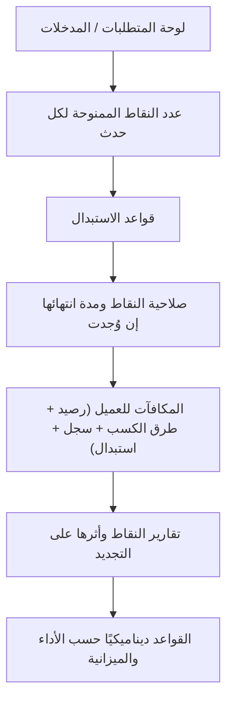

**لوحات — العنوان والمحتويات:**

#### **لوحة المتطلبات / المدخلات** _(مستنتجة)_

1. أحداث كسب النقاط: الاشتراك، التجديد، الطلب، التقييم، الإحالة.
2. جدول قيمة النقاط لكل حدث وقواعد الاستبدال والانتهاء.
3. ميزانية/سقف المكافآت ضمن الخطة المالية.

#### **عدد النقاط الممنوحة لكل حدث** _(مستنتجة)_

1. يحدد الأدمن عدد النقاط الممنوحة لكل حدث (اشتراك/تجديد/طلب/تقييم/إحالة)

#### **قواعد الاستبدال** _(مستنتجة)_

1. يضبط قواعد الاستبدال (قيمة النقطة
2. الحد الأدنى للاستبدال
3. المكافآت المتاحة)

#### **صلاحية النقاط ومدة انتهائها إن وُجدت** _(مستنتجة)_

1. يضبط صلاحية النقاط ومدة انتهائها إن وُجدت

#### **المكافآت للعميل (رصيد + طرق الكسب + سجل + استبدال)** _(مستنتجة)_

1. ينشر القواعد فتظهر في شاشة المكافآت للعميل (رصيد
2. طرق الكسب
3. سجل
4. استبدال)

#### **تقارير النقاط وأثرها على التجديد** _(مستنتجة)_

1. يتابع تقارير النقاط (مكتسبة/مستخدمة/منتهية) وأثرها على التجديد

#### **القواعد ديناميكيًا حسب الأداء والميزانية** _(مستنتجة)_

1. يعدّل القواعد ديناميكيًا حسب الأداء والميزانية

**خطوات Workflow:**

1. يحدد الأدمن عدد النقاط الممنوحة لكل حدث (اشتراك/تجديد/طلب/تقييم/إحالة)
2. يضبط قواعد الاستبدال (قيمة النقطة، الحد الأدنى للاستبدال، المكافآت المتاحة)
3. يضبط صلاحية النقاط ومدة انتهائها إن وُجدت
4. ينشر القواعد فتظهر في شاشة المكافآت للعميل (رصيد + طرق الكسب + سجل + استبدال)
5. يتابع تقارير النقاط (مكتسبة/مستخدمة/منتهية) وأثرها على التجديد
6. يعدّل القواعد ديناميكيًا حسب الأداء والميزانية

**حالات واستثناءات:**

1. إساءة استغلال (نقاط من أحداث وهمية) → تجميد/تصحيح الرصيد وتوثيق الحالة
2. إلغاء اشتراك مُنحت عليه نقاط → مراجعة سحب النقاط غير المستحقة
3. تغيير قيمة النقطة → يطبّق على الكسب الجديد دون مصادرة المكتسب تعسفيًا

#### **إدارة الإحالات والبرومو كود**

**الهدف:** ينشئ الأدمن ويدير روابط الإحالة وأكواد الخصم المرتبطة بالحملات والمؤثرين، ويحتسب العمولات/المكافآت، ويتابع تقارير الاستخدام لقياس فعالية كل حملة.

**Flowchart:**

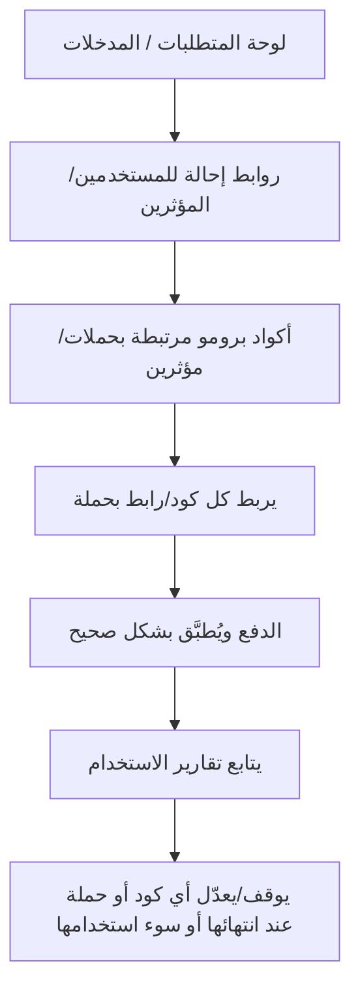

**لوحات — العنوان والمحتويات:**

#### **لوحة المتطلبات / المدخلات** _(مستنتجة)_

1. قائمة المؤثرين/الحملات وقنوات التوزيع.
2. قواعد الإحالة (مكافأة المُحيل والمُحال) وقواعد البرومو كود (نسبة/قيمة الخصم، الصلاحية، سقف الاستخدام).

#### **روابط إحالة للمستخدمين/المؤثرين** _(مستنتجة)_

1. ينشئ الأدمن روابط إحالة للمستخدمين/المؤثرين مع احتساب عمولة أو مكافأة

#### **أكواد برومو مرتبطة بحملات/مؤثرين** _(مستنتجة)_

1. ينشئ أكواد برومو مرتبطة بحملات/مؤثرين (نسبة/قيمة
2. تاريخ صلاحية
3. حد استخدام)

#### **يربط كل كود/رابط بحملة** _(مستنتجة)_

1. يربط كل كود/رابط بحملة لتتبع أدائها

#### **الدفع ويُطبَّق بشكل صحيح** _(مستنتجة)_

1. يتأكد أن البرومو كود يظهر للعميل في شاشة الدفع ويُطبَّق بشكل صحيح

#### **يتابع تقارير الاستخدام** _(مستنتجة)_

1. عدد المدعوين
2. المكافآت
3. مرات استخدام الأكواد
4. أثرها على المبيعات

#### **يوقف/يعدّل أي كود أو حملة عند انتهائها أو سوء استخدامها** _(مستنتجة)_

1. يوقف/يعدّل أي كود أو حملة عند انتهائها أو سوء استخدامها

**خطوات Workflow:**

1. ينشئ الأدمن روابط إحالة للمستخدمين/المؤثرين مع احتساب عمولة أو مكافأة
2. ينشئ أكواد برومو مرتبطة بحملات/مؤثرين (نسبة/قيمة، تاريخ صلاحية، حد استخدام)
3. يربط كل كود/رابط بحملة لتتبع أدائها
4. يتأكد أن البرومو كود يظهر للعميل في شاشة الدفع ويُطبَّق بشكل صحيح
5. يتابع تقارير الاستخدام: عدد المدعوين، المكافآت، مرات استخدام الأكواد، أثرها على المبيعات
6. يوقف/يعدّل أي كود أو حملة عند انتهائها أو سوء استخدامها

**حالات واستثناءات:**

1. استخدام كود منتهٍ/مستنفد → يرفضه النظام عند الدفع مع رسالة واضحة
2. محاولة احتيال إحالة (حسابات وهمية) → كشف وتعطيل ومراجعة المكافآت
3. تعارض كود مع عرض آخر → قواعد أولوية يحددها الأدمن

#### **متابعة الاشتراك العائلي**

**الهدف:** يتابع الأدمن آلية الاشتراك العائلي حيث يضيف مدير العائلة أفرادًا بحسابات منفصلة، ويتأكد من صحة الصلاحيات والحصص وعمليات الفصل/الترقية لحسابات مستقلة.

**Flowchart:**

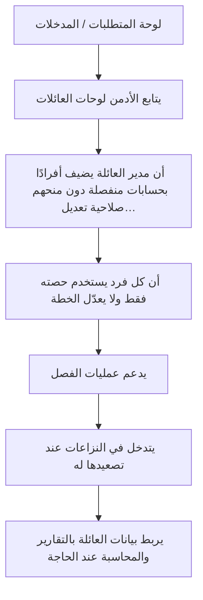

**لوحات — العنوان والمحتويات:**

#### **لوحة المتطلبات / المدخلات** _(مستنتجة)_

1. اشتراك رئيسي يديره «مدير العائلة».
2. أفراد عائلة بحسابات منفصلة مرتبطة بالاشتراك الرئيسي.
3. قواعد الحصص والصلاحيات (الفرد يستخدم حصته فقط ولا يعدّل الخطة).

#### **يتابع الأدمن لوحات العائلات** _(مستنتجة)_

1. عدد الأفراد
2. حالاتهم
3. الطلبات المرتبطة

#### **أن مدير العائلة يضيف أفرادًا بحسابات منفصلة دون منحهم صلاحية تعديل…** _(مستنتجة)_

1. يتأكد أن مدير العائلة يضيف أفرادًا بحسابات منفصلة دون منحهم صلاحية تعديل الاشتراك الرئيسي

#### **أن كل فرد يستخدم حصته فقط ولا يعدّل الخطة** _(مستنتجة)_

1. يراقب أن كل فرد يستخدم حصته فقط ولا يعدّل الخطة

#### **يدعم عمليات الفصل** _(مستنتجة)_

1. تأكيد → اختيار تحويل لحساب مستقل أو ترقية لاشتراك فردي → رسالة نجاح

#### **يتدخل في النزاعات عند تصعيدها له** _(مستنتجة)_

1. يتدخل في النزاعات (حصص/فصل) عند تصعيدها له

#### **يربط بيانات العائلة بالتقارير والمحاسبة عند الحاجة** _(مستنتجة)_

1. يربط بيانات العائلة بالتقارير والمحاسبة عند الحاجة

**خطوات Workflow:**

1. يتابع الأدمن لوحات العائلات: عدد الأفراد، حالاتهم، الطلبات المرتبطة
2. يتأكد أن مدير العائلة يضيف أفرادًا بحسابات منفصلة دون منحهم صلاحية تعديل الاشتراك الرئيسي
3. يراقب أن كل فرد يستخدم حصته فقط ولا يعدّل الخطة
4. يدعم عمليات الفصل: تأكيد → اختيار تحويل لحساب مستقل أو ترقية لاشتراك فردي → رسالة نجاح
5. يتدخل في النزاعات (حصص/فصل) عند تصعيدها له
6. يربط بيانات العائلة بالتقارير والمحاسبة عند الحاجة

**حالات واستثناءات:**

1. محاولة فرد تعديل الاشتراك الرئيسي → ممنوعة نظاميًا
2. فصل فرد له طلبات نشطة → معالجة الطلبات الجارية قبل/أثناء الفصل
3. ترقية فرد لاشتراك فردي → إنشاء اشتراك مستقل وفق التسعير الحالي

#### **إدارة تعدد اللغات**

**الهدف:** يدير الأدمن دعم تعدد اللغات (العربية RTL والإنجليزية LTR) عبر المنصة، ويتأكد من إدخال المحتوى الديناميكي باللغتين، ويضيف لغات/لهجات لكل دولة جديدة حسب الحاجة.

**Flowchart:**

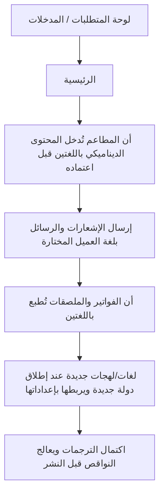

**لوحات — العنوان والمحتويات:**

#### **لوحة المتطلبات / المدخلات** _(مستنتجة)_

1. حزم الترجمة الثابتة للواجهات (عربي/إنجليزي).
2. محتوى ديناميكي من المطاعم (أسماء الوجبات/المكونات/البيانات الغذائية) باللغتين.
3. إعداد لغة افتراضية لكل دولة (يتقاطع مع ).

#### **الرئيسية** _(مستنتجة)_

1. يفعّل الأدمن اللغات المدعومة ويضبط زر التبديل الواضح في القائمة الرئيسية

#### **أن المطاعم تُدخل المحتوى الديناميكي باللغتين قبل اعتماده** _(مستنتجة)_

1. يتأكد أن المطاعم تُدخل المحتوى الديناميكي باللغتين قبل اعتماده 

#### **إرسال الإشعارات والرسائل بلغة العميل المختارة** _(مستنتجة)_

1. يضبط إرسال الإشعارات والرسائل بلغة العميل المختارة

#### **أن الفواتير والملصقات تُطبع باللغتين** _(مستنتجة)_

1. يتأكد أن الفواتير والملصقات تُطبع باللغتين 

#### **لغات/لهجات جديدة عند إطلاق دولة جديدة ويربطها بإعداداتها** _(مستنتجة)_

1. يضيف لغات/لهجات جديدة عند إطلاق دولة جديدة ويربطها بإعداداتها

#### **اكتمال الترجمات ويعالج النواقص قبل النشر** _(مستنتجة)_

1. يراجع اكتمال الترجمات ويعالج النواقص قبل النشر

**خطوات Workflow:**

1. يفعّل الأدمن اللغات المدعومة ويضبط زر التبديل الواضح في القائمة الرئيسية
2. يتأكد أن المطاعم تُدخل المحتوى الديناميكي باللغتين قبل اعتماده
3. يضبط إرسال الإشعارات والرسائل بلغة العميل المختارة
4. يتأكد أن الفواتير والملصقات تُطبع باللغتين
5. يضيف لغات/لهجات جديدة عند إطلاق دولة جديدة ويربطها بإعداداتها
6. يراجع اكتمال الترجمات ويعالج النواقص قبل النشر

**حالات واستثناءات:**

1. محتوى ديناميكي بلغة واحدة فقط → لا يُعتمد حتى يُستكمل باللغتين
2. لغة جديدة غير مكتملة الترجمة → لا تُفعّل للعملاء حتى الاكتمال
3. اتجاه النص (RTL/LTR) يجب أن ينعكس صحيحًا في كل الواجهات

#### **إدارة قنوات التواصل (واتساب/سوشيال)**

**الهدف:** يدير الأدمن قنوات التواصل مع العملاء: زر واتساب العائم للدعم، واستقبال الحالات الاستثنائية (تغيير داخل 72 ساعة)، وروابط السوشيال ميديا، باعتبارها نقطة التماس المباشر للطوارئ والاستفسارات.

**Flowchart:**

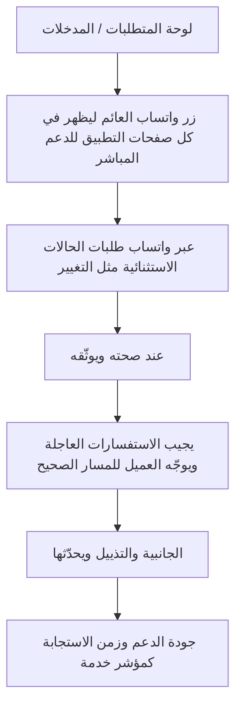

**لوحات — العنوان والمحتويات:**

#### **لوحة المتطلبات / المدخلات** _(مستنتجة)_

1. رقم/حساب واتساب الأدمن للدعم الفني.
2. روابط حسابات السوشيال (Instagram، Twitter/X، Snapchat/TikTok).
3. سياسة معالجة الحالات الاستثنائية (تتقاطع مع ).

#### **زر واتساب العائم ليظهر في كل صفحات التطبيق للدعم المباشر** _(مستنتجة)_

1. يضبط الأدمن زر واتساب العائم ليظهر في كل صفحات التطبيق للدعم المباشر

#### **عبر واتساب طلبات الحالات الاستثنائية مثل التغيير** _(مستنتجة)_

1. يستقبل عبر واتساب طلبات الحالات الاستثنائية مثل التغيير داخل نافذة 72 ساعة

#### **عند صحته ويوثّقه** _(مستنتجة)_

1. يتحقق من الطلب وينفّذ الاستثناء من اللوحة عند صحته ويوثّقه

#### **يجيب الاستفسارات العاجلة ويوجّه العميل للمسار الصحيح** _(مستنتجة)_

1. يجيب الاستفسارات العاجلة ويوجّه العميل للمسار الصحيح

#### **الجانبية والتذييل ويحدّثها** _(مستنتجة)_

1. يضبط روابط السوشيال في القائمة الجانبية والتذييل ويحدّثها

#### **جودة الدعم وزمن الاستجابة كمؤشر خدمة** _(مستنتجة)_

1. يتابع جودة الدعم وزمن الاستجابة كمؤشر خدمة

**خطوات Workflow:**

1. يضبط الأدمن زر واتساب العائم ليظهر في كل صفحات التطبيق للدعم المباشر
2. يستقبل عبر واتساب طلبات الحالات الاستثنائية مثل التغيير داخل نافذة 72 ساعة
3. يتحقق من الطلب وينفّذ الاستثناء من اللوحة عند صحته ويوثّقه
4. يجيب الاستفسارات العاجلة ويوجّه العميل للمسار الصحيح
5. يضبط روابط السوشيال في القائمة الجانبية والتذييل ويحدّثها
6. يتابع جودة الدعم وزمن الاستجابة كمؤشر خدمة

**حالات واستثناءات:**

1. طلب تغيير داخل 72 ساعة بعد بدء التحضير → يُرفض
2. إساءة استخدام قناة الدعم → توثيق وتعامل وفق السياسة
3. رابط سوشيال معطّل → تحديثه فورًا

#### **سياسات حماية الخصوصية**

**الهدف:** يضبط الأدمن سياسات حماية الخصوصية والأمان عبر المنصة: فصل تطبيق السائق، تقييد المعلومات المرئية لكل طرف، الاتصال الآمن، وتأمين البيانات وفق المعايير، مع رقابة على الاستثناءات.

**Flowchart:**

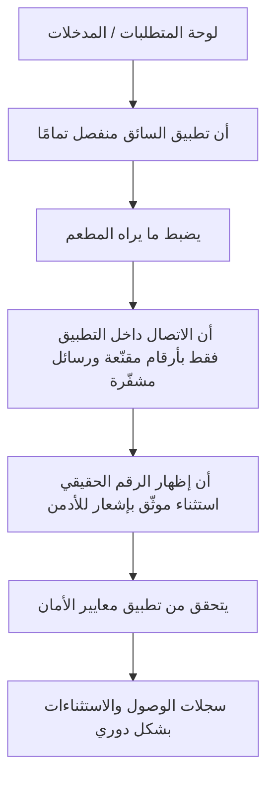

**لوحات — العنوان والمحتويات:**

#### **لوحة المتطلبات / المدخلات** _(مستنتجة)_

1. بنية فصل تطبيق السائق عن تطبيقي العميل والمطعم.
2. إعدادات إخفاء/تقنيع البيانات لكل طرف.
3. معايير الأمان: تشفير، حماية CSRF/SQLi/XSS، نسخ احتياطي يومي، PCI DSS للدفع.

#### **أن تطبيق السائق منفصل تمامًا** _(مستنتجة)_

1. يتأكد الأدمن أن تطبيق السائق منفصل تمامًا
2. ويرى الموقع الجغرافي فقط (Lat/Long) دون اسم/رقم العميل

#### **يضبط ما يراه المطعم** _(مستنتجة)_

1. عدد البوكسات ونوعها (بدون اسم العميل)
2. الموقع العام
3. وقت التوصيل المطلوب فقط

#### **أن الاتصال داخل التطبيق فقط بأرقام مقنّعة ورسائل مشفّرة** _(مستنتجة)_

1. يتأكد أن الاتصال داخل التطبيق فقط بأرقام مقنّعة ورسائل مشفّرة

#### **أن إظهار الرقم الحقيقي استثناء موثّق بإشعار للأدمن** _(مستنتجة)_

1. يراقب أن إظهار الرقم الحقيقي استثناء موثّق بإشعار للأدمن 

#### **يتحقق من تطبيق معايير الأمان** _(مستنتجة)_

1. تشفير البيانات الحساسة
2. حماية CSRF/SQLi/XSS
3. نسخ احتياطي يومي
4. PCI DSS

#### **سجلات الوصول والاستثناءات بشكل دوري** _(مستنتجة)_

1. يراجع سجلات الوصول والاستثناءات بشكل دوري

**خطوات Workflow:**

1. يتأكد الأدمن أن تطبيق السائق منفصل تمامًا، ويرى الموقع الجغرافي فقط (Lat/Long) دون اسم/رقم العميل
2. يضبط ما يراه المطعم: عدد البوكسات ونوعها (بدون اسم العميل)، الموقع العام، وقت التوصيل المطلوب فقط
3. يتأكد أن الاتصال داخل التطبيق فقط بأرقام مقنّعة ورسائل مشفّرة
4. يراقب أن إظهار الرقم الحقيقي استثناء موثّق بإشعار للأدمن
5. يتحقق من تطبيق معايير الأمان: تشفير البيانات الحساسة، حماية CSRF/SQLi/XSS، نسخ احتياطي يومي، PCI DSS
6. يراجع سجلات الوصول والاستثناءات بشكل دوري

**حالات واستثناءات:**

1. إظهار رقم العميل بعد فشل محاولتين → استثناء موثّق + إشعار الأدمن
2. محاولة طرف رؤية بيانات خارج صلاحيته → ممنوعة نظاميًا وتُسجّل
3. حادث أمني محتمل → تفعيل إجراءات الاستجابة والنسخ الاحتياطي

---

### المرحلة 3: **الاعتماد** — 3 ميزة | 21 لوحات

**الميزات:** مراجعة واعتماد وثائق المطاعم · إدارة السائقين العامين والتحقق · اعتماد القوائم والوجبات

#### ملخص المرحلة

1. وثائق مطاعم + تنبيه انتهاء
2. اعتماد سائق
3. اعتماد قوائم/وجبات

#### Flowchart شامل للمرحلة

```mermaid
flowchart TD
 p3_f22_s1["لوحة المتطلبات / المدخلات"]
 p3_f22_s2["طلب تسجيل/تحديث وثائق المطعم"]
 p3_f22_s3["كل وثيقة ويتحقق من صحتها واكتمالها وصلاحية تاريخها"]
 p3_f22_s4["يعتمد الوثائق أو يطلب استكمالًا/تصحيحًا"]
 p3_f22_s5["التنبيه الآلي قبل انتهاء الوثيقة بشهرين لطلب نسخة"]
 p3_f22_s6["أنه قبل الانتهاء بشهر يوقف النظام استقبال الطلبات"]
 p3_f22_s7["يعيد التفعيل بعد رفع المطعم نسخة محدّثة واعتمادها"]
 p3_f22_s1 --> p3_f22_s2
 p3_f22_s2 --> p3_f22_s3
 p3_f22_s3 --> p3_f22_s4
 p3_f22_s4 --> p3_f22_s5
 p3_f22_s5 --> p3_f22_s6
 p3_f22_s6 --> p3_f22_s7
 p3_f23_s1["لوحة المتطلبات / المدخلات"]
 p3_f23_s2["طلب السائق العام"]
 p3_f23_s3["من الوثائق وصحتها وصلاحيتها"]
 p3_f23_s4["موافقة الأدمن النهائية"]
 p3_f23_s5["السائق بعد الموافقة النهائية فيصبح قابلًا للإسناد"]
 p3_f23_s6["باستمرار تاريخ انتهاء الرخصة وأي وثيقة حرجة"]
 p3_f23_s7["أي سائق تنتهي رخصته أو يخالف"]
 p3_f23_s1 --> p3_f23_s2
 p3_f23_s2 --> p3_f23_s3
 p3_f23_s3 --> p3_f23_s4
 p3_f23_s4 --> p3_f23_s5
 p3_f23_s5 --> p3_f23_s6
 p3_f23_s6 --> p3_f23_s7
 p3_f22_s7 --> p3_f23_s1
 p3_f24_s1["لوحة المتطلبات / المدخلات"]
 p3_f24_s2["طلب إضافة وجبة جديدة من المطعم"]
 p3_f24_s3["المكونات والسعر والبيانات الغذائية واكتمالها باللغ"]
 p3_f24_s4["طلبات تعديل المكونات/السعر ويعتمدها قبل سريانها عل"]
 p3_f24_s5["30 يومًا"]
 p3_f24_s6["أن الوجبة المُلغاة تختفي فورًا عن العملاء الجدد وت"]
 p3_f24_s7["أن كل المحتوى مُدخل باللغتين قبل النشر"]
 p3_f24_s1 --> p3_f24_s2
 p3_f24_s2 --> p3_f24_s3
 p3_f24_s3 --> p3_f24_s4
 p3_f24_s4 --> p3_f24_s5
 p3_f24_s5 --> p3_f24_s6
 p3_f24_s6 --> p3_f24_s7
 p3_f23_s7 --> p3_f24_s1
```

#### تفاصيل كل ميزة

#### **مراجعة واعتماد وثائق المطاعم**

**الهدف:** يراجع الأدمن ويعتمد وثائق المطاعم (السجل التجاري، عقد التأسيس، الترخيص...)، ويتابع تواريخ انتهائها والتنبيهات الآلية، ويضمن إيقاف المطاعم منتهية الوثائق حماية للامتثال.

**Flowchart:**

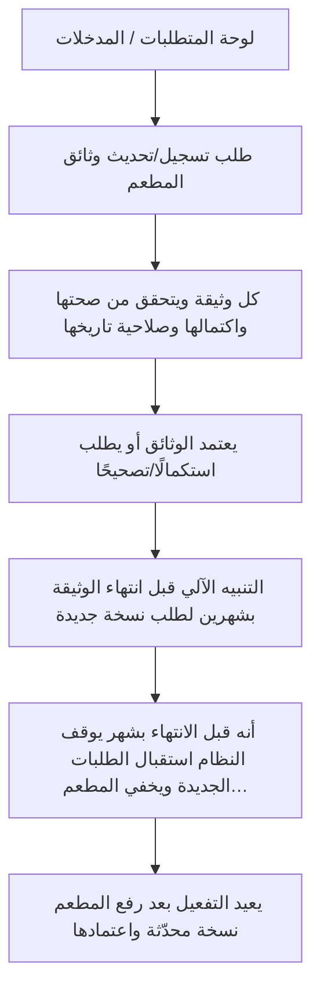

**لوحات — العنوان والمحتويات:**

#### **لوحة المتطلبات / المدخلات** _(مستنتجة)_

1. بيانات المطعم/الشركة/المالك + الوثائق المرفوعة (السجل التجاري، عقد التأسيس، ترخيص الشركة...).
2. تاريخ إصدار وانتهاء كل وثيقة.
3. إعدادات التنبيهات الزمنية (شهرين/شهر قبل الانتهاء).

#### **طلب تسجيل/تحديث وثائق المطعم** _(مستنتجة)_

1. يستقبل الأدمن طلب تسجيل/تحديث وثائق المطعم مع تواريخها

#### **كل وثيقة ويتحقق من صحتها واكتمالها وصلاحية تاريخها** _(مستنتجة)_

1. يراجع كل وثيقة ويتحقق من صحتها واكتمالها وصلاحية تاريخها

#### **يعتمد الوثائق أو يطلب استكمالًا/تصحيحًا** _(مستنتجة)_

1. يعتمد الوثائق (فيظهر المطعم/يستمر) أو يطلب استكمالًا/تصحيحًا

#### **التنبيه الآلي قبل انتهاء الوثيقة بشهرين لطلب نسخة جديدة** _(مستنتجة)_

1. يتابع التنبيه الآلي قبل انتهاء الوثيقة بشهرين لطلب نسخة جديدة

#### **أنه قبل الانتهاء بشهر يوقف النظام استقبال الطلبات الجديدة ويخفي المطعم…** _(مستنتجة)_

1. يتأكد أنه قبل الانتهاء بشهر يوقف النظام استقبال الطلبات الجديدة ويخفي المطعم ووجباته مؤقتًا

#### **يعيد التفعيل بعد رفع المطعم نسخة محدّثة واعتمادها** _(مستنتجة)_

1. يعيد التفعيل بعد رفع المطعم نسخة محدّثة واعتمادها

**خطوات Workflow:**

1. يستقبل الأدمن طلب تسجيل/تحديث وثائق المطعم مع تواريخها
2. يراجع كل وثيقة ويتحقق من صحتها واكتمالها وصلاحية تاريخها
3. يعتمد الوثائق (فيظهر المطعم/يستمر) أو يطلب استكمالًا/تصحيحًا
4. يتابع التنبيه الآلي قبل انتهاء الوثيقة بشهرين لطلب نسخة جديدة
5. يتأكد أنه قبل الانتهاء بشهر يوقف النظام استقبال الطلبات الجديدة ويخفي المطعم ووجباته مؤقتًا
6. يعيد التفعيل بعد رفع المطعم نسخة محدّثة واعتمادها

**حالات واستثناءات:**

1. وثيقة منتهية لم تُحدّث → يبقى المطعم مخفيًا حتى الاعتماد
2. وثيقة مزوّرة/غير مطابقة → رفض وتصعيد وإيقاف الحساب
3. تحديث وثيقة أثناء وجود اشتراكات نشطة → ضمان استمرار الطلبات القائمة وفق السياسات

#### **إدارة السائقين العامين والتحقق**

**الهدف:** يدير الأدمن السائقين العامين (التابعين للمنصة)، ويتحقق من وثائقهم، ويمنح الموافقة النهائية لتفعيل أي سائق، ويراقب صلاحية رخصهم باستمرار لضمان عدم توصيل أي طلب إلا عبر سائق معتمد.

**Flowchart:**

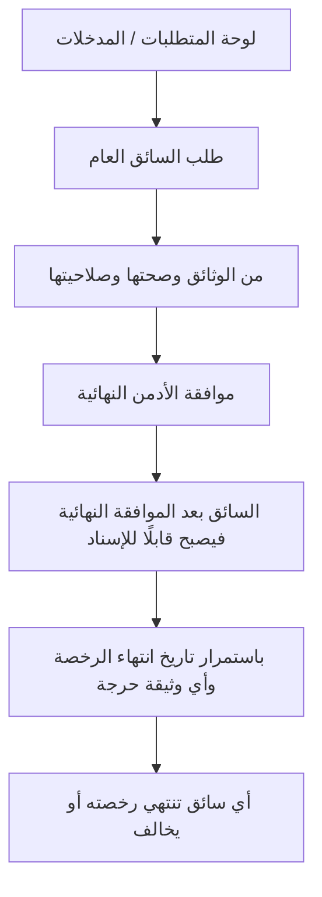

**لوحات — العنوان والمحتويات:**

#### **لوحة المتطلبات / المدخلات** _(مستنتجة)_

1. بيانات السائق الكاملة: شخصية (اسم، هاتف، بريد)، رخصة (رقم، انتهاء، صورة)، مركبة (نوع، لون، لوحة، رقم محرك، وثيقة، صور).
2. نوع السائق: عام (يديره الأدمن) أو تابع لمطعم (يديره المطعم بموافقة الأدمن النهائية).

#### **طلب السائق العام** _(مستنتجة)_

1. يستقبل الأدمن طلب السائق العام مع وثائقه الكاملة

#### **من الوثائق وصحتها وصلاحيتها** _(مستنتجة)_

1. يتحقق من الوثائق (الرخصة
2. وثيقة المركبة) وصحتها وصلاحيتها

#### **موافقة الأدمن النهائية** _(مستنتجة)_

1. يتحقق المطعم أولًا ثم تأتي

#### **السائق بعد الموافقة النهائية فيصبح قابلًا للإسناد** _(مستنتجة)_

1. يفعّل السائق بعد الموافقة النهائية فيصبح قابلًا للإسناد

#### **باستمرار تاريخ انتهاء الرخصة وأي وثيقة حرجة** _(مستنتجة)_

1. يراقب باستمرار تاريخ انتهاء الرخصة وأي وثيقة حرجة

#### **أي سائق تنتهي رخصته أو يخالف** _(مستنتجة)_

1. يعطّل أي سائق تنتهي رخصته أو يخالف
2. فيمنع النظام إسناد أي طلب له

**خطوات Workflow:**

1. يستقبل الأدمن طلب السائق العام مع وثائقه الكاملة
2. يتحقق من الوثائق (الرخصة، وثيقة المركبة) وصحتها وصلاحيتها
3. بالنسبة لسائقي المطاعم: يتحقق المطعم أولًا ثم تأتي **موافقة الأدمن النهائية**
4. يفعّل السائق بعد الموافقة النهائية فيصبح قابلًا للإسناد
5. يراقب باستمرار تاريخ انتهاء الرخصة وأي وثيقة حرجة
6. يعطّل أي سائق تنتهي رخصته أو يخالف، فيمنع النظام إسناد أي طلب له

**حالات واستثناءات:**

1. رخصة منتهية → تعطيل تلقائي ومنع الإسناد حتى التجديد والاعتماد
2. محاولة إسناد طلب لسائق غير معتمد → يمنعها النظام (تحقق قبل كل طلب)
3. مخالفة/شكوى متكررة على سائق → مراجعة وتعليق/إيقاف

#### **اعتماد القوائم والوجبات**

**الهدف:** يعتمد الأدمن إضافات وتعديلات الوجبات قبل ظهورها للعملاء، ويدير طلبات إلغاء الوجبات وفق سياسة الـ30 يومًا، بما يضمن جودة المحتوى ودقّة بياناته باللغتين.

**Flowchart:**

```mermaid
flowchart TD
 f24_s1["لوحة المتطلبات / المدخلات"]
 f24_s2["طلب إضافة وجبة جديدة من المطعم"]
 f24_s3["المكونات والسعر والبيانات الغذائية واكتمالها باللغتين"]
 f24_s4["طلبات تعديل المكونات/السعر ويعتمدها قبل سريانها على العملاء"]
 f24_s5["30 يومًا"]
 f24_s6["أن الوجبة المُلغاة تختفي فورًا عن العملاء الجدد وتبقى لمن اختارها مسبقًا"]
 f24_s7["أن كل المحتوى مُدخل باللغتين قبل النشر"]
 f24_s1 --> f24_s2
 f24_s2 --> f24_s3
 f24_s3 --> f24_s4
 f24_s4 --> f24_s5
 f24_s5 --> f24_s6
 f24_s6 --> f24_s7
```

**لوحات — العنوان والمحتويات:**

#### **لوحة المتطلبات / المدخلات** _(مستنتجة)_

1. وجبة جديدة/تعديل من المطعم (مكونات، سعر، بيانات غذائية باللغتين).
2. طلب إلغاء وجبة من المطعم (إن وُجد).
3. سياسة الاعتماد ومدد الالتزام (30 يومًا للإلغاء).

#### **طلب إضافة وجبة جديدة من المطعم** _(مستنتجة)_

1. يستقبل الأدمن طلب إضافة وجبة جديدة من المطعم

#### **المكونات والسعر والبيانات الغذائية واكتمالها باللغتين** _(مستنتجة)_

1. يراجع المكونات والسعر والبيانات الغذائية واكتمالها باللغتين
2. ثم يعتمدها أو يرفضها

#### **طلبات تعديل المكونات/السعر ويعتمدها قبل سريانها على العملاء** _(مستنتجة)_

1. يراجع طلبات تعديل المكونات/السعر ويعتمدها قبل سريانها على العملاء

#### **30 يومًا** _(مستنتجة)_

1. يعتمد الأدمن الطلب
2. فيلتزم المطعم بتوفيرها للطلبات القائمة 30 يومًا

#### **أن الوجبة المُلغاة تختفي فورًا عن العملاء الجدد وتبقى لمن اختارها مسبقًا** _(مستنتجة)_

1. يتأكد أن الوجبة المُلغاة تختفي فورًا عن العملاء الجدد وتبقى لمن اختارها مسبقًا

#### **أن كل المحتوى مُدخل باللغتين قبل النشر** _(مستنتجة)_

1. يتابع أن كل المحتوى مُدخل باللغتين قبل النشر

**خطوات Workflow:**

1. يستقبل الأدمن طلب إضافة وجبة جديدة من المطعم
2. يراجع المكونات والسعر والبيانات الغذائية واكتمالها باللغتين، ثم يعتمدها أو يرفضها
3. يراجع طلبات تعديل المكونات/السعر ويعتمدها قبل سريانها على العملاء
4. عند طلب إلغاء وجبة: يعتمد الأدمن الطلب، فيلتزم المطعم بتوفيرها للطلبات القائمة 30 يومًا
5. يتأكد أن الوجبة المُلغاة تختفي فورًا عن العملاء الجدد وتبقى لمن اختارها مسبقًا
6. يتابع أن كل المحتوى مُدخل باللغتين قبل النشر

**حالات واستثناءات:**

1. بيانات غذائية ناقصة → رفض الاعتماد حتى استكمالها (يؤثر على ملصق )
2. محاولة إلغاء وجبة فوريًا → غير مسموح؛ تخضع لسياسة 30 يومًا
3. تعديل سعر وجبة ضمن اشتراكات نشطة → لا يؤثر بأثر رجعي على المختار سابقًا

---

### المرحلة 4: **التشغيل اليومي** — 6 ميزة | 41 لوحات

**الميزات:** قاعدة 72 ساعة وتأكيد المطعم واستثناءات الأدمن · ضبط الاختيار التلقائي والتوزيع العادل · مراقبة الطاقة الاستيعابية و Busy · مراقبة التوصيل والتتبع · متابعة الاتصال وحالة Hold · متابعة التقييمات والإحصائيات

#### ملخص المرحلة

1. قفل 48h + إرسال للمطاعم + فواتير
2. اختيار تلقائي + كوتا + Fallback
3. مراقبة Busy
4. تتبع + Hold + تقييمات

#### Flowchart شامل للمرحلة

```mermaid
flowchart TD
 p4_f06_s1["لوحة المتطلبات / المدخلات"]
 p4_f06_s2["−72h"]
 p4_f06_s3["تأكيد المطعم"]
 p4_f06_s4["عدم التأكيد"]
 p4_f06_s5["24 الساعة المتبقية"]
 p4_f06_s6["−24h"]
 p4_f06_s7["مع توثيق السبب"]
 p4_f06_s1 --> p4_f06_s2
 p4_f06_s2 --> p4_f06_s3
 p4_f06_s3 --> p4_f06_s4
 p4_f06_s4 --> p4_f06_s5
 p4_f06_s5 --> p4_f06_s6
 p4_f06_s6 --> p4_f06_s7
 p4_f07_s1["لوحة المتطلبات / المدخلات"]
 p4_f07_s2["يتأكد الأدمن من تفعيل قاعدة التشغيل"]
 p4_f07_s3["Limit = max(round_up(N ÷ المدة), 2)"]
 p4_f07_s4["يقفل المطعم في واجهة العميل عند بلوغ حدّه طالما تو"]
 p4_f07_s5["Fallback"]
 p4_f07_s6["تجاوز الكوتا الذكي"]
 p4_f07_s7["تقارير التوزيع للتأكد من تنويع المطاعم وعدم تحيّز"]
 p4_f07_s1 --> p4_f07_s2
 p4_f07_s2 --> p4_f07_s3
 p4_f07_s3 --> p4_f07_s4
 p4_f07_s4 --> p4_f07_s5
 p4_f07_s5 --> p4_f07_s6
 p4_f07_s6 --> p4_f07_s7
 p4_f06_s7 --> p4_f07_s1
 p4_f08_s1["لوحة المتطلبات / المدخلات"]
 p4_f08_s2["الطاقة"]
 p4_f08_s3["Busy"]
 p4_f08_s4["إجمالي الطاقة اليومية مقابل عدد المشتركين النشطين"]
 p4_f08_s5["يمنع استقبال مشتركين جدد إذا تجاوز عددهم الطاقة ال"]
 p4_f08_s6["مرونة الكوتا"]
 p4_f08_s7["يستخدم المؤشرات لاتخاذ قرارات توسعة عند تكرار الاز"]
 p4_f08_s1 --> p4_f08_s2
 p4_f08_s2 --> p4_f08_s3
 p4_f08_s3 --> p4_f08_s4
 p4_f08_s4 --> p4_f08_s5
 p4_f08_s5 --> p4_f08_s6
 p4_f08_s6 --> p4_f08_s7
 p4_f07_s7 --> p4_f08_s1
 p4_f13_s1["لوحة المتطلبات / المدخلات"]
 p4_f13_s2["الطلبات الحيّة وحالات كل طلب"]
 p4_f13_s3["يحضّر الوجبة ثم يستلمها السائق ويحدّث الحالة"]
 p4_f13_s4["التتبع اللحظي على الخريطة ووقت الوصول المتوقع لكل"]
 p4_f13_s5["يرصد الطلبات المتأخرة/العالقة ويتدخل"]
 p4_f13_s6["تم التسليم"]
 p4_f13_s7["سجل أحداث الطلب عند أي خلل أو شكوى لاحقة"]
 p4_f13_s1 --> p4_f13_s2
 p4_f13_s2 --> p4_f13_s3
 p4_f13_s3 --> p4_f13_s4
 p4_f13_s4 --> p4_f13_s5
 p4_f13_s5 --> p4_f13_s6
 p4_f13_s6 --> p4_f13_s7
 p4_f08_s7 --> p4_f13_s1
 p4_f14_s1["لوحة المتطلبات / المدخلات"]
 p4_f14_s2["أن زر الاتصال يظهر فقط عند 3 كم أو أقل في تطبيقي ا"]
 p4_f14_s3["Hold"]
 p4_f14_s4["يكمل السائق باقي التوصيلات ثم يعود للمنطقة لمحاولة"]
 p4_f14_s5["يُشعر الأدمن"]
 p4_f14_s6["إشعار الاستثناء وسجل الطلب ويتأكد من المعالجة الصح"]
 p4_f14_s7["يرصد أنماط تكرار Hold/إظهار الرقم لمراجعة سلوك سائ"]
 p4_f14_s1 --> p4_f14_s2
 p4_f14_s2 --> p4_f14_s3
 p4_f14_s3 --> p4_f14_s4
 p4_f14_s4 --> p4_f14_s5
 p4_f14_s5 --> p4_f14_s6
 p4_f14_s6 --> p4_f14_s7
 p4_f13_s7 --> p4_f14_s1
 p4_f15_s1["لوحة المتطلبات / المدخلات"]
 p4_f15_s2["الإحصائيات الكلية للتقييمات حسب المطعم/السائق/المن"]
 p4_f15_s3["يحلّل متوسطات التقييم واتجاهاتها عبر الزمن"]
 p4_f15_s4["المطاعم/السائقين متدنّي التقييم لاتخاذ إجراء"]
 p4_f15_s5["يربط التقييمات السلبية بالشكاوى لرصد الأنماط المتك"]
 p4_f15_s6["يستخدم المؤشرات ضمن تقارير الأداء العامة"]
 p4_f15_s1 --> p4_f15_s2
 p4_f15_s2 --> p4_f15_s3
 p4_f15_s3 --> p4_f15_s4
 p4_f15_s4 --> p4_f15_s5
 p4_f15_s5 --> p4_f15_s6
 p4_f14_s7 --> p4_f15_s1
```

#### تفاصيل كل ميزة

#### **قاعدة 72 ساعة وتأكيد المطعم واستثناءات الأدمن**

**الهدف:** الإشراف على نافذة **72 ساعة** (قفل تعديل العميل)، ومتابعة **تأكيد المطعم خلال 24 ساعة**، ومعالجة عدم التأكيد (تواصل أو فتح بديل للعميل)، مع صلاحية الاستثناء الطارئ عبر واتساب.

**Flowchart:**

```mermaid
flowchart TD
 f06_s1["لوحة المتطلبات / المدخلات"]
 f06_s2["−72h"]
 f06_s3["تأكيد المطعم"]
 f06_s4["عدم التأكيد"]
 f06_s5["24 الساعة المتبقية"]
 f06_s6["−24h"]
 f06_s7["مع توثيق السبب"]
 f06_s1 --> f06_s2
 f06_s2 --> f06_s3
 f06_s3 --> f06_s4
 f06_s4 --> f06_s5
 f06_s5 --> f06_s6
 f06_s6 --> f06_s7
```

**لوحات — العنوان والمحتويات:**

#### **لوحة المتطلبات / المدخلات** _(مستنتجة)_

1. اشتراك نشط وأيام مجدولة في التقويم.
2. طلبات واردة للمطاعم عند −72h من التوصيل.
3. تنبيهات عدم تأكيد المطعم خلال 24h.

#### **−72h** _(مستنتجة)_

1. يراقب الأدمن قفل تعديل العميل تلقائيًا عند وإرسال الطلبات للمطاعم

#### **تأكيد المطعم** _(مستنتجة)_

1. يتابع خلال 24 ساعة من الاستلام

#### **عدم التأكيد** _(مستنتجة)_

1. عند **عدم التأكيد**:

#### **24 الساعة المتبقية** _(مستنتجة)_

1. يُرسَل الطلب للمطعم الجديد تلقائيًا

#### **−24h** _(مستنتجة)_

1. يُشعَر المطعم بالطلبات المقرّر توصيلها خلال 24h القادمة
2. تُولَّد الفواتير والملصقات ()

#### **مع توثيق السبب** _(مستنتجة)_

1. يستقبل طلبات استثناء طارئة من العميل عبر واتساب وينفّذها من اللوحة مع توثيق السبب

**خطوات Workflow:**

1. يراقب الأدمن قفل تعديل العميل تلقائيًا عند **−72h** وإرسال الطلبات للمطاعم
2. يتابع **تأكيد المطعم** خلال **24 ساعة** من الاستلام
3. عند **عدم التأكيد**:
4. في **24 الساعة المتبقية** قبل التوصيل: يُرسَل الطلب للمطعم الجديد تلقائيًا
5. عند **−24h**: يُشعَر المطعم بالطلبات المقرّر توصيلها خلال 24h القادمة؛ تُولَّد الفواتير والملصقات
6. يستقبل طلبات استثناء طارئة من العميل عبر واتساب وينفّذها من اللوحة مع توثيق السبب

**حالات واستثناءات:**

1. عدم تأكيد + انتهاء نافذة البديل → تدخل الأدmin الإلزامي (تواصل/تعيين مطعم)
2. طلب التغيير بعد بدء التحضير الفعلي (−24h) → يُرفض إلا في حالات استثنائية موثّقة
3. تكرار عدم تأكيد من نفس المطعم → مراجعة أداء المطعم

#### **ضبط الاختيار التلقائي والتوزيع العادل**

**الهدف:** يضبط الأدمن منطق الاختيار التلقائي الذي يعمل عند عدم اختيار العميل قبل 72 ساعة، ويتأكد من عدالة التوزيع بين المطاعم عبر معادلة الكوتا، مع آلية Fallback تمنع بقاء العميل بلا وجبة.

**Flowchart:**

```mermaid
flowchart TD
 f07_s1["لوحة المتطلبات / المدخلات"]
 f07_s2["يتأكد الأدمن من تفعيل قاعدة التشغيل"]
 f07_s3["Limit = max(round_up(N ÷ المدة), 2)"]
 f07_s4["يقفل المطعم في واجهة العميل عند بلوغ حدّه طالما توجد بدائل"]
 f07_s5["Fallback"]
 f07_s6["تجاوز الكوتا الذكي"]
 f07_s7["تقارير التوزيع للتأكد من تنويع المطاعم وعدم تحيّز النظام لمطعم بعينه"]
 f07_s1 --> f07_s2
 f07_s2 --> f07_s3
 f07_s3 --> f07_s4
 f07_s4 --> f07_s5
 f07_s5 --> f07_s6
 f07_s6 --> f07_s7
```

**لوحات — العنوان والمحتويات:**

#### **لوحة المتطلبات / المدخلات** _(مستنتجة)_

1. بيانات حساسية العميل وعدم إعجابه (Allergies/Dislikes) مفعّلة (شرط لدقة الاختيار).
2. عدد المطاعم المتاحة في كل تصنيف ومنطقة.
3. حدود الطاقة الاستيعابية اليومية للمطاعم .

#### **يتأكد الأدمن من تفعيل قاعدة التشغيل** _(مستنتجة)_

1. عند عدم اختيار العميل قبل 72 ساعة → اختيار تلقائي عشوائي ضمن القيود

#### **Limit = max(round_up(N ÷ المدة), 2)** _(مستنتجة)_

1. حيث N = عدد المطاعم المتاحة (تراكمي) — راجع [`00_accounting_requirements.md`](../00_accounting_requirements.md) §5

#### **يقفل المطعم في واجهة العميل عند بلوغ حدّه طالما توجد بدائل** _(مستنتجة)_

1. يتحقق أن النظام يقفل المطعم في واجهة العميل عند بلوغ حدّه طالما توجد بدائل

#### **Fallback** _(مستنتجة)_

1. يراجع منطق عند عدم توفر مطعم مطابق
2. يُفتح عدد الأيام المسموحة لهذا الطلب فقط ويُختار عشوائيًا من المتاح

#### **تجاوز الكوتا الذكي** _(مستنتجة)_

1. يراقب عند انشغال كل المطاعم (Busy) لضمان توفر بدائل

#### **تقارير التوزيع للتأكد من تنويع المطاعم وعدم تحيّز النظام لمطعم بعينه** _(مستنتجة)_

1. يتابع تقارير التوزيع للتأكد من تنويع المطاعم وعدم تحيّز النظام لمطعم بعينه

**خطوات Workflow:**

1. يتأكد الأدمن من تفعيل قاعدة التشغيل: عند عدم اختيار العميل قبل 72 ساعة → اختيار تلقائي عشوائي ضمن القيود
2. يراجع معادلة اللمت: **Limit = max(round_up(N ÷ المدة), 2)** حيث N = عدد المطاعم المتاحة (تراكمي) — راجع [`00_accounting_requirements.md`](../00_accounting_requirements.md) §5
3. يتحقق أن النظام يقفل المطعم في واجهة العميل عند بلوغ حدّه طالما توجد بدائل
4. يراجع منطق **Fallback:** عند عدم توفر مطعم مطابق، يُفتح عدد الأيام المسموحة لهذا الطلب فقط ويُختار عشوائيًا من المتاح
5. يراقب **تجاوز الكوتا الذكي** عند انشغال كل المطاعم (Busy) لضمان توفر بدائل
6. يتابع تقارير التوزيع للتأكد من تنويع المطاعم وعدم تحيّز النظام لمطعم بعينه

**حالات واستثناءات:**

1. لا توجد بيانات حساسية → الأدمن يحرص على إلزاميتها قبل تفعيل الاختيار التلقائي
2. كل المطاعم Busy → يُفعّل تجاوز الكوتا الذكي ويُتاح مطعم بلغ حدّه مؤقتًا
3. بعد شكوى محقّة → إعادة حساب الكوتا باستثناء المطعم المُشتكى عليه

#### **مراقبة الطاقة الاستيعابية و Busy**

**الهدف:** يراقب الأدمن إجمالي الطاقة الاستيعابية اليومية للمطاعم وحالات Busy، ويضمن ألّا يتجاوز عدد المشتركين الطاقة المتاحة، مع مرونة الكوتا في الأيام المزدحمة لضمان توفر بدائل للعميل.

**Flowchart:**

```mermaid
flowchart TD
 f08_s1["لوحة المتطلبات / المدخلات"]
 f08_s2["الطاقة"]
 f08_s3["Busy"]
 f08_s4["إجمالي الطاقة اليومية مقابل عدد المشتركين النشطين"]
 f08_s5["يمنع استقبال مشتركين جدد إذا تجاوز عددهم الطاقة المتاحة"]
 f08_s6["مرونة الكوتا"]
 f08_s7["يستخدم المؤشرات لاتخاذ قرارات توسعة عند تكرار الازدحام"]
 f08_s1 --> f08_s2
 f08_s2 --> f08_s3
 f08_s3 --> f08_s4
 f08_s4 --> f08_s5
 f08_s5 --> f08_s6
 f08_s6 --> f08_s7
```

**لوحات — العنوان والمحتويات:**

#### **لوحة المتطلبات / المدخلات** _(مستنتجة)_

1. حد البوكسات اليومي الأقصى المُدخل من كل مطعم في لوحته.
2. عدد الطلبات المؤكدة لحظيًا لكل مطعم/يوم.
3. إجمالي الطاقة اليومية = مجموع حدود كل المطاعم في المنطقة/التصنيف.

#### **الطاقة** _(مستنتجة)_

1. الحد اليومي لكل مطعم مقابل الطلبات المؤكدة

#### **Busy** _(مستنتجة)_

1. يتأكد أن النظام يحوّل المطعم تلقائيًا إلى عند بلوغ حدّه ويمنع اختياره لذلك اليوم

#### **إجمالي الطاقة اليومية مقابل عدد المشتركين النشطين** _(مستنتجة)_

1. يتابع إجمالي الطاقة اليومية مقابل عدد المشتركين النشطين

#### **يمنع استقبال مشتركين جدد إذا تجاوز عددهم الطاقة المتاحة** _(مستنتجة)_

1. يتأكد أن النظام يمنع استقبال مشتركين جدد إذا تجاوز عددهم الطاقة المتاحة

#### **مرونة الكوتا** _(مستنتجة)_

1. إتاحة مطعم بلغ حدّه لضمان بدائل

#### **يستخدم المؤشرات لاتخاذ قرارات توسعة عند تكرار الازدحام** _(مستنتجة)_

1. يستخدم المؤشرات لاتخاذ قرارات توسعة (جذب مطاعم جديدة) عند تكرار الازدحام

**خطوات Workflow:**

1. يراقب الأدمن لوحة الطاقة: الحد اليومي لكل مطعم مقابل الطلبات المؤكدة
2. يتأكد أن النظام يحوّل المطعم تلقائيًا إلى **Busy** عند بلوغ حدّه ويمنع اختياره لذلك اليوم
3. يتابع إجمالي الطاقة اليومية مقابل عدد المشتركين النشطين
4. يتأكد أن النظام يمنع استقبال مشتركين جدد إذا تجاوز عددهم الطاقة المتاحة
5. عند ازدحام يوم (أغلب المطاعم Busy) يتحقق من تفعيل **مرونة الكوتا**: إتاحة مطعم بلغ حدّه لضمان بدائل
6. يستخدم المؤشرات لاتخاذ قرارات توسعة (جذب مطاعم جديدة) عند تكرار الازدحام

**حالات واستثناءات:**

1. بلوغ كل المطاعم Busy في يوم → تفعيل مرونة الكوتا تلقائيًا (تتقاطع مع )
2. مطعم يخفض حدّه اليومي فجأة → مراجعة أثره على الطلبات المؤكدة والطاقة الكلية
3. الطاقة الكلية أقل من الطلب → إيقاف قبول مشتركين جدد حتى تتسع الطاقة

#### **مراقبة التوصيل والتتبع**

**الهدف:** يراقب الأدمن دورة حياة التوصيل لحظيًا من تحضير المطعم حتى التسليم، ويتدخل عند التعثّر، إذ تنعكس حالة كل طلب فورًا لدى جميع الأطراف (العميل، المطعم، الأدمن).

**Flowchart:**

```mermaid
flowchart TD
 f13_s1["لوحة المتطلبات / المدخلات"]
 f13_s2["الطلبات الحيّة وحالات كل طلب"]
 f13_s3["يحضّر الوجبة ثم يستلمها السائق ويحدّث الحالة"]
 f13_s4["التتبع اللحظي على الخريطة ووقت الوصول المتوقع لكل طلب"]
 f13_s5["يرصد الطلبات المتأخرة/العالقة ويتدخل"]
 f13_s6["تم التسليم"]
 f13_s7["سجل أحداث الطلب عند أي خلل أو شكوى لاحقة"]
 f13_s1 --> f13_s2
 f13_s2 --> f13_s3
 f13_s3 --> f13_s4
 f13_s4 --> f13_s5
 f13_s5 --> f13_s6
 f13_s6 --> f13_s7
```

**لوحات — العنوان والمحتويات:**

#### **لوحة المتطلبات / المدخلات** _(مستنتجة)_

1. طلبات مؤكدة دخلت نافذة التحضير (راجع /).
2. سائق معتمد ومفعّل مُسنَد للطلب .
3. تكامل الخرائط والتتبع (Google Maps) لعرض المواقع والـ ETA.

#### **الطلبات الحيّة وحالات كل طلب** _(مستنتجة)_

1. تحضير ← استلام السائق ← في الطريق ← تم التسليم

#### **يحضّر الوجبة ثم يستلمها السائق ويحدّث الحالة** _(مستنتجة)_

1. يتأكد أن المطعم يحضّر الوجبة ثم يستلمها السائق ويحدّث الحالة (مع مسح الباركود)

#### **التتبع اللحظي على الخريطة ووقت الوصول المتوقع لكل طلب** _(مستنتجة)_

1. يراقب التتبع اللحظي على الخريطة ووقت الوصول المتوقع لكل طلب

#### **يرصد الطلبات المتأخرة/العالقة ويتدخل** _(مستنتجة)_

1. يرصد الطلبات المتأخرة/العالقة ويتدخل (إعادة إسناد
2. تواصل
3. تصعيد)

#### **تم التسليم** _(مستنتجة)_

1. يتحقق من تحديث الحالة النهائية وانعكاسها لكل الأطراف

#### **سجل أحداث الطلب عند أي خلل أو شكوى لاحقة** _(مستنتجة)_

1. يراجع سجل أحداث الطلب (Timeline) عند أي خلل أو شكوى لاحقة

**خطوات Workflow:**

1. يتابع الأدمن لوحة الطلبات الحيّة وحالات كل طلب: تحضير ← استلام السائق ← في الطريق ← تم التسليم
2. يتأكد أن المطعم يحضّر الوجبة ثم يستلمها السائق ويحدّث الحالة (مع مسح الباركود)
3. يراقب التتبع اللحظي على الخريطة ووقت الوصول المتوقع لكل طلب
4. يرصد الطلبات المتأخرة/العالقة ويتدخل (إعادة إسناد، تواصل، تصعيد)
5. يتحقق من تحديث الحالة النهائية «تم التسليم» وانعكاسها لكل الأطراف
6. يراجع سجل أحداث الطلب (Timeline) عند أي خلل أو شكوى لاحقة

**حالات واستثناءات:**

1. تعطّل سائق/مركبة → إعادة إسناد الطلب لسائق معتمد آخر
2. عميل لا يردّ عند الوصول → الانتقال لمسار Hold
3. انقطاع التتبع/الإنترنت → اعتماد آخر حالة معروفة وتوثيق الانقطاع

#### **متابعة الاتصال وحالة Hold**

**الهدف:** يتابع الأدمن حالات عدم رد العميل وتحويل الطلب إلى Hold، ويراقب الاستثناء الحسّاس المتمثل في إظهار رقم العميل بعد فشل محاولتين، مع توثيق كامل لكل حدث.

**Flowchart:**

```mermaid
flowchart TD
 f14_s1["لوحة المتطلبات / المدخلات"]
 f14_s2["أن زر الاتصال يظهر فقط عند 3 كم أو أقل في تطبيقي العميل والمندوب"]
 f14_s3["Hold"]
 f14_s4["يكمل السائق باقي التوصيلات ثم يعود للمنطقة لمحاولة ثانية"]
 f14_s5["يُشعر الأدمن"]
 f14_s6["إشعار الاستثناء وسجل الطلب ويتأكد من المعالجة الصحيحة"]
 f14_s7["يرصد أنماط تكرار Hold/إظهار الرقم لمراجعة سلوك سائق أو منطقة"]
 f14_s1 --> f14_s2
 f14_s2 --> f14_s3
 f14_s3 --> f14_s4
 f14_s4 --> f14_s5
 f14_s5 --> f14_s6
 f14_s6 --> f14_s7
```

**لوحات — العنوان والمحتويات:**

#### **لوحة المتطلبات / المدخلات** _(مستنتجة)_

1. طلب في الطريق ووصول السائق لنطاق 3 كم (شرط ظهور زر الاتصال).
2. سجل محاولات الاتصال (ناجحة/فاشلة) مع الأسباب والأوقات.
3. سياسة الخصوصية: أرقام مقنّعة، اتصال داخل التطبيق، رسائل مشفّرة.

#### **أن زر الاتصال يظهر فقط عند 3 كم أو أقل في تطبيقي العميل والمندوب** _(مستنتجة)_

1. يتأكد الأدمن أن زر الاتصال يظهر فقط عند 3 كم أو أقل في تطبيقي العميل والمندوب

#### **Hold** _(مستنتجة)_

1. يسجّل السائق محاولة فاشلة ويحوّل الطلب إلى (سبب
2. وقت)

#### **يكمل السائق باقي التوصيلات ثم يعود للمنطقة لمحاولة ثانية** _(مستنتجة)_

1. يكمل السائق باقي التوصيلات ثم يعود للمنطقة لمحاولة ثانية مع إشعار العميل

#### **يُشعر الأدمن** _(مستنتجة)_

1. يُظهر النظام رقم العميل كاستثناء
2. يسجّل الحدث

#### **إشعار الاستثناء وسجل الطلب ويتأكد من المعالجة الصحيحة** _(مستنتجة)_

1. يراجع الأدمن إشعار الاستثناء وسجل الطلب (Timeline) ويتأكد من المعالجة الصحيحة

#### **يرصد أنماط تكرار Hold/إظهار الرقم لمراجعة سلوك سائق أو منطقة** _(مستنتجة)_

1. يرصد أنماط تكرار Hold/إظهار الرقم لمراجعة سلوك سائق أو منطقة

**خطوات Workflow:**

1. يتأكد الأدمن أن زر الاتصال يظهر فقط عند 3 كم أو أقل في تطبيقي العميل والمندوب
2. عند عدم رد العميل: يسجّل السائق محاولة فاشلة ويحوّل الطلب إلى **Hold** (سبب + وقت)
3. يكمل السائق باقي التوصيلات ثم يعود للمنطقة لمحاولة ثانية مع إشعار العميل
4. عند فشل المحاولة الثانية: يُظهر النظام رقم العميل كاستثناء + يسجّل الحدث + **يُشعر الأدمن**
5. يراجع الأدمن إشعار الاستثناء وسجل الطلب (Timeline) ويتأكد من المعالجة الصحيحة
6. يرصد أنماط تكرار Hold/إظهار الرقم لمراجعة سلوك سائق أو منطقة

**حالات واستثناءات:**

1. انقطاع إنترنت العميل → تحويل Hold مع توثيق السبب
2. فشل المحاولتين → إظهار الرقم استثناءً موثّقًا فقط، لا كإجراء افتراضي
3. تكرار Hold لنفس السائق → مراجعة أداء وربما تدريب/إجراء

#### **متابعة التقييمات والإحصائيات**

**الهدف:** يتابع الأدمن الإحصائيات الكلية للتقييمات (جودة الوجبة، سرعة التوصيل، المطعم عمومًا)، ويستخدمها كمؤشر جودة لاتخاذ قرارات بشأن المطاعم والسائقين.

**Flowchart:**

```mermaid
flowchart TD
 f15_s1["لوحة المتطلبات / المدخلات"]
 f15_s2["الإحصائيات الكلية للتقييمات حسب المطعم/السائق/المنطقة"]
 f15_s3["يحلّل متوسطات التقييم واتجاهاتها عبر الزمن"]
 f15_s4["المطاعم/السائقين متدنّي التقييم لاتخاذ إجراء"]
 f15_s5["يربط التقييمات السلبية بالشكاوى لرصد الأنماط المتكررة"]
 f15_s6["يستخدم المؤشرات ضمن تقارير الأداء العامة"]
 f15_s1 --> f15_s2
 f15_s2 --> f15_s3
 f15_s3 --> f15_s4
 f15_s4 --> f15_s5
 f15_s5 --> f15_s6
```

**لوحات — العنوان والمحتويات:**

#### **لوحة المتطلبات / المدخلات** _(مستنتجة)_

1. طلبات مكتملة («تم التسليم») تتيح للعميل التقييم.
2. تقييمات العملاء (نجوم + تعليق) عبر التطبيق، بشكل سريع (<30 ثانية).
3. ربط كل تقييم بالطلب والمطعم والسائق المعنيين.

#### **الإحصائيات الكلية للتقييمات حسب المطعم/السائق/المنطقة** _(مستنتجة)_

1. يفتح الأدمن لوحة الإحصائيات الكلية للتقييمات حسب المطعم/السائق/المنطقة

#### **يحلّل متوسطات التقييم واتجاهاتها عبر الزمن** _(مستنتجة)_

1. يحلّل متوسطات التقييم واتجاهاتها عبر الزمن

#### **المطاعم/السائقين متدنّي التقييم لاتخاذ إجراء** _(مستنتجة)_

1. يحدد المطاعم/السائقين متدنّي التقييم لاتخاذ إجراء (تنبيه/مراجعة)

#### **يربط التقييمات السلبية بالشكاوى لرصد الأنماط المتكررة** _(مستنتجة)_

1. يربط التقييمات السلبية بالشكاوى () لرصد الأنماط المتكررة

#### **يستخدم المؤشرات ضمن تقارير الأداء العامة** _(مستنتجة)_

1. يستخدم المؤشرات ضمن تقارير الأداء العامة 

**خطوات Workflow:**

1. يفتح الأدمن لوحة الإحصائيات الكلية للتقييمات حسب المطعم/السائق/المنطقة
2. يحلّل متوسطات التقييم واتجاهاتها عبر الزمن
3. يحدد المطاعم/السائقين متدنّي التقييم لاتخاذ إجراء (تنبيه/مراجعة)
4. يربط التقييمات السلبية بالشكاوى لرصد الأنماط المتكررة
5. يستخدم المؤشرات ضمن تقارير الأداء العامة

**حالات واستثناءات:**

1. تقييم مسيء/غير لائق في التعليق → مراجعة وإخفاء عند الحاجة
2. تقييم سلبي متكرر لمطعم بعينه → تصعيد ومراجعة استمراريته
3. تلاعب مشبوه بالتقييمات → تحقيق ومعالجة

---

### المرحلة 5: **الشكاوى والمالية** — 4 ميزة | 25 لوحات

**الميزات:** إدارة الإلغاء والاسترداد · إدارة التجميد · إدارة الشكاوى والمحفظة والتعويضات · النظام المحاسبي والتسويات

#### ملخص المرحلة

1. شكوى → تعويض → خصم من المطعم
2. إلغاء + استرداد | تجميد
3. تسوية: صافي = سعر − (سعر×%عمولة)

#### Flowchart شامل للمرحلة

```mermaid
flowchart TD
 p5_f10_s1["طلب الإلغاء"]
 p5_f10_s2["يتحقق الأدمن من المعادلة"]
 p5_f10_s3["إذا متبقي = 0"]
 p5_f10_s4["التحويل أو إضافة المحفظة"]
 p5_f10_s1 --> p5_f10_s2
 p5_f10_s2 --> p5_f10_s3
 p5_f10_s3 --> p5_f10_s4
 p5_f11_s1["لوحة المتطلبات / المدخلات"]
 p5_f11_s2["(مثال"]
 p5_f11_s3["طلب تجميد العميل ويبدأ التجميد بعد يومين من الطلب"]
 p5_f11_s4["أن النظام يضيف الأيام المجمّدة إلى نهاية الاشتراك"]
 p5_f11_s5["المشتركين المجمّدين مع تواريخ البداية والنهاية الم"]
 p5_f11_s6["ينهي التجميد يدويًا لعميل معيّن عند الحاجة"]
 p5_f11_s7["عودة العميل للاختيار اليومي بعد انتهاء التجميد"]
 p5_f11_s1 --> p5_f11_s2
 p5_f11_s2 --> p5_f11_s3
 p5_f11_s3 --> p5_f11_s4
 p5_f11_s4 --> p5_f11_s5
 p5_f11_s5 --> p5_f11_s6
 p5_f11_s6 --> p5_f11_s7
 p5_f10_s4 --> p5_f11_s1
 p5_f16_s1["لوحة المتطلبات / المدخلات"]
 p5_f16_s2["تظهر الشكوى فورًا للأدمن وللمطعم المعني بمجرد تقدي"]
 p5_f16_s3["الأدلة ويؤكد صحة الشكوى من عدمها"]
 p5_f16_s4["استرداد مالي"]
 p5_f16_s5["يُخصم مبلغ البوكس من مستحقات المطعم في كل الأحوال"]
 p5_f16_s6["يعيد النظام حساب الكوتا باستثناء المطعم المُشتكى ع"]
 p5_f16_s7["طلبات تحويل رصيد المحفظة للحساب البنكي"]
 p5_f16_s1 --> p5_f16_s2
 p5_f16_s2 --> p5_f16_s3
 p5_f16_s3 --> p5_f16_s4
 p5_f16_s4 --> p5_f16_s5
 p5_f16_s5 --> p5_f16_s6
 p5_f16_s6 --> p5_f16_s7
 p5_f11_s7 --> p5_f16_s1
 p5_f26_s1["لوحة المتطلبات / المدخلات"]
 p5_f26_s2["يجمّع النظام البوكسات المُسلّمة فعليًا لكل مطعم خل"]
 p5_f26_s3["صافي مستحق البوكس = سعر البوكس المتفق عليه − (سعر"]
 p5_f26_s4["إجمالي المستحقات = − رسوم اشتراك المطعم"]
 p5_f26_s5["يخصم أي مبالغ شكاوى محقّة"]
 p5_f26_s6["يعتمد التسوية ويصرف المستحقات للمطعم"]
 p5_f26_s7["يتابع تقارير"]
 p5_f26_s1 --> p5_f26_s2
 p5_f26_s2 --> p5_f26_s3
 p5_f26_s3 --> p5_f26_s4
 p5_f26_s4 --> p5_f26_s5
 p5_f26_s5 --> p5_f26_s6
 p5_f26_s6 --> p5_f26_s7
 p5_f16_s7 --> p5_f26_s1
```

#### تفاصيل كل ميزة

#### **إدارة الإلغاء والاسترداد**

**الهدف:** الإشراف على إلغاء الاشتراك والاسترداد الآلي مع **رسوم إلغاء تصاعدية** وخصم **3 أيام تشغيلية**.

**Flowchart:**

```mermaid
flowchart TD
 f10_s1["طلب الإلغاء"]
 f10_s2["يتحقق الأدمن من المعادلة"]
 f10_s3["إذا متبقي = 0"]
 f10_s4["التحويل أو إضافة المحفظة"]
 f10_s1 --> f10_s2
 f10_s2 --> f10_s3
 f10_s3 --> f10_s4
```

**لوحات — العنوان والمحتويات:**

#### **طلب الإلغاء** _(مستنتجة)_

1. يستقبل النظام طلب الإلغاء ويحسب المسترجع آليًا

#### **يتحقق الأدمن من المعادلة** _(مستنتجة)_

1. يتحقق الأدمن من المعادلة:

#### **إذا متبقي = 0** _(مستنتجة)_

1. إذا متبقي = 0 → يرفض الإلغاء أو يوجّه للدعم

#### **التحويل أو إضافة المحفظة** _(مستنتجة)_

1. يتابع التحويل (3–5 أيام عمل) أو إضافة المحفظة

**خطوات Workflow:**

1. يستقبل النظام طلب الإلغاء ويحسب المسترجع آليًا
2. يتحقق الأدمن من المعادلة:
3. إذا متبقي = 0 → يرفض الإلغاء أو يوجّه للدعم
4. يتابع التحويل (3–5 أيام عمل) أو إضافة المحفظة

#### **إدارة التجميد**

**الهدف:** يتحكم الأدمن في سياسة تجميد الاشتراك: يضبط المدة الافتراضية، ويعرض قائمة المشتركين المجمّدين، وينهي التجميد يدويًا عند اللزوم، بما يحافظ على حقوق العميل دون إلغاء اشتراكه.

**Flowchart:**

```mermaid
flowchart TD
 f11_s1["لوحة المتطلبات / المدخلات"]
 f11_s2["(مثال"]
 f11_s3["طلب تجميد العميل ويبدأ التجميد بعد يومين من الطلب"]
 f11_s4["أن النظام يضيف الأيام المجمّدة إلى نهاية الاشتراك تلقائيًا"]
 f11_s5["المشتركين المجمّدين مع تواريخ البداية والنهاية المتوقعة"]
 f11_s6["ينهي التجميد يدويًا لعميل معيّن عند الحاجة"]
 f11_s7["عودة العميل للاختيار اليومي بعد انتهاء التجميد"]
 f11_s1 --> f11_s2
 f11_s2 --> f11_s3
 f11_s3 --> f11_s4
 f11_s4 --> f11_s5
 f11_s5 --> f11_s6
 f11_s6 --> f11_s7
```

**لوحات — العنوان والمحتويات:**

#### **لوحة المتطلبات / المدخلات** _(مستنتجة)_

1. اشتراك نشط للعميل.
2. المدة الافتراضية للتجميد (أسبوع كقيمة افتراضية، قابلة للتعديل).
3. قاعدة بدء التجميد بعد يومين من الطلب (لأن طلبات اليومين محجوزة).

#### **(مثال** _(مستنتجة)_

1. أسبوع → 10 أيام)

#### **طلب تجميد العميل ويبدأ التجميد بعد يومين من الطلب** _(مستنتجة)_

1. يستقبل النظام طلب تجميد العميل ويبدأ التجميد بعد يومين من الطلب

#### **أن النظام يضيف الأيام المجمّدة إلى نهاية الاشتراك تلقائيًا** _(مستنتجة)_

1. يتأكد الأدمن أن النظام يضيف الأيام المجمّدة إلى نهاية الاشتراك تلقائيًا

#### **المشتركين المجمّدين مع تواريخ البداية والنهاية المتوقعة** _(مستنتجة)_

1. يعرض قائمة المشتركين المجمّدين مع تواريخ البداية والنهاية المتوقعة

#### **ينهي التجميد يدويًا لعميل معيّن عند الحاجة** _(مستنتجة)_

1. ينهي التجميد يدويًا لعميل معيّن عند الحاجة (طلب العميل/سبب تشغيلي)

#### **عودة العميل للاختيار اليومي بعد انتهاء التجميد** _(مستنتجة)_

1. يتابع عودة العميل للاختيار اليومي بعد انتهاء التجميد

**خطوات Workflow:**

1. يضبط الأدمن المدة الافتراضية للتجميد من اللوحة (مثال: أسبوع → 10 أيام)
2. يستقبل النظام طلب تجميد العميل ويبدأ التجميد بعد يومين من الطلب
3. يتأكد الأدمن أن النظام يضيف الأيام المجمّدة إلى نهاية الاشتراك تلقائيًا
4. يعرض قائمة المشتركين المجمّدين مع تواريخ البداية والنهاية المتوقعة
5. ينهي التجميد يدويًا لعميل معيّن عند الحاجة (طلب العميل/سبب تشغيلي)
6. يتابع عودة العميل للاختيار اليومي بعد انتهاء التجميد

**حالات واستثناءات:**

1. طلب تجميد ضمن نافذة 72 ساعة → اليومان القادمان محجوزان ويُنفَّذان قبل بدء التجميد
2. طلب تجميد لاشتراك قارب على الانتهاء → مراجعة جدوى التجميد مقابل الأيام المتبقية
3. إنهاء يدوي مبكر → إعادة احتساب نهاية الاشتراك بما يتوافق مع الأيام المستهلكة فعليًا

#### **إدارة الشكاوى والمحفظة والتعويضات**

**الهدف:** يدير الأدمن شكاوى العملاء على الوجبات (مع صور إلزامية)، ويؤكد صحتها، ويفعّل التعويض الآلي، ويتأكد من خصم قيمة البوكس من مستحقات المطعم وإعادة ضبط الكوتا لحماية جودة التوزيع.

**Flowchart:**

```mermaid
flowchart TD
 f16_s1["لوحة المتطلبات / المدخلات"]
 f16_s2["تظهر الشكوى فورًا للأدمن وللمطعم المعني بمجرد تقديمها"]
 f16_s3["الأدلة ويؤكد صحة الشكوى من عدمها"]
 f16_s4["استرداد مالي"]
 f16_s5["يُخصم مبلغ البوكس من مستحقات المطعم في كل الأحوال"]
 f16_s6["يعيد النظام حساب الكوتا باستثناء المطعم المُشتكى عليه"]
 f16_s7["طلبات تحويل رصيد المحفظة للحساب البنكي"]
 f16_s1 --> f16_s2
 f16_s2 --> f16_s3
 f16_s3 --> f16_s4
 f16_s4 --> f16_s5
 f16_s5 --> f16_s6
 f16_s6 --> f16_s7
```

**لوحات — العنوان والمحتويات:**

#### **لوحة المتطلبات / المدخلات** _(مستنتجة)_

1. شكوى عميل على وجبة (نقص مكونات، وجبة خاطئة...) **مع صور إلزامية**.
2. بيانات الطلب والمطعم المعني وقيمة البوكس.
3. إعدادات المحفظة الرقمية وقنوات التحويل البنكي.

#### **تظهر الشكوى فورًا للأدمن وللمطعم المعني بمجرد تقديمها** _(مستنتجة)_

1. تظهر الشكوى فورًا للأدمن وللمطعم المعني بمجرد تقديمها مع الصور

#### **الأدلة ويؤكد صحة الشكوى من عدمها** _(مستنتجة)_

1. يراجع الأدمن الأدلة (الصور
2. تفاصيل الطلب) ويؤكد صحة الشكوى من عدمها

#### **استرداد مالي** _(مستنتجة)_

1. يُشعر النظام العميل ليختار بين (قيمة البوكس للمحفظة) أو تمديد اشتراك (يوم إضافي)
2. مع تنفيذ فوري آلي

#### **يُخصم مبلغ البوكس من مستحقات المطعم في كل الأحوال** _(مستنتجة)_

1. يُخصم مبلغ البوكس من مستحقات المطعم في كل الأحوال 

#### **يعيد النظام حساب الكوتا باستثناء المطعم المُشتكى عليه** _(مستنتجة)_

1. يعيد النظام حساب الكوتا باستثناء المطعم المُشتكى عليه (فتح اللمت للمطاعم الجيدة)

#### **طلبات تحويل رصيد المحفظة للحساب البنكي** _(مستنتجة)_

1. يتابع طلبات تحويل رصيد المحفظة للحساب البنكي (خلال 21 يوم عمل)

**خطوات Workflow:**

1. تظهر الشكوى فورًا للأدمن وللمطعم المعني بمجرد تقديمها مع الصور
2. يراجع الأدمن الأدلة (الصور + تفاصيل الطلب) ويؤكد صحة الشكوى من عدمها
3. عند التأكيد: يُشعر النظام العميل ليختار بين **استرداد مالي** (قيمة البوكس للمحفظة) أو **تمديد اشتراك** (يوم إضافي)، مع تنفيذ فوري آلي
4. يُخصم مبلغ البوكس من مستحقات المطعم في كل الأحوال
5. يعيد النظام حساب الكوتا باستثناء المطعم المُشتكى عليه (فتح اللمت للمطاعم الجيدة)
6. يتابع طلبات تحويل رصيد المحفظة للحساب البنكي (خلال 21 يوم عمل)

**حالات واستثناءات:**

1. شكوى بلا صور → غير مكتملة ولا تُقبل حتى ترفق الصور
2. شكوى غير محقّة → رفض موثّق دون خصم على المطعم وإبلاغ العميل بالسبب
3. تكرار شكاوى محقّة على مطعم → تصعيد لمراجعة استمراريته (يتقاطع مع /)

#### **النظام المحاسبي والتسويات**

**الهدف:** يدير الأدمن التسويات المالية بين التطبيق والمطاعم على أساس البوكسات الفعلية المُسلّمة، ويتابع الإيرادات والمدفوعات والعمولات والاستردادات والتقارير المالية الشاملة.

**Flowchart:**

```mermaid
flowchart TD
 f26_s1["لوحة المتطلبات / المدخلات"]
 f26_s2["يجمّع النظام البوكسات المُسلّمة فعليًا لكل مطعم خلال فترة التسوية"]
 f26_s3["صافي مستحق البوكس = سعر البوكس المتفق عليه − (سعر البوكس × نسبة العمولة الديناميكية)"]
 f26_s4["إجمالي المستحقات = − رسوم اشتراك المطعم"]
 f26_s5["يخصم أي مبالغ شكاوى محقّة"]
 f26_s6["يعتمد التسوية ويصرف المستحقات للمطعم"]
 f26_s7["يتابع تقارير"]
 f26_s1 --> f26_s2
 f26_s2 --> f26_s3
 f26_s3 --> f26_s4
 f26_s4 --> f26_s5
 f26_s5 --> f26_s6
 f26_s6 --> f26_s7
```

**لوحات — العنوان والمحتويات:**

#### **لوحة المتطلبات / المدخلات** _(مستنتجة)_

1. عدد البوكسات الفعلية المُسلّمة لكل مطعم.
2. سعر البوكس المتفق عليه ونسبة العمولة الديناميكية للمطعم .
3. رسوم اشتراك المطعم (مبلغ ثابت شهري/سنوي) إن كانت مستحقة.

#### **يجمّع النظام البوكسات المُسلّمة فعليًا لكل مطعم خلال فترة التسوية** _(مستنتجة)_

1. يجمّع النظام البوكسات المُسلّمة فعليًا لكل مطعم خلال فترة التسوية

#### **صافي مستحق البوكس = سعر البوكس المتفق عليه − (سعر البوكس × نسبة العمولة الديناميكية)** _(مستنتجة)_

1. يحسب الأدمن

#### **إجمالي المستحقات = − رسوم اشتراك المطعم** _(مستنتجة)_

1. يحسب إجمالي المستحقات = (صافي البوكس × عدد البوكسات المُسلّمة) − رسوم اشتراك المطعم (إن استحقت)

#### **يخصم أي مبالغ شكاوى محقّة** _(مستنتجة)_

1. يخصم أي مبالغ شكاوى محقّة (قيمة بوكس مخصومة من المطعم
2. راجع )

#### **يعتمد التسوية ويصرف المستحقات للمطعم** _(مستنتجة)_

1. يعتمد التسوية ويصرف المستحقات للمطعم
2. ويسجّل العملية

#### **يتابع تقارير** _(مستنتجة)_

1. الإيرادات
2. مدفوعات العملاء
3. مستحقات المطاعم
4. العمولات
5. الاستردادات

**خطوات Workflow:**

1. يجمّع النظام البوكسات المُسلّمة فعليًا لكل مطعم خلال فترة التسوية
2. يحسب الأدمن **صافي مستحق البوكس = سعر البوكس المتفق عليه − (سعر البوكس × نسبة العمولة الديناميكية)**
3. يحسب **إجمالي المستحقات = (صافي البوكس × عدد البوكسات المُسلّمة) − رسوم اشتراك المطعم (إن استحقت)**
4. يخصم أي مبالغ شكاوى محقّة (قيمة بوكس مخصومة من المطعم، راجع )
5. يعتمد التسوية ويصرف المستحقات للمطعم، ويسجّل العملية
6. يتابع تقارير: الإيرادات، مدفوعات العملاء، مستحقات المطاعم، العمولات، الاستردادات

**حالات واستثناءات:**

1. **مثال:** سعر بوكس 8 د، عمولة 15% → عمولة 1.2، صافي 6.8، 100 بوكس = 680، ناقص اشتراك 50 = **630 د**
2. استرداد عميل → يُخصم/يُسجّل ضمن الحركة المالية للفترة
3. نزاع تسوية مع مطعم → مراجعة تفصيلية للبوكسات المُسلّمة قبل الصرف

---

### المرحلة 6: **التقارير والسياسات** — 3 ميزة | 22 لوحات

**الميزات:** إدارة الإعلانات والمزايدات · إدارة سياسة إنهاء التعاقد · التقارير ومؤشرات الأداء KPI

#### ملخص المرحلة

1. KPI وتقارير
2. إعلانات | Exit Policy
3. ↺ العودة للتشغيل اليومي

#### Flowchart شامل للمرحلة

```mermaid
flowchart TD
 p6_f20_s1["لوحة المتطلبات / المدخلات"]
 p6_f20_s2["الأماكن الإعلانية المتاحة وقواعدها لكل منطقة"]
 p6_f20_s3["مزايدات المطاعم على المناطق ويراقب قيمها"]
 p6_f20_s4["النظام/الأدمن الفائزين بالأماكن الثلاثة لكل منطقة"]
 p6_f20_s5["أن الإعلان يظهر للعميل فقط من مطاعم تخدم منطقته كـ"]
 p6_f20_s6["يضمن عدم إخفاء المعلومات الأساسية وعدم إزعاج العمي"]
 p6_f20_s7["أداء الأماكن الإعلانية وإيراداتها ضمن المحاسبة"]
 p6_f20_s1 --> p6_f20_s2
 p6_f20_s2 --> p6_f20_s3
 p6_f20_s3 --> p6_f20_s4
 p6_f20_s4 --> p6_f20_s5
 p6_f20_s5 --> p6_f20_s6
 p6_f20_s6 --> p6_f20_s7
 p6_f25_s1["لوحة المتطلبات / المدخلات"]
 p6_f25_s2["طلب إنهاء التعاقد من المطعم ويراجع التزاماته الجار"]
 p6_f25_s3["والمجدولة 30 يومًا على الأقل من تاريخ الطلب"]
 p6_f25_s4["يخطط لمرحلة انتقالية"]
 p6_f25_s5["يضمن منح العملاء الحاليين فرصة اختيار مطاعم بديلة"]
 p6_f25_s6["المتاحة"]
 p6_f25_s7["يُنهي التعاقد رسميًا بعد انقضاء المدة وتسوية المست"]
 p6_f25_s1 --> p6_f25_s2
 p6_f25_s2 --> p6_f25_s3
 p6_f25_s3 --> p6_f25_s4
 p6_f25_s4 --> p6_f25_s5
 p6_f25_s5 --> p6_f25_s6
 p6_f25_s6 --> p6_f25_s7
 p6_f20_s7 --> p6_f25_s1
 p6_f27_s1["لوحة المتطلبات / المدخلات"]
 p6_f27_s2["المؤشرات الرئيسية ويختار الفترة الزمنية والنطاق"]
 p6_f27_s3["مؤشرات الاشتراكات والطلبات"]
 p6_f27_s4["الإيرادات والعمولات والاستردادات"]
 p6_f27_s5["يحلّل أداء المطاعم والسائقين"]
 p6_f27_s6["يقارن أداء الدول/المناطق (للـ Super Admin"]
 p6_f27_s7["يصدّر التقارير ويستخدمها في قرارات التسعير/التغطية"]
 p6_f27_s8["الإنذار المبكر للربحية"]
 p6_f27_s1 --> p6_f27_s2
 p6_f27_s2 --> p6_f27_s3
 p6_f27_s3 --> p6_f27_s4
 p6_f27_s4 --> p6_f27_s5
 p6_f27_s5 --> p6_f27_s6
 p6_f27_s6 --> p6_f27_s7
 p6_f27_s7 --> p6_f27_s8
 p6_f25_s7 --> p6_f27_s1
```

#### تفاصيل كل ميزة

#### **إدارة الإعلانات والمزايدات**

**الهدف:** يدير الأدمن منظومة الإعلانات المدفوعة للمطاعم بنظام مزايدة على أماكن محددة لكل منطقة، بحيث تظهر للعميل من مطاعم تخدم منطقته فقط دون إزعاج أو إخفاء معلومات أساسية.

**Flowchart:**

```mermaid
flowchart TD
 f20_s1["لوحة المتطلبات / المدخلات"]
 f20_s2["الأماكن الإعلانية المتاحة وقواعدها لكل منطقة"]
 f20_s3["مزايدات المطاعم على المناطق ويراقب قيمها"]
 f20_s4["النظام/الأدمن الفائزين بالأماكن الثلاثة لكل منطقة وفق المزايدة"]
 f20_s5["أن الإعلان يظهر للعميل فقط من مطاعم تخدم منطقته كـ Banner/Sponsored Card"]
 f20_s6["يضمن عدم إخفاء المعلومات الأساسية وعدم إزعاج العميل"]
 f20_s7["أداء الأماكن الإعلانية وإيراداتها ضمن المحاسبة"]
 f20_s1 --> f20_s2
 f20_s2 --> f20_s3
 f20_s3 --> f20_s4
 f20_s4 --> f20_s5
 f20_s5 --> f20_s6
 f20_s6 --> f20_s7
```

**لوحات — العنوان والمحتويات:**

#### **لوحة المتطلبات / المدخلات** _(مستنتجة)_

1. تعريف الأماكن الإعلانية: الرئيسية (بانر)، قائمة المطاعم (Sponsored)، صفحة المنطقة (مزايدة)، تفاصيل المطعم (Highlight).
2. عدد الأماكن لكل منطقة: 3 أماكن إعلانية للفائزين.
3. مزايدات المطاعم على المناطق التي تخدمها.

#### **الأماكن الإعلانية المتاحة وقواعدها لكل منطقة** _(مستنتجة)_

1. يعرّف الأدمن الأماكن الإعلانية المتاحة وقواعدها لكل منطقة

#### **مزايدات المطاعم على المناطق ويراقب قيمها** _(مستنتجة)_

1. يستقبل مزايدات المطاعم على المناطق ويراقب قيمها

#### **النظام/الأدمن الفائزين بالأماكن الثلاثة لكل منطقة وفق المزايدة** _(مستنتجة)_

1. يحدد النظام/الأدمن الفائزين بالأماكن الثلاثة لكل منطقة وفق المزايدة

#### **أن الإعلان يظهر للعميل فقط من مطاعم تخدم منطقته كـ Banner/Sponsored Card** _(مستنتجة)_

1. يتأكد أن الإعلان يظهر للعميل فقط من مطاعم تخدم منطقته كـ Banner/Sponsored Card

#### **يضمن عدم إخفاء المعلومات الأساسية وعدم إزعاج العميل** _(مستنتجة)_

1. يضمن عدم إخفاء المعلومات الأساسية وعدم إزعاج العميل

#### **أداء الأماكن الإعلانية وإيراداتها ضمن المحاسبة** _(مستنتجة)_

1. يتابع أداء الأماكن الإعلانية وإيراداتها ضمن المحاسبة ()

**خطوات Workflow:**

1. يعرّف الأدمن الأماكن الإعلانية المتاحة وقواعدها لكل منطقة
2. يستقبل مزايدات المطاعم على المناطق ويراقب قيمها
3. يحدد النظام/الأدمن الفائزين بالأماكن الثلاثة لكل منطقة وفق المزايدة
4. يتأكد أن الإعلان يظهر للعميل فقط من مطاعم تخدم منطقته كـ Banner/Sponsored Card
5. يضمن عدم إخفاء المعلومات الأساسية وعدم إزعاج العميل
6. يتابع أداء الأماكن الإعلانية وإيراداتها ضمن المحاسبة

**حالات واستثناءات:**

1. مطعم فائز خرج عن خدمة المنطقة → سحب إعلانه وإعادة ترتيب الأماكن
2. تعادل مزايدات → قاعدة حسم يحددها الأدمن (الأسبق/الأعلى تقييمًا...)
3. إعلان مخالف للسياسة → إيقافه ومراجعته

#### **إدارة سياسة إنهاء التعاقد**

**الهدف:** يدير الأدمن طلبات إنهاء تعاقد المطاعم بما يضمن عدم تعطّل اشتراكات العملاء الحاليين، عبر إلزام المطعم بتوفير الطلبات القائمة والمجدولة لمدة لا تقل عن 30 يومًا.

**Flowchart:**

```mermaid
flowchart TD
 f25_s1["لوحة المتطلبات / المدخلات"]
 f25_s2["طلب إنهاء التعاقد من المطعم ويراجع التزاماته الجارية"]
 f25_s3["والمجدولة 30 يومًا على الأقل من تاريخ الطلب"]
 f25_s4["يخطط لمرحلة انتقالية"]
 f25_s5["يضمن منح العملاء الحاليين فرصة اختيار مطاعم بديلة للأيام القادمة"]
 f25_s6["المتاحة"]
 f25_s7["يُنهي التعاقد رسميًا بعد انقضاء المدة وتسوية المستحقات"]
 f25_s1 --> f25_s2
 f25_s2 --> f25_s3
 f25_s3 --> f25_s4
 f25_s4 --> f25_s5
 f25_s5 --> f25_s6
 f25_s6 --> f25_s7
```

**لوحات — العنوان والمحتويات:**

#### **لوحة المتطلبات / المدخلات** _(مستنتجة)_

1. «طلب إنهاء تعاقد» مقدّم من المطعم.
2. قائمة الطلبات القائمة والمجدولة المرتبطة بالمطعم.
3. بدائل المطاعم المتاحة للعملاء المتأثرين في نفس التصنيف/المنطقة.

#### **طلب إنهاء التعاقد من المطعم ويراجع التزاماته الجارية** _(مستنتجة)_

1. يستقبل الأدمن طلب إنهاء التعاقد من المطعم ويراجع التزاماته الجارية

#### **والمجدولة 30 يومًا على الأقل من تاريخ الطلب** _(مستنتجة)_

1. يتأكد من التزام المطعم بتوفير كل الطلبات القائمة والمجدولة 30 يومًا على الأقل من تاريخ الطلب

#### **يخطط لمرحلة انتقالية** _(مستنتجة)_

1. إخفاء المطعم عن الاشتراكات الجديدة مع إبقائه للطلبات القائمة

#### **يضمن منح العملاء الحاليين فرصة اختيار مطاعم بديلة للأيام القادمة** _(مستنتجة)_

1. يضمن منح العملاء الحاليين فرصة اختيار مطاعم بديلة للأيام القادمة

#### **المتاحة** _(مستنتجة)_

1. يراقب إعادة حساب الكوتا/التوزيع بعد خروج المطعم من تدريجيًا

#### **يُنهي التعاقد رسميًا بعد انقضاء المدة وتسوية المستحقات** _(مستنتجة)_

1. يُنهي التعاقد رسميًا بعد انقضاء المدة وتسوية المستحقات ()

**خطوات Workflow:**

1. يستقبل الأدمن طلب إنهاء التعاقد من المطعم ويراجع التزاماته الجارية
2. يتأكد من التزام المطعم بتوفير كل الطلبات القائمة والمجدولة 30 يومًا على الأقل من تاريخ الطلب
3. يخطط لمرحلة انتقالية: إخفاء المطعم عن الاشتراكات الجديدة مع إبقائه للطلبات القائمة
4. يضمن منح العملاء الحاليين فرصة اختيار مطاعم بديلة للأيام القادمة
5. يراقب إعادة حساب الكوتا/التوزيع بعد خروج المطعم من «المتاحة» تدريجيًا
6. يُنهي التعاقد رسميًا بعد انقضاء المدة وتسوية المستحقات

**حالات واستثناءات:**

1. طلب إنهاء مفاجئ دون التزام بالـ30 يومًا → مرفوض حتى يلتزم المطعم بالسياسة
2. وجود اشتراكات كثيفة على المطعم → تكثيف توفير البدائل وتنبيه العملاء مبكرًا
3. نزاع مالي عند الخروج → تسوية عبر النظام المحاسبي قبل الإغلاق النهائي

#### **التقارير ومؤشرات الأداء KPI**

**الهدف:** يوفّر للأدمن لوحة مؤشرات شاملة لقياس صحة المنصة: الاشتراكات، الطلبات، الإيرادات، أداء المطاعم والسائقين، والدول، لاتخاذ قرارات تشغيلية وتوسعية مبنية على بيانات.

**Flowchart:**

```mermaid
flowchart TD
 f27_s1["لوحة المتطلبات / المدخلات"]
 f27_s2["المؤشرات الرئيسية ويختار الفترة الزمنية والنطاق"]
 f27_s3["مؤشرات الاشتراكات والطلبات"]
 f27_s4["الإيرادات والعمولات والاستردادات"]
 f27_s5["يحلّل أداء المطاعم والسائقين"]
 f27_s6["يقارن أداء الدول/المناطق (للـ Super Admin"]
 f27_s7["يصدّر التقارير ويستخدمها في قرارات التسعير/التغطية/الاستمرارية"]
 f27_s8["الإنذار المبكر للربحية"]
 f27_s1 --> f27_s2
 f27_s2 --> f27_s3
 f27_s3 --> f27_s4
 f27_s4 --> f27_s5
 f27_s5 --> f27_s6
 f27_s6 --> f27_s7
 f27_s7 --> f27_s8
```

**لوحات — العنوان والمحتويات:**

#### **لوحة المتطلبات / المدخلات** _(مستنتجة)_

1. بيانات لحظية/مجمّعة من كل الأنظمة (اشتراكات، طلبات، تسويات، تقييمات، شكاوى).
2. صلاحية الوصول حسب النطاق: Country Admin (دولته) / Super Admin (كل الدول).

#### **المؤشرات الرئيسية ويختار الفترة الزمنية والنطاق** _(مستنتجة)_

1. يفتح الأدمن لوحة المؤشرات الرئيسية ويختار الفترة الزمنية والنطاق

#### **مؤشرات الاشتراكات والطلبات** _(مستنتجة)_

1. يتابع مؤشرات الاشتراكات (جديدة/مجدّدة/ملغاة/مجمّدة) والطلبات (مؤكدة/مُسلّمة)

#### **الإيرادات والعمولات والاستردادات** _(مستنتجة)_

1. يراقب الإيرادات والعمولات والاستردادات (يتقاطع مع )

#### **يحلّل أداء المطاعم والسائقين** _(مستنتجة)_

1. يحلّل أداء المطاعم (مبيعات
2. تقييم
3. شكاوى) والسائقين (إنجاز
4. تقييم
5. زمن)

#### **يقارن أداء الدول/المناطق (للـ Super Admin** _(مستنتجة)_

1. كل الدول أو دولة على حدة)

#### **يصدّر التقارير ويستخدمها في قرارات التسعير/التغطية/الاستمرارية** _(مستنتجة)_

1. يصدّر التقارير ويستخدمها في قرارات التسعير/التغطية/الاستمرارية

#### **الإنذار المبكر للربحية** _(مستنتجة)_

1. يراجع لكل برنامج/باقة — راجع [`00_accounting_requirements.md`](../00_accounting_requirements.md) §7

**خطوات Workflow:**

1. يفتح الأدمن لوحة المؤشرات الرئيسية ويختار الفترة الزمنية والنطاق
2. يتابع مؤشرات الاشتراكات (جديدة/مجدّدة/ملغاة/مجمّدة) والطلبات (مؤكدة/مُسلّمة)
3. يراقب الإيرادات والعمولات والاستردادات (يتقاطع مع )
4. يحلّل أداء المطاعم (مبيعات، تقييم، شكاوى) والسائقين (إنجاز، تقييم، زمن)
5. يقارن أداء الدول/المناطق (للـ Super Admin: كل الدول أو دولة على حدة)
6. يصدّر التقارير ويستخدمها في قرارات التسعير/التغطية/الاستمرارية
7. يراجع **الإنذار المبكر للربحية** لكل برنامج/باقة — راجع [`00_accounting_requirements.md`](../00_accounting_requirements.md) §7

**حالات واستثناءات:**

1. هبوط مؤشر حرج (إيراد/تقييم/إنجاز) → تنبيه واستقصاء السبب
2. بيانات ناقصة لفترة → توضيح الفجوة وعدم بناء قرار عليها
3. اختلاف نطاق الصلاحية → Country Admin لا يرى بيانات دول أخرى

---

## 4. معادلات أساسية

- **متوسط القروب (غير تراكمي):** Basic من Basic فقط | Platinum من Platinum فقط (بدون Basic) | Elite من Elite فقط
- **متوسط البوكس** = متوسط القروب (لتصنيف الاشتراك) ÷ 26
- **commission** = max − ((max−min)/25)×(days−1) · إذا days≥26 → min
- **سعر العميل** = (متوسط البوكس × أيام) × (1 + commission/100)
- **كوتا** = ⌈أيام ÷ عدد المطاعم المتاحة للاختيار⌉
- **استرداد** = (سعر ÷ أيام) × (متبقي − 2)
- **صافي المطعم** = سعر البوكس − (سعر × % عمولة)

---

## 5. القواعد المشتركة

القواعد دي بتأثر على أكثر من دور، ومذكورة هنا مرّة واحدة كمرجع. كل ملف بيشير إليها.

### 4.1 نافذة الطلبات: 72 ساعة — تأكيد المطعم — إشعار التوصيل

#### 4.1.1 قفل تعديل العميل (72 ساعة)
- لازم العميل يختار أو يعدّل البوكس **قبل 72 ساعة على الأقل** من تاريخ التوصيل.
- **الجمود التشغيلي:** عند دخول نافذة 72 ساعة، **لا يحق للعميل تغيير الطلب** من التطبيق.
- **استثناء الأدمن:** الأدمن وحده يملك صلاحية التغيير في الحالات الطارئة عبر واتساب.

#### 4.1.2 تأكيد المطعم (24 ساعة من الاستلام)
- عند إرسال الطلب للمطعم (بعد قفل 72 ساعة): يجب على المطعم **تأكيد** الطلب خلال **24 ساعة**.
- إذا **لم يُؤكَّد** خلال 24 ساعة:
 1. يُرسَل **إشعار للأدمن** للتواصل مع المطعم **أو** فتح خيار للعميل لاختيار مطعم جديد.
 2. نافذة اختيار مطعم بديل للعميل = **24 ساعة فقط**.
 3. في **24 الساعة المتبقية** قبل التوصيل: يُرسَل الطلب للمطعم الجديد (إن تغيّر).

**الجدول الزمني (من موعد التوصيل):**

| المرحلة | التوقيت | ماذا يحدث |
|---------|---------|-----------|
| اختيار حر | قبل −72h | العميل يختار/يعدّل بحرية |
| قفل + إرسال | −72h | قفل تعديل العميل → إرسال للمطعم |
| تأكيد المطعم | −72h → −48h | المطعم يؤكّد خلال 24 ساعة |
| بديل (إن لزم) | −48h → −24h | أدمن + عميل يختار مطعمًا جديدًا (24h) |
| تحضير نهائي | −24h | إشعار التوصيل القادم + فواتير/ملصقات + تحضير |

#### 4.1.3 إشعار التوصيل القادم (24 ساعة)
- **قبل التوصيل بـ 24 ساعة:** يُشعَر المطعم بكل الطلبات المقرّر **توصيلها خلال الـ24 ساعة القادمة**.
- يبدأ المطعم التحضير النهائي وتُولَّد الفواتير والباركود والملصقات ().

### 4.2 تصنيف مطاعم التلقائي (Categorization) — **ديناميكي بدون تدخل بشري**

> **المرجع الكامل:** [`00_restaurant_classification_algorithm.md`](00_restaurant_classification_algorithm.md) | **Excel:** [`MealMate_restaurant_classification.xlsx`](MealMate_restaurant_classification.xlsx)

- كل مطعم يُصنَّف **تلقائيًا** إلى Basic / Platinum / Elite حسب سعر بوكسه اليومي ضمن **نفس البرنامج والباقة**.
- **سعر البوكس اليومي** = سعر اشتراك 26 يوم ÷ 26.

#### 4.2.1 خوارزمية تصنيف (μ و σ)

| الخطوة | المعادلة |
|--------|----------|
| المتوسط **μ** | `AVERAGE` لأسعار البوكس اليومي لكل مطاعم (≥1) |
| الانحراف **σ** | `STDEV.P` (≥2 مطاعم) |
| **≥2 مطاعم** | Basic إذا ≤ μ−0.5σ · Elite إذا ≥ μ+0.5σ · وإلا Platinum |
| **مطعم واحد** | Basic < **4.5** · Platinum 4.5–6 · Elite ≥ **6** (د.ك/يوم — قابل للضبط) |

- عند إضافة/تعديل أي سعر → **إعادة تصنيف فورية** لكل مطاعم في نفس البرنامج/الباقة.

#### 4.2.2 وصول العميل للمطاعم (هرمي — للتقويم والاختيار)
- **Basic:** يرى ويختار من مطاعم **Basic** فقط.
- **Platinum:** يرى مطاعم **Basic + Platinum** (تغطية أوسع).
- **Elite:** يرى **جميع** المطاعم (Basic + Platinum + Elite).

> ⚠️ **الهرمية أعلاه للوصول والاختيار فقط** — لا تُستخدم في حساب متوسط السعر (انظر 4.3).

### 4.3 معادلات التسعير والاشتراك

#### 4.3.1 متوسط القروب (Group Average) — **لكل تصنيف على حدة**
**لا يُحسب متوسط جميع المطاعم المتاحة في التصنيف.** 
يُحسب المتوسط بناءً على المطاعم التي تمثل **المستوى الفعلي** للتصنيف فقط (نفس البرنامج والباقة):

| تصنيف اشتراك العميل | متوسط القروب (26 يوم) |
|---------------------|------------------------|
| **Basic** | متوسط أسعار مطاعم **Basic** فقط |
| **Platinum** | متوسط أسعار مطاعم **Platinum** فقط — **لا تُدخل Basic** |
| **Elite** | متوسط أسعار مطاعم **Elite** فقط |

#### 4.3.2 عمولة MealMate (استيفاء خطي — ديناميكي)

> **المرجع:** [`00_commission_interpolation_algorithm.md`](00_commission_interpolation_algorithm.md) | **Excel:** [`MealMate_commission_interpolation.xlsx`](MealMate_commission_interpolation.xlsx)

**التدخل الوحيد للأدmin:** ضبط **max_commission** (عند يوم 1) و **min_commission** (عند 26 يومًا).

```
إذا days ≥ 26 → commission = min_commission
وإلا → commission = max_commission − ((max−min)/(26−1)) × (days−1)
```

| أيام (مثال 30%→15%) | العمولة |
|---------------------|---------|
| 1 | 30.00% |
| 6 | 27.00% |
| 12 | 23.40% |
| 26 | 15.00% |

#### 4.3.3 سعر اشتراك العميل

> **المرجع الكامل:** [`00_accounting_requirements.md`](00_accounting_requirements.md) §4

- **متوسط التكلفة اليومية** = متوسط سعر القروب (للتصنيف المختار) ÷ 26.
- **سعر اليوم** = متوسط التكلفة × (1 + R).
- **السعر الأساسي** = `round_up`(سعر اليوم × المدة) — تقريب لأعلى لأقرب عدد صحيح.
- **بعد خصم المشترك** (إن وُجد كود): السعر_الأساسي × (1 − d) حيث d = **10%** افتراضياً.
- **عمولة المطاعم الثابتة (داخلي):** 10% من تكلفة الوجبات → تكلفة صافية = السعر_اليومي × 0.9.

#### 4.3.4 تغيير أسعار الاشتراكات
- أي تعديل لأسعار الاشتراك أو نسب العمولة يُطبَّق **فورًا على الاشتراكات الجديدة** فقط.
- **الاشتراكات النشطة الحالية لا تتأثر** بأثر رجعي عند تغيير الأسعار.
- **الفاتورة الشهرية** للعميل توضّح:
 - الأسعار المعدّلة (إن وُجدت) للفترة أو للاشتراك الجديد.
 - **تاريخ اشتراك العميل** الأصلي لتفادي أي لبس.

### 4.4 منطق التنويع (اللمت — Fair Distribution & Quota)

> **المرجع:** [`00_accounting_requirements.md`](00_accounting_requirements.md) §5

**N** = عدد المطاعم المتاحة للاختيار (تراكمي حسب التصنيف: Basic فقط · Basic+Platinum · الكل لـ Elite).

```
Limit = max( round_up(N ÷ المدة), 2 )
```

- لا يمكن اختيار نفس المطعم بعد بلوغ **Limit** طالما توجد بدائل.
- **الحد الأدنى = 2** حتى في الاشتراكات الطويلة.
- **تجاوز الكوتا الذكي:** عند Busy لكل المطاعم أو بعد شكوى محقّقة.

### 4.5 الطاقة الاستيعابية (Capacity / Busy)
- كل مطعم يحدد حد البوكسات اليومي الأقصى. عند الوصول له يظهر **Busy** ويُمنع اختياره لذلك اليوم.

### 4.6 الاختيار التلقائي (Auto-Selection)
- لو العميل ماختارش يدويًا قبل 72 ساعة، النظام يختار له بوكس تلقائيًا مع احترام: الحساسية، عدم الإعجاب، الكوتا، والتوزيع العادل، مع Fallback لو مفيش مطعم مطابق.

### 4.8 الإلغاء والاسترداد (مع رسوم تصاعدية)

> **المرجع:** [`00_accounting_requirements.md`](00_accounting_requirements.md) §6

```
الأيام_المتبقية = max(إجمالي − مستخدم − 3, 0)
المبلغ_المستحق = (المدفوع ÷ إجمالي) × الأيام_المتبقية
F = 10% إذا متبقي ≥ 23 · وإلا تصاعدي من 3% إلى 10%
المسترجع = المستحق − (المستحق × F)
```

### 4.9 الإنذار المبكر للربحية (داخلي — الأدمن)

> **المرجع:** [`00_accounting_requirements.md`](00_accounting_requirements.md) §7 · 

- يختبر أسوأ سيناريو (أعلى تكلفة + أقل مدة) لكل برنامج/باقة.
- **تحذير** إذا صافي الربح < 10% من التكلفة الصافية.

### 4.10 حالات اليوم في التقويم
| الحالة | اللون | الرمز | الوصف |
|--------|-------|-------|-------|
| مكتمل الاختيار | أخضر | ✅ | تم اختيار البوكس والمطعم |
| لم يتم الاختيار | رمادي/أحمر | ⚠ | لم يُختر بعد |
| مقفل (72h) | برتقالي | 🔒 | داخل 72 ساعة — لا تعديل من العميل |
| بانتظار تأكيد | أصفر | ⏳ | المطعم لم يؤكّد بعد (خلال 24h من الاستلام) |
| قيد التحضير | برتقالي | 📦 | أقل من 24 ساعة — تحضير نهائي + توصيل قادم |
| مجمّد | أزرق | ❄ | ضمن فترة التجميد |
| تم التسليم | أخضر | ✔ | يمكن التقييم |

### 4.11 الخصوصية والاتصال الآمن (3 كم)
- زر الاتصال يظهر فقط عند وصول المندوب إلى **3 كم أو أقل**.
- الاتصال داخل التطبيق فقط، بأرقام مقنّعة ورسائل مشفّرة.
- إظهار رقم العميل الحقيقي = **حالة استثنائية** بعد فشل محاولتين + تحويل Hold + إشعار الأدمن.

> **إحصائيات:** 28 ميزة | 192 لوحات

> `python workflows/_build_lifecycle_flowcharts.py`
