# العميل — Flowcharts (Mermaid MD)

> **الدور:** العميل | **المنصة:** Flutter — تطبيق موبايل

> ملف Markdown فيه **Mermaid flowcharts** — يفتح في GitHub / Cursor / VS Code Preview.

---

## الفلو الكامل للميزات

```mermaid
flowchart LR
  f01_feat["F01 التسجيل والدخول والـ Onboarding"]
  f02_feat["F02 اختيار الاشتراك والبرنامج والباقة"]
  f03_feat["F03 اختيار تصنيف المطاعم"]
  f04_feat["F04 رؤية سعر الاشتراك المحسوب"]
  f05_feat["F05 استخدام التقويم الذكي"]
  f06_feat["F06 مهلة 48 ساعة للاختيار والتعديل"]
  f07_feat["F07 الاختيار التلقائي عند عدم الاختيار"]
  f08_feat["F08 التعامل مع حالة Busy للمطاعم"]
  f09_feat["F09 إدارة الحساسية والتفضيلات"]
  f10_feat["F10 إلغاء الاشتراك وعرض الاسترداد"]
  f11_feat["F11 تجميد الاشتراك"]
  f13_feat["F13 تتبع الطلب اللحظي"]
  f14_feat["F14 الاتصال بالمندوب عند 3 كم"]
  f15_feat["F15 تقييم الطلب بعد التسليم"]
  f16_feat["F16 تقديم شكوى واستخدام المحفظة"]
  f17_feat["F17 الولاء والمكافآت والنقاط"]
  f18_feat["F18 الإحالات والبرومو كود"]
  f19_feat["F19 الاشتراك العائلي (مدير وفرد)"]
  f20_feat["F20 رؤية الإعلانات والترقيات"]
  f21_feat["F21 المحتوى حسب منطقة/دولة العميل"]
  f24_feat["F24 تصفّح القوائم والوجبات"]
  f25_feat["F25 استمرارية الخدمة عند خروج مطعم"]
  f26_feat["F26 المدفوعات والمحفظة والاستردادات"]
  f29_feat["F29 تبديل لغة التطبيق"]
  f30_feat["F30 قنوات التواصل والدعم (واتساب/سوشيال)"]
  f31_feat["F31 خصوصية بيانات العميل"]
  f01_feat --> f02_feat
  f02_feat --> f03_feat
  f03_feat --> f04_feat
  f04_feat --> f05_feat
  f05_feat --> f06_feat
  f06_feat --> f07_feat
  f07_feat --> f08_feat
  f08_feat --> f09_feat
  f09_feat --> f10_feat
  f10_feat --> f11_feat
  f11_feat --> f13_feat
  f13_feat --> f14_feat
  f14_feat --> f15_feat
  f15_feat --> f16_feat
  f16_feat --> f17_feat
  f17_feat --> f18_feat
  f18_feat --> f19_feat
  f19_feat --> f20_feat
  f20_feat --> f21_feat
  f21_feat --> f24_feat
  f24_feat --> f25_feat
  f25_feat --> f26_feat
  f26_feat --> f29_feat
  f29_feat --> f30_feat
  f30_feat --> f31_feat
```

---

## فهرس

- [F01 — التسجيل والدخول والـ Onboarding](#f01---onboarding) (5 شاشة)
- [F02 — اختيار الاشتراك والبرنامج والباقة](#f02---) (5 شاشة)
- [F03 — اختيار تصنيف المطاعم](#f03---) (2 شاشة)
- [F04 — رؤية سعر الاشتراك المحسوب](#f04---) (3 شاشة)
- [F05 — استخدام التقويم الذكي](#f05---) (4 شاشة)
- [F06 — مهلة 48 ساعة للاختيار والتعديل](#f06---48-) (2 شاشة)
- [F07 — الاختيار التلقائي عند عدم الاختيار](#f07---) (3 شاشة)
- [F08 — التعامل مع حالة Busy للمطاعم](#f08---busy-) (2 شاشة)
- [F09 — إدارة الحساسية والتفضيلات](#f09---) (3 شاشة)
- [F10 — إلغاء الاشتراك وعرض الاسترداد](#f10---) (3 شاشة)
- [F11 — تجميد الاشتراك](#f11---) (3 شاشة)
- [F13 — تتبع الطلب اللحظي](#f13---) (3 شاشة)
- [F14 — الاتصال بالمندوب عند 3 كم](#f14---3-) (3 شاشة)
- [F15 — تقييم الطلب بعد التسليم](#f15---) (3 شاشة)
- [F16 — تقديم شكوى واستخدام المحفظة](#f16---) (3 شاشة)
- [F17 — الولاء والمكافآت والنقاط](#f17---) (3 شاشة)
- [F18 — الإحالات والبرومو كود](#f18---) (3 شاشة)
- [F19 — الاشتراك العائلي (مدير وفرد)](#f19---) (4 شاشة)
- [F20 — رؤية الإعلانات والترقيات](#f20---) (5 شاشة)
- [F21 — المحتوى حسب منطقة/دولة العميل](#f21---) (3 شاشة)
- [F24 — تصفّح القوائم والوجبات](#f24---) (3 شاشة)
- [F25 — استمرارية الخدمة عند خروج مطعم](#f25---) (3 شاشة)
- [F26 — المدفوعات والمحفظة والاستردادات](#f26---) (3 شاشة)
- [F29 — تبديل لغة التطبيق](#f29---) (3 شاشة)
- [F30 — قنوات التواصل والدعم (واتساب/سوشيال)](#f30---) (3 شاشة)
- [F31 — خصوصية بيانات العميل](#f31---) (3 شاشة)

---

# الميزات (26 | 83 شاشات)

## F01 — التسجيل والدخول والـ Onboarding

**الهدف:** أول تجربة للعميل مع تطبيق MealMate (Flutter): فهم الفكرة بسرعة عبر شاشات Onboarding، ثم إنشاء حساب جديد أو تسجيل الدخول لحساب قائم، وصولًا إلى نقطة البدء في الاشتراك. الهدف تجربة دخول سلسة وقصيرة الخطوات.

### Flowchart

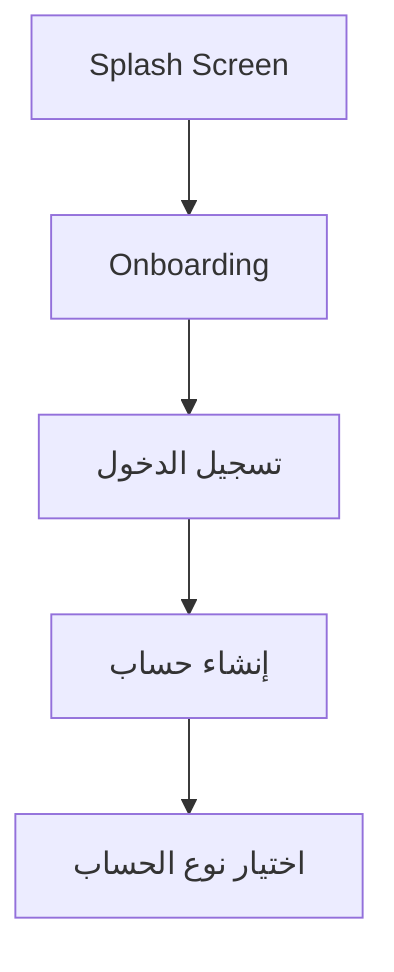

### شاشات — العنوان والمحتويات

#### **Splash Screen**

1. لوجو
2. اسم البراند
3. Loading بسيط

#### **Onboarding**

1. شرائح تعريفية
2. «تخطي»
3. «ابدأ الآن»

#### **تسجيل الدخول**

1. حقول Email/Phone
2. Password
3. «نسيت كلمة المرور»
4. رابط إنشاء حساب

#### **إنشاء حساب**

1. الاسم
2. الهاتف
3. البريد
4. كلمة المرور
5. المنطقة
6. مربع الموافقة على الشروط

#### **اختيار نوع الحساب**

1. بطاقتا «اشتراك فردي / اشتراك عائلي»

---

## F02 — اختيار الاشتراك والبرنامج والباقة

**الهدف:** تمكين العميل من بناء اشتراكه عبر اختيار متسلسل وواضح: مدة الاشتراك ثم البرنامج الغذائي ثم الباقة ثم تصنيف المطاعم، مع رؤية السعر المبدئي والمزايا في كل خطوة قبل الدفع.

### Flowchart

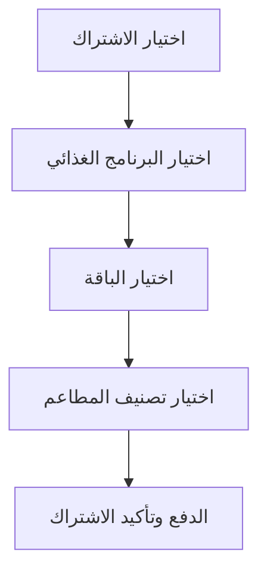

### شاشات — العنوان والمحتويات

#### **اختيار الاشتراك**

1. بطاقات المدد (شهري/أسبوعين/أسبوعي/مخصص/عائلي) مع السعر المبدئي والمزايا

#### **اختيار البرنامج الغذائي**

1. بطاقات بوصف مختصر لكل هدف

#### **اختيار الباقة**

1. بطاقات توضّح محتوى البوكس اليومي لكل باقة

#### **اختيار تصنيف المطاعم**

1. بطاقات Basic/Platinum/Elite بفروقات مبسّطة

#### **الدفع وتأكيد الاشتراك**

1. ملخص
2. السعر
3. كود الخصم
4. طريقة الدفع

---

## F03 — اختيار تصنيف المطاعم

**الهدف:** تمكين العميل من اختيار مستوى المطاعم المتاحة ضمن اشتراكه (Basic / Platinum / Elite) وفهم الفرق بينها ببساطة دون الدخول في تفاصيل التسعير الداخلي بين المنصة والمطاعم.

### Flowchart

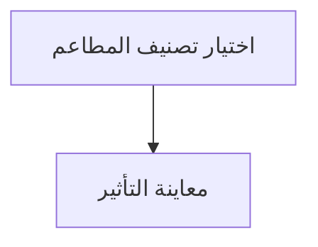

### شاشات — العنوان والمحتويات

#### **اختيار تصنيف المطاعم**

1. بطاقات Basic/Platinum/Elite
2. عناصر «ما الذي يشمله كل تصنيف»
3. مؤشر بصري للفرق بينها دون تعقيد

#### **معاينة التأثير**

1. إشارة لعدد/تنوّع المطاعم المتوقع داخل التصنيف في منطقة العميل

---

## F04 — رؤية سعر الاشتراك المحسوب

**الهدف:** عرض سعر اشتراك واضح ومحسوب تلقائيًا للعميل بناءً على المدة والبرنامج والباقة والتصنيف، بحيث يفهم العميل ما يدفعه قبل التأكيد. العمولات الداخلية للمطاعم لا تظهر للعميل.

### Flowchart

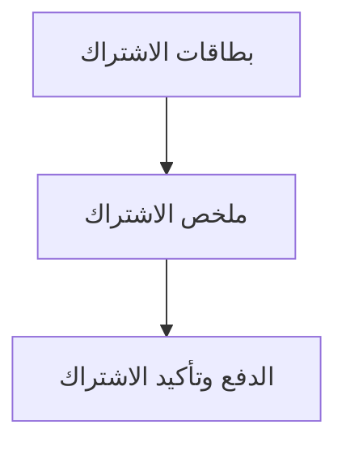

### شاشات — العنوان والمحتويات

#### **بطاقات الاشتراك**

1. السعر المبدئي تحت كل خيار مدة

#### **ملخص الاشتراك**

1. تفصيل السعر الإجمالي
2. اليومي
3. المدة

#### **الدفع وتأكيد الاشتراك**

1. المبلغ النهائي
2. حقل كود الخصم
3. طريقة الدفع

---

## F05 — استخدام التقويم الذكي

**الهدف:** التقويم الذكي هو قلب تطبيق العميل. يعرض أيام الاشتراك بحالات واضحة لكل يوم، ويتيح للعميل اختيار المطعم والبوكس لكل يوم قبل دخول الطلب في مهلة 48 ساعة، مع متابعة حالة كل يوم بنظرة سريعة.

### Flowchart

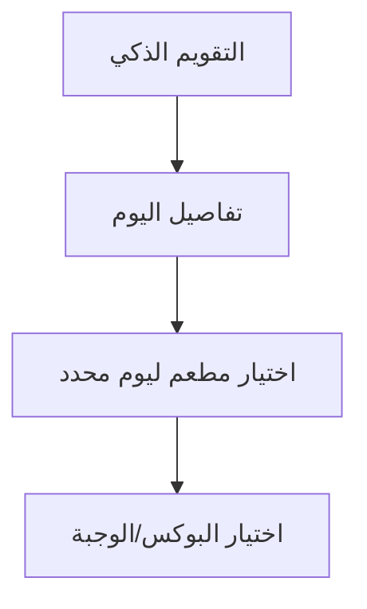

### شاشات — العنوان والمحتويات

#### **التقويم الذكي**

1. أيام ملوّنة
2. أيقونات حالة
3. عداد قبل 48 ساعة

#### **تفاصيل اليوم**

1. اسم اليوم والتاريخ
2. الحالة
3. المطعم/الوجبة المختارة
4. عداد التعديل
5. زر اختيار/تعديل

#### **اختيار مطعم ليوم محدد**

1. فلاتر
2. تقييم
3. صورة
4. حالة Busy
5. عدد مرات الاستخدام

#### **اختيار البوكس/الوجبة**

1. صورة
2. سعرات
3. بروتين
4. كارب
5. دهون
6. مكونات
7. حساسية
8. زر تأكيد

---

## F06 — مهلة 48 ساعة للاختيار والتعديل

**الهدف:** ضمان أن يختار العميل أو يعدّل بوكس أي يوم قبل 48 ساعة على الأقل من موعد التوصيل، إذ بعد دخول النافذة يصبح الطلب «قيد التحضير» ولا يمكن تغييره من التطبيق، حفاظًا على انتظام التشغيل مع المطاعم.

### Flowchart

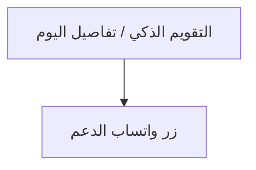

### شاشات — العنوان والمحتويات

#### **التقويم الذكي / تفاصيل اليوم**

1. عدّاد 48 ساعة
2. حالة «قيد التحضير»
3. أزرار تعديل/إلغاء مفعّلة أو مقفولة

#### **زر واتساب الدعم**

1. للحالات الاستثنائية داخل النافذة (راجع F30)

---

## F07 — الاختيار التلقائي عند عدم الاختيار

**الهدف:** ضمان عدم بقاء العميل بلا وجبة في أي يوم لم يختره يدويًا قبل مهلة الـ48 ساعة، عبر اختيار النظام بوكسًا تلقائيًا يحترم الحساسية وعدم الإعجاب والتوزيع العادل وتنويع المطاعم.

### Flowchart

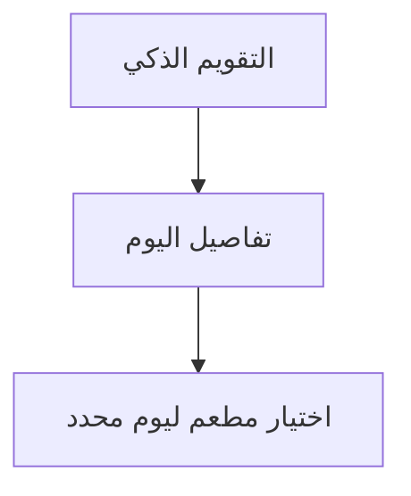

### شاشات — العنوان والمحتويات

#### **التقويم الذكي**

1. اليوم يتحول إلى مكتمل (أخضر) بعد الاختيار التلقائي

#### **تفاصيل اليوم**

1. يوضّح أن الاختيار تم تلقائيًا
2. مع المطعم والوجبة

#### **اختيار مطعم ليوم محدد**

1. المطاعم التي بلغت حدّها تظهر مقفولة (حتى للاختيار اليدوي قبل المهلة)

---

## F08 — التعامل مع حالة Busy للمطاعم

**الهدف:** توضيح كيف يرى العميل المطاعم التي بلغت طاقتها الاستيعابية اليومية بحالة **Busy** ويُمنع اختيارها لذلك اليوم، مع ضمان توفّر بدائل أو مرونة الكوتا في الأيام المزدحمة.

### Flowchart

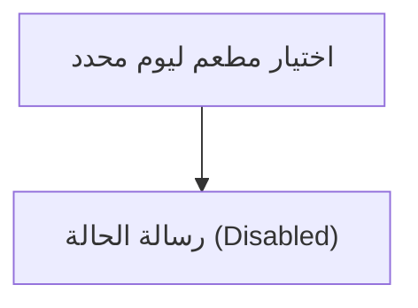

### شاشات — العنوان والمحتويات

#### **اختيار مطعم ليوم محدد**

1. بطاقات المطاعم مع وسم Busy
2. تقييم
3. صورة
4. عدد مرات الاستخدام

#### **رسالة الحالة (Disabled)**

1. توضيح أن المطعم Busy لهذا اليوم بدل منع صامت

---

## F09 — إدارة الحساسية والتفضيلات

**الهدف:** تمكين العميل من تسجيل الحساسية (Allergies) وعدم الإعجاب (Dislikes) وتحديثها في أي وقت، لضمان دقة الاختيار التلقائي واستبعاد المكوّنات غير المرغوبة من بوكساته.

### Flowchart

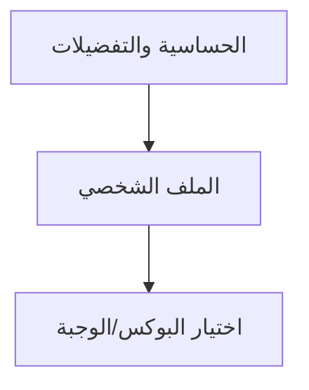

### شاشات — العنوان والمحتويات

#### **الحساسية والتفضيلات**

1. اختيارات متعددة
2. إضافة يدوية
3. زر حفظ

#### **الملف الشخصي**

1. قسم لتحديث الحساسية والتفضيلات في أي وقت

#### **اختيار البوكس/الوجبة**

1. عرض ملاحظات الحساسية والمكونات لكل وجبة

---

## F10 — إلغاء الاشتراك وعرض الاسترداد

**الهدف:** تمكين العميل من إلغاء اشتراكه في أي وقت من التطبيق، مع رؤية المبلغ المسترد المحسوب تلقائيًا قبل التأكيد، وفهم أثر القرار على طلبات اليومين القادمين.

### Flowchart

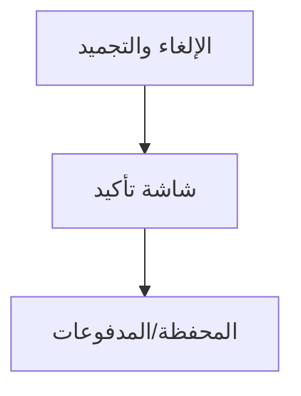

### شاشات — العنوان والمحتويات

#### **الإلغاء والتجميد**

1. زر «طلب إلغاء»
2. عرض الاسترداد المتوقع
3. ملخص الأثر

#### **شاشة تأكيد**

1. تفصيل الأيام المُسلّمة/المتبقية والمبلغ المسترد

#### **المحفظة/المدفوعات**

1. متابعة حالة الاسترداد (راجع F26)

---

## F11 — تجميد الاشتراك

**الهدف:** تمكين العميل من تجميد اشتراكه لفترة محددة دون إلغائه، بحيث تتوقف الطلبات والخصومات مؤقتًا وتُضاف الأيام المجمّدة إلى نهاية الاشتراك، مع مراعاة أن طلبات اليومين القادمين محجوزة.

### Flowchart

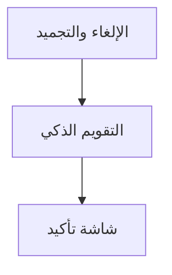

### شاشات — العنوان والمحتويات

#### **الإلغاء والتجميد**

1. زر «طلب تجميد»
2. اختيار المدة
3. ملخص الأثر

#### **التقويم الذكي**

1. الأيام المجمّدة بحالة زرقاء ❄ (القسم 4.7)

#### **شاشة تأكيد**

1. تواريخ بدء/انتهاء التجميد والأيام المضافة لنهاية الاشتراك

---

## F13 — تتبع الطلب اللحظي

**الهدف:** تمكين العميل من متابعة طلبه لحظيًا أثناء التوصيل عبر خريطة وحالة الطلب وبيانات محدودة عن المندوب، مع إظهار زر الاتصال عند اقتراب المندوب لمسافة 3 كم.

### Flowchart

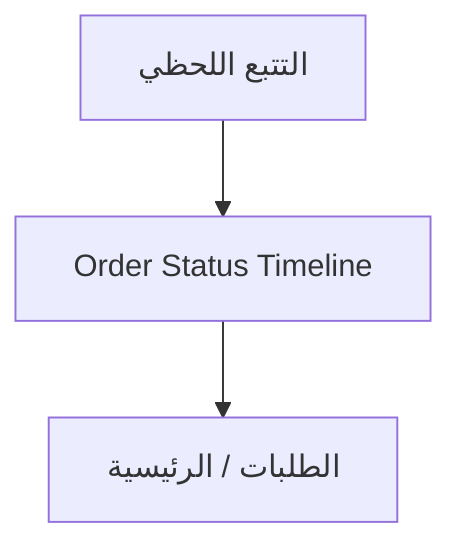

### شاشات — العنوان والمحتويات

#### **التتبع اللحظي**

1. خريطة
2. حالة الطلب
3. بيانات المندوب (محدودة)
4. زر اتصال عند 3 كم

#### **Order Status Timeline**

1. مراحل الطلب بتتابع بصري واضح

#### **الطلبات / الرئيسية**

1. بطاقة الطلب الحالي مع رابط للتتبع

---

## F14 — الاتصال بالمندوب عند 3 كم

**الهدف:** تمكين العميل من التواصل مع المندوب بأمان داخل التطبيق عند اقترابه لمسافة 3 كم أو أقل، مع الحفاظ على الخصوصية (أرقام مقنّعة)، وفهم ما يحدث عند عدم الرد (Hold ومحاولة ثانية).

### Flowchart

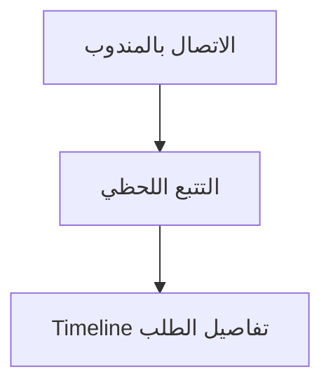

### شاشات — العنوان والمحتويات

#### **الاتصال بالمندوب**

1. زر اتصال
2. حالة الاتصال
3. تنبيه الخصوصية

#### **التتبع اللحظي**

1. ظهور/إخفاء زر الاتصال حسب المسافة

#### **Timeline تفاصيل الطلب**

1. تسجيل كل أحداث الاتصال وHold

---

## F15 — تقييم الطلب بعد التسليم

**الهدف:** تمكين العميل من تقييم تجربته بعد التسليم بسرعة (أقل من 30 ثانية): جودة الوجبة وسرعة التوصيل والمطعم عمومًا، عبر نجوم وتعليق اختياري، بما يغذّي تحسين الخدمة ونظام النقاط.

### Flowchart

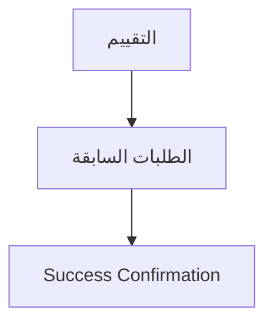

### شاشات — العنوان والمحتويات

#### **التقييم**

1. تقييم نجوم متعدد المحاور
2. حقل تعليق
3. زر إرسال

#### **الطلبات السابقة**

1. مدخل لتقييم أي طلب مُسلّم لم يُقيَّم بعد

#### **Success Confirmation**

1. رسالة نجاح قصيرة بعد الإرسال

---

## F16 — تقديم شكوى واستخدام المحفظة

**الهدف:** تمكين العميل من تقديم شكوى على وجبة مع صور إلزامية، واختيار طريقة التعويض بعد قبول الأدمن (استرداد للمحفظة أو تمديد اشتراك)، وإدارة رصيد محفظته الرقمية لاحقًا.

### Flowchart

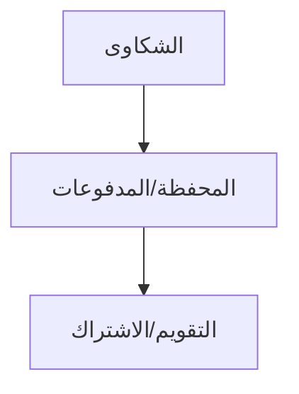

### شاشات — العنوان والمحتويات

#### **الشكاوى**

1. نوع المشكلة
2. صور (إلزامية)
3. وصف
4. اختيار طريقة التعويض إن قُبلت

#### **المحفظة/المدفوعات**

1. الرصيد
2. سجل الحركات
3. خيار التحويل البنكي

#### **التقويم/الاشتراك**

1. انعكاس «يوم إضافي» عند اختيار التمديد

---

## F17 — الولاء والمكافآت والنقاط

**الهدف:** تحفيز العميل عبر نقاط ولاء يكسبها من أنشطته (الاشتراك، التجديد، الطلب، التقييم، الإحالة) ويستبدلها بمكافآت، مع شاشة واضحة ماليًا تعرض الرصيد وطرق الكسب وسجل النقاط.

### Flowchart

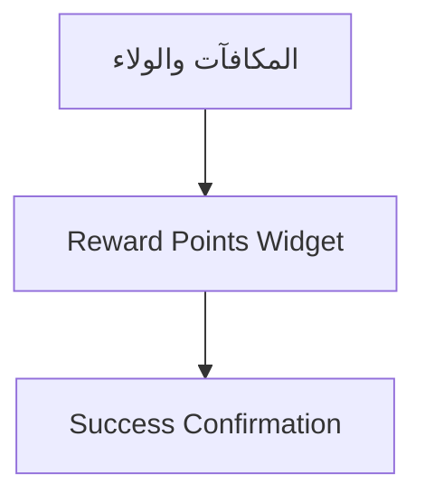

### شاشات — العنوان والمحتويات

#### **المكافآت والولاء**

1. رصيد النقاط
2. طرق الكسب
3. سجل النقاط
4. خيارات الاستبدال

#### **Reward Points Widget**

1. عرض النقاط وسجل مختصر (قد يظهر في الرئيسية)

#### **Success Confirmation**

1. تأكيد الاستبدال

---

## F18 — الإحالات والبرومو كود

**الهدف:** تمكين العميل من دعوة أصدقائه عبر رابط إحالة خاص وكسب مكافآت، واستخدام برومو كود في شاشة الدفع للحصول على خصم، بما يدعم انتشار المنصة.

### Flowchart

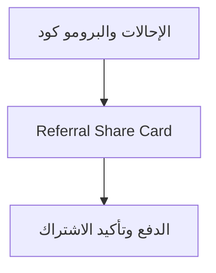

### شاشات — العنوان والمحتويات

#### **الإحالات والبرومو كود**

1. رابط الإحالة
2. زر نسخ/مشاركة
3. عدد المدعوين
4. سجل المكافآت

#### **Referral Share Card**

1. رابط
2. كود
3. نسخ/مشاركة

#### **الدفع وتأكيد الاشتراك**

1. حقل إدخال برومو كود وأثره على السعر

---

## F19 — الاشتراك العائلي (مدير وفرد)

**الهدف:** تمكين مدير العائلة من إدارة اشتراك لعدة أفراد بحسابات منفصلة، مع احتفاظه بصلاحيات الإدارة، بينما يستخدم الأفراد حصصهم دون تعديل الاشتراك الرئيسي، مع Flow واضح لفصل الفرد.

### Flowchart

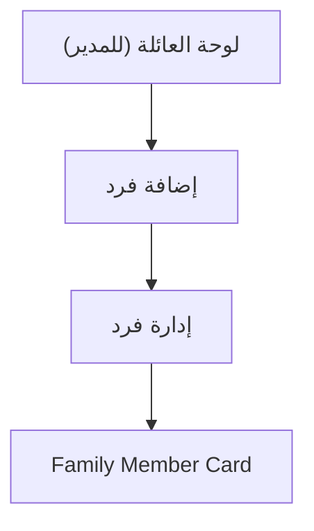

### شاشات — العنوان والمحتويات

#### **لوحة العائلة (للمدير)**

1. عدد الأفراد
2. حالاتهم
3. الطلبات
4. زر إضافة فرد

#### **إضافة فرد**

1. اسم
2. Username
3. Password
4. التفضيلات والحساسية

#### **إدارة فرد**

1. تعديل
2. فصل
3. تحويل لحساب مستقل

#### **Family Member Card**

1. اسم الفرد
2. حالته
3. صلاحياته
4. زر فصل

---

## F20 — رؤية الإعلانات والترقيات

**الهدف:** عرض إعلانات وترقيات مدفوعة من مطاعم تخدم منطقة العميل فقط، بشكل واضح وغير مزعج (Banner / Sponsored Card)، دون إخفاء المعلومات الأساسية أو الإخلال بتجربة الاشتراك.

### Flowchart

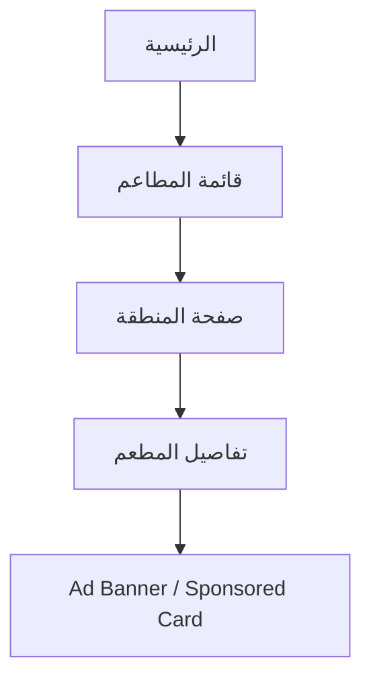

### شاشات — العنوان والمحتويات

#### **الرئيسية**

1. Banner أفقي للإعلان في منطقة العميل

#### **قائمة المطاعم**

1. Sponsored Card موسوم

#### **صفحة المنطقة**

1. 3 أماكن إعلانية للفائزين بالمزايدة

#### **تفاصيل المطعم**

1. عرض/Highlight

#### **Ad Banner / Sponsored Card**

1. تصميم يوضّح أنه إعلان دون إزعاج

---

## F21 — المحتوى حسب منطقة/دولة العميل

**الهدف:** ضمان أن يرى العميل فقط المطاعم والباقات والعملات المتاحة في دولته/منطقته، بحيث تكون كل الخيارات قابلة للتنفيذ فعليًا ضمن نطاق تغطيته الجغرافي.

### Flowchart

```mermaid
flowchart TD
  f21_s1["إنشاء حساب / الملف الشخصي"]
  f21_s2["الرئيسية وقائمة المطاعم"]
  f21_s3["اختيار مطعم ليوم محدد"]
  f21_s1 --> f21_s2
  f21_s2 --> f21_s3
```

### شاشات — العنوان والمحتويات

#### **إنشاء حساب / الملف الشخصي**

1. اختيار/تحديث المنطقة والعنوان

#### **الرئيسية وقائمة المطاعم**

1. محتوى مفلتر حسب المنطقة
2. بنرات المنطقة (راجع F20)

#### **اختيار مطعم ليوم محدد**

1. مطاعم منطقة العميل فقط

---

## F24 — تصفّح القوائم والوجبات

**الهدف:** تمكين العميل من تصفّح قوائم المطاعم ووجباتها مع بياناتها الغذائية ومكوناتها وملاحظات الحساسية باللغتين، لاختيار البوكس المناسب ضمن تقويمه اليومي.

### Flowchart

```mermaid
flowchart TD
  f24_s1["اختيار البوكس/الوجبة"]
  f24_s2["Meal Card"]
  f24_s3["اختيار مطعم ليوم محدد"]
  f24_s1 --> f24_s2
  f24_s2 --> f24_s3
```

### شاشات — العنوان والمحتويات

#### **اختيار البوكس/الوجبة**

1. صورة
2. سعرات
3. بروتين
4. كارب
5. دهون
6. مكونات
7. حساسية
8. زر تأكيد

#### **Meal Card**

1. صورة
2. اسم
3. مطعم
4. معلومات غذائية
5. حالة توفّر

#### **اختيار مطعم ليوم محدد**

1. فلاتر وتقييمات لتصفية القوائم

---

## F25 — استمرارية الخدمة عند خروج مطعم

**الهدف:** ضمان عدم تعطّل اشتراك العميل عند رغبة مطعم في التوقف، عبر التزام المطعم بتوفير الطلبات القائمة والمجدولة لمدة لا تقل عن 30 يومًا، ومنح العميل فرصة اختيار مطاعم بديلة للأيام القادمة.

### Flowchart

```mermaid
flowchart TD
  f25_s1["التقويم الذكي"]
  f25_s2["اختيار مطعم ليوم محدد"]
  f25_s3["الطلبات"]
  f25_s1 --> f25_s2
  f25_s2 --> f25_s3
```

### شاشات — العنوان والمحتويات

#### **التقويم الذكي**

1. الأيام القادمة تعرض بدائل بعد اختفاء المطعم المنتهي

#### **اختيار مطعم ليوم محدد**

1. المطعم المنتهي لا يظهر للأيام الجديدة

#### **الطلبات**

1. الطلبات القائمة من المطعم تبقى ظاهرة حتى تنفيذها

---

## F26 — المدفوعات والمحفظة والاستردادات

**الهدف:** تمكين العميل من متابعة مدفوعاته ورصيد محفظته الرقمية واستردادته في مكان واضح، وفهم مصادر الرصيد (استرداد إلغاء/شكوى) وطرق استخدامه أو تحويله بنكيًا.

### Flowchart

```mermaid
flowchart TD
  f26_s1["المحفظة/المدفوعات"]
  f26_s2["الدفع وتأكيد الاشتراك"]
  f26_s3["الطلبات/الاشتراك"]
  f26_s1 --> f26_s2
  f26_s2 --> f26_s3
```

### شاشات — العنوان والمحتويات

#### **المحفظة/المدفوعات**

1. الرصيد
2. سجل الحركات
3. أزرار الاستخدام/التحويل

#### **الدفع وتأكيد الاشتراك**

1. خيار الدفع من المحفظة

#### **الطلبات/الاشتراك**

1. انعكاس الاستردادات والتمديدات على الحساب

---

## F29 — تبديل لغة التطبيق

**الهدف:** تمكين العميل من استخدام التطبيق بالعربية (RTL) أو الإنجليزية (LTR) عبر زر تبديل واضح، مع تطبيق اللغة على الواجهة والمحتوى الديناميكي والإشعارات.

### Flowchart

```mermaid
flowchart TD
  f29_s1["الملف الشخصي / القائمة الرئيسية"]
  f29_s2["كل الشاشات"]
  f29_s3["اختيار البوكس/الوجبة"]
  f29_s1 --> f29_s2
  f29_s2 --> f29_s3
```

### شاشات — العنوان والمحتويات

#### **الملف الشخصي / القائمة الرئيسية**

1. زر/قائمة تبديل اللغة

#### **كل الشاشات**

1. تتكيّف مع الاتجاه RTL/LTR

#### **اختيار البوكس/الوجبة**

1. أسماء ومكونات وبيانات غذائية باللغة المختارة

---

## F30 — قنوات التواصل والدعم (واتساب/سوشيال)

**الهدف:** توفير وصول سريع للعميل إلى الدعم الفني عبر زر واتساب عائم في كل صفحات التطبيق، وقنوات السوشيال ميديا، خصوصًا للحالات الاستثنائية مثل طلب تعديل داخل مهلة 48 ساعة.

### Flowchart

```mermaid
flowchart TD
  f30_s1["زر واتساب عائم"]
  f30_s2["القائمة الجانبية / التذييل"]
  f30_s3["شاشات الحالات الاستثنائية"]
  f30_s1 --> f30_s2
  f30_s2 --> f30_s3
```

### شاشات — العنوان والمحتويات

#### **زر واتساب عائم**

1. ظاهر في كل الصفحات للدعم المباشر

#### **القائمة الجانبية / التذييل**

1. روابط السوشيال ميديا

#### **شاشات الحالات الاستثنائية**

1. توجيه لواتساب الأدمن (مثل قفل الـ48 ساعة — راجع F06)

---

## F31 — خصوصية بيانات العميل

**الهدف:** طمأنة العميل وحماية بياناته: لا يرى المندوب اسمه أو رقمه (موقع جغرافي فقط)، ولا يرى المطعم هويته، والاتصال آمن داخل التطبيق بأرقام مقنّعة، مع توثيق أي استثناء.

### Flowchart

```mermaid
flowchart TD
  f31_s1["Permission Required"]
  f31_s2["الاتصال بالمندوب"]
  f31_s3["الملف الشخصي"]
  f31_s1 --> f31_s2
  f31_s2 --> f31_s3
```

### شاشات — العنوان والمحتويات

#### **Permission Required**

1. شرح سبب طلب الصلاحية قبل نافذة النظام

#### **الاتصال بالمندوب**

1. تنبيه الخصوصية وعدم إظهار الرقم إلا استثناءً

#### **الملف الشخصي**

1. إدارة البيانات والإعدادات والخصوصية

---

