# العميل — Lifecycle Flowcharts (تفصيلي)

> **الدور:** العميل | **المنصة:** Flutter — تطبيق موبايل

> **ملف مستقل كامل** — دورة حياة + flowcharts + شاشات/لوحات + خطوات workflow + قواعد.

> افتح **Preview** (`Ctrl+Shift+V`) لرؤية Mermaid.

---

## 1. دورة الحياة الكاملة

### 1.1 خريطة الميزات (Flowchart)

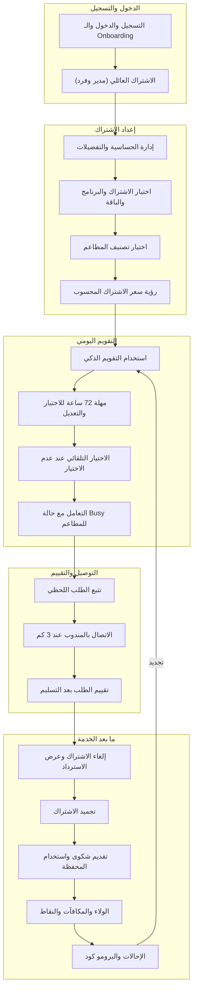

### 1.2 مسار الشاشات/اللوحات الكامل (Flowchart)

```mermaid
flowchart TD
 p1_f01_s1["Splash Screen"]
 p1_f01_s2["Onboarding"]
 p1_f01_s3["تسجيل الدخول"]
 p1_f01_s4["إنشاء حساب"]
 p1_f01_s5["اختيار نوع الحساب"]
 p1_f01_s1 --> p1_f01_s2
 p1_f01_s2 --> p1_f01_s3
 p1_f01_s3 --> p1_f01_s4
 p1_f01_s4 --> p1_f01_s5
 p1_f19_s1["لوحة العائلة (للمدير)"]
 p1_f19_s2["إضافة فرد"]
 p1_f19_s3["إدارة فرد"]
 p1_f19_s4["Family Member Card"]
 p1_f19_s1 --> p1_f19_s2
 p1_f19_s2 --> p1_f19_s3
 p1_f19_s3 --> p1_f19_s4
 p1_f01_s5 --> p1_f19_s1
 p2_f09_s1["الحساسية والتفضيلات"]
 p2_f09_s2["الملف الشخصي"]
 p2_f09_s3["اختيار البوكس/الوجبة"]
 p2_f09_s1 --> p2_f09_s2
 p2_f09_s2 --> p2_f09_s3
 p1_f19_s4 --> p2_f09_s1
 p2_f02_s1["اختيار الاشتراك"]
 p2_f02_s2["اختيار البرنامج الغذائي"]
 p2_f02_s3["اختيار الباقة"]
 p2_f02_s4["اختيار تصنيف المطاعم"]
 p2_f02_s5["الدفع وتأكيد الاشتراك"]
 p2_f02_s1 --> p2_f02_s2
 p2_f02_s2 --> p2_f02_s3
 p2_f02_s3 --> p2_f02_s4
 p2_f02_s4 --> p2_f02_s5
 p2_f09_s3 --> p2_f02_s1
 p2_f03_s1["اختيار تصنيف المطاعم"]
 p2_f03_s2["معاينة التأثير"]
 p2_f03_s1 --> p2_f03_s2
 p2_f02_s5 --> p2_f03_s1
 p2_f04_s1["بطاقات الاشتراك"]
 p2_f04_s2["ملخص الاشتراك"]
 p2_f04_s3["الدفع وتأكيد الاشتراك"]
 p2_f04_s1 --> p2_f04_s2
 p2_f04_s2 --> p2_f04_s3
 p2_f03_s2 --> p2_f04_s1
 p3_f05_s1["التقويم الذكي"]
 p3_f05_s2["تفاصيل اليوم"]
 p3_f05_s3["اختيار مطعم ليوم محدد"]
 p3_f05_s4["اختيار البوكس/الوجبة"]
 p3_f05_s1 --> p3_f05_s2
 p3_f05_s2 --> p3_f05_s3
 p3_f05_s3 --> p3_f05_s4
 p2_f04_s3 --> p3_f05_s1
 p3_f06_s1["التقويم الذكي / تفاصيل اليوم"]
 p3_f06_s2["اختيار مطعم بديل"]
 p3_f06_s3["زر واتساب الدعم"]
 p3_f06_s1 --> p3_f06_s2
 p3_f06_s2 --> p3_f06_s3
 p3_f05_s4 --> p3_f06_s1
 p3_f07_s1["التقويم الذكي"]
 p3_f07_s2["تفاصيل اليوم"]
 p3_f07_s3["اختيار مطعم ليوم محدد"]
 p3_f07_s1 --> p3_f07_s2
 p3_f07_s2 --> p3_f07_s3
 p3_f06_s3 --> p3_f07_s1
 p3_f08_s1["اختيار مطعم ليوم محدد"]
 p3_f08_s2["رسالة الحالة (Disabled)"]
 p3_f08_s1 --> p3_f08_s2
 p3_f07_s3 --> p3_f08_s1
 p4_f13_s1["التتبع اللحظي"]
 p4_f13_s2["Order Status Timeline"]
 p4_f13_s3["الطلبات / الرئيسية"]
 p4_f13_s1 --> p4_f13_s2
 p4_f13_s2 --> p4_f13_s3
 p3_f08_s2 --> p4_f13_s1
 p4_f14_s1["الاتصال بالمندوب"]
 p4_f14_s2["التتبع اللحظي"]
 p4_f14_s3["Timeline تفاصيل الطلب"]
 p4_f14_s1 --> p4_f14_s2
 p4_f14_s2 --> p4_f14_s3
 p4_f13_s3 --> p4_f14_s1
 p4_f15_s1["التقييم"]
 p4_f15_s2["الطلبات السابقة"]
 p4_f15_s3["Success Confirmation"]
 p4_f15_s1 --> p4_f15_s2
 p4_f15_s2 --> p4_f15_s3
 p4_f14_s3 --> p4_f15_s1
 p5_f10_s1["شاشة المتطلبات / المدخلات"]
 p5_f10_s2["طلب إلغاء"]
 p5_f10_s3["رسوم الإلغاء F"]
 p5_f10_s4["إذا الأيام المتبقية = 0"]
 p5_f10_s5["يؤكد العميل بعد رؤية التفصيل"]
 p5_f10_s6["تُلغى الطلبات المتبقية"]
 p5_f10_s7["يُحوّل المسترجع خلال 3–5 أيام عمل أو يُضاف للمحفظة"]
 p5_f10_s1 --> p5_f10_s2
 p5_f10_s2 --> p5_f10_s3
 p5_f10_s3 --> p5_f10_s4
 p5_f10_s4 --> p5_f10_s5
 p5_f10_s5 --> p5_f10_s6
 p5_f10_s6 --> p5_f10_s7
 p4_f15_s3 --> p5_f10_s1
 p5_f11_s1["الإلغاء والتجميد"]
 p5_f11_s2["التقويم الذكي"]
 p5_f11_s3["شاشة تأكيد"]
 p5_f11_s1 --> p5_f11_s2
 p5_f11_s2 --> p5_f11_s3
 p5_f10_s7 --> p5_f11_s1
 p5_f16_s1["الشكاوى"]
 p5_f16_s2["المحفظة/المدفوعات"]
 p5_f16_s3["التقويم/الاشتراك"]
 p5_f16_s1 --> p5_f16_s2
 p5_f16_s2 --> p5_f16_s3
 p5_f11_s3 --> p5_f16_s1
 p5_f17_s1["المكافآت والولاء"]
 p5_f17_s2["Reward Points Widget"]
 p5_f17_s3["Success Confirmation"]
 p5_f17_s1 --> p5_f17_s2
 p5_f17_s2 --> p5_f17_s3
 p5_f16_s3 --> p5_f17_s1
 p5_f18_s1["الإحالات والبرومو كود"]
 p5_f18_s2["Referral Share Card"]
 p5_f18_s3["الدفع وتأكيد الاشتراك"]
 p5_f18_s1 --> p5_f18_s2
 p5_f18_s2 --> p5_f18_s3
 p5_f17_s3 --> p5_f18_s1
```

### تفاصيل دورة الحياة (نص)

#### المرحلة 1: **الدخول والتسجيل**

**الميزات:** التسجيل والدخول والـ Onboarding · الاشتراك العائلي (مدير وفرد)

**عدد شاشات:** 9

**الخطوات الرئيسية:**

1. Splash → Onboarding → تسجيل أو دخول
2. اختيار نوع الحساب: فردي / عائلي
3. الوصول للرئيسية أو مسار الاشتراك

**شاشات في هذه المرحلة:**

- **التسجيل والدخول والـ Onboarding:** Splash Screen → Onboarding → تسجيل الدخول → إنشاء حساب → اختيار نوع الحساب
- **الاشتراك العائلي (مدير وفرد):** لوحة العائلة (للمدير) → إضافة فرد → إدارة فرد → Family Member Card

#### المرحلة 2: **إعداد الاشتراك**

**الميزات:** إدارة الحساسية والتفضيلات · اختيار الاشتراك والبرنامج والباقة · اختيار تصنيف المطاعم · رؤية سعر الاشتراك المحسوب

**عدد شاشات:** 13

**الخطوات الرئيسية:**

4. تسجيل الحساسية وعدم الإعجاب
5. اختيار المدة → البرنامج → الباقة
6. اختيار تصنيف المطاعم
7. عرض السعر المحسوب + الدفع

**شاشات في هذه المرحلة:**

- **إدارة الحساسية والتفضيلات:** الحساسية والتفضيلات → الملف الشخصي → اختيار البوكس/الوجبة
- **اختيار الاشتراك والبرنامج والباقة:** اختيار الاشتراك → اختيار البرنامج الغذائي → اختيار الباقة → اختيار تصنيف المطاعم → الدفع وتأكيد الاشتراك
- **اختيار تصنيف المطاعم:** اختيار تصنيف المطاعم → معاينة التأثير
- **رؤية سعر الاشتراك المحسوب:** بطاقات الاشتراك → ملخص الاشتراك → الدفع وتأكيد الاشتراك

#### المرحلة 3: **التقويم اليومي**

**الميزات:** استخدام التقويم الذكي · مهلة 72 ساعة للاختيار والتعديل · الاختيار التلقائي عند عدم الاختيار · التعامل مع حالة Busy للمطاعم

**عدد شاشات:** 12

**الخطوات الرئيسية:**

8. فتح التقويم → يوم → مطعم → بوكس
9. قبل 48h: تأكيد | داخل 48h: لا تعديل
10. عدم الاختيار → اختيار تلقائي + كوتا
11. مطعم Busy → معطّل أو بديل

**شاشات في هذه المرحلة:**

- **استخدام التقويم الذكي:** التقويم الذكي → تفاصيل اليوم → اختيار مطعم ليوم محدد → اختيار البوكس/الوجبة
- **مهلة 72 ساعة للاختيار والتعديل:** التقويم الذكي / تفاصيل اليوم → اختيار مطعم بديل → زر واتساب الدعم
- **الاختيار التلقائي عند عدم الاختيار:** التقويم الذكي → تفاصيل اليوم → اختيار مطعم ليوم محدد
- **التعامل مع حالة Busy للمطاعم:** اختيار مطعم ليوم محدد → رسالة الحالة (Disabled)

#### المرحلة 4: **التوصيل والتقييم**

**الميزات:** تتبع الطلب اللحظي · الاتصال بالمندوب عند 3 كم · تقييم الطلب بعد التسليم

**عدد شاشات:** 9

**الخطوات الرئيسية:**

12. متابعة الخريطة وحالة الطلب
13. زر اتصال عند 3 km — VoIP مقنّع
14. Hold إن لم يرد → محاولة ثانية
15. بعد التسليم: تقييم

**شاشات في هذه المرحلة:**

- **تتبع الطلب اللحظي:** التتبع اللحظي → Order Status Timeline → الطلبات / الرئيسية
- **الاتصال بالمندوب عند 3 كم:** الاتصال بالمندوب → التتبع اللحظي → Timeline تفاصيل الطلب
- **تقييم الطلب بعد التسليم:** التقييم → الطلبات السابقة → Success Confirmation

#### المرحلة 5: **ما بعد الخدمة**

**الميزات:** إلغاء الاشتراك وعرض الاسترداد · تجميد الاشتراك · تقديم شكوى واستخدام المحفظة · الولاء والمكافآت والنقاط · الإحالات والبرومو كود

**عدد شاشات:** 19

**الخطوات الرئيسية:**

16. شكوى + صور → تعويض
17. نقاط ولاء وإحالة
18. إلغاء: استرداد = (سعر÷أيام) × (متبقي−2)
19. تجميد → تجديد أو العودة للتقويم

**شاشات في هذه المرحلة:**

- **إلغاء الاشتراك وعرض الاسترداد:** شاشة المتطلبات / المدخلات → طلب إلغاء → رسوم الإلغاء F → إذا الأيام المتبقية = 0 → يؤكد العميل بعد رؤية التفصيل → تُلغى الطلبات المتبقية → يُحوّل المسترجع خلال 3–5 أيام عمل أو يُضاف للمحفظة
- **تجميد الاشتراك:** الإلغاء والتجميد → التقويم الذكي → شاشة تأكيد
- **تقديم شكوى واستخدام المحفظة:** الشكاوى → المحفظة/المدفوعات → التقويم/الاشتراك
- **الولاء والمكافآت والنقاط:** المكافآت والولاء → Reward Points Widget → Success Confirmation
- **الإحالات والبرومو كود:** الإحالات والبرومو كود → Referral Share Card → الدفع وتأكيد الاشتراك


---

## 2. الحلقة التشغيلية

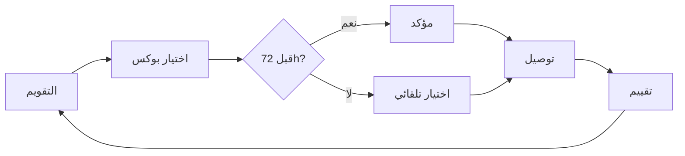

---

## 3. تفاصيل المراحل (Flowcharts + شاشات + Workflow)

### المرحلة 1: **الدخول والتسجيل** — 2 ميزة | 9 شاشات

**الميزات:** التسجيل والدخول والـ Onboarding · الاشتراك العائلي (مدير وفرد)

#### ملخص المرحلة

1. Splash → Onboarding → تسجيل أو دخول
2. اختيار نوع الحساب: فردي / عائلي
3. الوصول للرئيسية أو مسار الاشتراك

#### Flowchart شامل للمرحلة

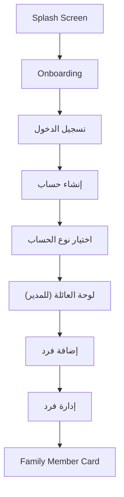

#### تفاصيل كل ميزة

#### **التسجيل والدخول والـ Onboarding**

**الهدف:** أول تجربة للعميل مع تطبيق MealMate (Flutter): فهم الفكرة بسرعة عبر شاشات Onboarding، ثم إنشاء حساب جديد أو تسجيل الدخول لحساب قائم، وصولًا إلى نقطة البدء في الاشتراك. الهدف تجربة دخول سلسة وقصيرة الخطوات.

**Flowchart:**

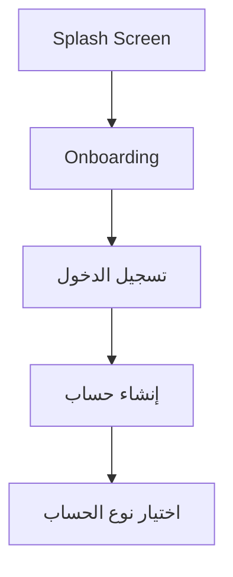

**شاشات — العنوان والمحتويات:**

#### **Splash Screen**

1. لوجو
2. اسم البراند
3. Loading بسيط

#### **Onboarding**

1. شرائح تعريفية
2. «تخطي»
3. «ابدأ الآن»

#### **تسجيل الدخول**

1. حقول Email/Phone
2. Password
3. «نسيت كلمة المرور»
4. رابط إنشاء حساب

#### **إنشاء حساب**

1. الاسم
2. الهاتف
3. البريد
4. كلمة المرور
5. المنطقة
6. مربع الموافقة على الشروط

#### **اختيار نوع الحساب**

1. بطاقتا «اشتراك فردي / اشتراك عائلي»

**خطوات Workflow:**

1. يفتح العميل التطبيق فتظهر شاشة **Splash** (لوجو MealMate) لثوانٍ قليلة
2. لأول استخدام يُعرض **Onboarding** (3–4 شرائح: اختر خطتك، نوّع وجباتك، تابع التوصيل، اكسب مكافآت) مع زر «تخطي» و«ابدأ الآن»
3. ينتقل إلى شاشة **تسجيل الدخول**: يدخل Email/Phone + Password، أو يضغط «نسيت كلمة المرور»، أو «إنشاء حساب»
4. عند إنشاء حساب جديد: يملأ البيانات على خطوات قصيرة ويختار المنطقة ويوافق على الشروط
5. (عند توفّره) يختار **نوع الحساب**: فردي أو عائلي عبر بطاقتين واضحتين
6. بعد نجاح الدخول يتحقق التطبيق من حالة الاشتراك ويوجّه العميل إلى الرئيسية أو إلى مسار الاشتراك

**حالات واستثناءات:**

1. **Loading:** أثناء التحقق من بيانات الدخول (Loader بهوية التطبيق)
2. **Error:** بيانات دخول خاطئة أو بريد/هاتف مستخدم مسبقًا → رسالة واضحة مع إعادة المحاولة
3. **Offline:** Banner أعلى الشاشة يوضح فقدان الاتصال ويمنع الإرسال
4. **حساب معطّل:** إذا عطّل الأدمن الحساب، تظهر رسالة وتوجيه لقناة الدعم (واتساب)
5. **نسيت كلمة المرور:** مسار إعادة تعيين عبر البريد/الهاتف

#### **الاشتراك العائلي (مدير وفرد)**

**الهدف:** تمكين مدير العائلة من إدارة اشتراك لعدة أفراد بحسابات منفصلة، مع احتفاظه بصلاحيات الإدارة، بينما يستخدم الأفراد حصصهم دون تعديل الاشتراك الرئيسي، مع Flow واضح لفصل الفرد.

**Flowchart:**

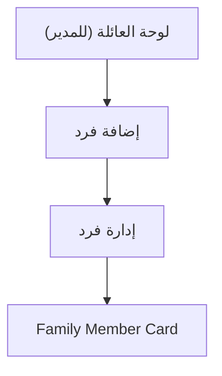

**شاشات — العنوان والمحتويات:**

#### **لوحة العائلة (للمدير)**

1. عدد الأفراد
2. حالاتهم
3. الطلبات
4. زر إضافة فرد

#### **إضافة فرد**

1. اسم
2. Username
3. Password
4. التفضيلات والحساسية

#### **إدارة فرد**

1. تعديل
2. فصل
3. تحويل لحساب مستقل

#### **Family Member Card**

1. اسم الفرد
2. حالته
3. صلاحياته
4. زر فصل

**خطوات Workflow:**

1. يفتح **مدير العائلة** لوحة العائلة فيرى عدد الأفراد وحالاتهم وطلباتهم
2. يضيف فردًا عبر **إضافة فرد** بإدخال بياناته وتفضيلاته وحساسيته
3. يدير فردًا (تعديل بياناته، فصله، أو تحويله لحساب مستقل)
4. يستخدم **فرد العائلة** حسابه ضمن حصته فقط دون تعديل الخطة الرئيسية
5. عند الفصل: تأكيد → اختيار **تحويل لحساب مستقل** أو **ترقية لاشتراك فردي** → رسالة نجاح
6. يصل الفرد المفصول حالة حسابه الجديد

**حالات واستثناءات:**

1. **صلاحيات الفرد:** لا يرى لوحة الإدارة (أو ملخص فقط) ولا يعدّل الخطة
2. **فصل فرد:** Flow تأكيد واضح مع خيار التحويل/الترقية
3. **Empty:** لا أفراد بعد → دعوة لإضافة أول فرد
4. **Error/Offline:** فشل إضافة/فصل فرد → إعادة محاولة

---

### المرحلة 2: **إعداد الاشتراك** — 4 ميزة | 13 شاشات

**الميزات:** إدارة الحساسية والتفضيلات · اختيار الاشتراك والبرنامج والباقة · اختيار تصنيف المطاعم · رؤية سعر الاشتراك المحسوب

#### ملخص المرحلة

1. تسجيل الحساسية وعدم الإعجاب
2. اختيار المدة → البرنامج → الباقة
3. اختيار تصنيف المطاعم
4. عرض السعر المحسوب + الدفع

#### Flowchart شامل للمرحلة

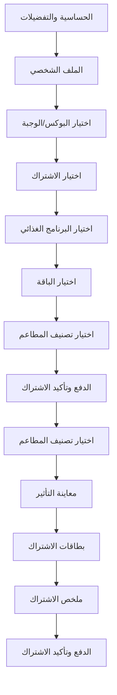

#### تفاصيل كل ميزة

#### **إدارة الحساسية والتفضيلات**

**الهدف:** تمكين العميل من تسجيل الحساسية (Allergies) وعدم الإعجاب (Dislikes) وتحديثها في أي وقت، لضمان دقة الاختيار التلقائي واستبعاد المكوّنات غير المرغوبة من بوكساته.

**Flowchart:**

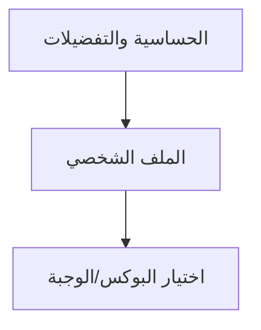

**شاشات — العنوان والمحتويات:**

#### **الحساسية والتفضيلات**

1. اختيارات متعددة
2. إضافة يدوية
3. زر حفظ

#### **الملف الشخصي**

1. قسم لتحديث الحساسية والتفضيلات في أي وقت

#### **اختيار البوكس/الوجبة**

1. عرض ملاحظات الحساسية والمكونات لكل وجبة

**خطوات Workflow:**

1. أثناء التسجيل (أو من شاشة **الحساسية والتفضيلات**) يحدد العميل ما يعاني حساسية منه
2. يضيف عناصر **عدم الإعجاب** التي لا يرغب بها في وجباته
3. يستخدم اختيارات متعددة جاهزة مع إمكانية **إضافة يدوية** لعناصر غير مدرجة
4. يحفظ البيانات؛ فتُطبَّق فورًا على الاختيار اليدوي والتلقائي
5. عند التجديد: يؤكد البيانات أو يعدّلها. وفي أي وقت: يحدّثها من الملف الشخصي

**حالات واستثناءات:**

1. **قبل الاختيار التلقائي:** تسجيل الحساسية ضروري لتفعيله بدقّة؛ يُنبَّه العميل إن لم يكملها
2. **Empty:** لا توجد حساسية مسجّلة → رسالة لطيفة مع زر إضافة
3. **Error/Offline:** فشل الحفظ → إبقاء التعديل محليًا وإعادة المحاولة عند عودة الاتصال
4. **تعارض:** وجبة تحتوي مكوّن حساسية تظهر مقيّدة/مستبعدة في الاختيار التلقائي

#### **اختيار الاشتراك والبرنامج والباقة**

**الهدف:** تمكين العميل من بناء اشتراكه عبر اختيار متسلسل وواضح: مدة الاشتراك ثم البرنامج الغذائي ثم الباقة ثم تصنيف المطاعم، مع رؤية السعر المبدئي والمزايا في كل خطوة قبل الدفع.

**Flowchart:**

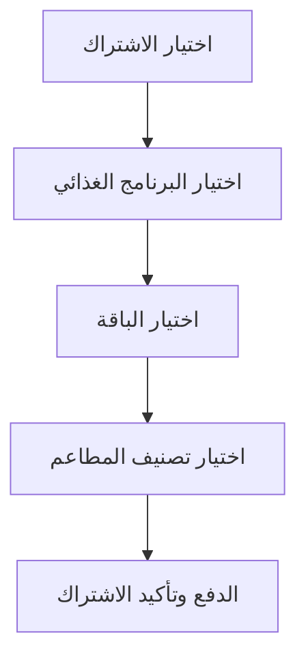

**شاشات — العنوان والمحتويات:**

#### **اختيار الاشتراك**

1. بطاقات المدد (شهري/أسبوعين/أسبوعي/مخصص/عائلي) مع السعر المبدئي والمزايا

#### **اختيار البرنامج الغذائي**

1. بطاقات بوصف مختصر لكل هدف

#### **اختيار الباقة**

1. بطاقات توضّح محتوى البوكس اليومي لكل باقة

#### **اختيار تصنيف المطاعم**

1. بطاقات Basic/Platinum/Elite بفروقات مبسّطة

#### **الدفع وتأكيد الاشتراك**

1. ملخص
2. السعر
3. كود الخصم
4. طريقة الدفع

**خطوات Workflow:**

1. من مسار الاشتراك يبدأ العميل بـ **اختيار المدة**: شهري (26 يوم عمل)، أسبوعين (12 يوم)، أسبوع (6 أيام)، أو مخصص (من يوم فأكثر)
2. يختار **البرنامج الغذائي**: نزول وزن، ضخامة عضلية، محافظة، كيتو (حسب المتاح من الأدمن)
3. يختار **الباقة**: كاملة (إفطار + 2 وجبة رئيسية + سناك + سلطة)، الغداء (وجبة رئيسية + سلطة)، أو مخصصة
4. يختار **تصنيف المطاعم** (Basic / Platinum / Elite) ويرى الفرق بينها
5. يستعرض ملخص الاشتراك والسعر المحسوب تلقائيًا
6. يتابع إلى شاشة الدفع وتأكيد الاشتراك، ثم ينتقل إلى التقويم الذكي

**حالات واستثناءات:**

1. **Loading:** أثناء جلب البرامج/الباقات/الأسعار لكل منطقة
2. **Empty/Disabled:** برنامج أو باقة غير متاح في منطقة العميل يظهر معطّلًا مع توضيح السبب
3. **Error/Offline:** فشل تحميل الخيارات → رسالة + إعادة محاولة
4. **منع اشتراك جديد:** إذا تجاوزت أعداد المشتركين الطاقة المتاحة لليوم قد يُمنع بدء اشتراك جديد مؤقتًا

#### **اختيار تصنيف المطاعم**

**الهدف:** تمكين العميل من اختيار مستوى المطاعم المتاحة ضمن اشتراكه (Basic / Platinum / Elite) وفهم الفرق بينها ببساطة دون الدخول في تفاصيل التسعير الداخلي بين المنصة والمطاعم.

**Flowchart:**

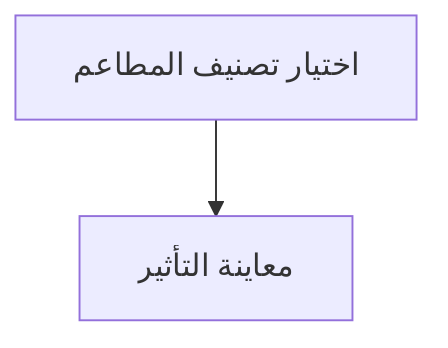

**شاشات — العنوان والمحتويات:**

#### **اختيار تصنيف المطاعم**

1. بطاقات Basic/Platinum/Elite
2. عناصر «ما الذي يشمله كل تصنيف»
3. مؤشر بصري للفرق بينها دون تعقيد

#### **معاينة التأثير**

1. إشارة لعدد/تنوّع المطاعم المتوقع داخل التصنيف في منطقة العميل

**خطوات Workflow:**

1. بعد اختيار الباقة، يصل العميل إلى شاشة **اختيار تصنيف المطاعم**
2. يستعرض ثلاث بطاقات: **Basic** و**Platinum** و**Elite** مع وصف مبسّط لكل تصنيف
3. يفهم أن **Platinum يضم Basic** في **الاختيار** (تقويم أوسع)، وأن **Elite يضم جميع المطاعم** — بينما **سعر كل تصنيف** يُحسب من متوسط مطاعم **ذلك المستوى فقط**
4. يرى تأثير التصنيف على نطاق المطاعم المتاحة في التقويم لاحقًا (تنوّع أكبر مع التصنيف الأعلى)
5. يختار التصنيف المناسب، فيُحدَّث السعر المحسوب
6. يتابع إلى الدفع أو يعود لتعديل اختياراته السابقة

**حالات واستثناءات:**

1. **Loading:** أثناء جلب المطاعم المصنّفة لمنطقة العميل
2. **Empty:** عدم وجود مطاعم كافية في تصنيف معيّن داخل المنطقة → توضيح وبدائل
3. **Disabled:** تصنيف غير متاح حاليًا في المنطقة يظهر معطّلًا مع السبب
4. **Error/Offline:** فشل التحميل → رسالة + إعادة محاولة

#### **رؤية سعر الاشتراك المحسوب**

**الهدف:** عرض سعر اشتراك واضح ومحسوب تلقائيًا للعميل بناءً على المدة والبرنامج والباقة والتصنيف، بحيث يفهم العميل ما يدفعه قبل التأكيد. العمولات الداخلية للمطاعم لا تظهر للعميل.

**Flowchart:**

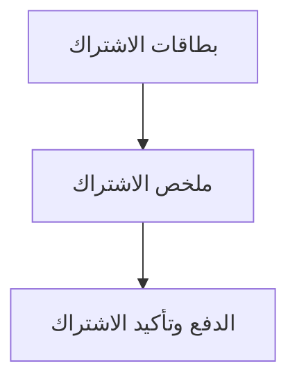

**شاشات — العنوان والمحتويات:**

#### **بطاقات الاشتراك**

1. السعر المبدئي تحت كل خيار مدة

#### **ملخص الاشتراك**

1. تفصيل السعر الإجمالي
2. اليومي
3. المدة

#### **الدفع وتأكيد الاشتراك**

1. المبلغ النهائي
2. حقل كود الخصم
3. طريقة الدفع

**خطوات Workflow:**

1. بعد اكتمال الاختيارات، يحسب النظام السعر تلقائيًا ويعرضه للعميل
2. يرى العميل **السعر الإجمالي** للاشتراك و**ما يعادله يوميًا** (سعر البوكس اليومي)
3. عند تغيير أي اختيار (مدة/برنامج/باقة/تصنيف) يُعاد حساب السعر فورًا ويظهر التحديث
4. في شاشة الدفع يرى العميل ملخصًا نهائيًا للسعر مع أي كود خصم مطبّق
5. يؤكد ويكمل الدفع لتفعيل الاشتراك

**حالات واستثناءات:**

1. **Loading:** أثناء حساب/تحديث السعر بعد تغيير اختيار
2. **تغيّر المتوسطات:** قد يتغير السعر عند انضمام مطاعم جديدة أو تعديل أسعار قبل الدفع → يُعرض السعر المحدّث
3. **Error/Offline:** تعذّر جلب الأسعار → رسالة + إعادة محاولة، ومنع الدفع حتى يكتمل الحساب

---

### المرحلة 3: **التقويم اليومي** — 4 ميزة | 12 شاشات

**الميزات:** استخدام التقويم الذكي · مهلة 72 ساعة للاختيار والتعديل · الاختيار التلقائي عند عدم الاختيار · التعامل مع حالة Busy للمطاعم

#### ملخص المرحلة

1. فتح التقويم → يوم → مطعم → بوكس
2. قبل 48h: تأكيد | داخل 48h: لا تعديل
3. عدم الاختيار → اختيار تلقائي + كوتا
4. مطعم Busy → معطّل أو بديل

#### Flowchart شامل للمرحلة

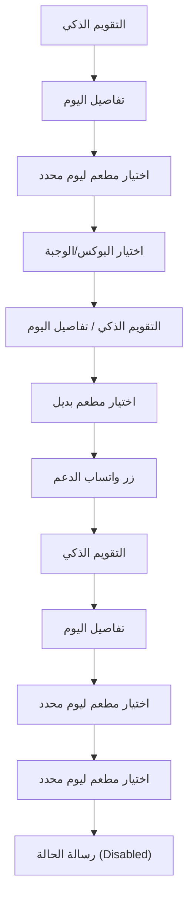

#### تفاصيل كل ميزة

#### **استخدام التقويم الذكي**

**الهدف:** التقويم الذكي هو قلب تطبيق العميل. يعرض أيام الاشتراك بحالات واضحة لكل يوم، ويتيح للعميل اختيار المطعم والبوكس لكل يوم **قبل 72 ساعة** من التوصيل، مع متابعة حالات القفل (🔒) وتأكيد المطعم (⏳) والتحضير (📦).

**Flowchart:**

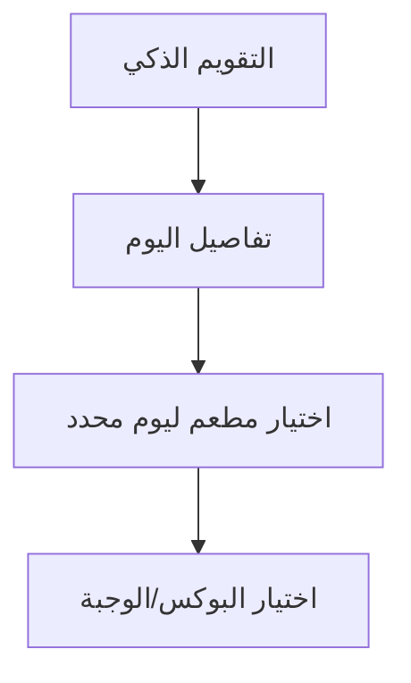

**شاشات — العنوان والمحتويات:**

#### **التقويم الذكي**

1. أيام ملوّنة
2. أيقونات حالة
3. عداد قبل 72 ساعة

#### **تفاصيل اليوم**

1. اسم اليوم والتاريخ
2. الحالة
3. المطعم/الوجبة المختارة
4. عداد التعديل
5. زر اختيار/تعديل

#### **اختيار مطعم ليوم محدد**

1. فلاتر
2. تقييم
3. صورة
4. حالة Busy
5. عدد مرات الاستخدام

#### **اختيار البوكس/الوجبة**

1. صورة
2. سعرات
3. بروتين
4. كارب
5. دهون
6. مكونات
7. حساسية
8. زر تأكيد

**خطوات Workflow:**

1. يفتح العميل تبويب **التقويم** ويرى شهر/أسبوع الاشتراك بأيام ملوّنة حسب حالتها
2. يضغط على **يوم** غير مختار لفتح تفاصيل اليوم
3. ينتقل إلى **اختيار مطعم** متاح لهذا اليوم (مع فلاتر وتقييمات وحالة Busy)
4. يختار **البوكس/الوجبة** ويستعرض الصورة والقيم الغذائية والمكونات وملاحظات الحساسية
5. يضغط **تأكيد** فيتحول اليوم إلى مكتمل الاختيار (أخضر ✅)
6. يتابع باقي الأيام؛ «تغيير البوكس» للأيام **خارج 72 ساعة**؛ داخل 72h: 🔒 مقفل — وقد تُفتح نافذة **24h** لاختيار مطعم بديل إن لم يؤكّد المطعم

#### **مهلة 72 ساعة للاختيار والتعديل**

**الهدف:** ضمان أن يختار العميل أو يعدّل بوكس أي يوم **قبل 72 ساعة على الأقل** من موعد التوصيل. بعد دخول النافذة لا يحق له تغيير الطلب من التطبيق، مع مسار تأكيد المطعم وبديل عند عدم التأكيد.

**Flowchart:**

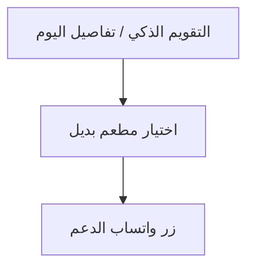

**شاشات — العنوان والمحتويات:**

#### **التقويم الذكي / تفاصيل اليوم**

1. عدّاد 72 ساعة
2. حالات 🔒 / ⏳ / 📦
3. أزرار تعديل مفعّلة أو مقفولة

#### **اختيار مطعم بديل**

1. تظهر عند فتح الأدمن نافذة البديل (24h فقط) بعد عدم تأكيد المطعم

#### **زر واتساب الدعم**

1. للحالات الاستثنائية ()

**خطوات Workflow:**

1. يرى العميل لكل يوم **عدّاد الوقت المتبقي** للتعديل قبل قفل الـ72 ساعة
2. طالما اليوم خارج النافذة: يمكنه الاختيار أو التغيير أو الإلغاء بحرية
3. عند اقتراب انتهاء المهلة يصله **تنبيه** بضرورة إكمال الاختيار
4. عند **−72h**: يُقفل التعديل (🔒) ويُرسَل الطلب للمطعم — ينتظر تأكيد المطعم خلال 24 ساعة (⏳)
5. إذا **لم يؤكّد** المطعم: يُبلَّغ الأدمن وقد تُفتح للعميل **24 ساعة** لاختيار مطعم بديل؛ ثم يُرسَل الطلب للمطعم الجديد في **24 الساعة المتبقية** قبل التوصيل
6. عند **−24h**: يتحول اليوم إلى **قيد التحضير** (📦) — تحضير نهائي وتوصيل قادم
7. إذا لم يكن العميل قد اختار قبل −72h، يتولى النظام **الاختيار التلقائي**
8. للحالات الطارئة فقط: واتساب الأدمن لطلب استثناء

**حالات واستثناءات:**

1. **Disabled Action:** محاولة تعديل داخل 72 ساعة → «الطلب مقفل — لا يمكن التغيير»
2. **عدم تأكيد المطعم:** إشعار + خيار مطعم بديل (24h) أو تدخل الأدمن
3. **انتهاء المهلة بلا اختيار:** اختيار تلقائي
4. **استثناء الأدمن:** التغيير داخل النافذة عبر الأدمن (واتساب) للطوارئ فقط

#### **الاختيار التلقائي عند عدم الاختيار**

**الهدف:** ضمان عدم بقاء العميل بلا وجبة في أي يوم لم يختره يدويًا **قبل مهلة 72 ساعة**، عبر اختيار النظام بوكسًا تلقائيًا يحترم الحساسية وعدم الإعجاب والتوزيع العادل وتنويع المطاعم.

**Flowchart:**

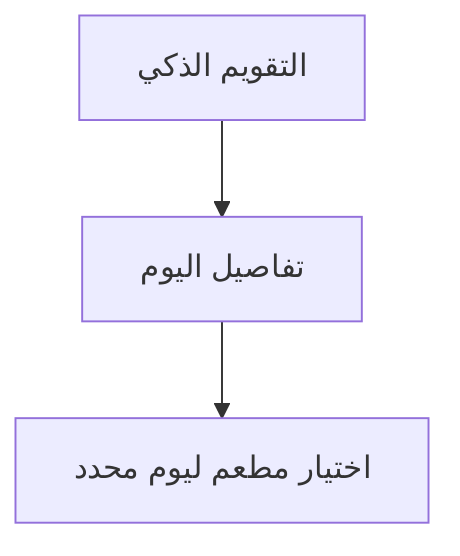

**شاشات — العنوان والمحتويات:**

#### **التقويم الذكي**

1. اليوم يتحول إلى مكتمل (أخضر) بعد الاختيار التلقائي

#### **تفاصيل اليوم**

1. يوضّح أن الاختيار تم تلقائيًا
2. مع المطعم والوجبة

#### **اختيار مطعم ليوم محدد**

1. المطاعم التي بلغت حدّها تظهر مقفولة (حتى للاختيار اليدوي قبل المهلة)

**خطوات Workflow:**

1. عند بلوغ **−72h** دون اختيار يدوي، يتدخل النظام تلقائيًا
2. يختار بوكسًا **عشوائيًا ضمن القيود**: استبعاد مكوّنات الحساسية وعدم الإعجاب
3. يلتزم بكوتا التوزيع العادل وتنويع المطاعم قدر الإمكان
4. عند عدم توفّر مطعم مطابق، يُفعّل **Fallback** يفتح المتاح لهذا اليوم فقط ويختار عشوائيًا
5. يظهر اليوم في تقويم العميل **مكتمل الاختيار** مع بيان المطعم/الوجبة المختارة آليًا
6. يصل العميل **إشعار** بما تم اختياره له

**حالات واستثناءات:**

1. **عدم اكتمال الحساسية:** الاختيار التلقائي قد لا يُفعّل بدقّة قبل استكمال البيانات؛ يُنبَّه العميل
2. **كل المطاعم Busy:** يُسمح بتجاوز الكوتا الذكي لضمان توفّر بديل
3. **Fallback:** عند غياب المطابق، يُفتح عدد الأيام المسموح لهذا الطلب فقط
4. **Offline:** الاختيار التلقائي يتم على الخادم بصرف النظر عن اتصال العميل

#### **التعامل مع حالة Busy للمطاعم**

**الهدف:** توضيح كيف يرى العميل المطاعم التي بلغت طاقتها الاستيعابية اليومية بحالة **Busy** ويُمنع اختيارها لذلك اليوم، مع ضمان توفّر بدائل أو مرونة الكوتا في الأيام المزدحمة.

**Flowchart:**

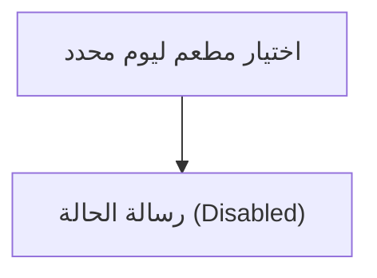

**شاشات — العنوان والمحتويات:**

#### **اختيار مطعم ليوم محدد**

1. بطاقات المطاعم مع وسم Busy
2. تقييم
3. صورة
4. عدد مرات الاستخدام

#### **رسالة الحالة (Disabled)**

1. توضيح أن المطعم Busy لهذا اليوم بدل منع صامت

**خطوات Workflow:**

1. عند فتح **اختيار مطعم ليوم محدد**، يرى العميل المطاعم المتاحة مع حالة كل مطعم
2. المطعم الذي بلغ حدّه اليومي يظهر بوسم **Busy** ولا يمكن اختياره لذلك اليوم
3. يختار العميل من المطاعم المتاحة الأخرى ضمن تصنيفه
4. في الأيام المزدحمة (أغلب المطاعم Busy)، قد يُتاح اختيار مطعم سبق أن بلغ حدّه لضمان بديل
5. يكمل اختيار البوكس ويؤكد كالمعتاد

**حالات واستثناءات:**

1. **Disabled:** مطعم Busy يظهر معطّلًا مع سبب واضح
2. **يوم مزدحم:** مرونة الكوتا تتيح مطعمًا بلغ حدّه عند انشغال الجميع
3. **منع اشتراك جديد:** إذا تجاوز عدد المشتركين الطاقة اليومية الكلية، قد يُمنع بدء اشتراكات جديدة (تشغيليًا)
4. **Loading/Error/Offline:** Skeleton لقائمة المطاعم، إعادة محاولة عند الفشل

---

### المرحلة 4: **التوصيل والتقييم** — 3 ميزة | 9 شاشات

**الميزات:** تتبع الطلب اللحظي · الاتصال بالمندوب عند 3 كم · تقييم الطلب بعد التسليم

#### ملخص المرحلة

1. متابعة الخريطة وحالة الطلب
2. زر اتصال عند 3 km — VoIP مقنّع
3. Hold إن لم يرد → محاولة ثانية
4. بعد التسليم: تقييم

#### Flowchart شامل للمرحلة

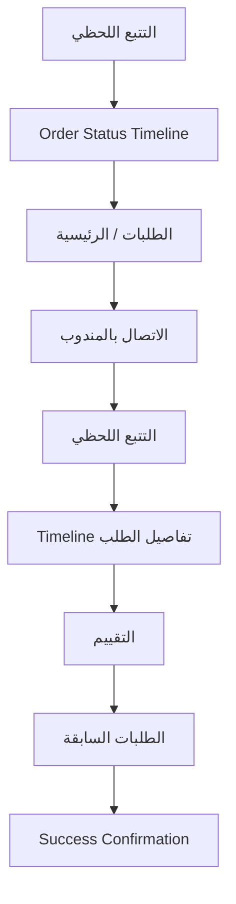

#### تفاصيل كل ميزة

#### **تتبع الطلب اللحظي**

**الهدف:** تمكين العميل من متابعة طلبه لحظيًا أثناء التوصيل عبر خريطة وحالة الطلب وبيانات محدودة عن المندوب، مع إظهار زر الاتصال عند اقتراب المندوب لمسافة 3 كم.

**Flowchart:**

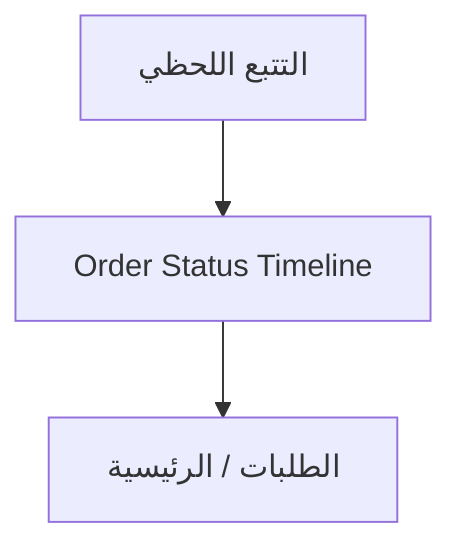

**شاشات — العنوان والمحتويات:**

#### **التتبع اللحظي**

1. خريطة
2. حالة الطلب
3. بيانات المندوب (محدودة)
4. زر اتصال عند 3 كم

#### **Order Status Timeline**

1. مراحل الطلب بتتابع بصري واضح

#### **الطلبات / الرئيسية**

1. بطاقة الطلب الحالي مع رابط للتتبع

**خطوات Workflow:**

1. عند بدء تجهيز الطلب يرى العميل حالته في تبويب **الطلبات** أو الرئيسية
2. يفتح **التتبع اللحظي** فيظهر مسار التوصيل على الخريطة وحالة الطلب
3. تتحدث الحالة تباعًا: «تم الاستلام وفي الطريق» بعد استلام المندوب من المطعم
4. يتابع تقدّم المندوب على الخريطة مع بيانات محدودة عنه (دون رقم مباشر)
5. عند وصول المندوب إلى **3 كم أو أقل** يظهر **زر الاتصال**
6. عند التسليم تتحول الحالة إلى «تم التسليم»، ويصبح التقييم متاحًا

**حالات واستثناءات:**

1. **قبل 3 كم:** زر الاتصال مخفي/Disabled مع رسالة «يتاح عند الاقتراب»
2. **Loading:** أثناء جلب موقع المندوب وحالة الطلب
3. **Offline:** Banner فقدان الاتصال وتعذّر تحديث الموقع لحظيًا
4. **Error:** فشل تحميل الخريطة → رسالة + إعادة محاولة
5. **Hold:** عند عدم رد العميل قد يتحول الطلب إلى Hold

#### **الاتصال بالمندوب عند 3 كم**

**الهدف:** تمكين العميل من التواصل مع المندوب بأمان داخل التطبيق عند اقترابه لمسافة 3 كم أو أقل، مع الحفاظ على الخصوصية (أرقام مقنّعة)، وفهم ما يحدث عند عدم الرد (Hold ومحاولة ثانية).

**Flowchart:**

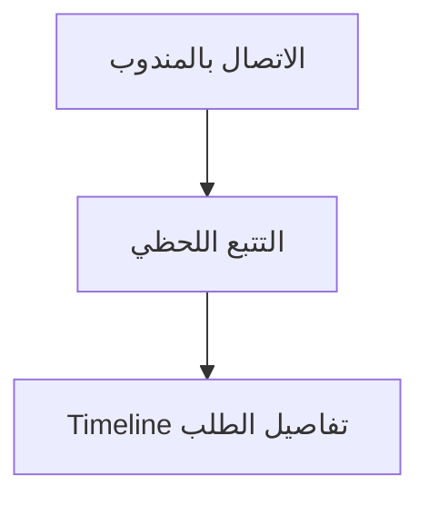

**شاشات — العنوان والمحتويات:**

#### **الاتصال بالمندوب**

1. زر اتصال
2. حالة الاتصال
3. تنبيه الخصوصية

#### **التتبع اللحظي**

1. ظهور/إخفاء زر الاتصال حسب المسافة

#### **Timeline تفاصيل الطلب**

1. تسجيل كل أحداث الاتصال وHold

**خطوات Workflow:**

1. قبل 3 كم: زر الاتصال مخفي/Disabled مع رسالة توضيحية
2. عند 3 كم أو أقل: يظهر **زر الاتصال** في شاشة التتبع مع تنبيه الخصوصية
3. يضغط العميل للاتصال بالمندوب **داخل التطبيق** (رقم مقنّع، رسائل مشفّرة)
4. إن لم يرد العميل على المندوب: يسجّل المندوب محاولة فاشلة ويتحول الطلب إلى **Hold**
5. يعود المندوب للمنطقة ويجري **محاولة ثانية**، ويصل العميل إشعار بذلك
6. عند فشل الثانية: يُظهر النظام رقم العميل للمندوب كاستثناء موثّق مع إشعار الأدمن

**حالات واستثناءات:**

1. **Disabled (قبل 3 كم):** رسالة «الاتصال يتاح عند الاقتراب من العميل»
2. **Hold:** عند عدم الرد يُعلّق الطلب مؤقتًا ويكمل المندوب توصيلاته
3. **محاولة ثانية:** إشعار جديد للعميل عند عودة المندوب
4. **إظهار الرقم:** حالة استثنائية بعد فشل محاولتين + إشعار الأدمن + تسجيل الحدث
5. **Offline/Permission:** توضيح سبب الصلاحية قبل نافذة النظام

#### **تقييم الطلب بعد التسليم**

**الهدف:** تمكين العميل من تقييم تجربته بعد التسليم بسرعة (أقل من 30 ثانية): جودة الوجبة وسرعة التوصيل والمطعم عمومًا، عبر نجوم وتعليق اختياري، بما يغذّي تحسين الخدمة ونظام النقاط.

**Flowchart:**

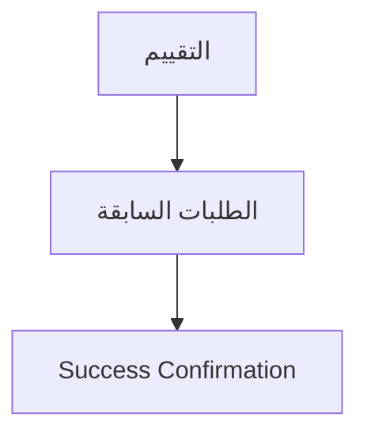

**شاشات — العنوان والمحتويات:**

#### **التقييم**

1. تقييم نجوم متعدد المحاور
2. حقل تعليق
3. زر إرسال

#### **الطلبات السابقة**

1. مدخل لتقييم أي طلب مُسلّم لم يُقيَّم بعد

#### **Success Confirmation**

1. رسالة نجاح قصيرة بعد الإرسال

**خطوات Workflow:**

1. بعد التسليم يصل العميل إشعار/دعوة للتقييم، أو يفتح الطلب من **الطلبات السابقة**
2. يفتح شاشة **التقييم** ويمنح نجومًا لـ: جودة الوجبة، سرعة التوصيل، المطعم عمومًا
3. يضيف **تعليقًا** اختياريًا قصيرًا
4. يرسل التقييم في خطوة سريعة (<30 ثانية)
5. تظهر رسالة نجاح، وقد يُمنح نقاط ولاء على التقييم

**حالات واستثناءات:**

1. **Empty:** لا توجد طلبات قابلة للتقييم → رسالة لطيفة
2. **تقييم سابق:** يظهر التقييم المسجّل دون تكرار الإرسال
3. **Error/Offline:** فشل الإرسال → حفظ مؤقت وإعادة محاولة
4. **سرعة:** التصميم يبقي التقييم سريعًا دون حقول إلزامية مطوّلة

---

### المرحلة 5: **ما بعد الخدمة** — 5 ميزة | 19 شاشات

**الميزات:** إلغاء الاشتراك وعرض الاسترداد · تجميد الاشتراك · تقديم شكوى واستخدام المحفظة · الولاء والمكافآت والنقاط · الإحالات والبرومو كود

#### ملخص المرحلة

1. شكوى + صور → تعويض
2. نقاط ولاء وإحالة
3. إلغاء: استرداد = (سعر÷أيام) × (متبقي−2)
4. تجميد → تجديد أو العودة للتقويم

#### Flowchart شامل للمرحلة

```mermaid
flowchart TD
 p5_f10_s1["شاشة المتطلبات / المدخلات"]
 p5_f10_s2["طلب إلغاء"]
 p5_f10_s3["رسوم الإلغاء F"]
 p5_f10_s4["إذا الأيام المتبقية = 0"]
 p5_f10_s5["يؤكد العميل بعد رؤية التفصيل"]
 p5_f10_s6["تُلغى الطلبات المتبقية"]
 p5_f10_s7["يُحوّل المسترجع خلال 3–5 أيام عمل أو يُضاف للمحفظة"]
 p5_f10_s1 --> p5_f10_s2
 p5_f10_s2 --> p5_f10_s3
 p5_f10_s3 --> p5_f10_s4
 p5_f10_s4 --> p5_f10_s5
 p5_f10_s5 --> p5_f10_s6
 p5_f10_s6 --> p5_f10_s7
 p5_f11_s1["الإلغاء والتجميد"]
 p5_f11_s2["التقويم الذكي"]
 p5_f11_s3["شاشة تأكيد"]
 p5_f11_s1 --> p5_f11_s2
 p5_f11_s2 --> p5_f11_s3
 p5_f10_s7 --> p5_f11_s1
 p5_f16_s1["الشكاوى"]
 p5_f16_s2["المحفظة/المدفوعات"]
 p5_f16_s3["التقويم/الاشتراك"]
 p5_f16_s1 --> p5_f16_s2
 p5_f16_s2 --> p5_f16_s3
 p5_f11_s3 --> p5_f16_s1
 p5_f17_s1["المكافآت والولاء"]
 p5_f17_s2["Reward Points Widget"]
 p5_f17_s3["Success Confirmation"]
 p5_f17_s1 --> p5_f17_s2
 p5_f17_s2 --> p5_f17_s3
 p5_f16_s3 --> p5_f17_s1
 p5_f18_s1["الإحالات والبرومو كود"]
 p5_f18_s2["Referral Share Card"]
 p5_f18_s3["الدفع وتأكيد الاشتراك"]
 p5_f18_s1 --> p5_f18_s2
 p5_f18_s2 --> p5_f18_s3
 p5_f17_s3 --> p5_f18_s1
```

#### تفاصيل كل ميزة

#### **إلغاء الاشتراك وعرض الاسترداد**

**الهدف:** تمكين العميل من إلغاء اشتراكه في أي وقت، مع رؤية **المبلغ المسترد** و**رسوم الإلغاء** محسوبين تلقائيًا قبل التأكيد.

**Flowchart:**

```mermaid
flowchart TD
 f10_s1["شاشة المتطلبات / المدخلات"]
 f10_s2["طلب إلغاء"]
 f10_s3["رسوم الإلغاء F"]
 f10_s4["إذا الأيام المتبقية = 0"]
 f10_s5["يؤكد العميل بعد رؤية التفصيل"]
 f10_s6["تُلغى الطلبات المتبقية"]
 f10_s7["يُحوّل المسترجع خلال 3–5 أيام عمل أو يُضاف للمحفظة"]
 f10_s1 --> f10_s2
 f10_s2 --> f10_s3
 f10_s3 --> f10_s4
 f10_s4 --> f10_s5
 f10_s5 --> f10_s6
 f10_s6 --> f10_s7
```

**شاشات — العنوان والمحتويات:**

#### **شاشة المتطلبات / المدخلات** _(مستنتجة)_

1. اشتراك مفعّل جارٍ.
2. عدد الأيام المُستخدمة (المُسلّمة) ومبلغ الاشتراك الكلي.

#### **طلب إلغاء** _(مستنتجة)_

1. من الإلغاء والتجميد يختار

#### **رسوم الإلغاء F** _(مستنتجة)_

1. الأيام المتبقية
2. المبلغ المستحق
3. والمسترجع النهائي

#### **إذا الأيام المتبقية = 0** _(مستنتجة)_

1. إذا الأيام المتبقية = 0 (بعد خصم 3 أيام تشغيلية) → لا إلغاء ولا استرداد

#### **يؤكد العميل بعد رؤية التفصيل** _(مستنتجة)_

1. يؤكد العميل بعد رؤية التفصيل

#### **تُلغى الطلبات المتبقية** _(مستنتجة)_

1. تُلغى الطلبات المتبقية (مع احترام أيام التشغيل المحجوزة)

#### **يُحوّل المسترجع خلال 3–5 أيام عمل أو يُضاف للمحفظة** _(مستنتجة)_

1. يُحوّل المسترجع خلال 3–5 أيام عمل أو يُضاف للمحفظة

**خطوات Workflow:**

1. من **الإلغاء والتجميد** يختار «طلب إلغاء»
2. يعرض النظام: الأيام المتبقية، المبلغ المستحق، **رسوم الإلغاء F**، والمسترجع النهائي
3. إذا الأيام المتبقية = 0 (بعد خصم 3 أيام تشغيلية) → لا إلغاء ولا استرداد
4. يؤكد العميل بعد رؤية التفصيل
5. تُلغى الطلبات المتبقية (مع احترام أيام التشغيل المحجوزة)
6. يُحوّل المسترجع خلال 3–5 أيام عمل أو يُضاف للمحفظة

#### **تجميد الاشتراك**

**الهدف:** تمكين العميل من تجميد اشتراكه لفترة محددة دون إلغائه، بحيث تتوقف الطلبات والخصومات مؤقتًا وتُضاف الأيام المجمّدة إلى نهاية الاشتراك، مع مراعاة أن طلبات اليومين القادمين محجوزة.

**Flowchart:**

```mermaid
flowchart TD
 f11_s1["الإلغاء والتجميد"]
 f11_s2["التقويم الذكي"]
 f11_s3["شاشة تأكيد"]
 f11_s1 --> f11_s2
 f11_s2 --> f11_s3
```

**شاشات — العنوان والمحتويات:**

#### **الإلغاء والتجميد**

1. زر «طلب تجميد»
2. اختيار المدة
3. ملخص الأثر

#### **التقويم الذكي**

1. الأيام المجمّدة بحالة زرقاء ❄ (القسم 4.7)

#### **شاشة تأكيد**

1. تواريخ بدء/انتهاء التجميد والأيام المضافة لنهاية الاشتراك

**خطوات Workflow:**

1. من شاشة **الإلغاء والتجميد** يختار العميل «طلب تجميد»
2. يحدد فترة التجميد (المدة الافتراضية أسبوع) ويرى أثرها قبل التأكيد
3. يوضّح النظام أن **التجميد يبدأ بعد يومين** من الطلب (لأن طلبات اليومين محجوزة)
4. يؤكد العميل التجميد
5. خلال التجميد: لا اختيار طلبات جديدة ولا خصم مبالغ، وتظهر الأيام **مجمّدة** (أزرق ❄) في التقويم
6. تُضاف الأيام المجمّدة إلى **نهاية الاشتراك** ويستأنف العميل بعد انتهاء الفترة

**حالات واستثناءات:**

1. **بدء مؤجّل:** التجميد يبدأ بعد يومين بسبب حجز طلبات اليومين القادمين
2. **خلال التجميد:** التقويم مقفول للاختيار الجديد، ولا خصومات
3. **إنهاء يدوي:** الأدمن قد ينهي التجميد يدويًا عند اللزوم
4. **Error/Offline:** تعذّر تنفيذ الطلب → رسالة + إعادة محاولة

#### **تقديم شكوى واستخدام المحفظة**

**الهدف:** تمكين العميل من تقديم شكوى على وجبة مع صور إلزامية، واختيار طريقة التعويض بعد قبول الأدمن (استرداد للمحفظة أو تمديد اشتراك)، وإدارة رصيد محفظته الرقمية لاحقًا.

**Flowchart:**

```mermaid
flowchart TD
 f16_s1["الشكاوى"]
 f16_s2["المحفظة/المدفوعات"]
 f16_s3["التقويم/الاشتراك"]
 f16_s1 --> f16_s2
 f16_s2 --> f16_s3
```

**شاشات — العنوان والمحتويات:**

#### **الشكاوى**

1. نوع المشكلة
2. صور (إلزامية)
3. وصف
4. اختيار طريقة التعويض إن قُبلت

#### **المحفظة/المدفوعات**

1. الرصيد
2. سجل الحركات
3. خيار التحويل البنكي

#### **التقويم/الاشتراك**

1. انعكاس «يوم إضافي» عند اختيار التمديد

**خطوات Workflow:**

1. من **الطلبات السابقة** أو تفاصيل الطلب يفتح العميل **شاشة الشكاوى**
2. يحدد نوع المشكلة، يكتب وصفًا، ويُرفق **صورًا (إلزامية)**
3. يرسل الشكوى فتظهر فورًا للأدمن وللمطعم المعني
4. بعد تأكيد الأدمن صحّة الشكوى، يصل العميل إشعار يخيّره بين: **استرداد مالي** (مبلغ البوكس للمحفظة) أو **تمديد اشتراك** (يوم إضافي)
5. يختار طريقة التعويض فيُنفَّذ فوريًا وآليًا
6. من **المحفظة** يستخدم الرصيد للتجديد/اشتراك جديد أو يطلب تحويله للبنك

**حالات واستثناءات:**

1. **بدون صور:** لا يمكن إرسال الشكوى (الصور إلزامية)
2. **قيد المراجعة:** الشكوى بانتظار تأكيد الأدمن قبل التعويض
3. **رفض الشكوى:** إشعار بالنتيجة دون تعويض
4. **Error/Offline:** فشل رفع الصور/الإرسال → إعادة محاولة

#### **الولاء والمكافآت والنقاط**

**الهدف:** تحفيز العميل عبر نقاط ولاء يكسبها من أنشطته (الاشتراك، التجديد، الطلب، التقييم، الإحالة) ويستبدلها بمكافآت، مع شاشة واضحة ماليًا تعرض الرصيد وطرق الكسب وسجل النقاط.

**Flowchart:**

```mermaid
flowchart TD
 f17_s1["المكافآت والولاء"]
 f17_s2["Reward Points Widget"]
 f17_s3["Success Confirmation"]
 f17_s1 --> f17_s2
 f17_s2 --> f17_s3
```

**شاشات — العنوان والمحتويات:**

#### **المكافآت والولاء**

1. رصيد النقاط
2. طرق الكسب
3. سجل النقاط
4. خيارات الاستبدال

#### **Reward Points Widget**

1. عرض النقاط وسجل مختصر (قد يظهر في الرئيسية)

#### **Success Confirmation**

1. تأكيد الاستبدال

**خطوات Workflow:**

1. يفتح العميل تبويب **المكافآت** فيرى **رصيد النقاط** بارزًا في الأعلى
2. يستعرض **طرق كسب النقاط**: الاشتراك، التجديد، الطلب، التقييم، الإحالة
3. يتصفّح **سجل النقاط**: المكتسبة، المستخدمة، المنتهية (إن وجدت)
4. يختار مكافأة/خيار **استبدال** متاحًا ويؤكد العملية
5. يُخصم المقابل من الرصيد ويُحدّث السجل فورًا مع رسالة نجاح

**حالات واستثناءات:**

1. **Empty:** لا نقاط بعد → رسالة محفّزة مع طرق الكسب
2. **رصيد غير كافٍ:** خيار الاستبدال يظهر معطّلًا مع توضيح المطلوب
3. **نقاط منتهية:** تظهر في السجل بوضوح
4. **Error/Offline:** فشل الاستبدال → رسالة + إعادة محاولة دون خصم مزدوج

#### **الإحالات والبرومو كود**

**الهدف:** تمكين العميل من دعوة أصدقائه عبر رابط إحالة خاص وكسب مكافآت، واستخدام برومو كود في شاشة الدفع للحصول على خصم، بما يدعم انتشار المنصة.

**Flowchart:**

```mermaid
flowchart TD
 f18_s1["الإحالات والبرومو كود"]
 f18_s2["Referral Share Card"]
 f18_s3["الدفع وتأكيد الاشتراك"]
 f18_s1 --> f18_s2
 f18_s2 --> f18_s3
```

**شاشات — العنوان والمحتويات:**

#### **الإحالات والبرومو كود**

1. رابط الإحالة
2. زر نسخ/مشاركة
3. عدد المدعوين
4. سجل المكافآت

#### **Referral Share Card**

1. رابط
2. كود
3. نسخ/مشاركة

#### **الدفع وتأكيد الاشتراك**

1. حقل إدخال برومو كود وأثره على السعر

**خطوات Workflow:**

1. يفتح العميل **شاشة الإحالات** ويرى رابطه الخاص وزر المشاركة
2. يشارك الرابط مع أصدقائه عبر قنوات التواصل
3. يتابع **عدد المدعوين** والمكافآت الناتجة في نفس الشاشة
4. عند الاشتراك يدخل **برومو كود** (إن وُجد) في شاشة الدفع
5. يُطبَّق الخصم على المبلغ ويظهر السعر بعد الخصم قبل التأكيد
6. تُحتسب مكافأة الإحالة عند استيفاء شرط الحملة

**حالات واستثناءات:**

1. **كود غير صالح/منتهٍ:** رسالة واضحة دون تطبيق الخصم
2. **Empty:** لا مدعوين بعد → رسالة محفّزة مع زر مشاركة
3. **Error/Offline:** فشل تطبيق الكود/تحميل البيانات → إعادة محاولة
4. **شرط الحملة:** المكافأة تُحتسب فقط عند تحقق شرط الحملة (مثل أول اشتراك للمدعو)

---

## 4. معادلات أساسية

- **متوسط القروب (غير تراكمي):** Basic من Basic فقط | Platinum من Platinum فقط (بدون Basic) | Elite من Elite فقط
- **متوسط البوكس** = متوسط القروب (لتصنيف الاشتراك) ÷ 26
- **commission** = max − ((max−min)/25)×(days−1) · إذا days≥26 → min
- **سعر العميل** = (متوسط البوكس × أيام) × (1 + commission/100)
- **كوتا** = ⌈أيام ÷ عدد المطاعم المتاحة للاختيار⌉
- **استرداد** = (سعر ÷ أيام) × (متبقي − 2)
- **صافي المطعم** = سعر البوكس − (سعر × % عمولة)

---

## 5. القواعد المشتركة

القواعد دي بتأثر على أكثر من دور، ومذكورة هنا مرّة واحدة كمرجع. كل ملف بيشير إليها.

### 4.1 نافذة الطلبات: 72 ساعة — تأكيد المطعم — إشعار التوصيل

#### 4.1.1 قفل تعديل العميل (72 ساعة)
- لازم العميل يختار أو يعدّل البوكس **قبل 72 ساعة على الأقل** من تاريخ التوصيل.
- **الجمود التشغيلي:** عند دخول نافذة 72 ساعة، **لا يحق للعميل تغيير الطلب** من التطبيق.
- **استثناء الأدمن:** الأدمن وحده يملك صلاحية التغيير في الحالات الطارئة عبر واتساب.

#### 4.1.2 تأكيد المطعم (24 ساعة من الاستلام)
- عند إرسال الطلب للمطعم (بعد قفل 72 ساعة): يجب على المطعم **تأكيد** الطلب خلال **24 ساعة**.
- إذا **لم يُؤكَّد** خلال 24 ساعة:
 1. يُرسَل **إشعار للأدمن** للتواصل مع المطعم **أو** فتح خيار للعميل لاختيار مطعم جديد.
 2. نافذة اختيار مطعم بديل للعميل = **24 ساعة فقط**.
 3. في **24 الساعة المتبقية** قبل التوصيل: يُرسَل الطلب للمطعم الجديد (إن تغيّر).

**الجدول الزمني (من موعد التوصيل):**

| المرحلة | التوقيت | ماذا يحدث |
|---------|---------|-----------|
| اختيار حر | قبل −72h | العميل يختار/يعدّل بحرية |
| قفل + إرسال | −72h | قفل تعديل العميل → إرسال للمطعم |
| تأكيد المطعم | −72h → −48h | المطعم يؤكّد خلال 24 ساعة |
| بديل (إن لزم) | −48h → −24h | أدمن + عميل يختار مطعمًا جديدًا (24h) |
| تحضير نهائي | −24h | إشعار التوصيل القادم + فواتير/ملصقات + تحضير |

#### 4.1.3 إشعار التوصيل القادم (24 ساعة)
- **قبل التوصيل بـ 24 ساعة:** يُشعَر المطعم بكل الطلبات المقرّر **توصيلها خلال الـ24 ساعة القادمة**.
- يبدأ المطعم التحضير النهائي وتُولَّد الفواتير والباركود والملصقات ().

### 4.2 تصنيف مطاعم التلقائي (Categorization) — **ديناميكي بدون تدخل بشري**

> **المرجع الكامل:** [`00_restaurant_classification_algorithm.md`](00_restaurant_classification_algorithm.md) | **Excel:** [`MealMate_restaurant_classification.xlsx`](MealMate_restaurant_classification.xlsx)

- كل مطعم يُصنَّف **تلقائيًا** إلى Basic / Platinum / Elite حسب سعر بوكسه اليومي ضمن **نفس البرنامج والباقة**.
- **سعر البوكس اليومي** = سعر اشتراك 26 يوم ÷ 26.

#### 4.2.1 خوارزمية تصنيف (μ و σ)

| الخطوة | المعادلة |
|--------|----------|
| المتوسط **μ** | `AVERAGE` لأسعار البوكس اليومي لكل مطاعم (≥1) |
| الانحراف **σ** | `STDEV.P` (≥2 مطاعم) |
| **≥2 مطاعم** | Basic إذا ≤ μ−0.5σ · Elite إذا ≥ μ+0.5σ · وإلا Platinum |
| **مطعم واحد** | Basic < **4.5** · Platinum 4.5–6 · Elite ≥ **6** (د.ك/يوم — قابل للضبط) |

- عند إضافة/تعديل أي سعر → **إعادة تصنيف فورية** لكل مطاعم في نفس البرنامج/الباقة.

#### 4.2.2 وصول العميل للمطاعم (هرمي — للتقويم والاختيار)
- **Basic:** يرى ويختار من مطاعم **Basic** فقط.
- **Platinum:** يرى مطاعم **Basic + Platinum** (تغطية أوسع).
- **Elite:** يرى **جميع** المطاعم (Basic + Platinum + Elite).

> ⚠️ **الهرمية أعلاه للوصول والاختيار فقط** — لا تُستخدم في حساب متوسط السعر (انظر 4.3).

### 4.3 معادلات التسعير والاشتراك

#### 4.3.1 متوسط القروب (Group Average) — **لكل تصنيف على حدة**
**لا يُحسب متوسط جميع المطاعم المتاحة في التصنيف.** 
يُحسب المتوسط بناءً على المطاعم التي تمثل **المستوى الفعلي** للتصنيف فقط (نفس البرنامج والباقة):

| تصنيف اشتراك العميل | متوسط القروب (26 يوم) |
|---------------------|------------------------|
| **Basic** | متوسط أسعار مطاعم **Basic** فقط |
| **Platinum** | متوسط أسعار مطاعم **Platinum** فقط — **لا تُدخل Basic** |
| **Elite** | متوسط أسعار مطاعم **Elite** فقط |

#### 4.3.2 عمولة MealMate (استيفاء خطي — ديناميكي)

> **المرجع:** [`00_commission_interpolation_algorithm.md`](00_commission_interpolation_algorithm.md) | **Excel:** [`MealMate_commission_interpolation.xlsx`](MealMate_commission_interpolation.xlsx)

**التدخل الوحيد للأدmin:** ضبط **max_commission** (عند يوم 1) و **min_commission** (عند 26 يومًا).

```
إذا days ≥ 26 → commission = min_commission
وإلا → commission = max_commission − ((max−min)/(26−1)) × (days−1)
```

| أيام (مثال 30%→15%) | العمولة |
|---------------------|---------|
| 1 | 30.00% |
| 6 | 27.00% |
| 12 | 23.40% |
| 26 | 15.00% |

#### 4.3.3 سعر اشتراك العميل

> **المرجع الكامل:** [`00_accounting_requirements.md`](00_accounting_requirements.md) §4

- **متوسط التكلفة اليومية** = متوسط سعر القروب (للتصنيف المختار) ÷ 26.
- **سعر اليوم** = متوسط التكلفة × (1 + R).
- **السعر الأساسي** = `round_up`(سعر اليوم × المدة) — تقريب لأعلى لأقرب عدد صحيح.
- **بعد خصم المشترك** (إن وُجد كود): السعر_الأساسي × (1 − d) حيث d = **10%** افتراضياً.
- **عمولة المطاعم الثابتة (داخلي):** 10% من تكلفة الوجبات → تكلفة صافية = السعر_اليومي × 0.9.

#### 4.3.4 تغيير أسعار الاشتراكات
- أي تعديل لأسعار الاشتراك أو نسب العمولة يُطبَّق **فورًا على الاشتراكات الجديدة** فقط.
- **الاشتراكات النشطة الحالية لا تتأثر** بأثر رجعي عند تغيير الأسعار.
- **الفاتورة الشهرية** للعميل توضّح:
 - الأسعار المعدّلة (إن وُجدت) للفترة أو للاشتراك الجديد.
 - **تاريخ اشتراك العميل** الأصلي لتفادي أي لبس.

### 4.4 منطق التنويع (اللمت — Fair Distribution & Quota)

> **المرجع:** [`00_accounting_requirements.md`](00_accounting_requirements.md) §5

**N** = عدد المطاعم المتاحة للاختيار (تراكمي حسب التصنيف: Basic فقط · Basic+Platinum · الكل لـ Elite).

```
Limit = max( round_up(N ÷ المدة), 2 )
```

- لا يمكن اختيار نفس المطعم بعد بلوغ **Limit** طالما توجد بدائل.
- **الحد الأدنى = 2** حتى في الاشتراكات الطويلة.
- **تجاوز الكوتا الذكي:** عند Busy لكل المطاعم أو بعد شكوى محقّقة.

### 4.5 الطاقة الاستيعابية (Capacity / Busy)
- كل مطعم يحدد حد البوكسات اليومي الأقصى. عند الوصول له يظهر **Busy** ويُمنع اختياره لذلك اليوم.

### 4.6 الاختيار التلقائي (Auto-Selection)
- لو العميل ماختارش يدويًا قبل 72 ساعة، النظام يختار له بوكس تلقائيًا مع احترام: الحساسية، عدم الإعجاب، الكوتا، والتوزيع العادل، مع Fallback لو مفيش مطعم مطابق.

### 4.8 الإلغاء والاسترداد (مع رسوم تصاعدية)

> **المرجع:** [`00_accounting_requirements.md`](00_accounting_requirements.md) §6

```
الأيام_المتبقية = max(إجمالي − مستخدم − 3, 0)
المبلغ_المستحق = (المدفوع ÷ إجمالي) × الأيام_المتبقية
F = 10% إذا متبقي ≥ 23 · وإلا تصاعدي من 3% إلى 10%
المسترجع = المستحق − (المستحق × F)
```

### 4.9 الإنذار المبكر للربحية (داخلي — الأدمن)

> **المرجع:** [`00_accounting_requirements.md`](00_accounting_requirements.md) §7 · 

- يختبر أسوأ سيناريو (أعلى تكلفة + أقل مدة) لكل برنامج/باقة.
- **تحذير** إذا صافي الربح < 10% من التكلفة الصافية.

### 4.10 حالات اليوم في التقويم
| الحالة | اللون | الرمز | الوصف |
|--------|-------|-------|-------|
| مكتمل الاختيار | أخضر | ✅ | تم اختيار البوكس والمطعم |
| لم يتم الاختيار | رمادي/أحمر | ⚠ | لم يُختر بعد |
| مقفل (72h) | برتقالي | 🔒 | داخل 72 ساعة — لا تعديل من العميل |
| بانتظار تأكيد | أصفر | ⏳ | المطعم لم يؤكّد بعد (خلال 24h من الاستلام) |
| قيد التحضير | برتقالي | 📦 | أقل من 24 ساعة — تحضير نهائي + توصيل قادم |
| مجمّد | أزرق | ❄ | ضمن فترة التجميد |
| تم التسليم | أخضر | ✔ | يمكن التقييم |

### 4.11 الخصوصية والاتصال الآمن (3 كم)
- زر الاتصال يظهر فقط عند وصول المندوب إلى **3 كم أو أقل**.
- الاتصال داخل التطبيق فقط، بأرقام مقنّعة ورسائل مشفّرة.
- إظهار رقم العميل الحقيقي = **حالة استثنائية** بعد فشل محاولتين + تحويل Hold + إشعار الأدمن.

> **إحصائيات:** 18 ميزة | 62 شاشات

> `python workflows/_build_lifecycle_flowcharts.py`
