# المندوب — Flowcharts (Mermaid MD)

> **الدور:** المندوب | **المنصة:** Flutter — تطبيق توصيل

> ملف Markdown فيه **Mermaid flowcharts** — يفتح في GitHub / Cursor / VS Code Preview.

---

## الفلو الكامل للميزات

```mermaid
flowchart LR
  f01_feat["F01 تسجيل المندوب والدخول والتفعيل"]
  f12_feat["F12 مسح الباركود عند الاستلام والتسليم"]
  f13_feat["F13 استلام وتوصيل الطلب والتتبع اللحظي"]
  f14_feat["F14 الاتصال عند 3 كم وحالة Hold والمحاولة ال"]
  f15_feat["F15 تقييم الطلب ورؤية تقييم المندوب"]
  f21_feat["F21 استقبال الطلبات حسب النطاق الجغرافي"]
  f23_feat["F23 بيانات المندوب والوثائق والتحقق"]
  f27_feat["F27 إحصائيات وأداء المندوب"]
  f29_feat["F29 لغة تطبيق المندوب"]
  f31_feat["F31 خصوصية بيانات العميل تجاه المندوب"]
  f01_feat --> f12_feat
  f12_feat --> f13_feat
  f13_feat --> f14_feat
  f14_feat --> f15_feat
  f15_feat --> f21_feat
  f21_feat --> f23_feat
  f23_feat --> f27_feat
  f27_feat --> f29_feat
  f29_feat --> f31_feat
```

---

## فهرس

- [F01 — تسجيل المندوب والدخول والتفعيل](#f01---) (4 شاشة)
- [F12 — مسح الباركود عند الاستلام والتسليم](#f12---) (4 شاشة)
- [F13 — استلام وتوصيل الطلب والتتبع اللحظي](#f13---) (4 شاشة)
- [F14 — الاتصال عند 3 كم وحالة Hold والمحاولة الثانية](#f14---3-hold-) (5 شاشة)
- [F15 — تقييم الطلب ورؤية تقييم المندوب](#f15---) (3 شاشة)
- [F21 — استقبال الطلبات حسب النطاق الجغرافي](#f21---) (3 شاشة)
- [F23 — بيانات المندوب والوثائق والتحقق](#f23---) (3 شاشة)
- [F27 — إحصائيات وأداء المندوب](#f27---) (3 شاشة)
- [F29 — لغة تطبيق المندوب](#f29---) (3 شاشة)
- [F31 — خصوصية بيانات العميل تجاه المندوب](#f31---) (3 شاشة)

---

# الميزات (10 | 35 شاشات)

## F01 — تسجيل المندوب والدخول والتفعيل

**الهدف:** تمكين المندوب من إنشاء حسابه وتسجيل الدخول إلى تطبيق التوصيل (Flutter منفصل تمامًا عن تطبيقي العميل والمطعم)، مع توضيح أن الحساب لا يعمل ولا يستقبل أي طلب إلا بعد مراجعة الأدمن لبياناته ووثائقه واعتمادها. الهدف تجربة دخول سريعة وآمنة تناسب الاستخدام أثناء التنقّل.

### Flowchart

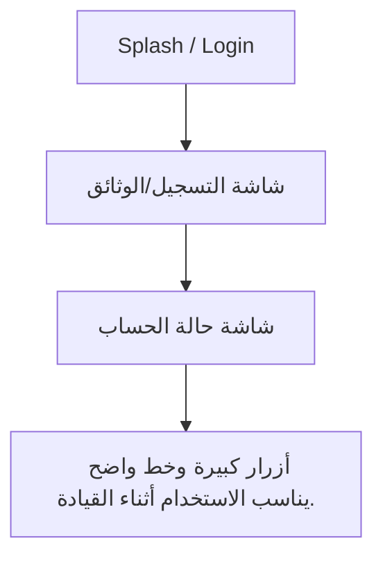

### شاشات — العنوان والمحتويات

#### **Splash / Login**

1. لوجو MealMate
2. حقول الدخول
3. رابط «نسيت كلمة المرور»
4. تصميم سريع وواضح

#### **شاشة التسجيل/الوثائق**

1. حقول البيانات
2. رفع الرخصة وبيانات السيارة

#### **شاشة حالة الحساب**

1. شارة «قيد المراجعة» / «مفعّل» / «مرفوض مع السبب»

#### **أزرار كبيرة وخط واضح يناسب الاستخدام أثناء القيادة.**

_لا توجد عناصر._

---

## F12 — مسح الباركود عند الاستلام والتسليم

**الهدف:** تسهيل استلام المندوب للبوكسات من المطعم وتسليمها للعميل عبر مسح باركود/QR المرتبط بكل طلب، لضمان مطابقة الطلب الصحيح وتقليل الأخطاء وتوثيق لحظتي الاستلام والتسليم.

### Flowchart

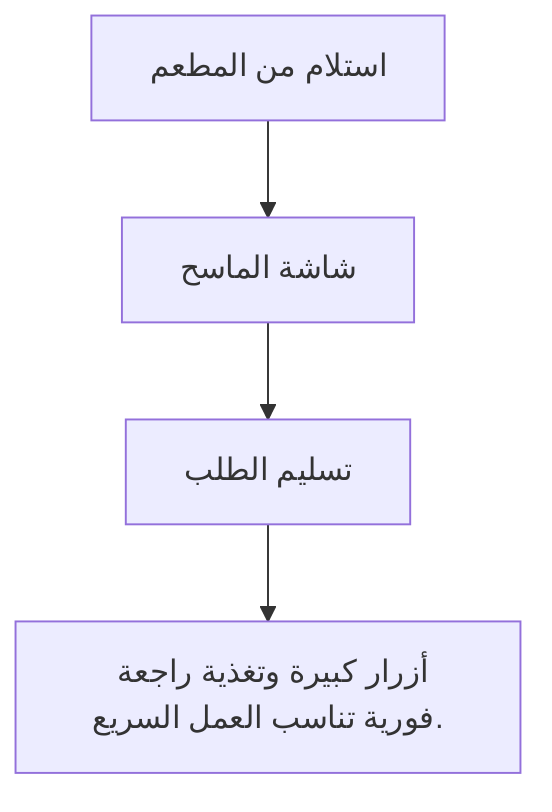

### شاشات — العنوان والمحتويات

#### **استلام من المطعم**

1. زر «تم الاستلام»
2. ماسح Barcode/QR
3. حقل ملاحظات

#### **شاشة الماسح**

1. إطار مسح واضح
2. تأكيد بصري عند النجاح (✓) أو خطأ عند عدم التطابق

#### **تسليم الطلب**

1. زر «تم التسليم»
2. إثبات تسليم اختياري
3. ملاحظات

#### **أزرار كبيرة وتغذية راجعة فورية تناسب العمل السريع.**

_لا توجد عناصر._

---

## F13 — استلام وتوصيل الطلب والتتبع اللحظي

**الهدف:** إدارة دورة التوصيل كاملة من منظور المندوب: استلام البوكس من المطعم، تحديث حالات الطلب لحظيًا، والوصول للعميل عبر خريطة واتجاهات و ETA واضحة، بحيث تنعكس الحالة فورًا لدى العميل والمطعم والأدمن.

### Flowchart

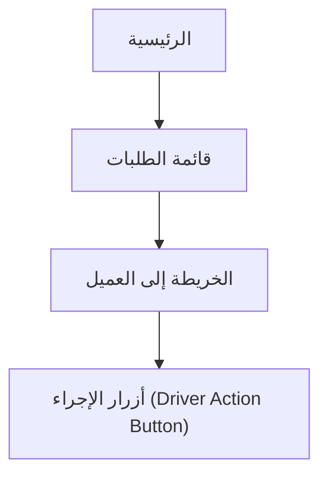

### شاشات — العنوان والمحتويات

#### **الرئيسية**

1. زر Online/Offline
2. ملخص طلبات اليوم
3. الطلب الحالي

#### **قائمة الطلبات**

1. رقم الطلب
2. المطعم
3. منطقة العميل
4. وقت التسليم
5. الحالة
6. مع تمييز الطلب العاجل/المتأخر

#### **الخريطة إلى العميل**

1. خريطة
2. اتجاهات
3. ETA
4. زر اتصال عند 3 كم (أهم شاشة للمندوب)

#### **أزرار الإجراء (Driver Action Button)**

1. تم الاستلام
2. في الطريق
3. Hold
4. تم التسليم — أزرار كبيرة سهلة أثناء القيادة

---

## F14 — الاتصال عند 3 كم وحالة Hold والمحاولة الثانية

**الهدف:** تنظيم تواصل المندوب مع العميل بأمان عند الاقتراب من موقع التسليم، ومعالجة حالة عدم الرد عبر تحويل الطلب إلى Hold ثم محاولة ثانية، وصولًا لإظهار رقم العميل كاستثناء موثّق فقط عند الضرورة القصوى.

### Flowchart

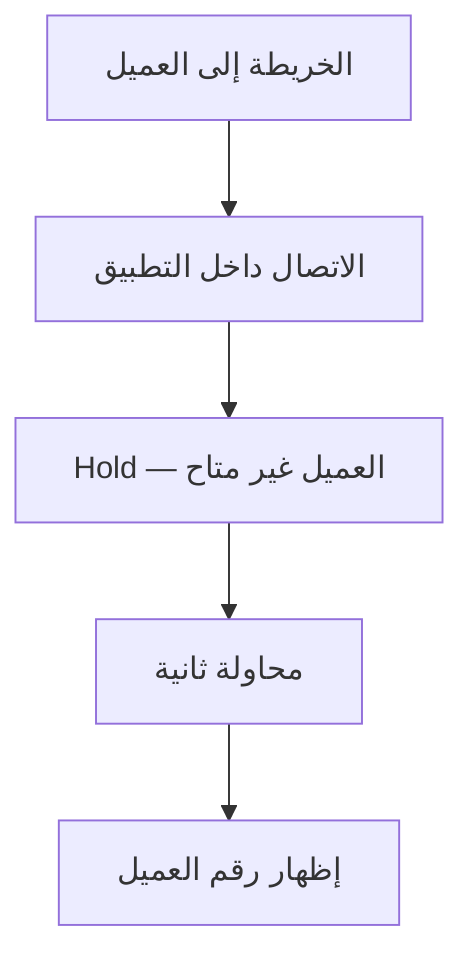

### شاشات — العنوان والمحتويات

#### **الخريطة إلى العميل**

1. زر الاتصال يظهر فقط عند 3 كم
2. تنبيه خصوصية

#### **الاتصال داخل التطبيق**

1. زر اتصال
2. حالة الاتصال
3. سجل المحاولة

#### **Hold — العميل غير متاح**

1. سبب التعليق
2. ملاحظات
3. زر تأكيد Hold

#### **محاولة ثانية**

1. زر اتصال
2. إشعار جديد
3. خيار إظهار الرقم بعد الفشل

#### **إظهار رقم العميل**

1. تحذير واضح
2. سبب الإظهار
3. الرقم
4. تسجيل الحدث

---

## F15 — تقييم الطلب ورؤية تقييم المندوب

**الهدف:** تمكين المندوب من الاطلاع على تقييمه الشخصي الناتج عن تقييمات العملاء لسرعة التوصيل بعد كل طلب، لمساعدته على تحسين أدائه. المندوب لا يُقيّم العميل، بل يرى نتيجة تقييمه فقط.

### Flowchart

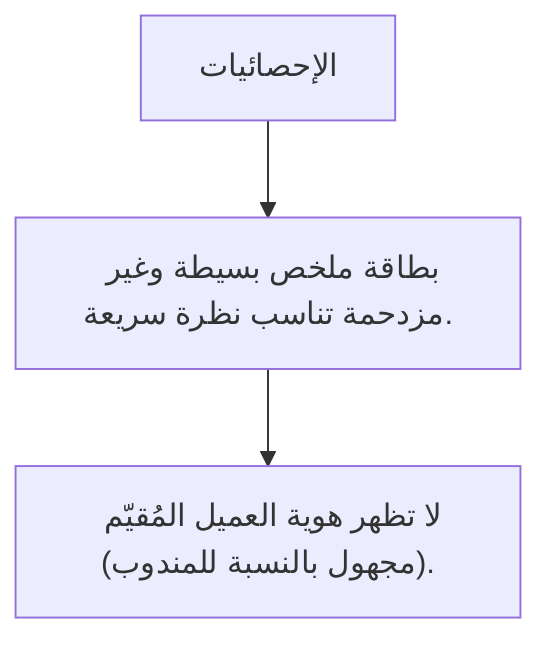

### شاشات — العنوان والمحتويات

#### **الإحصائيات**

1. متوسط التقييم (نجوم) بشكل بارز
2. عدد الطلبات المقيّمة
3. اتجاه الأداء

#### **بطاقة ملخص بسيطة وغير مزدحمة تناسب نظرة سريعة.**

_لا توجد عناصر._

#### **لا تظهر هوية العميل المُقيّم (مجهول بالنسبة للمندوب).**

_لا توجد عناصر._

---

## F21 — استقبال الطلبات حسب النطاق الجغرافي

**الهدف:** ضمان ألا يستقبل المندوب إلا الطلبات الواقعة داخل نطاقه الجغرافي (دولته/مناطق عمله)، مع عرض خرائط محلية مناسبة، لتقليل المسافات وضمان عزل بيانات كل دولة ضمن نظام Multi-Tenancy.

### Flowchart

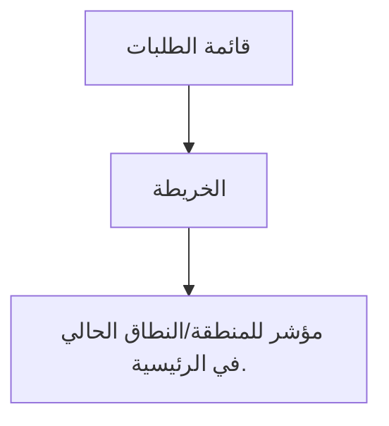

### شاشات — العنوان والمحتويات

#### **قائمة الطلبات**

1. مفلترة حسب النطاق الجغرافي تلقائيًا

#### **الخريطة**

1. خرائط محلية ضمن حدود منطقة العمل

#### **مؤشر للمنطقة/النطاق الحالي في الرئيسية.**

_لا توجد عناصر._

---

## F23 — بيانات المندوب والوثائق والتحقق

**الهدف:** تمكين المندوب من إدخال بياناته الشخصية وبيانات سيارته ورفع وثائقه (الرخصة وأوراق السيارة)، ومتابعة حالة التحقق حتى اعتماد الأدمن، مع تنبيهات استباقية قبل انتهاء صلاحية الوثائق.

### Flowchart

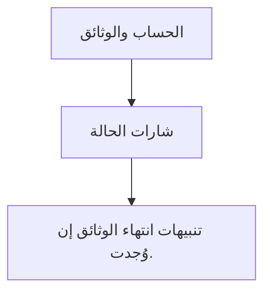

### شاشات — العنوان والمحتويات

#### **الحساب والوثائق**

1. الاسم
2. الهاتف
3. بيانات السيارة
4. الرخصة
5. حالة كل وثيقة

#### **شارات الحالة**

1. «قيد التحقق» / «مفعّل» / «مطلوب تحديث»

#### **تنبيهات انتهاء الوثائق إن وُجدت.**

_لا توجد عناصر._

---

## F27 — إحصائيات وأداء المندوب

**الهدف:** عرض لوحة إحصائيات شخصية بسيطة للمندوب تلخّص أداءه: عدد الطلبات المكتملة، متوسط التقييم، متوسط وقت التوصيل، وعدد الشكاوى، لمساعدته على متابعة أدائه دون تعقيد.

### Flowchart

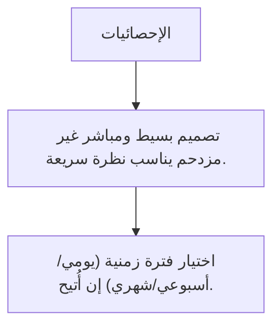

### شاشات — العنوان والمحتويات

#### **الإحصائيات**

1. بطاقات مؤشرات (طلبات مكتملة
2. تقييم
3. وقت متوسط
4. شكاوى)

#### **تصميم بسيط ومباشر غير مزدحم يناسب نظرة سريعة.**

_لا توجد عناصر._

#### **اختيار فترة زمنية (يومي/أسبوعي/شهري) إن أُتيح.**

_لا توجد عناصر._

---

## F29 — لغة تطبيق المندوب

**الهدف:** تمكين المندوب من استخدام التطبيق بالعربية (RTL) أو الإنجليزية (LTR) عبر زر تبديل واضح، مع وصول الإشعارات والرسائل بلغته المختارة، لضمان وضوح الواجهة أثناء العمل السريع.

### Flowchart

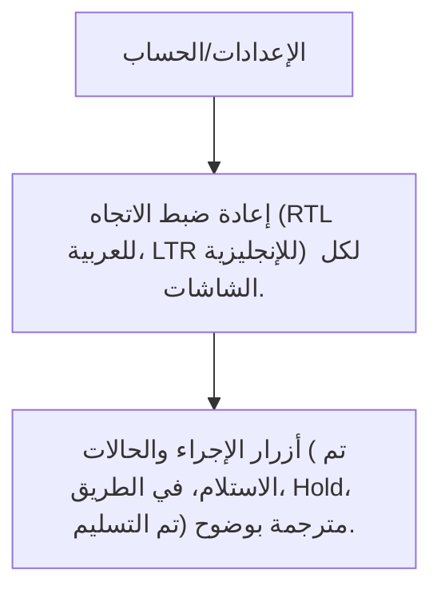

### شاشات — العنوان والمحتويات

#### **الإعدادات/الحساب**

1. زر تبديل اللغة واضح

#### **إعادة ضبط الاتجاه (RTL للعربية، LTR للإنجليزية) لكل الشاشات.**

_لا توجد عناصر._

#### **أزرار الإجراء والحالات (تم الاستلام، في الطريق، Hold، تم التسليم) مترجمة بوضوح.**

_لا توجد عناصر._

---

## F31 — خصوصية بيانات العميل تجاه المندوب

**الهدف:** ضمان أعلى مستوى من الخصوصية في تطبيق المندوب المنفصل تمامًا، بحيث لا يرى المندوب سوى الموقع الجغرافي اللازم للتوصيل، دون اسم العميل أو رقمه، إلا في حالة استثنائية موثّقة.

### Flowchart

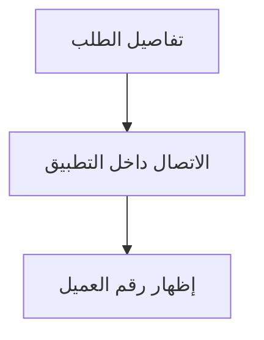

### شاشات — العنوان والمحتويات

#### **تفاصيل الطلب**

1. بيانات العميل مخفية
2. يظهر الموقع/المنطقة فقط

#### **الاتصال داخل التطبيق**

1. تنبيه خصوصية
2. رقم مقنّع

#### **إظهار رقم العميل**

1. تحذير واضح
2. سبب
3. تسجيل الحدث

---

