# المندوب — Lifecycle Flowcharts (تفصيلي)

> **الدور:** المندوب | **المنصة:** Flutter — تطبيق توصيل

> **ملف مستقل كامل** — دورة حياة + flowcharts + شاشات/لوحات + خطوات workflow + قواعد.

> افتح **Preview** (`Ctrl+Shift+V`) لرؤية Mermaid.

---

## 1. دورة الحياة الكاملة

### 1.1 خريطة الميزات (Flowchart)

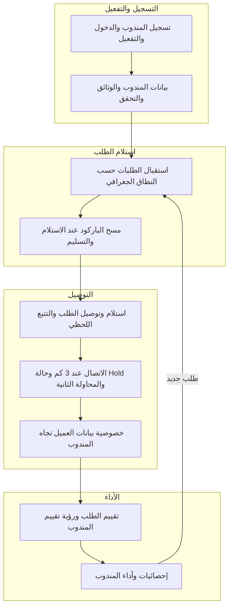

### 1.2 مسار الشاشات/اللوحات الكامل (Flowchart)

```mermaid
flowchart TD
 p1_f01_s1["Splash / Login"]
 p1_f01_s2["شاشة التسجيل/الوثائق"]
 p1_f01_s3["شاشة حالة الحساب"]
 p1_f01_s4["أزرار كبيرة وخط واضح يناسب الاستخدام أثناء القيادة"]
 p1_f01_s1 --> p1_f01_s2
 p1_f01_s2 --> p1_f01_s3
 p1_f01_s3 --> p1_f01_s4
 p1_f23_s1["الحساب والوثائق"]
 p1_f23_s2["شارات الحالة"]
 p1_f23_s3["تنبيهات انتهاء الوثائق إن وُجدت."]
 p1_f23_s1 --> p1_f23_s2
 p1_f23_s2 --> p1_f23_s3
 p1_f01_s4 --> p1_f23_s1
 p2_f21_s1["قائمة الطلبات"]
 p2_f21_s2["الخريطة"]
 p2_f21_s3["مؤشر للمنطقة/النطاق الحالي في الرئيسية."]
 p2_f21_s1 --> p2_f21_s2
 p2_f21_s2 --> p2_f21_s3
 p1_f23_s3 --> p2_f21_s1
 p2_f12_s1["استلام من المطعم"]
 p2_f12_s2["شاشة الماسح"]
 p2_f12_s3["تسليم الطلب"]
 p2_f12_s4["أزرار كبيرة وتغذية راجعة فورية تناسب العمل السريع."]
 p2_f12_s1 --> p2_f12_s2
 p2_f12_s2 --> p2_f12_s3
 p2_f12_s3 --> p2_f12_s4
 p2_f21_s3 --> p2_f12_s1
 p3_f13_s1["الرئيسية"]
 p3_f13_s2["قائمة الطلبات"]
 p3_f13_s3["الخريطة إلى العميل"]
 p3_f13_s4["أزرار الإجراء (Driver Action Button)"]
 p3_f13_s1 --> p3_f13_s2
 p3_f13_s2 --> p3_f13_s3
 p3_f13_s3 --> p3_f13_s4
 p2_f12_s4 --> p3_f13_s1
 p3_f14_s1["الخريطة إلى العميل"]
 p3_f14_s2["الاتصال داخل التطبيق"]
 p3_f14_s3["Hold — العميل غير متاح"]
 p3_f14_s4["محاولة ثانية"]
 p3_f14_s5["إظهار رقم العميل"]
 p3_f14_s1 --> p3_f14_s2
 p3_f14_s2 --> p3_f14_s3
 p3_f14_s3 --> p3_f14_s4
 p3_f14_s4 --> p3_f14_s5
 p3_f13_s4 --> p3_f14_s1
 p3_f31_s1["تفاصيل الطلب"]
 p3_f31_s2["الاتصال داخل التطبيق"]
 p3_f31_s3["إظهار رقم العميل"]
 p3_f31_s1 --> p3_f31_s2
 p3_f31_s2 --> p3_f31_s3
 p3_f14_s5 --> p3_f31_s1
 p4_f15_s1["الإحصائيات"]
 p4_f15_s2["بطاقة ملخص بسيطة وغير مزدحمة تناسب نظرة سريعة."]
 p4_f15_s3["لا تظهر هوية العميل المُقيّم (مجهول بالنسبة للمندو"]
 p4_f15_s1 --> p4_f15_s2
 p4_f15_s2 --> p4_f15_s3
 p3_f31_s3 --> p4_f15_s1
 p4_f27_s1["الإحصائيات"]
 p4_f27_s2["تصميم بسيط ومباشر غير مزدحم يناسب نظرة سريعة."]
 p4_f27_s3["اختيار فترة زمنية (يومي/أسبوعي/شهري) إن أُتيح."]
 p4_f27_s1 --> p4_f27_s2
 p4_f27_s2 --> p4_f27_s3
 p4_f15_s3 --> p4_f27_s1
```

### تفاصيل دورة الحياة (نص)

#### المرحلة 1: **التسجيل والتفعيل**

**الميزات:** تسجيل المندوب والدخول والتفعيل · بيانات المندوب والوثائق والتحقق

**عدد شاشات:** 7

**الخطوات الرئيسية:**

1. تسجيل + وثائق ورخصة
2. اعتماد الأدمن → Online

**شاشات في هذه المرحلة:**

- **تسجيل المندوب والدخول والتفعيل:** Splash / Login → شاشة التسجيل/الوثائق → شاشة حالة الحساب → أزرار كبيرة وخط واضح يناسب الاستخدام أثناء القيادة.
- **بيانات المندوب والوثائق والتحقق:** الحساب والوثائق → شارات الحالة → تنبيهات انتهاء الوثائق إن وُجدت.

#### المرحلة 2: **استلام الطلب**

**الميزات:** استقبال الطلبات حسب النطاق الجغرافي · مسح الباركود عند الاستلام والتسليم

**عدد شاشات:** 7

**الخطوات الرئيسية:**

3. طلبات في نطاق التغطية
4. استلام من المطعم + مسح باركود

**شاشات في هذه المرحلة:**

- **استقبال الطلبات حسب النطاق الجغرافي:** قائمة الطلبات → الخريطة → مؤشر للمنطقة/النطاق الحالي في الرئيسية.
- **مسح الباركود عند الاستلام والتسليم:** استلام من المطعم → شاشة الماسح → تسليم الطلب → أزرار كبيرة وتغذية راجعة فورية تناسب العمل السريع.

#### المرحلة 3: **التوصيل**

**الميزات:** استلام وتوصيل الطلب والتتبع اللحظي · الاتصال عند 3 كم وحالة Hold والمحاولة الثانية · خصوصية بيانات العميل تجاه المندوب

**عدد شاشات:** 12

**الخطوات الرئيسية:**

5. توصيل + خريطة — موقع فقط
6. اتصال 3 km / Hold
7. مسح باركود التسليم

**شاشات في هذه المرحلة:**

- **استلام وتوصيل الطلب والتتبع اللحظي:** الرئيسية → قائمة الطلبات → الخريطة إلى العميل → أزرار الإجراء (Driver Action Button)
- **الاتصال عند 3 كم وحالة Hold والمحاولة الثانية:** الخريطة إلى العميل → الاتصال داخل التطبيق → Hold — العميل غير متاح → محاولة ثانية → إظهار رقم العميل
- **خصوصية بيانات العميل تجاه المندوب:** تفاصيل الطلب → الاتصال داخل التطبيق → إظهار رقم العميل

#### المرحلة 4: **الأداء**

**الميزات:** تقييم الطلب ورؤية تقييم المندوب · إحصائيات وأداء المندوب

**عدد شاشات:** 6

**الخطوات الرئيسية:**

8. تقييمات العملاء
9. KPI ومؤشرات الأداء
10. ↺ طلب تالي أو Offline

**شاشات في هذه المرحلة:**

- **تقييم الطلب ورؤية تقييم المندوب:** الإحصائيات → بطاقة ملخص بسيطة وغير مزدحمة تناسب نظرة سريعة. → لا تظهر هوية العميل المُقيّم (مجهول بالنسبة للمندوب).
- **إحصائيات وأداء المندوب:** الإحصائيات → تصميم بسيط ومباشر غير مزدحم يناسب نظرة سريعة. → اختيار فترة زمنية (يومي/أسبوعي/شهري) إن أُتيح.


---

## 2. الحلقة التشغيلية

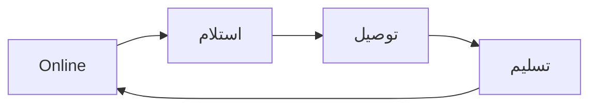

---

## 3. تفاصيل المراحل (Flowcharts + شاشات + Workflow)

### المرحلة 1: **التسجيل والتفعيل** — 2 ميزة | 7 شاشات

**الميزات:** تسجيل المندوب والدخول والتفعيل · بيانات المندوب والوثائق والتحقق

#### ملخص المرحلة

1. تسجيل + وثائق ورخصة
2. اعتماد الأدمن → Online

#### Flowchart شامل للمرحلة

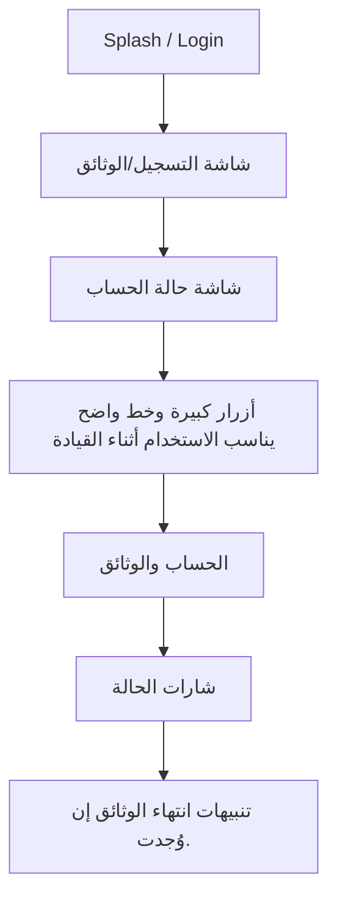

#### تفاصيل كل ميزة

#### **تسجيل المندوب والدخول والتفعيل**

**الهدف:** تمكين المندوب من إنشاء حسابه وتسجيل الدخول إلى تطبيق التوصيل (Flutter منفصل تمامًا عن تطبيقي العميل والمطعم)، مع توضيح أن الحساب لا يعمل ولا يستقبل أي طلب إلا بعد مراجعة الأدمن لبياناته ووثائقه واعتمادها. الهدف تجربة دخول سريعة وآمنة تناسب الاستخدام أثناء التنقّل.

**Flowchart:**

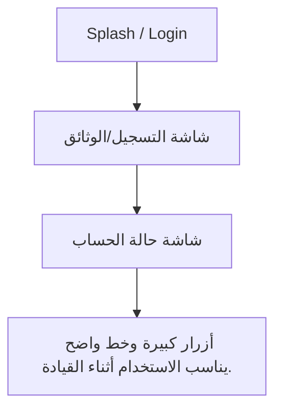

**شاشات — العنوان والمحتويات:**

#### **Splash / Login**

1. لوجو MealMate
2. حقول الدخول
3. رابط «نسيت كلمة المرور»
4. تصميم سريع وواضح

#### **شاشة التسجيل/الوثائق**

1. حقول البيانات
2. رفع الرخصة وبيانات السيارة

#### **شاشة حالة الحساب**

1. شارة «قيد المراجعة» / «مفعّل» / «مرفوض مع السبب»

#### **أزرار كبيرة وخط واضح يناسب الاستخدام أثناء القيادة.**

_لا توجد عناصر._

**خطوات Workflow:**

1. يفتح المندوب التطبيق فتظهر شاشة Splash بلوجو MealMate ثم تنتقل لشاشة الدخول
2. إن لم يكن لديه حساب: يدخل بياناته الأساسية ويرفع الوثائق المطلوبة ثم يرسل الطلب
3. تظهر له حالة «قيد المراجعة» ولا يستطيع استقبال أي طلب بعد
4. يراجع الأدمن البيانات والوثائق ثم يعتمد الحساب أو يطلب تعديلًا
5. عند الاعتماد يصله إشعار «تم تفعيل حسابك» ويصبح قادرًا على الدخول بكامل الصلاحيات
6. عند الدخول: يُدخل البريد/الهاتف وكلمة المرور؛ وعند نسيانها يستخدم «نسيت كلمة المرور» لإعادة التعيين
7. بعد الدخول الناجح ينتقل للرئيسية حيث زر تبديل Online/Offline

**حالات واستثناءات:**

1. **حساب غير مفعّل:** يُمنع الدخول للوحة الطلبات وتظهر رسالة بانتظار موافقة الأدمن
2. **رفض الأدمن:** يظهر السبب مع إمكانية إعادة رفع الوثائق
3. **انتهاء صلاحية الرخصة لاحقًا:** قد يُعطّل الحساب تلقائيًا
4. **Offline:** يتعذّر الدخول أو التسجيل مع Banner يوضّح فقدان الاتصال

#### **بيانات المندوب والوثائق والتحقق**

**الهدف:** تمكين المندوب من إدخال بياناته الشخصية وبيانات سيارته ورفع وثائقه (الرخصة وأوراق السيارة)، ومتابعة حالة التحقق حتى اعتماد الأدمن، مع تنبيهات استباقية قبل انتهاء صلاحية الوثائق.

**Flowchart:**

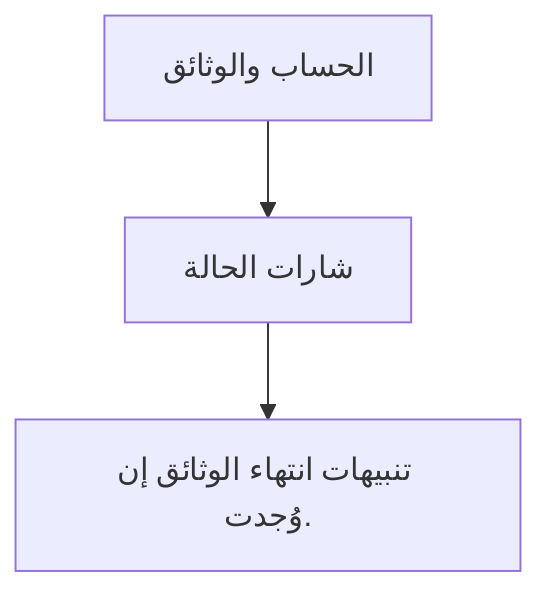

**شاشات — العنوان والمحتويات:**

#### **الحساب والوثائق**

1. الاسم
2. الهاتف
3. بيانات السيارة
4. الرخصة
5. حالة كل وثيقة

#### **شارات الحالة**

1. «قيد التحقق» / «مفعّل» / «مطلوب تحديث»

#### **تنبيهات انتهاء الوثائق إن وُجدت.**

_لا توجد عناصر._

**خطوات Workflow:**

1. يُدخل المندوب بياناته الشخصية وبيانات السيارة في شاشة الحساب والوثائق
2. يرفع صور الرخصة ووثيقة السيارة بوضوح
3. يرسل الطلب فتتحول الحالة إلى «قيد التحقق»
4. يتحقق الأدمن (أو المطعم لسائقي المطاعم) من الوثائق ويطلب تعديلًا عند الحاجة
5. يعتمد الأدمن الحساب نهائيًا فتتحول الحالة إلى «مفعّل»
6. يتابع النظام تاريخ انتهاء الرخصة باستمرار ويُنبّه المندوب قبل الانتهاء
7. يحدّث المندوب الوثيقة المنتهية ويعيد رفعها للاعتماد

**حالات واستثناءات:**

1. **رفض وثيقة:** يظهر السبب مع إمكانية إعادة الرفع
2. **اقتراب انتهاء الرخصة:** تنبيه استباقي قبل الانتهاء
3. **انتهاء الرخصة فعليًا:** تعطيل الحساب ومنع إسناد طلبات حتى التحديث
4. **سائق مطعم:** يتحقق المطعم أولًا ثم يعتمد الأدمن نهائيًا

---

### المرحلة 2: **استلام الطلب** — 2 ميزة | 7 شاشات

**الميزات:** استقبال الطلبات حسب النطاق الجغرافي · مسح الباركود عند الاستلام والتسليم

#### ملخص المرحلة

1. طلبات في نطاق التغطية
2. استلام من المطعم + مسح باركود

#### Flowchart شامل للمرحلة

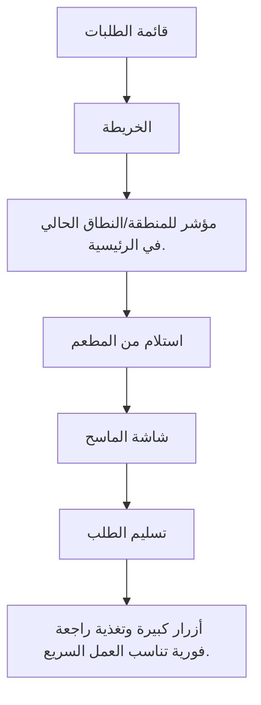

#### تفاصيل كل ميزة

#### **استقبال الطلبات حسب النطاق الجغرافي**

**الهدف:** ضمان ألا يستقبل المندوب إلا الطلبات الواقعة داخل نطاقه الجغرافي (دولته/مناطق عمله)، مع عرض خرائط محلية مناسبة، لتقليل المسافات وضمان عزل بيانات كل دولة ضمن نظام Multi-Tenancy.

**Flowchart:**

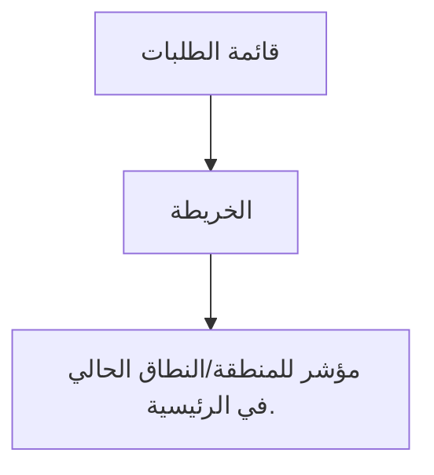

**شاشات — العنوان والمحتويات:**

#### **قائمة الطلبات**

1. مفلترة حسب النطاق الجغرافي تلقائيًا

#### **الخريطة**

1. خرائط محلية ضمن حدود منطقة العمل

#### **مؤشر للمنطقة/النطاق الحالي في الرئيسية.**

_لا توجد عناصر._

**خطوات Workflow:**

1. عند تفعيل الحساب يربط الأدمن المندوب بنطاقه الجغرافي (الدولة والمناطق)
2. يضبط المندوب حالته على Online لاستقبال الطلبات
3. يعرض النظام فقط الطلبات الواقعة ضمن نطاقه ويستبعد ما هو خارجه
4. تظهر الخرائط والاتجاهات المحلية المناسبة لنطاق عمله
5. يستلم ويوصّل ضمن النطاق فقط، ولا تظهر له طلبات دول/مناطق أخرى

**حالات واستثناءات:**

1. **لا طلبات في النطاق:** Empty State «لا توجد طلبات في منطقتك حاليًا»
2. **خروج المندوب عن النطاق:** قد تتوقف الإسنادات الجديدة حتى العودة
3. **تغيير النطاق:** يتطلب تحديثًا من الأدمن
4. **Offline:** لا تُحدّث قائمة الطلبات حتى عودة الاتصال

#### **مسح الباركود عند الاستلام والتسليم**

**الهدف:** تسهيل استلام المندوب للبوكسات من المطعم وتسليمها للعميل عبر مسح باركود/QR المرتبط بكل طلب، لضمان مطابقة الطلب الصحيح وتقليل الأخطاء وتوثيق لحظتي الاستلام والتسليم.

**Flowchart:**

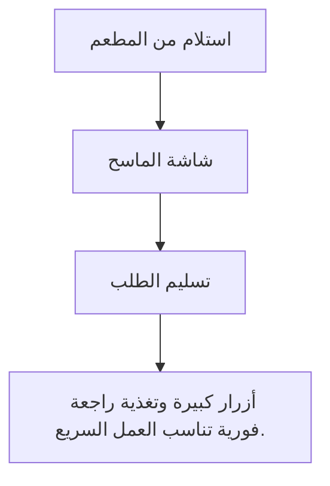

**شاشات — العنوان والمحتويات:**

#### **استلام من المطعم**

1. زر «تم الاستلام»
2. ماسح Barcode/QR
3. حقل ملاحظات

#### **شاشة الماسح**

1. إطار مسح واضح
2. تأكيد بصري عند النجاح (✓) أو خطأ عند عدم التطابق

#### **تسليم الطلب**

1. زر «تم التسليم»
2. إثبات تسليم اختياري
3. ملاحظات

#### **أزرار كبيرة وتغذية راجعة فورية تناسب العمل السريع.**

_لا توجد عناصر._

**خطوات Workflow:**

1. يصل المندوب للمطعم ويفتح تفاصيل الطلب من قائمة طلباته
2. يضغط «مسح الباركود» عند الاستلام ويوجّه الكاميرا لباركود الفاتورة
3. يؤكد النظام مطابقة الباركود للطلب المُسند له، فتتحول الحالة إلى «تم الاستلام» ثم «في الطريق»
4. أثناء التوصيل يحمل البوكسات بملصقاتها دون الحاجة لأي بيانات شخصية للعميل
5. عند الوصول لموقع العميل يفتح الطلب ويضغط «مسح عند التسليم» (إن كان مفعّلًا) لتأكيد تسليم البوكس الصحيح
6. بعد نجاح المسح يحدّث الحالة إلى «تم التسليم»

**حالات واستثناءات:**

1. **باركود لا يطابق الطلب:** رسالة خطأ ومنع تغيير الحالة حتى مسح الباركود الصحيح
2. **تلف أو عدم قراءة الباركود:** إدخال يدوي لرقم الطلب أو تأكيد يدوي مع ملاحظة
3. **Offline:** يُحفظ المسح محليًا ويُزامن عند عودة الاتصال مع Banner تنبيه
4. **نقص بوكس عند الاستلام:** تسجيل ملاحظة قبل تأكيد الاستلام

---

### المرحلة 3: **التوصيل** — 3 ميزة | 12 شاشات

**الميزات:** استلام وتوصيل الطلب والتتبع اللحظي · الاتصال عند 3 كم وحالة Hold والمحاولة الثانية · خصوصية بيانات العميل تجاه المندوب

#### ملخص المرحلة

1. توصيل + خريطة — موقع فقط
2. اتصال 3 km / Hold
3. مسح باركود التسليم

#### Flowchart شامل للمرحلة

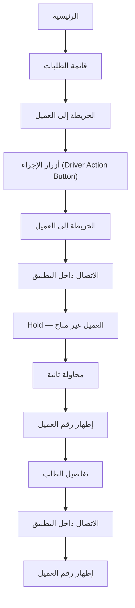

#### تفاصيل كل ميزة

#### **استلام وتوصيل الطلب والتتبع اللحظي**

**الهدف:** إدارة دورة التوصيل كاملة من منظور المندوب: استلام البوكس من المطعم، تحديث حالات الطلب لحظيًا، والوصول للعميل عبر خريطة واتجاهات و ETA واضحة، بحيث تنعكس الحالة فورًا لدى العميل والمطعم والأدمن.

**Flowchart:**

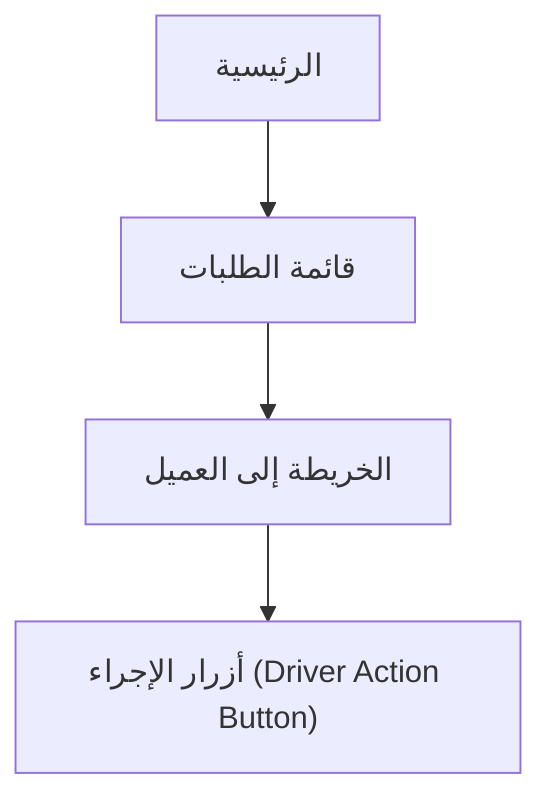

**شاشات — العنوان والمحتويات:**

#### **الرئيسية**

1. زر Online/Offline
2. ملخص طلبات اليوم
3. الطلب الحالي

#### **قائمة الطلبات**

1. رقم الطلب
2. المطعم
3. منطقة العميل
4. وقت التسليم
5. الحالة
6. مع تمييز الطلب العاجل/المتأخر

#### **الخريطة إلى العميل**

1. خريطة
2. اتجاهات
3. ETA
4. زر اتصال عند 3 كم (أهم شاشة للمندوب)

#### **أزرار الإجراء (Driver Action Button)**

1. تم الاستلام
2. في الطريق
3. Hold
4. تم التسليم — أزرار كبيرة سهلة أثناء القيادة

**خطوات Workflow:**

1. يضبط المندوب حالته على Online فتظهر له طلبات اليوم المسندة
2. يفتح الطلب النشط ويتوجه للمطعم بمساعدة الخريطة
3. يستلم البوكس ويحدّث الحالة إلى «تم الاستلام» (مع مسح الباركود — ) فتتحول إلى «في الطريق»
4. يتابع الخريطة والاتجاهات و ETA حتى موقع التسليم
5. عند الاقتراب لمسافة 3 كم يظهر زر الاتصال الآمن عند الحاجة
6. يسلّم البوكس ويضغط «تم التسليم» فتُغلق المهمة
7. ينتقل تلقائيًا للطلب التالي في القائمة

**حالات واستثناءات:**

1. **العميل لا يرد عند الوصول:** تسجيل محاولة فاشلة وتحويل Hold
2. **Offline:** Banner أعلى الشاشة + حفظ آخر تحديث ومزامنته لاحقًا
3. **تعذّر الوصول للموقع:** إعادة توجيه عبر الخريطة أو إضافة ملاحظة على الطلب
4. **تأخّر المطعم في التجهيز:** يبقى الطلب بانتظار الاستلام مع إشعار

#### **الاتصال عند 3 كم وحالة Hold والمحاولة الثانية**

**الهدف:** تنظيم تواصل المندوب مع العميل بأمان عند الاقتراب من موقع التسليم، ومعالجة حالة عدم الرد عبر تحويل الطلب إلى Hold ثم محاولة ثانية، وصولًا لإظهار رقم العميل كاستثناء موثّق فقط عند الضرورة القصوى.

**Flowchart:**

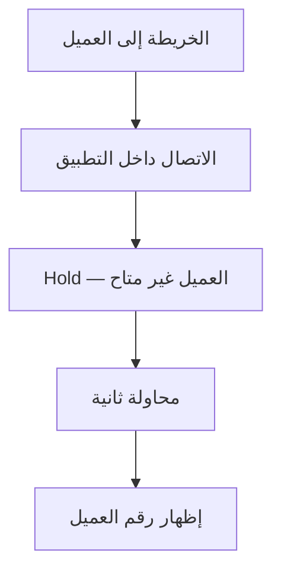

**شاشات — العنوان والمحتويات:**

#### **الخريطة إلى العميل**

1. زر الاتصال يظهر فقط عند 3 كم
2. تنبيه خصوصية

#### **الاتصال داخل التطبيق**

1. زر اتصال
2. حالة الاتصال
3. سجل المحاولة

#### **Hold — العميل غير متاح**

1. سبب التعليق
2. ملاحظات
3. زر تأكيد Hold

#### **محاولة ثانية**

1. زر اتصال
2. إشعار جديد
3. خيار إظهار الرقم بعد الفشل

#### **إظهار رقم العميل**

1. تحذير واضح
2. سبب الإظهار
3. الرقم
4. تسجيل الحدث

**خطوات Workflow:**

1. أثناء التوصيل يحسب النظام المسافة لحظيًا؛ وقبل 3 كم يكون زر الاتصال مخفيًا/Disabled مع رسالة «الاتصال يتاح عند الاقتراب»
2. عند الوصول إلى 3 كم أو أقل يظهر زر الاتصال داخل التطبيق مع تنبيه الخصوصية
3. يتصل المندوب بالعميل عبر التطبيق دون رؤية الرقم الحقيقي
4. إذا لم يرد العميل: يضغط المندوب «لم يرد العميل» ويكتب ملاحظة فتُسجّل محاولة فاشلة
5. يحوّل الطلب إلى Hold (سبب + وقت) ويكمل باقي التوصيلات المسندة له
6. عند العودة لمنطقة العميل يجري محاولة اتصال ثانية ويُرسَل إشعار جديد للعميل
7. إذا فشلت المحاولة الثانية: يظهر رقم العميل كاستثناء بعد تحذير، مع تسجيل الحدث وإشعار الأدمن
8. تُحفظ كل الأحداث في Timeline تفاصيل الطلب

**حالات واستثناءات:**

1. **قبل 3 كم:** الاتصال غير متاح مع رسالة توضيحية
2. **عدم رد العميل (المحاولة الأولى):** محاولة فاشلة + تحويل Hold
3. **فشل المحاولة الثانية:** إظهار الرقم كاستثناء + إشعار الأدمن
4. **Offline أثناء الاقتراب:** يتعذّر الاتصال؛ يسجّل المندوب الحالة ويعيد المحاولة عند عودة الاتصال

#### **خصوصية بيانات العميل تجاه المندوب**

**الهدف:** ضمان أعلى مستوى من الخصوصية في تطبيق المندوب المنفصل تمامًا، بحيث لا يرى المندوب سوى الموقع الجغرافي اللازم للتوصيل، دون اسم العميل أو رقمه، إلا في حالة استثنائية موثّقة.

**Flowchart:**

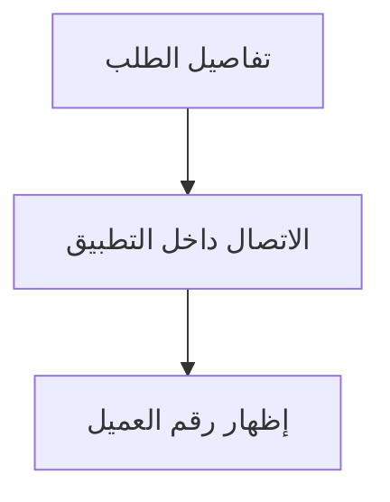

**شاشات — العنوان والمحتويات:**

#### **تفاصيل الطلب**

1. بيانات العميل مخفية
2. يظهر الموقع/المنطقة فقط

#### **الاتصال داخل التطبيق**

1. تنبيه خصوصية
2. رقم مقنّع

#### **إظهار رقم العميل**

1. تحذير واضح
2. سبب
3. تسجيل الحدث

**خطوات Workflow:**

1. يفتح المندوب تفاصيل الطلب فيرى الموقع الجغرافي للتسليم فقط، دون اسم أو رقم
2. يتنقّل عبر الخريطة والاتجاهات إلى الموقع المحدد
3. عند الحاجة للتواصل يستخدم الاتصال داخل التطبيق (يظهر عند 3 كم) برقم مقنّع
4. عند فشل محاولتين وتحويل Hold، قد يُظهر النظام رقم العميل كاستثناء بعد تحذير
5. يُسجَّل حدث إظهار الرقم في Timeline الطلب ويُرسَل إشعار للأدمن

**حالات واستثناءات:**

1. **التواصل الطبيعي:** عبر التطبيق فقط دون كشف أي بيانات
2. **إظهار الرقم:** حالة استثنائية بعد فشل محاولتين + Hold + إشعار الأدمن
3. **محاولة الوصول لبيانات غير مصرّح بها:** يمنعها النظام

---

### المرحلة 4: **الأداء** — 2 ميزة | 6 شاشات

**الميزات:** تقييم الطلب ورؤية تقييم المندوب · إحصائيات وأداء المندوب

#### ملخص المرحلة

1. تقييمات العملاء
2. KPI ومؤشرات الأداء
3. ↺ طلب تالي أو Offline

#### Flowchart شامل للمرحلة

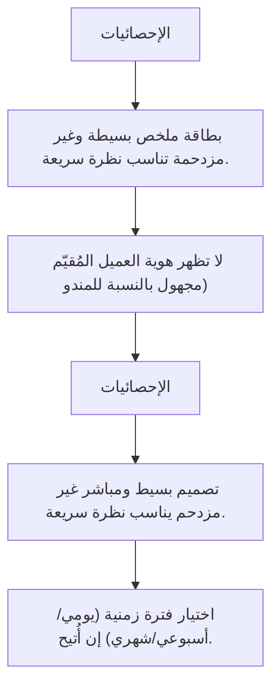

#### تفاصيل كل ميزة

#### **تقييم الطلب ورؤية تقييم المندوب**

**الهدف:** تمكين المندوب من الاطلاع على تقييمه الشخصي الناتج عن تقييمات العملاء لسرعة التوصيل بعد كل طلب، لمساعدته على تحسين أدائه. المندوب لا يُقيّم العميل، بل يرى نتيجة تقييمه فقط.

**Flowchart:**

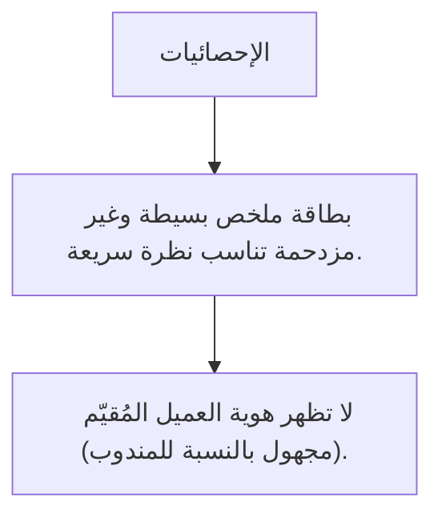

**شاشات — العنوان والمحتويات:**

#### **الإحصائيات**

1. متوسط التقييم (نجوم) بشكل بارز
2. عدد الطلبات المقيّمة
3. اتجاه الأداء

#### **بطاقة ملخص بسيطة وغير مزدحمة تناسب نظرة سريعة.**

_لا توجد عناصر._

#### **لا تظهر هوية العميل المُقيّم (مجهول بالنسبة للمندوب).**

_لا توجد عناصر._

**خطوات Workflow:**

1. بعد تسليم الطلب يصل العميل لشاشة التقييم في تطبيقه ويقيّم سرعة التوصيل والوجبة والمطعم
2. يجمّع النظام تقييمات سرعة التوصيل الخاصة بالمندوب
3. يفتح المندوب قسم الإحصائيات في تطبيقه ليرى متوسط تقييمه العام
4. يستعرض تطوّر التقييم عبر الوقت وعدد الطلبات المقيّمة
5. يستفيد من الملاحظات (إن أُتيحت) لتحسين سرعته وجودة تعامله

**حالات واستثناءات:**

1. **لا تقييمات بعد:** Empty State لطيف «لا توجد تقييمات حتى الآن»
2. **تقييم منخفض متكرر:** قد يستدعي متابعة من الأدمن (خارج تحكم المندوب)
3. **شكوى مرتبطة بالطلب:** تنعكس على الإحصائيات لكن تفاصيلها تُدار عبر الأدمن

#### **إحصائيات وأداء المندوب**

**الهدف:** عرض لوحة إحصائيات شخصية بسيطة للمندوب تلخّص أداءه: عدد الطلبات المكتملة، متوسط التقييم، متوسط وقت التوصيل، وعدد الشكاوى، لمساعدته على متابعة أدائه دون تعقيد.

**Flowchart:**

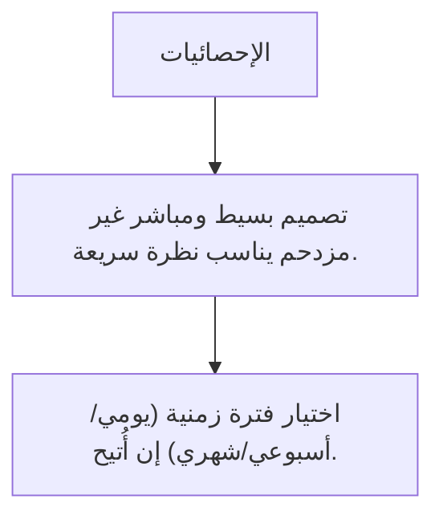

**شاشات — العنوان والمحتويات:**

#### **الإحصائيات**

1. بطاقات مؤشرات (طلبات مكتملة
2. تقييم
3. وقت متوسط
4. شكاوى)

#### **تصميم بسيط ومباشر غير مزدحم يناسب نظرة سريعة.**

_لا توجد عناصر._

#### **اختيار فترة زمنية (يومي/أسبوعي/شهري) إن أُتيح.**

_لا توجد عناصر._

**خطوات Workflow:**

1. يفتح المندوب قسم «الإحصائيات» من شريط التنقل
2. يعرض النظام مؤشرات الأداء المجمّعة لفترة محددة
3. يستعرض عدد الطلبات المكتملة ومتوسط التقييم ومتوسط الوقت
4. يطّلع على عدد الشكاوى المرتبطة بطلباته (إن وُجدت)
5. يستخدم هذه المؤشرات لتحسين سرعته وجودة خدمته

**حالات واستثناءات:**

1. **لا بيانات بعد:** Empty State «لا توجد إحصائيات حتى الآن»
2. **Offline:** عرض آخر بيانات محفوظة مع تنبيه بعدم التحديث
3. **شكاوى مفتوحة:** تظهر ضمن المؤشر لكن تفاصيلها تُدار عبر الأدمن

---

## 4. معادلات أساسية

- **متوسط القروب (غير تراكمي):** Basic من Basic فقط | Platinum من Platinum فقط (بدون Basic) | Elite من Elite فقط
- **متوسط البوكس** = متوسط القروب (لتصنيف الاشتراك) ÷ 26
- **commission** = max − ((max−min)/25)×(days−1) · إذا days≥26 → min
- **سعر العميل** = (متوسط البوكس × أيام) × (1 + commission/100)
- **كوتا** = ⌈أيام ÷ عدد المطاعم المتاحة للاختيار⌉
- **استرداد** = (سعر ÷ أيام) × (متبقي − 2)
- **صافي المطعم** = سعر البوكس − (سعر × % عمولة)

---

## 5. القواعد المشتركة

القواعد دي بتأثر على أكثر من دور، ومذكورة هنا مرّة واحدة كمرجع. كل ملف بيشير إليها.

### 4.1 نافذة الطلبات: 72 ساعة — تأكيد المطعم — إشعار التوصيل

#### 4.1.1 قفل تعديل العميل (72 ساعة)
- لازم العميل يختار أو يعدّل البوكس **قبل 72 ساعة على الأقل** من تاريخ التوصيل.
- **الجمود التشغيلي:** عند دخول نافذة 72 ساعة، **لا يحق للعميل تغيير الطلب** من التطبيق.
- **استثناء الأدمن:** الأدمن وحده يملك صلاحية التغيير في الحالات الطارئة عبر واتساب.

#### 4.1.2 تأكيد المطعم (24 ساعة من الاستلام)
- عند إرسال الطلب للمطعم (بعد قفل 72 ساعة): يجب على المطعم **تأكيد** الطلب خلال **24 ساعة**.
- إذا **لم يُؤكَّد** خلال 24 ساعة:
 1. يُرسَل **إشعار للأدمن** للتواصل مع المطعم **أو** فتح خيار للعميل لاختيار مطعم جديد.
 2. نافذة اختيار مطعم بديل للعميل = **24 ساعة فقط**.
 3. في **24 الساعة المتبقية** قبل التوصيل: يُرسَل الطلب للمطعم الجديد (إن تغيّر).

**الجدول الزمني (من موعد التوصيل):**

| المرحلة | التوقيت | ماذا يحدث |
|---------|---------|-----------|
| اختيار حر | قبل −72h | العميل يختار/يعدّل بحرية |
| قفل + إرسال | −72h | قفل تعديل العميل → إرسال للمطعم |
| تأكيد المطعم | −72h → −48h | المطعم يؤكّد خلال 24 ساعة |
| بديل (إن لزم) | −48h → −24h | أدمن + عميل يختار مطعمًا جديدًا (24h) |
| تحضير نهائي | −24h | إشعار التوصيل القادم + فواتير/ملصقات + تحضير |

#### 4.1.3 إشعار التوصيل القادم (24 ساعة)
- **قبل التوصيل بـ 24 ساعة:** يُشعَر المطعم بكل الطلبات المقرّر **توصيلها خلال الـ24 ساعة القادمة**.
- يبدأ المطعم التحضير النهائي وتُولَّد الفواتير والباركود والملصقات ().

### 4.2 تصنيف مطاعم التلقائي (Categorization) — **ديناميكي بدون تدخل بشري**

> **المرجع الكامل:** [`00_restaurant_classification_algorithm.md`](00_restaurant_classification_algorithm.md) | **Excel:** [`MealMate_restaurant_classification.xlsx`](MealMate_restaurant_classification.xlsx)

- كل مطعم يُصنَّف **تلقائيًا** إلى Basic / Platinum / Elite حسب سعر بوكسه اليومي ضمن **نفس البرنامج والباقة**.
- **سعر البوكس اليومي** = سعر اشتراك 26 يوم ÷ 26.

#### 4.2.1 خوارزمية تصنيف (μ و σ)

| الخطوة | المعادلة |
|--------|----------|
| المتوسط **μ** | `AVERAGE` لأسعار البوكس اليومي لكل مطاعم (≥1) |
| الانحراف **σ** | `STDEV.P` (≥2 مطاعم) |
| **≥2 مطاعم** | Basic إذا ≤ μ−0.5σ · Elite إذا ≥ μ+0.5σ · وإلا Platinum |
| **مطعم واحد** | Basic < **4.5** · Platinum 4.5–6 · Elite ≥ **6** (د.ك/يوم — قابل للضبط) |

- عند إضافة/تعديل أي سعر → **إعادة تصنيف فورية** لكل مطاعم في نفس البرنامج/الباقة.

#### 4.2.2 وصول العميل للمطاعم (هرمي — للتقويم والاختيار)
- **Basic:** يرى ويختار من مطاعم **Basic** فقط.
- **Platinum:** يرى مطاعم **Basic + Platinum** (تغطية أوسع).
- **Elite:** يرى **جميع** المطاعم (Basic + Platinum + Elite).

> ⚠️ **الهرمية أعلاه للوصول والاختيار فقط** — لا تُستخدم في حساب متوسط السعر (انظر 4.3).

### 4.3 معادلات التسعير والاشتراك

#### 4.3.1 متوسط القروب (Group Average) — **لكل تصنيف على حدة**
**لا يُحسب متوسط جميع المطاعم المتاحة في التصنيف.** 
يُحسب المتوسط بناءً على المطاعم التي تمثل **المستوى الفعلي** للتصنيف فقط (نفس البرنامج والباقة):

| تصنيف اشتراك العميل | متوسط القروب (26 يوم) |
|---------------------|------------------------|
| **Basic** | متوسط أسعار مطاعم **Basic** فقط |
| **Platinum** | متوسط أسعار مطاعم **Platinum** فقط — **لا تُدخل Basic** |
| **Elite** | متوسط أسعار مطاعم **Elite** فقط |

#### 4.3.2 عمولة MealMate (استيفاء خطي — ديناميكي)

> **المرجع:** [`00_commission_interpolation_algorithm.md`](00_commission_interpolation_algorithm.md) | **Excel:** [`MealMate_commission_interpolation.xlsx`](MealMate_commission_interpolation.xlsx)

**التدخل الوحيد للأدmin:** ضبط **max_commission** (عند يوم 1) و **min_commission** (عند 26 يومًا).

```
إذا days ≥ 26 → commission = min_commission
وإلا → commission = max_commission − ((max−min)/(26−1)) × (days−1)
```

| أيام (مثال 30%→15%) | العمولة |
|---------------------|---------|
| 1 | 30.00% |
| 6 | 27.00% |
| 12 | 23.40% |
| 26 | 15.00% |

#### 4.3.3 سعر اشتراك العميل

> **المرجع الكامل:** [`00_accounting_requirements.md`](00_accounting_requirements.md) §4

- **متوسط التكلفة اليومية** = متوسط سعر القروب (للتصنيف المختار) ÷ 26.
- **سعر اليوم** = متوسط التكلفة × (1 + R).
- **السعر الأساسي** = `round_up`(سعر اليوم × المدة) — تقريب لأعلى لأقرب عدد صحيح.
- **بعد خصم المشترك** (إن وُجد كود): السعر_الأساسي × (1 − d) حيث d = **10%** افتراضياً.
- **عمولة المطاعم الثابتة (داخلي):** 10% من تكلفة الوجبات → تكلفة صافية = السعر_اليومي × 0.9.

#### 4.3.4 تغيير أسعار الاشتراكات
- أي تعديل لأسعار الاشتراك أو نسب العمولة يُطبَّق **فورًا على الاشتراكات الجديدة** فقط.
- **الاشتراكات النشطة الحالية لا تتأثر** بأثر رجعي عند تغيير الأسعار.
- **الفاتورة الشهرية** للعميل توضّح:
 - الأسعار المعدّلة (إن وُجدت) للفترة أو للاشتراك الجديد.
 - **تاريخ اشتراك العميل** الأصلي لتفادي أي لبس.

### 4.4 منطق التنويع (اللمت — Fair Distribution & Quota)

> **المرجع:** [`00_accounting_requirements.md`](00_accounting_requirements.md) §5

**N** = عدد المطاعم المتاحة للاختيار (تراكمي حسب التصنيف: Basic فقط · Basic+Platinum · الكل لـ Elite).

```
Limit = max( round_up(N ÷ المدة), 2 )
```

- لا يمكن اختيار نفس المطعم بعد بلوغ **Limit** طالما توجد بدائل.
- **الحد الأدنى = 2** حتى في الاشتراكات الطويلة.
- **تجاوز الكوتا الذكي:** عند Busy لكل المطاعم أو بعد شكوى محقّقة.

### 4.5 الطاقة الاستيعابية (Capacity / Busy)
- كل مطعم يحدد حد البوكسات اليومي الأقصى. عند الوصول له يظهر **Busy** ويُمنع اختياره لذلك اليوم.

### 4.6 الاختيار التلقائي (Auto-Selection)
- لو العميل ماختارش يدويًا قبل 72 ساعة، النظام يختار له بوكس تلقائيًا مع احترام: الحساسية، عدم الإعجاب، الكوتا، والتوزيع العادل، مع Fallback لو مفيش مطعم مطابق.

### 4.8 الإلغاء والاسترداد (مع رسوم تصاعدية)

> **المرجع:** [`00_accounting_requirements.md`](00_accounting_requirements.md) §6

```
الأيام_المتبقية = max(إجمالي − مستخدم − 3, 0)
المبلغ_المستحق = (المدفوع ÷ إجمالي) × الأيام_المتبقية
F = 10% إذا متبقي ≥ 23 · وإلا تصاعدي من 3% إلى 10%
المسترجع = المستحق − (المستحق × F)
```

### 4.9 الإنذار المبكر للربحية (داخلي — الأدمن)

> **المرجع:** [`00_accounting_requirements.md`](00_accounting_requirements.md) §7 · 

- يختبر أسوأ سيناريو (أعلى تكلفة + أقل مدة) لكل برنامج/باقة.
- **تحذير** إذا صافي الربح < 10% من التكلفة الصافية.

### 4.10 حالات اليوم في التقويم
| الحالة | اللون | الرمز | الوصف |
|--------|-------|-------|-------|
| مكتمل الاختيار | أخضر | ✅ | تم اختيار البوكس والمطعم |
| لم يتم الاختيار | رمادي/أحمر | ⚠ | لم يُختر بعد |
| مقفل (72h) | برتقالي | 🔒 | داخل 72 ساعة — لا تعديل من العميل |
| بانتظار تأكيد | أصفر | ⏳ | المطعم لم يؤكّد بعد (خلال 24h من الاستلام) |
| قيد التحضير | برتقالي | 📦 | أقل من 24 ساعة — تحضير نهائي + توصيل قادم |
| مجمّد | أزرق | ❄ | ضمن فترة التجميد |
| تم التسليم | أخضر | ✔ | يمكن التقييم |

### 4.11 الخصوصية والاتصال الآمن (3 كم)
- زر الاتصال يظهر فقط عند وصول المندوب إلى **3 كم أو أقل**.
- الاتصال داخل التطبيق فقط، بأرقام مقنّعة ورسائل مشفّرة.
- إظهار رقم العميل الحقيقي = **حالة استثنائية** بعد فشل محاولتين + تحويل Hold + إشعار الأدمن.

> **إحصائيات:** 9 ميزة | 32 شاشات

> `python workflows/_build_lifecycle_flowcharts.py`
