# المطعم — Flowcharts (Mermaid MD)

> **الدور:** المطعم | **المنصة:** Angular — لوحة ويب

> ملف Markdown فيه **Mermaid flowcharts** — يفتح في GitHub / Cursor / VS Code Preview.

---

## الفلو الكامل للميزات

```mermaid
flowchart LR
  f01_feat["F01 تسجيل المطعم واعتماد الحساب والدخول"]
  f02_feat["F02 تسعير البرامج والباقات لمدة 26 يوم"]
  f03_feat["F03 التصنيف التلقائي للمطعم"]
  f04_feat["F04 التسعير والعمولة الديناميكية على المطعم"]
  f05_feat["F05 استقبال اختيارات التقويم كطلبات يومية"]
  f06_feat["F06 نافذة التحضير 48 ساعة"]
  f08_feat["F08 تحديد الطاقة الاستيعابية اليومية و Busy"]
  f09_feat["F09 احترام الحساسية في التحضير والملصقات"]
  f12_feat["F12 طباعة الفواتير والباركود وملصقات الوجبات"]
  f13_feat["F13 تسليم الطلب للسائق وتحديث الحالة"]
  f15_feat["F15 متابعة تقييمات المطعم والوجبات"]
  f16_feat["F16 التعامل مع الشكاوى وخصم قيمة البوكس"]
  f20_feat["F20 المزايدة على الأماكن الإعلانية"]
  f21_feat["F21 اختيار المحافظات والمناطق المخدومة"]
  f22_feat["F22 رفع ومتابعة الوثائق والتراخيص"]
  f23_feat["F23 إدارة سائقي المطعم (إضافة/تعديل/تفعيل/تع"]
  f24_feat["F24 إدارة القوائم والوجبات والأسعار"]
  f25_feat["F25 طلب إنهاء التعاقد والالتزامات"]
  f26_feat["F26 التسويات والمستحقات المالية"]
  f27_feat["F27 تقارير المطعم والمبيعات"]
  f29_feat["F29 إدخال المحتوى الغذائي باللغتين"]
  f31_feat["F31 حدود بيانات العميل الظاهرة للمطعم"]
  f01_feat --> f02_feat
  f02_feat --> f03_feat
  f03_feat --> f04_feat
  f04_feat --> f05_feat
  f05_feat --> f06_feat
  f06_feat --> f08_feat
  f08_feat --> f09_feat
  f09_feat --> f12_feat
  f12_feat --> f13_feat
  f13_feat --> f15_feat
  f15_feat --> f16_feat
  f16_feat --> f20_feat
  f20_feat --> f21_feat
  f21_feat --> f22_feat
  f22_feat --> f23_feat
  f23_feat --> f24_feat
  f24_feat --> f25_feat
  f25_feat --> f26_feat
  f26_feat --> f27_feat
  f27_feat --> f29_feat
  f29_feat --> f31_feat
```

---

## فهرس

- [F01 — تسجيل المطعم واعتماد الحساب والدخول](#f01---) (9 لوحة)
- [F02 — تسعير البرامج والباقات لمدة 26 يوم](#f02---26-) (8 لوحة)
- [F03 — التصنيف التلقائي للمطعم](#f03---) (6 لوحة)
- [F04 — التسعير والعمولة الديناميكية على المطعم](#f04---) (6 لوحة)
- [F05 — استقبال اختيارات التقويم كطلبات يومية](#f05---) (6 لوحة)
- [F06 — نافذة التحضير 48 ساعة](#f06---48-) (6 لوحة)
- [F08 — تحديد الطاقة الاستيعابية اليومية و Busy](#f08---busy) (7 لوحة)
- [F09 — احترام الحساسية في التحضير والملصقات](#f09---) (6 لوحة)
- [F12 — طباعة الفواتير والباركود وملصقات الوجبات](#f12---) (7 لوحة)
- [F13 — تسليم الطلب للسائق وتحديث الحالة](#f13---) (6 لوحة)
- [F15 — متابعة تقييمات المطعم والوجبات](#f15---) (6 لوحة)
- [F16 — التعامل مع الشكاوى وخصم قيمة البوكس](#f16---) (6 لوحة)
- [F20 — المزايدة على الأماكن الإعلانية](#f20---) (7 لوحة)
- [F21 — اختيار المحافظات والمناطق المخدومة](#f21---) (7 لوحة)
- [F22 — رفع ومتابعة الوثائق والتراخيص](#f22---) (7 لوحة)
- [F23 — إدارة سائقي المطعم (إضافة/تعديل/تفعيل/تعطيل)](#f23---) (8 لوحة)
- [F24 — إدارة القوائم والوجبات والأسعار](#f24---) (7 لوحة)
- [F25 — طلب إنهاء التعاقد والالتزامات](#f25---) (7 لوحة)
- [F26 — التسويات والمستحقات المالية](#f26---) (7 لوحة)
- [F27 — تقارير المطعم والمبيعات](#f27---) (7 لوحة)
- [F29 — إدخال المحتوى الغذائي باللغتين](#f29---) (6 لوحة)
- [F31 — حدود بيانات العميل الظاهرة للمطعم](#f31---) (6 لوحة)

---

# الميزات (22 | 148 لوحات)

## F01 — تسجيل المطعم واعتماد الحساب والدخول

**الهدف:** تسجيل المطعم رسميًا على المنصة عبر لوحة تحكم ويب (وليس تطبيق موبايل)، برفع بيانات الشركة الرسمية ووثائقها، ثم انتظار مراجعة الأدمن واعتماده.
لا يُفعّل الحساب ولا يظهر المطعم للعملاء إلا بعد موافقة الأدمن.

### Flowchart

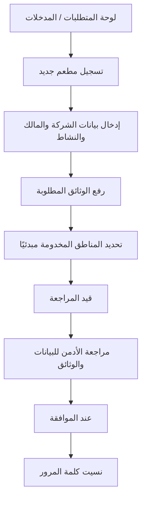

### لوحات — العنوان والمحتويات

#### **لوحة المتطلبات / المدخلات** _(مستنتجة)_

1. بيانات الشركة الرسمية وبيانات المالك (مرجع F22).
2. وثائق إلزامية: السجل التجاري، عقد التأسيس، ترخيص الشركة، وأي وثائق مطلوبة بتواريخ إصدار وانتهاء.
3. بريد إلكتروني/هاتف وكلمة مرور خاصة بلوحة المطعم.
4. المحافظات/المناطق المخدومة مبدئيًا (مرجع F21).

#### **تسجيل مطعم جديد** _(مستنتجة)_

1. فتح صفحة  على لوحة الويب

#### **إدخال بيانات الشركة والمالك والنشاط** _(مستنتجة)_

1. إدخال بيانات الشركة والمالك والنشاط

#### **رفع الوثائق المطلوبة** _(مستنتجة)_

1. رفع الوثائق المطلوبة مع تواريخ الإصدار والانتهاء

#### **تحديد المناطق المخدومة مبدئيًا** _(مستنتجة)_

1. تحديد المناطق المخدومة مبدئيًا

#### **قيد المراجعة** _(مستنتجة)_

1. إرسال الطلب → ينتقل الحساب إلى حالة

#### **مراجعة الأدمن للبيانات والوثائق** _(مستنتجة)_

1. مراجعة الأدمن للبيانات والوثائق

#### **عند الموافقة** _(مستنتجة)_

1. تفعيل الحساب وإشعار المطعم
2. ويصبح ظاهرًا للعملاء بعد إكمال الأسعار والقوائم المعتمدة

#### **نسيت كلمة المرور** _(مستنتجة)_

1. الدخول لاحقًا عبر تسجيل دخول خاص (Email/Phone
2. Password) مع خيار

---

## F02 — تسعير البرامج والباقات لمدة 26 يوم

**الهدف:** يحدد المطعم سعره الخاص لكل برنامج غذائي وكل باقة لمدة 26 يوم عمل من لوحته.
هذه الأسعار هي الأساس الذي يبني عليه النظام تصنيف المطعم وقيمة البوكس اليومي ومتوسطات القروب.

### Flowchart

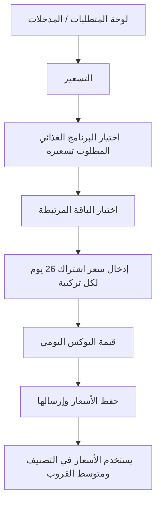

### لوحات — العنوان والمحتويات

#### **لوحة المتطلبات / المدخلات** _(مستنتجة)_

1. حساب مطعم معتمد (F01).
2. قائمة البرامج الغذائية (نزول وزن، ضخامة عضلية، محافظة، كيتو) والباقات (كاملة، غداء، مخصصة) كما يحددها الأدمن.
3. بيانات تكلفة المطعم لتسعير عادل.

#### **التسعير** _(مستنتجة)_

1. فتح شاشة  في لوحة المطعم

#### **اختيار البرنامج الغذائي المطلوب تسعيره** _(مستنتجة)_

1. اختيار البرنامج الغذائي المطلوب تسعيره

#### **اختيار الباقة المرتبطة** _(مستنتجة)_

1. اختيار الباقة المرتبطة

#### **إدخال سعر اشتراك 26 يوم لكل تركيبة** _(مستنتجة)_

1. إدخال سعر اشتراك 26 يوم لكل تركيبة (برنامج × باقة)

#### **قيمة البوكس اليومي** _(مستنتجة)_

1. مراجعة  المحسوبة تلقائيًا = السعر ÷ 26

#### **حفظ الأسعار وإرسالها** _(مستنتجة)_

1. حفظ الأسعار وإرسالها

#### **يستخدم الأسعار في التصنيف ومتوسط القروب** _(مستنتجة)_

1. النظام يستخدم الأسعار في التصنيف (F03) ومتوسط القروب (F04)

---

## F03 — التصنيف التلقائي للمطعم

**الهدف:** يصنّف النظام المطعم تلقائيًا (Basic / Platinum / Elite) بناءً على سعر اشتراكه لـ26 يوم مقارنة بالحدود السعرية التي يضعها الأدمن.
التصنيف يحدد القروب الذي يظهر فيه المطعم للعملاء، وهو تصنيف داخلي بين الأدمن والمطاعم.

### Flowchart

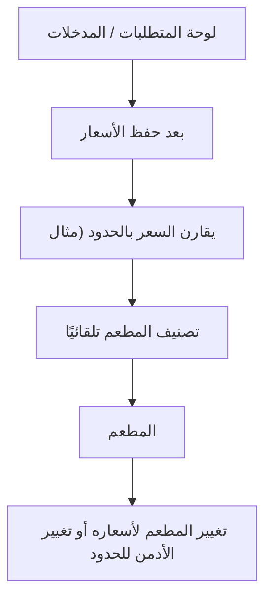

### لوحات — العنوان والمحتويات

#### **لوحة المتطلبات / المدخلات** _(مستنتجة)_

1. إدخال أسعار اشتراك 26 يوم (F02).
2. الحدود السعرية للتصنيفات المعرّفة من الأدمن.

#### **بعد حفظ الأسعار** _(مستنتجة)_

1. بعد حفظ الأسعار
2. يحسب النظام سعر اشتراك 26 يوم للمطعم

#### **يقارن السعر بالحدود (مثال** _(مستنتجة)_

1. Basic < 100 د.ك
2. Platinum < 150
3. Elite < 200)

#### **تصنيف المطعم تلقائيًا** _(مستنتجة)_

1. يحدد النظام تصنيف المطعم تلقائيًا

#### **المطعم** _(مستنتجة)_

1. يعرض التصنيف الحالي في لوحة المطعم

#### **تغيير المطعم لأسعاره أو تغيير الأدمن للحدود** _(مستنتجة)_

1. عند تغيير المطعم لأسعاره أو تغيير الأدمن للحدود → إعادة تصنيف تلقائية

---

## F04 — التسعير والعمولة الديناميكية على المطعم

**الهدف:** توضيح كيف تُحتسب العمولة الديناميكية الخاصة بالمطعم وتُخصم من «سعر البوكس المتفق عليه» بين المنصة والمطعم — وليس من سعر العميل.
يرى المطعم نسبته الخاصة وصافي مستحقه المتوقع لكل بوكس.

### Flowchart

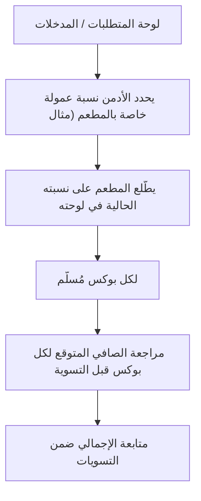

### لوحات — العنوان والمحتويات

#### **لوحة المتطلبات / المدخلات** _(مستنتجة)_

1. نسبة عمولة المطعم التي يحددها الأدمن (تختلف من مطعم لآخر).
2. سعر البوكس المتفق عليه بين المنصة والمطعم.

#### **يحدد الأدمن نسبة عمولة خاصة بالمطعم (مثال** _(مستنتجة)_

1. 15%)

#### **يطّلع المطعم على نسبته الحالية في لوحته** _(مستنتجة)_

1. يطّلع المطعم على نسبته الحالية في لوحته

#### **لكل بوكس مُسلّم** _(مستنتجة)_

1. صافي مستحق المطعم = سعر البوكس − (سعر البوكس × النسبة)

#### **مراجعة الصافي المتوقع لكل بوكس قبل التسوية** _(مستنتجة)_

1. مراجعة الصافي المتوقع لكل بوكس قبل التسوية

#### **متابعة الإجمالي ضمن التسويات** _(مستنتجة)_

1. متابعة الإجمالي ضمن التسويات (F26)

---

## F05 — استقبال اختيارات التقويم كطلبات يومية

**الهدف:** يستقبل المطعم ناتج اختيارات العملاء من التقويم الذكي كطلبات يومية مؤكدة عند بدء نافذة 48 ساعة.
المطعم لا يستخدم التقويم نفسه (فهو أداة العميل)، بل يرى الطلبات الناتجة عنه في لوحته.

### Flowchart

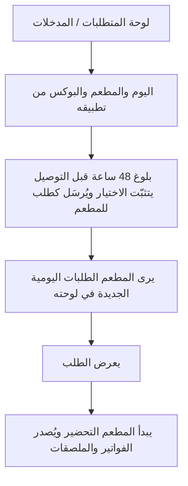

### لوحات — العنوان والمحتويات

#### **لوحة المتطلبات / المدخلات** _(مستنتجة)_

1. حساب معتمد وقوائم معتمدة (F24).
2. تحديد الطاقة الاستيعابية اليومية (F08).
3. دخول الطلب في نافذة 48 ساعة قبل التوصيل.

#### **اليوم والمطعم والبوكس من تطبيقه** _(مستنتجة)_

1. يختار العميل اليوم والمطعم والبوكس من تطبيقه

#### **بلوغ 48 ساعة قبل التوصيل يتثبّت الاختيار ويُرسَل كطلب للمطعم** _(مستنتجة)_

1. عند بلوغ 48 ساعة قبل التوصيل يتثبّت الاختيار ويُرسَل كطلب للمطعم

#### **يرى المطعم الطلبات اليومية الجديدة في لوحته** _(مستنتجة)_

1. يرى المطعم الطلبات اليومية الجديدة في لوحته

#### **يعرض الطلب** _(مستنتجة)_

1. عدد البوكسات
2. نوعها
3. وقت التوصيل المطلوب
4. والموقع العام فقط

#### **يبدأ المطعم التحضير ويُصدر الفواتير والملصقات** _(مستنتجة)_

1. يبدأ المطعم التحضير ويُصدر الفواتير والملصقات (F12)

---

## F06 — نافذة التحضير 48 ساعة

**الهدف:** تثبيت طلبات العملاء قبل 48 ساعة من التوصيل لتبدأ مرحلة التحضير لدى المطعم دون أي تعديل من العميل.
عند بدء النافذة تُرسل الطلبات وتتولّد الفواتير والملصقات تلقائيًا.

### Flowchart

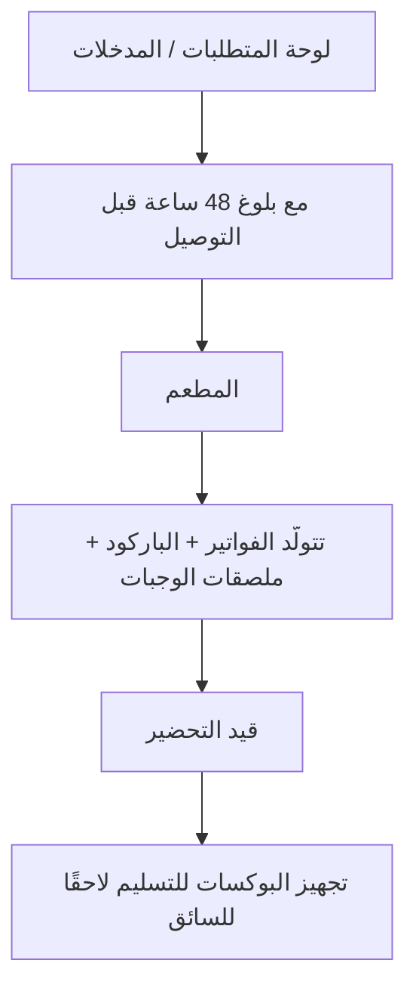

### لوحات — العنوان والمحتويات

#### **لوحة المتطلبات / المدخلات** _(مستنتجة)_

1. طلبات عملاء مختارة عبر التقويم (F05).
2. قوائم معتمدة وطاقة استيعابية محددة (F08).

#### **مع بلوغ 48 ساعة قبل التوصيل** _(مستنتجة)_

1. مع بلوغ 48 ساعة قبل التوصيل
2. تُقفل اختيارات العميل لذلك اليوم

#### **المطعم** _(مستنتجة)_

1. يرسل النظام الطلبات المثبّتة إلى لوحة المطعم

#### **تتولّد الفواتير + الباركود + ملصقات الوجبات** _(مستنتجة)_

1. تتولّد الفواتير
2. الباركود
3. ملصقات الوجبات (F12)

#### **قيد التحضير** _(مستنتجة)_

1. يبدأ المطعم التحضير وتنتقل حالة الطلب إلى

#### **تجهيز البوكسات للتسليم لاحقًا للسائق** _(مستنتجة)_

1. تجهيز البوكسات للتسليم لاحقًا للسائق (F13)

---

## F08 — تحديد الطاقة الاستيعابية اليومية و Busy

**الهدف:** يحدد المطعم حد البوكسات اليومي الأقصى من لوحته، ويراقب النظام الطلبات المؤكدة لحظيًا.
عند بلوغ الحد يتحوّل المطعم إلى حالة Busy في واجهة العميل ويُمنع اختياره لذلك اليوم.

### Flowchart

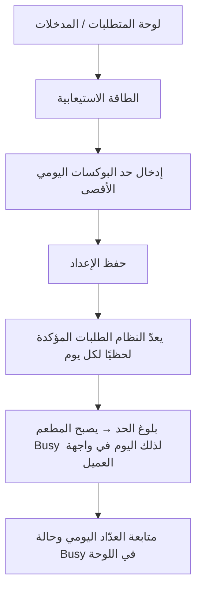

### لوحات — العنوان والمحتويات

#### **لوحة المتطلبات / المدخلات** _(مستنتجة)_

1. حساب مطعم معتمد (F01).
2. تقدير واقعي للطاقة الفعلية للمطبخ.

#### **الطاقة الاستيعابية** _(مستنتجة)_

1. فتح شاشة  في اللوحة

#### **إدخال حد البوكسات اليومي الأقصى** _(مستنتجة)_

1. إدخال حد البوكسات اليومي الأقصى

#### **حفظ الإعداد** _(مستنتجة)_

1. حفظ الإعداد

#### **يعدّ النظام الطلبات المؤكدة لحظيًا لكل يوم** _(مستنتجة)_

1. يعدّ النظام الطلبات المؤكدة لحظيًا لكل يوم

#### **بلوغ الحد → يصبح المطعم Busy لذلك اليوم في واجهة العميل** _(مستنتجة)_

1. عند بلوغ الحد → يصبح المطعم Busy لذلك اليوم في واجهة العميل

#### **متابعة العدّاد اليومي وحالة Busy في اللوحة** _(مستنتجة)_

1. متابعة العدّاد اليومي وحالة Busy في اللوحة

---

## F09 — احترام الحساسية في التحضير والملصقات

**الهدف:** يلتزم المطعم بدقة بيانات المكونات في كل بوكس، ويعكس ملاحظات الحساسية على ملصقات الوجبات لضمان سلامة العميل.
دقة المكونات شرط أساسي لصحة الاختيار التلقائي الذي يستبعد المكونات المسببة للحساسية.

### Flowchart

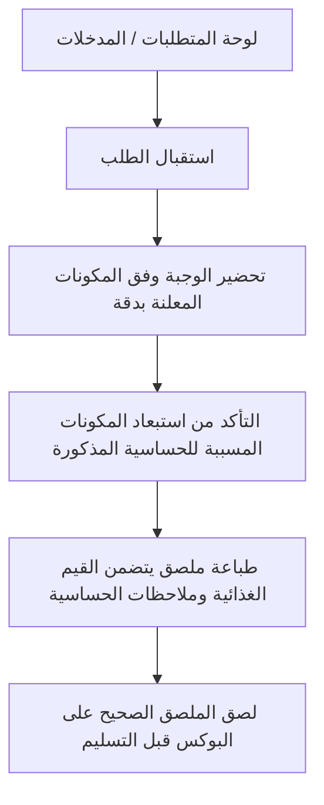

### لوحات — العنوان والمحتويات

#### **لوحة المتطلبات / المدخلات** _(مستنتجة)_

1. بيانات مكونات الوجبات والقيم الغذائية باللغتين (F24).
2. ملاحظات الحساسية المرفقة بالطلب القادم من النظام.

#### **استقبال الطلب** _(مستنتجة)_

1. استقبال الطلب مع ملاحظات الحساسية (دون بيانات العميل الشخصية)

#### **تحضير الوجبة وفق المكونات المعلنة بدقة** _(مستنتجة)_

1. تحضير الوجبة وفق المكونات المعلنة بدقة

#### **التأكد من استبعاد المكونات المسببة للحساسية المذكورة** _(مستنتجة)_

1. التأكد من استبعاد المكونات المسببة للحساسية المذكورة

#### **طباعة ملصق يتضمن القيم الغذائية وملاحظات الحساسية** _(مستنتجة)_

1. طباعة ملصق يتضمن القيم الغذائية وملاحظات الحساسية

#### **لصق الملصق الصحيح على البوكس قبل التسليم** _(مستنتجة)_

1. لصق الملصق الصحيح على البوكس قبل التسليم

---

## F12 — طباعة الفواتير والباركود وملصقات الوجبات

**الهدف:** عند بدء نافذة 48 ساعة يستقبل المطعم فاتورة احترافية بتفاصيل الطلب + باركود قابل للقراءة مخصص للسائق + ملصق لكل وجبة.
يطبع المطعم هذه المستندات لتسهيل التحضير والاستلام والتسليم.

### Flowchart

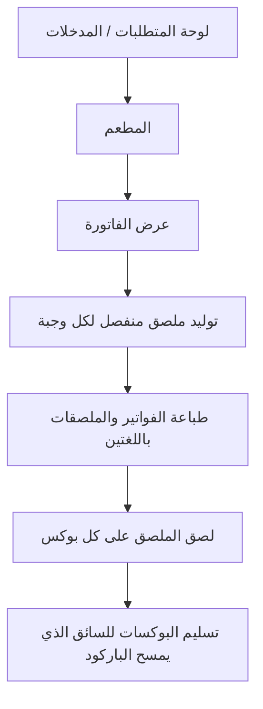

### لوحات — العنوان والمحتويات

#### **لوحة المتطلبات / المدخلات** _(مستنتجة)_

1. طلبات مؤكدة دخلت نافذة 48 ساعة (F06).
2. بيانات الوجبات الغذائية باللغتين (F24/F29).
3. لوجو المطعم لإدراجه على الملصق.

#### **المطعم** _(مستنتجة)_

1. عند بدء الـ48 ساعة تتولّد الفواتير تلقائيًا في لوحة المطعم

#### **عرض الفاتورة** _(مستنتجة)_

1. تفاصيل الوجبات
2. باركود مخصص للسائق

#### **توليد ملصق منفصل لكل وجبة** _(مستنتجة)_

1. توليد ملصق منفصل لكل وجبة

#### **طباعة الفواتير والملصقات باللغتين** _(مستنتجة)_

1. طباعة الفواتير والملصقات باللغتين

#### **لصق الملصق على كل بوكس** _(مستنتجة)_

1. لصق الملصق على كل بوكس

#### **تسليم البوكسات للسائق الذي يمسح الباركود** _(مستنتجة)_

1. تسليم البوكسات للسائق الذي يمسح الباركود (F13)

---

## F13 — تسليم الطلب للسائق وتحديث الحالة

**الهدف:** يحضّر المطعم البوكسات ويسلّمها لسائق معتمد، فتنعكس حالة الطلب لحظيًا لدى جميع الأطراف (العميل، المطعم، الأدمن).
المطعم يتابع تقدّم التوصيل من لوحته دون رؤية بيانات العميل الشخصية.

### Flowchart

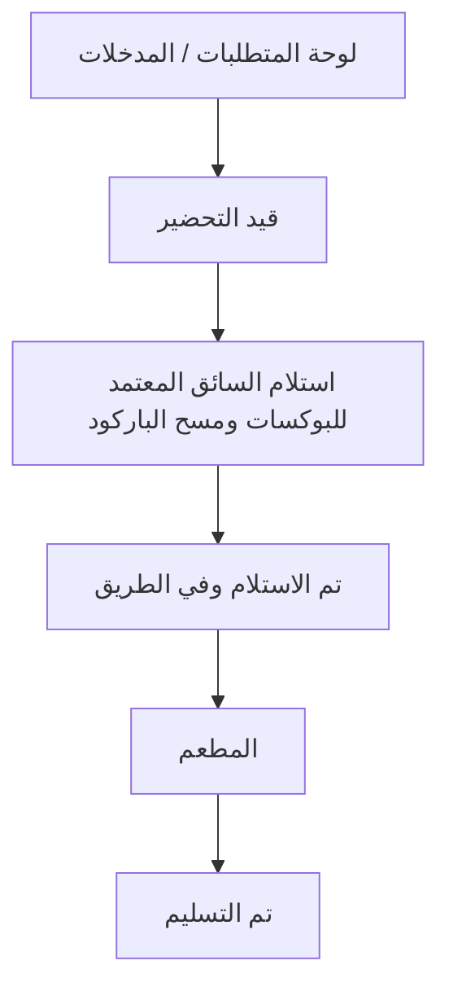

### لوحات — العنوان والمحتويات

#### **لوحة المتطلبات / المدخلات** _(مستنتجة)_

1. بوكسات جاهزة بملصقات وباركود (F12).
2. سائق معتمد ومفعّل من الأدمن (F23).

#### **قيد التحضير** _(مستنتجة)_

1. تجهيز البوكسات وتحويل حالتها من  إلى «جاهز»

#### **استلام السائق المعتمد للبوكسات ومسح الباركود** _(مستنتجة)_

1. استلام السائق المعتمد للبوكسات ومسح الباركود

#### **تم الاستلام وفي الطريق** _(مستنتجة)_

1. تحديث حالة الطلب إلى

#### **المطعم** _(مستنتجة)_

1. متابعة حالة الطلب لحظيًا في لوحة المطعم

#### **تم التسليم** _(مستنتجة)_

1. عند وصول السائق وتسليمه → تتحدّث الحالة إلى

---

## F15 — متابعة تقييمات المطعم والوجبات

**الهدف:** يطّلع المطعم على تقييمات العملاء لجودة الوجبة والمطعم عمومًا بعد التسليم، لتحسين الأداء وجودة القوائم.
يرى المطعم تقييماته الخاصة فقط دون بيانات العملاء الشخصية.

### Flowchart

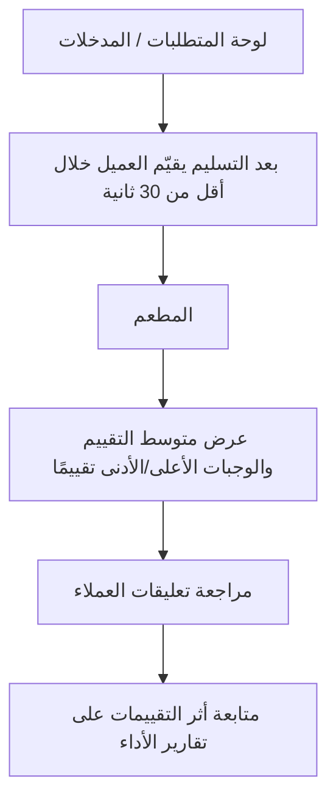

### لوحات — العنوان والمحتويات

#### **لوحة المتطلبات / المدخلات** _(مستنتجة)_

1. طلبات مُسلّمة وقابلة للتقييم.
2. حساب مطعم معتمد.

#### **بعد التسليم يقيّم العميل خلال أقل من 30 ثانية** _(مستنتجة)_

1. بعد التسليم يقيّم العميل (نجوم
2. تعليق) خلال أقل من 30 ثانية

#### **المطعم** _(مستنتجة)_

1. تظهر التقييمات في لوحة المطعم

#### **عرض متوسط التقييم والوجبات الأعلى/الأدنى تقييمًا** _(مستنتجة)_

1. عرض متوسط التقييم والوجبات الأعلى/الأدنى تقييمًا

#### **مراجعة تعليقات العملاء** _(مستنتجة)_

1. مراجعة تعليقات العملاء لتحسين الجودة

#### **متابعة أثر التقييمات على تقارير الأداء** _(مستنتجة)_

1. متابعة أثر التقييمات على تقارير الأداء (F27)

---

## F16 — التعامل مع الشكاوى وخصم قيمة البوكس

**الهدف:** يطّلع المطعم على شكاوى الوجبات المقدّمة بصور إلزامية، ويتابع نتيجة مراجعة الأدمن لها.
عند تأكيد صحة الشكوى يُخصم مبلغ البوكس من مستحقات المطعم في كل الأحوال.

### Flowchart

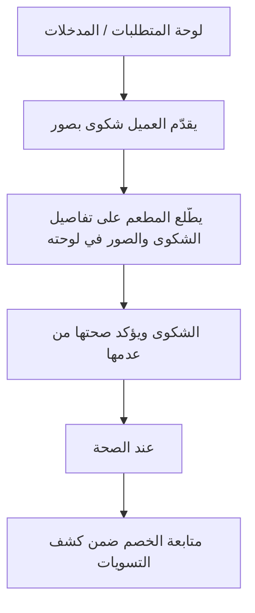

### لوحات — العنوان والمحتويات

#### **لوحة المتطلبات / المدخلات** _(مستنتجة)_

1. طلب مُسلّم محل شكوى.
2. صور إلزامية مرفقة من العميل (نقص مكونات، وجبة خاطئة...).

#### **يقدّم العميل شكوى بصور** _(مستنتجة)_

1. يقدّم العميل شكوى بصور → تظهر فورًا للأدمن وللمطعم المعني

#### **يطّلع المطعم على تفاصيل الشكوى والصور في لوحته** _(مستنتجة)_

1. يطّلع المطعم على تفاصيل الشكوى والصور في لوحته

#### **الشكوى ويؤكد صحتها من عدمها** _(مستنتجة)_

1. يراجع الأدمن الشكوى ويؤكد صحتها من عدمها

#### **عند الصحة** _(مستنتجة)_

1. يُخصم مبلغ البوكس من مستحقات المطعم

#### **متابعة الخصم ضمن كشف التسويات** _(مستنتجة)_

1. متابعة الخصم ضمن كشف التسويات (F26)

---

## F20 — المزايدة على الأماكن الإعلانية

**الهدف:** يزايد المطعم على أماكن إعلانية محددة داخل المناطق التي يخدمها لزيادة ظهوره أمام العملاء.
لكل منطقة 3 أماكن إعلانية للفائزين، وتظهر الإعلانات دون إخفاء المعلومات الأساسية.

### Flowchart

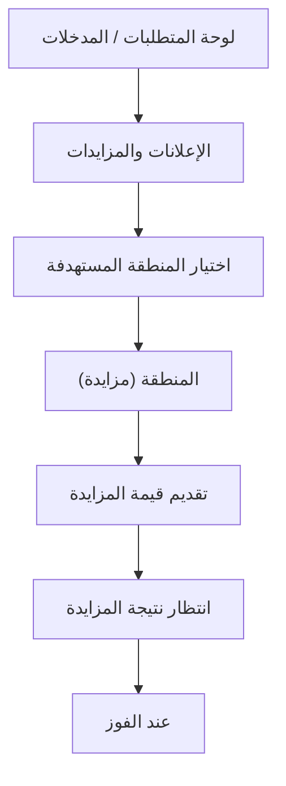

### لوحات — العنوان والمحتويات

#### **لوحة المتطلبات / المدخلات** _(مستنتجة)_

1. حساب معتمد يخدم مناطق محددة (F21).
2. ميزانية مخصصة للمزايدة.

#### **الإعلانات والمزايدات** _(مستنتجة)_

1. فتح شاشة  في اللوحة

#### **اختيار المنطقة المستهدفة** _(مستنتجة)_

1. اختيار المنطقة المستهدفة (ضمن مناطق خدمة المطعم)

#### **المنطقة (مزايدة)** _(مستنتجة)_

1. الرئيسية (بانر)
2. قائمة المطاعم (Sponsored)
3. صفحة المنطقة (مزايدة)
4. تفاصيل المطعم (Highlight)

#### **تقديم قيمة المزايدة** _(مستنتجة)_

1. تقديم قيمة المزايدة

#### **انتظار نتيجة المزايدة** _(مستنتجة)_

1. انتظار نتيجة المزايدة (الفائزون = 3 أماكن لكل منطقة)

#### **عند الفوز** _(مستنتجة)_

1. يظهر المطعم كـ Banner / Sponsored Card في المكان المحدد

---

## F21 — اختيار المحافظات والمناطق المخدومة

**الهدف:** يحدد المطعم المحافظات والمناطق التي يستطيع التوصيل إليها من لوحته.
اختيار محافظة كاملة يعني تلقائيًا تغطية كل مناطقها، ويظهر المطعم لعملاء تلك المناطق فقط.

### Flowchart

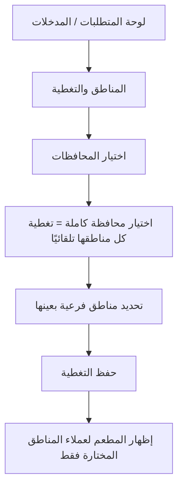

### لوحات — العنوان والمحتويات

#### **لوحة المتطلبات / المدخلات** _(مستنتجة)_

1. حساب مطعم معتمد (F01).
2. قدرة توصيل فعلية للمناطق المختارة.

#### **المناطق والتغطية** _(مستنتجة)_

1. فتح شاشة  في اللوحة

#### **اختيار المحافظات** _(مستنتجة)_

1. اختيار المحافظات التي يخدمها المطعم

#### **اختيار محافظة كاملة = تغطية كل مناطقها تلقائيًا** _(مستنتجة)_

1. اختيار محافظة كاملة = تغطية كل مناطقها تلقائيًا

#### **تحديد مناطق فرعية بعينها** _(مستنتجة)_

1. أو تحديد مناطق فرعية بعينها داخل المحافظة

#### **حفظ التغطية** _(مستنتجة)_

1. حفظ التغطية

#### **إظهار المطعم لعملاء المناطق المختارة فقط** _(مستنتجة)_

1. النظام يُظهر المطعم لعملاء المناطق المختارة فقط

---

## F22 — رفع ومتابعة الوثائق والتراخيص

**الهدف:** يسجّل المطعم بياناته ووثائقه الرسمية (السجل التجاري، عقد التأسيس، الترخيص...) مع تواريخ إصدار وانتهاء كل وثيقة.
يتابع المطعم تنبيهات انتهاء الوثائق ليحدّثها قبل إيقاف نشاطه.

### Flowchart

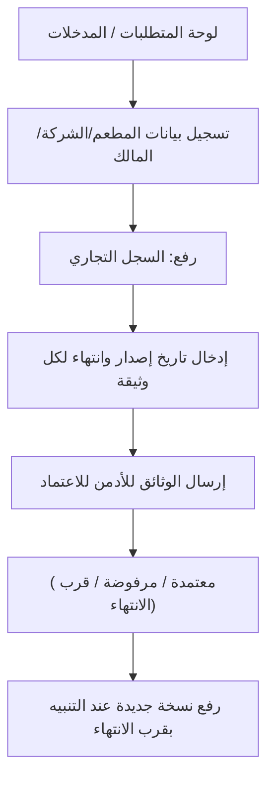

### لوحات — العنوان والمحتويات

#### **لوحة المتطلبات / المدخلات** _(مستنتجة)_

1. وثائق رسمية سارية المفعول.
2. بيانات الشركة والمالك.

#### **تسجيل بيانات المطعم/الشركة/المالك** _(مستنتجة)_

1. تسجيل بيانات المطعم/الشركة/المالك

#### **رفع: السجل التجاري** _(مستنتجة)_

1. رفع: السجل التجاري
2. عقد التأسيس
3. ترخيص الشركة
4. وأي وثائق مطلوبة

#### **إدخال تاريخ إصدار وانتهاء لكل وثيقة** _(مستنتجة)_

1. إدخال تاريخ إصدار وانتهاء لكل وثيقة

#### **إرسال الوثائق للأدمن للاعتماد** _(مستنتجة)_

1. إرسال الوثائق للأدمن للاعتماد

#### **(معتمدة / مرفوضة / قرب الانتهاء)** _(مستنتجة)_

1. متابعة حالة كل وثيقة في اللوحة (معتمدة / مرفوضة / قرب الانتهاء)

#### **رفع نسخة جديدة عند التنبيه بقرب الانتهاء** _(مستنتجة)_

1. رفع نسخة جديدة عند التنبيه بقرب الانتهاء

---

## F23 — إدارة سائقي المطعم (إضافة/تعديل/تفعيل/تعطيل)

**الهدف:** يدير المطعم سائقيه الخاصين (التابعين للمطعم) بإضافة بياناتهم ووثائقهم والتحقق المبدئي منها.
لا يُفعّل أي سائق إلا بعد موافقة الأدمن النهائية، ولا يُسند طلب لسائق غير معتمد.

### Flowchart

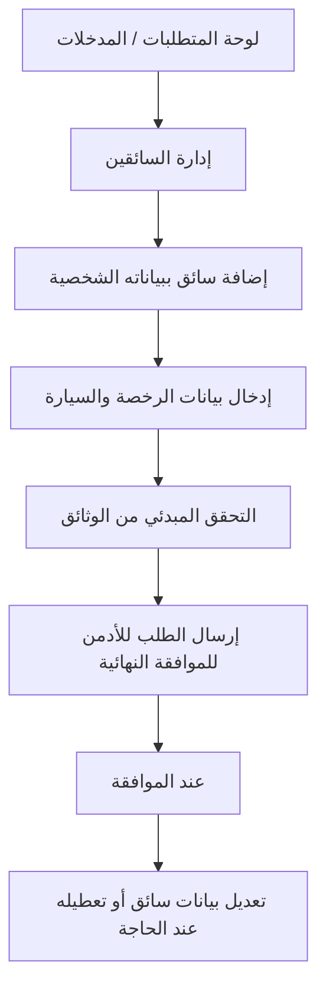

### لوحات — العنوان والمحتويات

#### **لوحة المتطلبات / المدخلات** _(مستنتجة)_

1. حساب مطعم معتمد (F01).
2. بيانات السائق ووثائقه كاملة.

#### **إدارة السائقين** _(مستنتجة)_

1. فتح شاشة  في اللوحة

#### **إضافة سائق ببياناته الشخصية** _(مستنتجة)_

1. إضافة سائق ببياناته الشخصية (اسم
2. هاتف
3. بريد)

#### **إدخال بيانات الرخصة والسيارة** _(مستنتجة)_

1. إدخال بيانات الرخصة (رقم
2. انتهاء
3. صورة) والسيارة (نوع
4. لون
5. لوحة
6. رقم محرك
7. وثيقة
8. صور)

#### **التحقق المبدئي من الوثائق** _(مستنتجة)_

1. التحقق المبدئي من الوثائق

#### **إرسال الطلب للأدمن للموافقة النهائية** _(مستنتجة)_

1. إرسال الطلب للأدمن للموافقة النهائية

#### **عند الموافقة** _(مستنتجة)_

1. تفعيل السائق ليصبح قابلًا لاستلام الطلبات

#### **تعديل بيانات سائق أو تعطيله عند الحاجة** _(مستنتجة)_

1. تعديل بيانات سائق أو تعطيله عند الحاجة

---

## F24 — إدارة القوائم والوجبات والأسعار

**الهدف:** يضيف المطعم ويعدّل قوائمه ووجباته وأسعارها وبياناتها الغذائية باللغتين من لوحته.
تخضع كل إضافة أو تعديل أو إلغاء لموافقة الأدمن، ولا يمكن إلغاء وجبة فوريًا.

### Flowchart

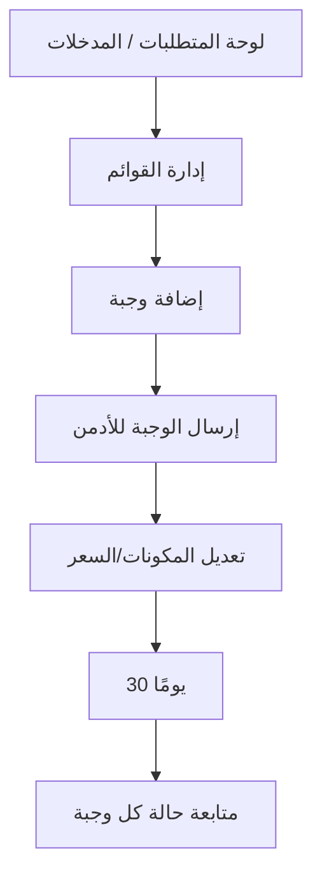

### لوحات — العنوان والمحتويات

#### **لوحة المتطلبات / المدخلات** _(مستنتجة)_

1. حساب مطعم معتمد (F01).
2. بيانات الوجبات والمكونات والقيم الغذائية باللغتين (F29).

#### **إدارة القوائم** _(مستنتجة)_

1. فتح شاشة  في اللوحة

#### **إضافة وجبة** _(مستنتجة)_

1. الاسم
2. المكونات
3. القيم الغذائية
4. السعر — باللغتين

#### **إرسال الوجبة للأدمن** _(مستنتجة)_

1. إرسال الوجبة للأدمن → لا تظهر للعملاء قبل الموافقة

#### **تعديل المكونات/السعر** _(مستنتجة)_

1. تعديل المكونات/السعر → يتطلب موافقة الأدمن أيضًا

#### **30 يومًا** _(مستنتجة)_

1. طلب إلغاء وجبة → بعد موافقة الأدمن يلتزم المطعم بتوفيرها للطلبات القائمة 30 يومًا

#### **متابعة حالة كل وجبة** _(مستنتجة)_

1. متابعة حالة كل وجبة (قيد المراجعة / معتمدة)

---

## F25 — طلب إنهاء التعاقد والالتزامات

**الهدف:** يقدّم المطعم الراغب في التوقف «طلب إنهاء تعاقد» للأدمن من لوحته.
يلتزم المطعم بتوفير كل الطلبات القائمة والمجدولة لمدة لا تقل عن 30 يومًا من تاريخ الطلب لضمان عدم تعطّل العملاء.

### Flowchart

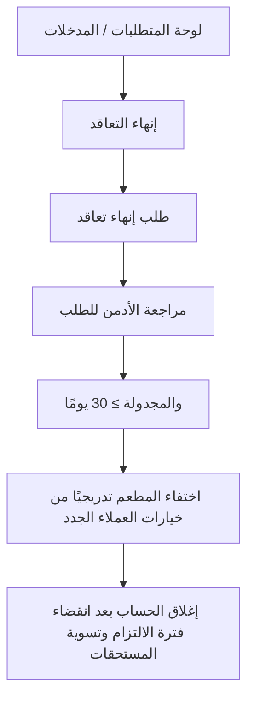

### لوحات — العنوان والمحتويات

#### **لوحة المتطلبات / المدخلات** _(مستنتجة)_

1. حساب مطعم معتمد ونشط.
2. معرفة الطلبات القائمة والمجدولة قبل التقديم.

#### **إنهاء التعاقد** _(مستنتجة)_

1. فتح شاشة  في اللوحة

#### **طلب إنهاء تعاقد** _(مستنتجة)_

1. تقديم  مع التاريخ والسبب

#### **مراجعة الأدمن للطلب** _(مستنتجة)_

1. مراجعة الأدمن للطلب

#### **والمجدولة ≥ 30 يومًا** _(مستنتجة)_

1. الالتزام بتوفير كل الطلبات القائمة والمجدولة ≥ 30 يومًا

#### **اختفاء المطعم تدريجيًا من خيارات العملاء الجدد** _(مستنتجة)_

1. اختفاء المطعم تدريجيًا من خيارات العملاء الجدد

#### **إغلاق الحساب بعد انقضاء فترة الالتزام وتسوية المستحقات** _(مستنتجة)_

1. إغلاق الحساب بعد انقضاء فترة الالتزام وتسوية المستحقات (F26)

---

## F26 — التسويات والمستحقات المالية

**الهدف:** يتابع المطعم تسوياته ومستحقاته المالية المبنية على عدد البوكسات الفعلية المُسلّمة، بعد خصم العمولة الديناميكية ورسوم الاشتراك.
يعرض النظام كشف تسوية واضحًا في لوحة المطعم.

### Flowchart

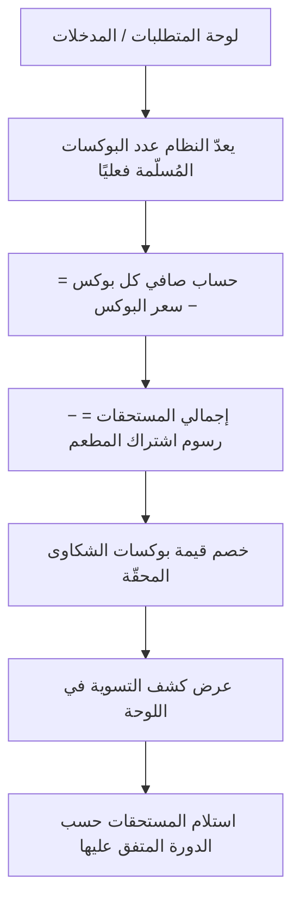

### لوحات — العنوان والمحتويات

#### **لوحة المتطلبات / المدخلات** _(مستنتجة)_

1. بوكسات مُسلّمة موثّقة عبر التتبع (F13).
2. نسبة العمولة الديناميكية للمطعم (F04) ورسوم الاشتراك إن وُجدت.

#### **يعدّ النظام عدد البوكسات المُسلّمة فعليًا** _(مستنتجة)_

1. يعدّ النظام عدد البوكسات المُسلّمة فعليًا

#### **حساب صافي كل بوكس = سعر البوكس −** _(مستنتجة)_

1. حساب صافي كل بوكس = سعر البوكس − (سعر البوكس × نسبة العمولة)

#### **إجمالي المستحقات = − رسوم اشتراك المطعم** _(مستنتجة)_

1. إجمالي المستحقات = (صافي البوكس × عدد البوكسات المُسلّمة) − رسوم اشتراك المطعم (إن استُحقت)

#### **خصم قيمة بوكسات الشكاوى المحقّة** _(مستنتجة)_

1. خصم قيمة بوكسات الشكاوى المحقّة (F16)

#### **عرض كشف التسوية في اللوحة** _(مستنتجة)_

1. عرض كشف التسوية في اللوحة

#### **استلام المستحقات حسب الدورة المتفق عليها** _(مستنتجة)_

1. استلام المستحقات حسب الدورة المتفق عليها

---

## F27 — تقارير المطعم والمبيعات

**الهدف:** يطّلع المطعم على تقارير أدائه ومبيعاته والوجبات الأكثر طلبًا من لوحته، لاتخاذ قرارات تشغيلية أفضل.
تنحصر التقارير في بيانات المطعم نفسه دون كشف بيانات العملاء الشخصية.

### Flowchart

```mermaid
flowchart TD
  f27_s1["لوحة المتطلبات / المدخلات"]
  f27_s2["التقارير"]
  f27_s3["عرض المبيعات وعدد البوكسات المُسلّمة خلال الفترة"]
  f27_s4["عرض الوجبات الأكثر طلبًا"]
  f27_s5["متابعة متوسط التقييمات"]
  f27_s6["ربط الأداء بالطاقة الاستيعابية والتسويات"]
  f27_s7["مراجعة/تصدير التقارير دوريًا"]
  f27_s1 --> f27_s2
  f27_s2 --> f27_s3
  f27_s3 --> f27_s4
  f27_s4 --> f27_s5
  f27_s5 --> f27_s6
  f27_s6 --> f27_s7
```

### لوحات — العنوان والمحتويات

#### **لوحة المتطلبات / المدخلات** _(مستنتجة)_

1. بيانات طلبات وتسليمات وتقييمات (F13/F15).
2. حساب مطعم معتمد.

#### **التقارير** _(مستنتجة)_

1. فتح لوحة  في اللوحة

#### **عرض المبيعات وعدد البوكسات المُسلّمة خلال الفترة** _(مستنتجة)_

1. عرض المبيعات وعدد البوكسات المُسلّمة خلال الفترة

#### **عرض الوجبات الأكثر طلبًا** _(مستنتجة)_

1. عرض الوجبات الأكثر طلبًا

#### **متابعة متوسط التقييمات** _(مستنتجة)_

1. متابعة متوسط التقييمات (F15)

#### **ربط الأداء بالطاقة الاستيعابية والتسويات** _(مستنتجة)_

1. ربط الأداء بالطاقة الاستيعابية (F08) والتسويات (F26)

#### **مراجعة/تصدير التقارير دوريًا** _(مستنتجة)_

1. مراجعة/تصدير التقارير دوريًا

---

## F29 — إدخال المحتوى الغذائي باللغتين

**الهدف:** يُدخل المطعم المحتوى الديناميكي (أسماء الوجبات، المكونات، البيانات الغذائية) بالعربية والإنجليزية.
يضمن ذلك عرض المحتوى للعميل بلغته المختارة وطباعته على الفواتير والملصقات باللغتين.

### Flowchart

```mermaid
flowchart TD
  f29_s1["لوحة المتطلبات / المدخلات"]
  f29_s2["إضافة/تعديل وجبة"]
  f29_s3["إدخال المكونات والقيم الغذائية باللغتين"]
  f29_s4["حفظ المحتوى ثنائي اللغة"]
  f29_s5["المحتوى للعميل بلغته المختارة"]
  f29_s6["تُطبع الفواتير والملصقات باللغتين تلقائيًا"]
  f29_s1 --> f29_s2
  f29_s2 --> f29_s3
  f29_s3 --> f29_s4
  f29_s4 --> f29_s5
  f29_s5 --> f29_s6
```

### لوحات — العنوان والمحتويات

#### **لوحة المتطلبات / المدخلات** _(مستنتجة)_

1. محتوى الوجبات والمكونات والقيم الغذائية (F24).
2. حساب مطعم معتمد.

#### **إضافة/تعديل وجبة** _(مستنتجة)_

1. عند إضافة/تعديل وجبة
2. إدخال الحقول بالعربية (RTL) والإنجليزية (LTR)

#### **إدخال المكونات والقيم الغذائية باللغتين** _(مستنتجة)_

1. إدخال المكونات والقيم الغذائية باللغتين

#### **حفظ المحتوى ثنائي اللغة** _(مستنتجة)_

1. حفظ المحتوى ثنائي اللغة

#### **المحتوى للعميل بلغته المختارة** _(مستنتجة)_

1. النظام يعرض المحتوى للعميل بلغته المختارة

#### **تُطبع الفواتير والملصقات باللغتين تلقائيًا** _(مستنتجة)_

1. تُطبع الفواتير والملصقات باللغتين تلقائيًا (F12)

---

## F31 — حدود بيانات العميل الظاهرة للمطعم

**الهدف:** ضمان خصوصية العميل بعدم كشف بياناته الشخصية للمطعم.
يرى المطعم فقط ما يلزم لتجهيز البوكسات وتسليمها، دون اسم العميل أو رقمه أو عنوانه الدقيق.

### Flowchart

```mermaid
flowchart TD
  f31_s1["لوحة المتطلبات / المدخلات"]
  f31_s2["استقبال الطلب ببيانات محدودة فقط"]
  f31_s3["الاطلاع على"]
  f31_s4["تجهيز البوكسات دون معرفة هوية العميل"]
  f31_s5["تسليم البوكسات للسائق المعتمد"]
  f31_s6["أي تواصل لازم يتم عبر قنوات المنصة الآمنة فقط"]
  f31_s1 --> f31_s2
  f31_s2 --> f31_s3
  f31_s3 --> f31_s4
  f31_s4 --> f31_s5
  f31_s5 --> f31_s6
```

### لوحات — العنوان والمحتويات

#### **لوحة المتطلبات / المدخلات** _(مستنتجة)_

1. نظام طلبات يعرض بيانات محدودة فقط.
2. التزام المطعم بمعايير الأمان والخصوصية.

#### **استقبال الطلب ببيانات محدودة فقط** _(مستنتجة)_

1. استقبال الطلب ببيانات محدودة فقط

#### **الاطلاع على** _(مستنتجة)_

1. عدد البوكسات
2. نوعها
3. الموقع العام للتوصيل
4. وقت التوصيل المطلوب

#### **تجهيز البوكسات دون معرفة هوية العميل** _(مستنتجة)_

1. تجهيز البوكسات دون معرفة هوية العميل

#### **تسليم البوكسات للسائق المعتمد** _(مستنتجة)_

1. تسليم البوكسات للسائق المعتمد (F13)

#### **أي تواصل لازم يتم عبر قنوات المنصة الآمنة فقط** _(مستنتجة)_

1. أي تواصل لازم يتم عبر قنوات المنصة الآمنة فقط

---

