# المطعم — Lifecycle Flowcharts (تفصيلي)

> **الدور:** المطعم | **المنصة:** Angular — لوحة ويب

> **ملف مستقل كامل** — دورة حياة + flowcharts + شاشات/لوحات + خطوات workflow + قواعد.

> افتح **Preview** (`Ctrl+Shift+V`) لرؤية Mermaid.

---

## 1. دورة الحياة الكاملة

### 1.1 خريطة الميزات (Flowchart)

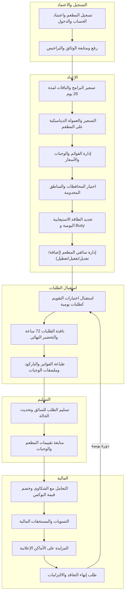

### 1.2 مسار الشاشات/اللوحات الكامل (Flowchart)

```mermaid
flowchart TD
 p1_f01_s1["لوحة المتطلبات / المدخلات"]
 p1_f01_s2["تسجيل مطعم جديد"]
 p1_f01_s3["إدخال بيانات الشركة والمالك والنشاط"]
 p1_f01_s4["رفع الوثائق المطلوبة"]
 p1_f01_s5["تحديد المناطق المخدومة مبدئيًا"]
 p1_f01_s6["قيد المراجعة"]
 p1_f01_s7["مراجعة الأدمن للبيانات والوثائق"]
 p1_f01_s8["عند الموافقة"]
 p1_f01_s9["نسيت كلمة المرور"]
 p1_f01_s1 --> p1_f01_s2
 p1_f01_s2 --> p1_f01_s3
 p1_f01_s3 --> p1_f01_s4
 p1_f01_s4 --> p1_f01_s5
 p1_f01_s5 --> p1_f01_s6
 p1_f01_s6 --> p1_f01_s7
 p1_f01_s7 --> p1_f01_s8
 p1_f01_s8 --> p1_f01_s9
 p1_f22_s1["لوحة المتطلبات / المدخلات"]
 p1_f22_s2["تسجيل بيانات المطعم/الشركة/المالك"]
 p1_f22_s3["رفع: السجل التجاري"]
 p1_f22_s4["إدخال تاريخ إصدار وانتهاء لكل وثيقة"]
 p1_f22_s5["إرسال الوثائق للأدمن للاعتماد"]
 p1_f22_s6["(معتمدة / مرفوضة / قرب الانتهاء)"]
 p1_f22_s7["رفع نسخة جديدة عند التنبيه بقرب الانتهاء"]
 p1_f22_s1 --> p1_f22_s2
 p1_f22_s2 --> p1_f22_s3
 p1_f22_s3 --> p1_f22_s4
 p1_f22_s4 --> p1_f22_s5
 p1_f22_s5 --> p1_f22_s6
 p1_f22_s6 --> p1_f22_s7
 p1_f01_s9 --> p1_f22_s1
 p2_f02_s1["لوحة المتطلبات / المدخلات"]
 p2_f02_s2["التسعير"]
 p2_f02_s3["اختيار البرنامج الغذائي المطلوب تسعيره"]
 p2_f02_s4["اختيار الباقة المرتبطة"]
 p2_f02_s5["إدخال سعر اشتراك 26 يوم لكل تركيبة"]
 p2_f02_s6["قيمة البوكس اليومي"]
 p2_f02_s7["حفظ الأسعار وإرسالها"]
 p2_f02_s8["يستخدم الأسعار في التصنيف ومتوسط القروب"]
 p2_f02_s1 --> p2_f02_s2
 p2_f02_s2 --> p2_f02_s3
 p2_f02_s3 --> p2_f02_s4
 p2_f02_s4 --> p2_f02_s5
 p2_f02_s5 --> p2_f02_s6
 p2_f02_s6 --> p2_f02_s7
 p2_f02_s7 --> p2_f02_s8
 p1_f22_s7 --> p2_f02_s1
 p2_f04_s1["لوحة المتطلبات / المدخلات"]
 p2_f04_s2["يحدد الأدمن نسبة عمولة خاصة بالمطعم (مثال"]
 p2_f04_s3["يطّلع المطعم على نسبته الحالية في لوحته"]
 p2_f04_s4["لكل بوكس مُسلّم"]
 p2_f04_s5["مراجعة الصافي المتوقع لكل بوكس قبل التسوية"]
 p2_f04_s6["متابعة الإجمالي ضمن التسويات"]
 p2_f04_s1 --> p2_f04_s2
 p2_f04_s2 --> p2_f04_s3
 p2_f04_s3 --> p2_f04_s4
 p2_f04_s4 --> p2_f04_s5
 p2_f04_s5 --> p2_f04_s6
 p2_f02_s8 --> p2_f04_s1
 p2_f24_s1["لوحة المتطلبات / المدخلات"]
 p2_f24_s2["إدارة القوائم"]
 p2_f24_s3["إضافة وجبة"]
 p2_f24_s4["إرسال الوجبة للأدمن"]
 p2_f24_s5["تعديل المكونات/السعر"]
 p2_f24_s6["30 يومًا"]
 p2_f24_s7["متابعة حالة كل وجبة"]
 p2_f24_s1 --> p2_f24_s2
 p2_f24_s2 --> p2_f24_s3
 p2_f24_s3 --> p2_f24_s4
 p2_f24_s4 --> p2_f24_s5
 p2_f24_s5 --> p2_f24_s6
 p2_f24_s6 --> p2_f24_s7
 p2_f04_s6 --> p2_f24_s1
 p2_f21_s1["لوحة المتطلبات / المدخلات"]
 p2_f21_s2["المناطق والتغطية"]
 p2_f21_s3["اختيار المحافظات"]
 p2_f21_s4["اختيار محافظة كاملة = تغطية كل مناطقها تلقائيًا"]
 p2_f21_s5["تحديد مناطق فرعية بعينها"]
 p2_f21_s6["حفظ التغطية"]
 p2_f21_s7["إظهار المطعم لعملاء المناطق المختارة فقط"]
 p2_f21_s1 --> p2_f21_s2
 p2_f21_s2 --> p2_f21_s3
 p2_f21_s3 --> p2_f21_s4
 p2_f21_s4 --> p2_f21_s5
 p2_f21_s5 --> p2_f21_s6
 p2_f21_s6 --> p2_f21_s7
 p2_f24_s7 --> p2_f21_s1
 p2_f08_s1["لوحة المتطلبات / المدخلات"]
 p2_f08_s2["الطاقة الاستيعابية"]
 p2_f08_s3["إدخال حد البوكسات اليومي الأقصى"]
 p2_f08_s4["حفظ الإعداد"]
 p2_f08_s5["يعدّ النظام الطلبات المؤكدة لحظيًا لكل يوم"]
 p2_f08_s6["بلوغ الحد → يصبح المطعم Busy لذلك اليوم في واجهة ا"]
 p2_f08_s7["متابعة العدّاد اليومي وحالة Busy في اللوحة"]
 p2_f08_s1 --> p2_f08_s2
 p2_f08_s2 --> p2_f08_s3
 p2_f08_s3 --> p2_f08_s4
 p2_f08_s4 --> p2_f08_s5
 p2_f08_s5 --> p2_f08_s6
 p2_f08_s6 --> p2_f08_s7
 p2_f21_s7 --> p2_f08_s1
 p2_f23_s1["لوحة المتطلبات / المدخلات"]
 p2_f23_s2["إدارة السائقين"]
 p2_f23_s3["إضافة سائق ببياناته الشخصية"]
 p2_f23_s4["إدخال بيانات الرخصة والسيارة"]
 p2_f23_s5["التحقق المبدئي من الوثائق"]
 p2_f23_s6["إرسال الطلب للأدمن للموافقة النهائية"]
 p2_f23_s7["عند الموافقة"]
 p2_f23_s8["تعديل بيانات سائق أو تعطيله عند الحاجة"]
 p2_f23_s1 --> p2_f23_s2
 p2_f23_s2 --> p2_f23_s3
 p2_f23_s3 --> p2_f23_s4
 p2_f23_s4 --> p2_f23_s5
 p2_f23_s5 --> p2_f23_s6
 p2_f23_s6 --> p2_f23_s7
 p2_f23_s7 --> p2_f23_s8
 p2_f08_s7 --> p2_f23_s1
 p3_f05_s1["لوحة المتطلبات / المدخلات"]
 p3_f05_s2["اليوم والمطعم والبوكس من تطبيقه"]
 p3_f05_s3["−72h"]
 p3_f05_s4["24 ساعة"]
 p3_f05_s5["إذا لم يُؤكَّد"]
 p3_f05_s6["−24h"]
 p3_f05_s7["يعرض المطعم الطلب"]
 p3_f05_s8["يبدأ التحضير النهائي ويُصدر الفواتير والملصقات"]
 p3_f05_s1 --> p3_f05_s2
 p3_f05_s2 --> p3_f05_s3
 p3_f05_s3 --> p3_f05_s4
 p3_f05_s4 --> p3_f05_s5
 p3_f05_s5 --> p3_f05_s6
 p3_f05_s6 --> p3_f05_s7
 p3_f05_s7 --> p3_f05_s8
 p2_f23_s8 --> p3_f05_s1
 p3_f06_s1["لوحة المتطلبات / المدخلات"]
 p3_f06_s2["المطعم"]
 p3_f06_s3["24 ساعة"]
 p3_f06_s4["لم يُؤكَّد"]
 p3_f06_s5["−24h"]
 p3_f06_s6["تتولّد الفواتير + الباركود + ملصقات الوجبات ويبدأ"]
 p3_f06_s7["تجهيز البوكسات للتسليم للسائق"]
 p3_f06_s1 --> p3_f06_s2
 p3_f06_s2 --> p3_f06_s3
 p3_f06_s3 --> p3_f06_s4
 p3_f06_s4 --> p3_f06_s5
 p3_f06_s5 --> p3_f06_s6
 p3_f06_s6 --> p3_f06_s7
 p3_f05_s8 --> p3_f06_s1
 p3_f12_s1["لوحة المتطلبات / المدخلات"]
 p3_f12_s2["المطعم"]
 p3_f12_s3["عرض الفاتورة"]
 p3_f12_s4["توليد ملصق منفصل لكل وجبة"]
 p3_f12_s5["طباعة الفواتير والملصقات باللغتين"]
 p3_f12_s6["لصق الملصق على كل بوكس"]
 p3_f12_s7["تسليم البوكسات للسائق الذي يمسح الباركود"]
 p3_f12_s1 --> p3_f12_s2
 p3_f12_s2 --> p3_f12_s3
 p3_f12_s3 --> p3_f12_s4
 p3_f12_s4 --> p3_f12_s5
 p3_f12_s5 --> p3_f12_s6
 p3_f12_s6 --> p3_f12_s7
 p3_f06_s7 --> p3_f12_s1
 p4_f13_s1["لوحة المتطلبات / المدخلات"]
 p4_f13_s2["قيد التحضير"]
 p4_f13_s3["استلام السائق المعتمد للبوكسات ومسح الباركود"]
 p4_f13_s4["تم الاستلام وفي الطريق"]
 p4_f13_s5["المطعم"]
 p4_f13_s6["تم التسليم"]
 p4_f13_s1 --> p4_f13_s2
 p4_f13_s2 --> p4_f13_s3
 p4_f13_s3 --> p4_f13_s4
 p4_f13_s4 --> p4_f13_s5
 p4_f13_s5 --> p4_f13_s6
 p3_f12_s7 --> p4_f13_s1
 p4_f15_s1["لوحة المتطلبات / المدخلات"]
 p4_f15_s2["بعد التسليم يقيّم العميل خلال أقل من 30 ثانية"]
 p4_f15_s3["المطعم"]
 p4_f15_s4["عرض متوسط التقييم والوجبات الأعلى/الأدنى تقييمًا"]
 p4_f15_s5["مراجعة تعليقات العملاء"]
 p4_f15_s6["متابعة أثر التقييمات على تقارير الأداء"]
 p4_f15_s1 --> p4_f15_s2
 p4_f15_s2 --> p4_f15_s3
 p4_f15_s3 --> p4_f15_s4
 p4_f15_s4 --> p4_f15_s5
 p4_f15_s5 --> p4_f15_s6
 p4_f13_s6 --> p4_f15_s1
 p5_f16_s1["لوحة المتطلبات / المدخلات"]
 p5_f16_s2["يقدّم العميل شكوى بصور"]
 p5_f16_s3["يطّلع المطعم على تفاصيل الشكوى والصور في لوحته"]
 p5_f16_s4["الشكوى ويؤكد صحتها من عدمها"]
 p5_f16_s5["عند الصحة"]
 p5_f16_s6["متابعة الخصم ضمن كشف التسويات"]
 p5_f16_s1 --> p5_f16_s2
 p5_f16_s2 --> p5_f16_s3
 p5_f16_s3 --> p5_f16_s4
 p5_f16_s4 --> p5_f16_s5
 p5_f16_s5 --> p5_f16_s6
 p4_f15_s6 --> p5_f16_s1
 p5_f26_s1["لوحة المتطلبات / المدخلات"]
 p5_f26_s2["يعدّ النظام عدد البوكسات المُسلّمة فعليًا"]
 p5_f26_s3["حساب صافي كل بوكس = سعر البوكس −"]
 p5_f26_s4["إجمالي المستحقات = − رسوم اشتراك المطعم"]
 p5_f26_s5["خصم قيمة بوكسات الشكاوى المحقّة"]
 p5_f26_s6["عرض كشف التسوية في اللوحة"]
 p5_f26_s7["استلام المستحقات حسب الدورة المتفق عليها"]
 p5_f26_s1 --> p5_f26_s2
 p5_f26_s2 --> p5_f26_s3
 p5_f26_s3 --> p5_f26_s4
 p5_f26_s4 --> p5_f26_s5
 p5_f26_s5 --> p5_f26_s6
 p5_f26_s6 --> p5_f26_s7
 p5_f16_s6 --> p5_f26_s1
 p5_f20_s1["لوحة المتطلبات / المدخلات"]
 p5_f20_s2["الإعلانات والمزايدات"]
 p5_f20_s3["اختيار المنطقة المستهدفة"]
 p5_f20_s4["المنطقة (مزايدة)"]
 p5_f20_s5["تقديم قيمة المزايدة"]
 p5_f20_s6["انتظار نتيجة المزايدة"]
 p5_f20_s7["عند الفوز"]
 p5_f20_s1 --> p5_f20_s2
 p5_f20_s2 --> p5_f20_s3
 p5_f20_s3 --> p5_f20_s4
 p5_f20_s4 --> p5_f20_s5
 p5_f20_s5 --> p5_f20_s6
 p5_f20_s6 --> p5_f20_s7
 p5_f26_s7 --> p5_f20_s1
 p5_f25_s1["لوحة المتطلبات / المدخلات"]
 p5_f25_s2["إنهاء التعاقد"]
 p5_f25_s3["طلب إنهاء تعاقد"]
 p5_f25_s4["مراجعة الأدمن للطلب"]
 p5_f25_s5["والمجدولة ≥ 30 يومًا"]
 p5_f25_s6["اختفاء المطعم تدريجيًا من خيارات العملاء الجدد"]
 p5_f25_s7["إغلاق الحساب بعد انقضاء فترة الالتزام وتسوية المست"]
 p5_f25_s1 --> p5_f25_s2
 p5_f25_s2 --> p5_f25_s3
 p5_f25_s3 --> p5_f25_s4
 p5_f25_s4 --> p5_f25_s5
 p5_f25_s5 --> p5_f25_s6
 p5_f25_s6 --> p5_f25_s7
 p5_f20_s7 --> p5_f25_s1
```

### تفاصيل دورة الحياة (نص)

#### المرحلة 1: **التسجيل والاعتماد**

**الميزات:** تسجيل المطعم واعتماد الحساب والدخول · رفع ومتابعة الوثائق والتراخيص

**عدد لوحات:** 16

**الخطوات الرئيسية:**

1. تسجيل + وثائق
2. اعتماد الأدمن
3. تفعيل — ظهور بعد الأسعار والقوائم

**لوحات في هذه المرحلة:**

- **تسجيل المطعم واعتماد الحساب والدخول:** لوحة المتطلبات / المدخلات → تسجيل مطعم جديد → إدخال بيانات الشركة والمالك والنشاط → رفع الوثائق المطلوبة → تحديد المناطق المخدومة مبدئيًا → قيد المراجعة → مراجعة الأدمن للبيانات والوثائق → عند الموافقة → نسيت كلمة المرور
- **رفع ومتابعة الوثائق والتراخيص:** لوحة المتطلبات / المدخلات → تسجيل بيانات المطعم/الشركة/المالك → رفع: السجل التجاري → إدخال تاريخ إصدار وانتهاء لكل وثيقة → إرسال الوثائق للأدمن للاعتماد → (معتمدة / مرفوضة / قرب الانتهاء) → رفع نسخة جديدة عند التنبيه بقرب الانتهاء

#### المرحلة 2: **الإعداد**

**الميزات:** تسعير البرامج والباقات لمدة 26 يوم · التسعير والعمولة الديناميكية على المطعم · إدارة القوائم والوجبات والأسعار · اختيار المحافظات والمناطق المخدومة · تحديد الطاقة الاستيعابية اليومية و Busy · إدارة سائقي المطعم (إضافة/تعديل/تفعيل/تعطيل)

**عدد لوحات:** 43

**الخطوات الرئيسية:**

4. تسعير 26 يوم + عمولة
5. قائمة + حساسية
6. مناطق | طاقة Busy | سائقين

**لوحات في هذه المرحلة:**

- **تسعير البرامج والباقات لمدة 26 يوم:** لوحة المتطلبات / المدخلات → التسعير → اختيار البرنامج الغذائي المطلوب تسعيره → اختيار الباقة المرتبطة → إدخال سعر اشتراك 26 يوم لكل تركيبة → قيمة البوكس اليومي → حفظ الأسعار وإرسالها → يستخدم الأسعار في التصنيف ومتوسط القروب
- **التسعير والعمولة الديناميكية على المطعم:** لوحة المتطلبات / المدخلات → يحدد الأدمن نسبة عمولة خاصة بالمطعم (مثال → يطّلع المطعم على نسبته الحالية في لوحته → لكل بوكس مُسلّم → مراجعة الصافي المتوقع لكل بوكس قبل التسوية → متابعة الإجمالي ضمن التسويات
- **إدارة القوائم والوجبات والأسعار:** لوحة المتطلبات / المدخلات → إدارة القوائم → إضافة وجبة → إرسال الوجبة للأدمن → تعديل المكونات/السعر → 30 يومًا → متابعة حالة كل وجبة
- **اختيار المحافظات والمناطق المخدومة:** لوحة المتطلبات / المدخلات → المناطق والتغطية → اختيار المحافظات → اختيار محافظة كاملة = تغطية كل مناطقها تلقائيًا → تحديد مناطق فرعية بعينها → حفظ التغطية → إظهار المطعم لعملاء المناطق المختارة فقط
- **تحديد الطاقة الاستيعابية اليومية و Busy:** لوحة المتطلبات / المدخلات → الطاقة الاستيعابية → إدخال حد البوكسات اليومي الأقصى → حفظ الإعداد → يعدّ النظام الطلبات المؤكدة لحظيًا لكل يوم → بلوغ الحد → يصبح المطعم Busy لذلك اليوم في واجهة العميل → متابعة العدّاد اليومي وحالة Busy في اللوحة
- **إدارة سائقي المطعم (إضافة/تعديل/تفعيل/تعطيل):** لوحة المتطلبات / المدخلات → إدارة السائقين → إضافة سائق ببياناته الشخصية → إدخال بيانات الرخصة والسيارة → التحقق المبدئي من الوثائق → إرسال الطلب للأدمن للموافقة النهائية → عند الموافقة → تعديل بيانات سائق أو تعطيله عند الحاجة

#### المرحلة 3: **استقبال الطلبات**

**الميزات:** استقبال اختيارات التقويم كطلبات يومية · نافذة الطلبات 72 ساعة والتحضير النهائي · طباعة الفواتير والباركود وملصقات الوجبات

**عدد لوحات:** 22

**الخطوات الرئيسية:**

7. طلبات من التقويم
8. قفل 48h واستلام الطلبات
9. طباعة فواتير/باركود/ملصقات → تحضير

**لوحات في هذه المرحلة:**

- **استقبال اختيارات التقويم كطلبات يومية:** لوحة المتطلبات / المدخلات → اليوم والمطعم والبوكس من تطبيقه → −72h → 24 ساعة → إذا لم يُؤكَّد → −24h → يعرض المطعم الطلب → يبدأ التحضير النهائي ويُصدر الفواتير والملصقات
- **نافذة الطلبات 72 ساعة والتحضير النهائي:** لوحة المتطلبات / المدخلات → المطعم → 24 ساعة → لم يُؤكَّد → −24h → تتولّد الفواتير + الباركود + ملصقات الوجبات ويبدأ التحضير النهائي → تجهيز البوكسات للتسليم للسائق
- **طباعة الفواتير والباركود وملصقات الوجبات:** لوحة المتطلبات / المدخلات → المطعم → عرض الفاتورة → توليد ملصق منفصل لكل وجبة → طباعة الفواتير والملصقات باللغتين → لصق الملصق على كل بوكس → تسليم البوكسات للسائق الذي يمسح الباركود

#### المرحلة 4: **التسليم**

**الميزات:** تسليم الطلب للسائق وتحديث الحالة · متابعة تقييمات المطعم والوجبات

**عدد لوحات:** 12

**الخطوات الرئيسية:**

10. تسليم للمندوب + باركود
11. متابعة تقييمات العملاء

**لوحات في هذه المرحلة:**

- **تسليم الطلب للسائق وتحديث الحالة:** لوحة المتطلبات / المدخلات → قيد التحضير → استلام السائق المعتمد للبوكسات ومسح الباركود → تم الاستلام وفي الطريق → المطعم → تم التسليم
- **متابعة تقييمات المطعم والوجبات:** لوحة المتطلبات / المدخلات → بعد التسليم يقيّم العميل خلال أقل من 30 ثانية → المطعم → عرض متوسط التقييم والوجبات الأعلى/الأدنى تقييمًا → مراجعة تعليقات العملاء → متابعة أثر التقييمات على تقارير الأداء

#### المرحلة 5: **المالية**

**الميزات:** التعامل مع الشكاوى وخصم قيمة البوكس · التسويات والمستحقات المالية · المزايدة على الأماكن الإعلانية · طلب إنهاء التعاقد والالتزامات

**عدد لوحات:** 27

**الخطوات الرئيسية:**

12. شكوى وخصم | تسوية
13. إعلانات | Exit Policy
14. ↺ طلبات جديدة

**لوحات في هذه المرحلة:**

- **التعامل مع الشكاوى وخصم قيمة البوكس:** لوحة المتطلبات / المدخلات → يقدّم العميل شكوى بصور → يطّلع المطعم على تفاصيل الشكوى والصور في لوحته → الشكوى ويؤكد صحتها من عدمها → عند الصحة → متابعة الخصم ضمن كشف التسويات
- **التسويات والمستحقات المالية:** لوحة المتطلبات / المدخلات → يعدّ النظام عدد البوكسات المُسلّمة فعليًا → حساب صافي كل بوكس = سعر البوكس − → إجمالي المستحقات = − رسوم اشتراك المطعم → خصم قيمة بوكسات الشكاوى المحقّة → عرض كشف التسوية في اللوحة → استلام المستحقات حسب الدورة المتفق عليها
- **المزايدة على الأماكن الإعلانية:** لوحة المتطلبات / المدخلات → الإعلانات والمزايدات → اختيار المنطقة المستهدفة → المنطقة (مزايدة) → تقديم قيمة المزايدة → انتظار نتيجة المزايدة → عند الفوز
- **طلب إنهاء التعاقد والالتزامات:** لوحة المتطلبات / المدخلات → إنهاء التعاقد → طلب إنهاء تعاقد → مراجعة الأدمن للطلب → والمجدولة ≥ 30 يومًا → اختفاء المطعم تدريجيًا من خيارات العملاء الجدد → إغلاق الحساب بعد انقضاء فترة الالتزام وتسوية المستحقات


---

## 2. الحلقة التشغيلية

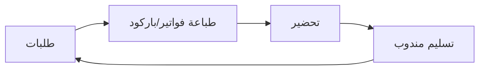

---

## 3. تفاصيل المراحل (Flowcharts + شاشات + Workflow)

### المرحلة 1: **التسجيل والاعتماد** — 2 ميزة | 16 لوحات

**الميزات:** تسجيل المطعم واعتماد الحساب والدخول · رفع ومتابعة الوثائق والتراخيص

#### ملخص المرحلة

1. تسجيل + وثائق
2. اعتماد الأدمن
3. تفعيل — ظهور بعد الأسعار والقوائم

#### Flowchart شامل للمرحلة

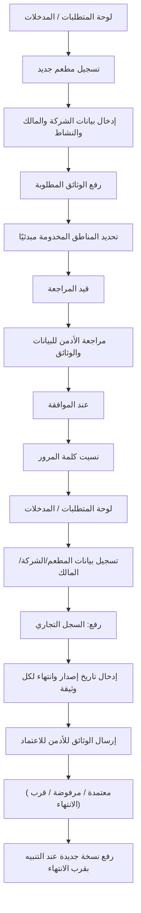

#### تفاصيل كل ميزة

#### **تسجيل المطعم واعتماد الحساب والدخول**

**الهدف:** تسجيل المطعم رسميًا على المنصة عبر لوحة تحكم ويب (وليس تطبيق موبايل)، برفع بيانات الشركة الرسمية ووثائقها، ثم انتظار مراجعة الأدمن واعتماده.
لا يُفعّل الحساب ولا يظهر المطعم للعملاء إلا بعد موافقة الأدمن.

**Flowchart:**

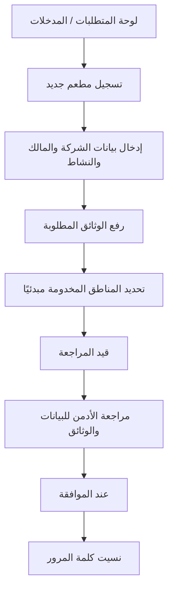

**لوحات — العنوان والمحتويات:**

#### **لوحة المتطلبات / المدخلات** _(مستنتجة)_

1. بيانات الشركة الرسمية وبيانات المالك (مرجع ).
2. وثائق إلزامية: السجل التجاري، عقد التأسيس، ترخيص الشركة، وأي وثائق مطلوبة بتواريخ إصدار وانتهاء.
3. بريد إلكتروني/هاتف وكلمة مرور خاصة بلوحة المطعم.
4. المحافظات/المناطق المخدومة مبدئيًا (مرجع ).

#### **تسجيل مطعم جديد** _(مستنتجة)_

1. فتح صفحة على لوحة الويب

#### **إدخال بيانات الشركة والمالك والنشاط** _(مستنتجة)_

1. إدخال بيانات الشركة والمالك والنشاط

#### **رفع الوثائق المطلوبة** _(مستنتجة)_

1. رفع الوثائق المطلوبة مع تواريخ الإصدار والانتهاء

#### **تحديد المناطق المخدومة مبدئيًا** _(مستنتجة)_

1. تحديد المناطق المخدومة مبدئيًا

#### **قيد المراجعة** _(مستنتجة)_

1. إرسال الطلب → ينتقل الحساب إلى حالة

#### **مراجعة الأدمن للبيانات والوثائق** _(مستنتجة)_

1. مراجعة الأدمن للبيانات والوثائق

#### **عند الموافقة** _(مستنتجة)_

1. تفعيل الحساب وإشعار المطعم
2. ويصبح ظاهرًا للعملاء بعد إكمال الأسعار والقوائم المعتمدة

#### **نسيت كلمة المرور** _(مستنتجة)_

1. الدخول لاحقًا عبر تسجيل دخول خاص (Email/Phone
2. Password) مع خيار

**خطوات Workflow:**

1. فتح صفحة "تسجيل مطعم جديد" على لوحة الويب
2. إدخال بيانات الشركة والمالك والنشاط
3. رفع الوثائق المطلوبة مع تواريخ الإصدار والانتهاء
4. تحديد المناطق المخدومة مبدئيًا
5. إرسال الطلب → ينتقل الحساب إلى حالة "قيد المراجعة"
6. مراجعة الأدمن للبيانات والوثائق
7. عند الموافقة: تفعيل الحساب وإشعار المطعم، ويصبح ظاهرًا للعملاء بعد إكمال الأسعار والقوائم المعتمدة
8. الدخول لاحقًا عبر تسجيل دخول خاص (Email/Phone + Password) مع خيار "نسيت كلمة المرور"

**حالات واستثناءات:**

1. رفض الأدمن بسبب نقص/خطأ وثيقة → إشعار بالسبب وإعادة الرفع
2. الحساب "قيد المراجعة" لا يستقبل طلبات ولا يظهر للعملاء
3. وثيقة منتهية أو ناقصة توقف الاعتماد (مرجع )
4. نسيان كلمة المرور → استرجاع آمن عبر اللوحة

#### **رفع ومتابعة الوثائق والتراخيص**

**الهدف:** يسجّل المطعم بياناته ووثائقه الرسمية (السجل التجاري، عقد التأسيس، الترخيص...) مع تواريخ إصدار وانتهاء كل وثيقة.
يتابع المطعم تنبيهات انتهاء الوثائق ليحدّثها قبل إيقاف نشاطه.

**Flowchart:**

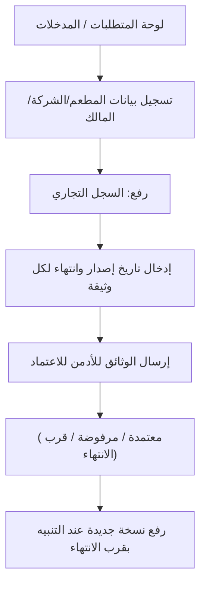

**لوحات — العنوان والمحتويات:**

#### **لوحة المتطلبات / المدخلات** _(مستنتجة)_

1. وثائق رسمية سارية المفعول.
2. بيانات الشركة والمالك.

#### **تسجيل بيانات المطعم/الشركة/المالك** _(مستنتجة)_

1. تسجيل بيانات المطعم/الشركة/المالك

#### **رفع: السجل التجاري** _(مستنتجة)_

1. رفع: السجل التجاري
2. عقد التأسيس
3. ترخيص الشركة
4. وأي وثائق مطلوبة

#### **إدخال تاريخ إصدار وانتهاء لكل وثيقة** _(مستنتجة)_

1. إدخال تاريخ إصدار وانتهاء لكل وثيقة

#### **إرسال الوثائق للأدمن للاعتماد** _(مستنتجة)_

1. إرسال الوثائق للأدمن للاعتماد

#### **(معتمدة / مرفوضة / قرب الانتهاء)** _(مستنتجة)_

1. متابعة حالة كل وثيقة في اللوحة (معتمدة / مرفوضة / قرب الانتهاء)

#### **رفع نسخة جديدة عند التنبيه بقرب الانتهاء** _(مستنتجة)_

1. رفع نسخة جديدة عند التنبيه بقرب الانتهاء

**خطوات Workflow:**

1. تسجيل بيانات المطعم/الشركة/المالك
2. رفع: السجل التجاري، عقد التأسيس، ترخيص الشركة، وأي وثائق مطلوبة
3. إدخال تاريخ إصدار وانتهاء لكل وثيقة
4. إرسال الوثائق للأدمن للاعتماد
5. متابعة حالة كل وثيقة في اللوحة (معتمدة / مرفوضة / قرب الانتهاء)
6. رفع نسخة جديدة عند التنبيه بقرب الانتهاء

**حالات واستثناءات:**

1. تنبيه قبل انتهاء الوثيقة بشهرين لرفع نسخة جديدة
2. قبل الانتهاء بشهر: إيقاف استقبال الطلبات الجديدة وإخفاء المطعم ووجباته مؤقتًا
3. استئناف النشاط فور اعتماد الوثائق المحدّثة

---

### المرحلة 2: **الإعداد** — 6 ميزة | 43 لوحات

**الميزات:** تسعير البرامج والباقات لمدة 26 يوم · التسعير والعمولة الديناميكية على المطعم · إدارة القوائم والوجبات والأسعار · اختيار المحافظات والمناطق المخدومة · تحديد الطاقة الاستيعابية اليومية و Busy · إدارة سائقي المطعم (إضافة/تعديل/تفعيل/تعطيل)

#### ملخص المرحلة

1. تسعير 26 يوم + عمولة
2. قائمة + حساسية
3. مناطق | طاقة Busy | سائقين

#### Flowchart شامل للمرحلة

```mermaid
flowchart TD
 p2_f02_s1["لوحة المتطلبات / المدخلات"]
 p2_f02_s2["التسعير"]
 p2_f02_s3["اختيار البرنامج الغذائي المطلوب تسعيره"]
 p2_f02_s4["اختيار الباقة المرتبطة"]
 p2_f02_s5["إدخال سعر اشتراك 26 يوم لكل تركيبة"]
 p2_f02_s6["قيمة البوكس اليومي"]
 p2_f02_s7["حفظ الأسعار وإرسالها"]
 p2_f02_s8["يستخدم الأسعار في التصنيف ومتوسط القروب"]
 p2_f02_s1 --> p2_f02_s2
 p2_f02_s2 --> p2_f02_s3
 p2_f02_s3 --> p2_f02_s4
 p2_f02_s4 --> p2_f02_s5
 p2_f02_s5 --> p2_f02_s6
 p2_f02_s6 --> p2_f02_s7
 p2_f02_s7 --> p2_f02_s8
 p2_f04_s1["لوحة المتطلبات / المدخلات"]
 p2_f04_s2["يحدد الأدمن نسبة عمولة خاصة بالمطعم (مثال"]
 p2_f04_s3["يطّلع المطعم على نسبته الحالية في لوحته"]
 p2_f04_s4["لكل بوكس مُسلّم"]
 p2_f04_s5["مراجعة الصافي المتوقع لكل بوكس قبل التسوية"]
 p2_f04_s6["متابعة الإجمالي ضمن التسويات"]
 p2_f04_s1 --> p2_f04_s2
 p2_f04_s2 --> p2_f04_s3
 p2_f04_s3 --> p2_f04_s4
 p2_f04_s4 --> p2_f04_s5
 p2_f04_s5 --> p2_f04_s6
 p2_f02_s8 --> p2_f04_s1
 p2_f24_s1["لوحة المتطلبات / المدخلات"]
 p2_f24_s2["إدارة القوائم"]
 p2_f24_s3["إضافة وجبة"]
 p2_f24_s4["إرسال الوجبة للأدمن"]
 p2_f24_s5["تعديل المكونات/السعر"]
 p2_f24_s6["30 يومًا"]
 p2_f24_s7["متابعة حالة كل وجبة"]
 p2_f24_s1 --> p2_f24_s2
 p2_f24_s2 --> p2_f24_s3
 p2_f24_s3 --> p2_f24_s4
 p2_f24_s4 --> p2_f24_s5
 p2_f24_s5 --> p2_f24_s6
 p2_f24_s6 --> p2_f24_s7
 p2_f04_s6 --> p2_f24_s1
 p2_f21_s1["لوحة المتطلبات / المدخلات"]
 p2_f21_s2["المناطق والتغطية"]
 p2_f21_s3["اختيار المحافظات"]
 p2_f21_s4["اختيار محافظة كاملة = تغطية كل مناطقها تلقائيًا"]
 p2_f21_s5["تحديد مناطق فرعية بعينها"]
 p2_f21_s6["حفظ التغطية"]
 p2_f21_s7["إظهار المطعم لعملاء المناطق المختارة فقط"]
 p2_f21_s1 --> p2_f21_s2
 p2_f21_s2 --> p2_f21_s3
 p2_f21_s3 --> p2_f21_s4
 p2_f21_s4 --> p2_f21_s5
 p2_f21_s5 --> p2_f21_s6
 p2_f21_s6 --> p2_f21_s7
 p2_f24_s7 --> p2_f21_s1
 p2_f08_s1["لوحة المتطلبات / المدخلات"]
 p2_f08_s2["الطاقة الاستيعابية"]
 p2_f08_s3["إدخال حد البوكسات اليومي الأقصى"]
 p2_f08_s4["حفظ الإعداد"]
 p2_f08_s5["يعدّ النظام الطلبات المؤكدة لحظيًا لكل يوم"]
 p2_f08_s6["بلوغ الحد → يصبح المطعم Busy لذلك اليوم في واجهة ا"]
 p2_f08_s7["متابعة العدّاد اليومي وحالة Busy في اللوحة"]
 p2_f08_s1 --> p2_f08_s2
 p2_f08_s2 --> p2_f08_s3
 p2_f08_s3 --> p2_f08_s4
 p2_f08_s4 --> p2_f08_s5
 p2_f08_s5 --> p2_f08_s6
 p2_f08_s6 --> p2_f08_s7
 p2_f21_s7 --> p2_f08_s1
 p2_f23_s1["لوحة المتطلبات / المدخلات"]
 p2_f23_s2["إدارة السائقين"]
 p2_f23_s3["إضافة سائق ببياناته الشخصية"]
 p2_f23_s4["إدخال بيانات الرخصة والسيارة"]
 p2_f23_s5["التحقق المبدئي من الوثائق"]
 p2_f23_s6["إرسال الطلب للأدمن للموافقة النهائية"]
 p2_f23_s7["عند الموافقة"]
 p2_f23_s8["تعديل بيانات سائق أو تعطيله عند الحاجة"]
 p2_f23_s1 --> p2_f23_s2
 p2_f23_s2 --> p2_f23_s3
 p2_f23_s3 --> p2_f23_s4
 p2_f23_s4 --> p2_f23_s5
 p2_f23_s5 --> p2_f23_s6
 p2_f23_s6 --> p2_f23_s7
 p2_f23_s7 --> p2_f23_s8
 p2_f08_s7 --> p2_f23_s1
```

#### تفاصيل كل ميزة

#### **تسعير البرامج والباقات لمدة 26 يوم**

**الهدف:** يحدد المطعم سعره الخاص لكل برنامج غذائي وكل باقة لمدة 26 يوم عمل من لوحته.
هذه الأسعار هي الأساس الذي يبني عليه النظام تصنيف المطعم وقيمة البوكس اليومي ومتوسطات القروب.

**Flowchart:**

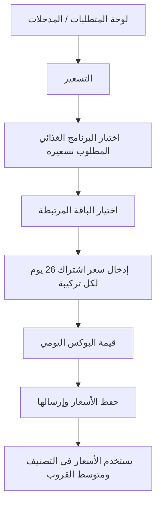

**لوحات — العنوان والمحتويات:**

#### **لوحة المتطلبات / المدخلات** _(مستنتجة)_

1. حساب مطعم معتمد ().
2. قائمة البرامج الغذائية (نزول وزن، ضخامة عضلية، محافظة، كيتو) والباقات (كاملة، غداء، مخصصة) كما يحددها الأدمن.
3. بيانات تكلفة المطعم لتسعير عادل.

#### **التسعير** _(مستنتجة)_

1. فتح شاشة في لوحة المطعم

#### **اختيار البرنامج الغذائي المطلوب تسعيره** _(مستنتجة)_

1. اختيار البرنامج الغذائي المطلوب تسعيره

#### **اختيار الباقة المرتبطة** _(مستنتجة)_

1. اختيار الباقة المرتبطة

#### **إدخال سعر اشتراك 26 يوم لكل تركيبة** _(مستنتجة)_

1. إدخال سعر اشتراك 26 يوم لكل تركيبة (برنامج × باقة)

#### **قيمة البوكس اليومي** _(مستنتجة)_

1. مراجعة المحسوبة تلقائيًا = السعر ÷ 26

#### **حفظ الأسعار وإرسالها** _(مستنتجة)_

1. حفظ الأسعار وإرسالها

#### **يستخدم الأسعار في التصنيف ومتوسط القروب** _(مستنتجة)_

1. النظام يستخدم الأسعار في التصنيف () ومتوسط القروب ()

**خطوات Workflow:**

1. فتح شاشة "التسعير" في لوحة المطعم
2. اختيار البرنامج الغذائي المطلوب تسعيره
3. اختيار الباقة المرتبطة
4. إدخال سعر اشتراك 26 يوم لكل تركيبة (برنامج × باقة)
5. مراجعة "قيمة البوكس اليومي" المحسوبة تلقائيًا = السعر ÷ 26
6. حفظ الأسعار وإرسالها
7. النظام يستخدم الأسعار في التصنيف ومتوسط القروب

**حالات واستثناءات:**

1. برنامج/باقة بدون سعر → لا يظهر المطعم ضمن تلك التركيبة للعملاء
2. تعديل أي سعر يعيد حساب التصنيف والمتوسطات تلقائيًا
3. قد يضيف الأدمن أو يلغي برامج/باقات ديناميكيًا → تتحدّث شاشة التسعير لدى المطعم

#### **التسعير والعمولة الديناميكية على المطعم**

**الهدف:** توضيح كيف تُحتسب العمولة الديناميكية الخاصة بالمطعم وتُخصم من «سعر البوكس المتفق عليه» بين المنصة والمطعم — وليس من سعر العميل.
يرى المطعم نسبته الخاصة وصافي مستحقه المتوقع لكل بوكس.

**Flowchart:**

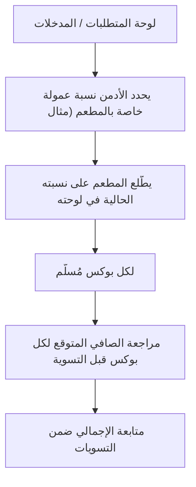

**لوحات — العنوان والمحتويات:**

#### **لوحة المتطلبات / المدخلات** _(مستنتجة)_

1. نسبة عمولة المطعم التي يحددها الأدمن (تختلف من مطعم لآخر).
2. سعر البوكس المتفق عليه بين المنصة والمطعم.

#### **يحدد الأدمن نسبة عمولة خاصة بالمطعم (مثال** _(مستنتجة)_

1. 15%)

#### **يطّلع المطعم على نسبته الحالية في لوحته** _(مستنتجة)_

1. يطّلع المطعم على نسبته الحالية في لوحته

#### **لكل بوكس مُسلّم** _(مستنتجة)_

1. صافي مستحق المطعم = سعر البوكس − (سعر البوكس × النسبة)

#### **مراجعة الصافي المتوقع لكل بوكس قبل التسوية** _(مستنتجة)_

1. مراجعة الصافي المتوقع لكل بوكس قبل التسوية

#### **متابعة الإجمالي ضمن التسويات** _(مستنتجة)_

1. متابعة الإجمالي ضمن التسويات ()

**خطوات Workflow:**

1. يحدد الأدمن نسبة عمولة خاصة بالمطعم (مثال: 15%)
2. يطّلع المطعم على نسبته الحالية في لوحته
3. لكل بوكس مُسلّم: صافي مستحق المطعم = سعر البوكس − (سعر البوكس × النسبة)
4. مراجعة الصافي المتوقع لكل بوكس قبل التسوية
5. متابعة الإجمالي ضمن التسويات

**حالات واستثناءات:**

1. تغيير الأدمن للنسبة يسري على البوكسات اللاحقة فقط
2. العمولة لا تمس سعر العميل النهائي إطلاقًا
3. قد تختلف النسبة بين مطعم وآخر (مثال: مطعم A 15%، مطعم B 20%)

#### **إدارة القوائم والوجبات والأسعار**

**الهدف:** يضيف المطعم ويعدّل قوائمه ووجباته وأسعارها وبياناتها الغذائية باللغتين من لوحته.
تخضع كل إضافة أو تعديل أو إلغاء لموافقة الأدمن، ولا يمكن إلغاء وجبة فوريًا.

**Flowchart:**

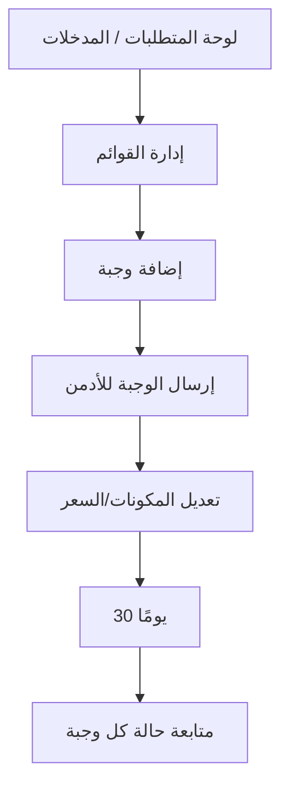

**لوحات — العنوان والمحتويات:**

#### **لوحة المتطلبات / المدخلات** _(مستنتجة)_

1. حساب مطعم معتمد ().
2. بيانات الوجبات والمكونات والقيم الغذائية باللغتين ().

#### **إدارة القوائم** _(مستنتجة)_

1. فتح شاشة في اللوحة

#### **إضافة وجبة** _(مستنتجة)_

1. الاسم
2. المكونات
3. القيم الغذائية
4. السعر — باللغتين

#### **إرسال الوجبة للأدمن** _(مستنتجة)_

1. إرسال الوجبة للأدمن → لا تظهر للعملاء قبل الموافقة

#### **تعديل المكونات/السعر** _(مستنتجة)_

1. تعديل المكونات/السعر → يتطلب موافقة الأدمن أيضًا

#### **30 يومًا** _(مستنتجة)_

1. طلب إلغاء وجبة → بعد موافقة الأدمن يلتزم المطعم بتوفيرها للطلبات القائمة 30 يومًا

#### **متابعة حالة كل وجبة** _(مستنتجة)_

1. متابعة حالة كل وجبة (قيد المراجعة / معتمدة)

**خطوات Workflow:**

1. فتح شاشة «إدارة القوائم» في اللوحة
2. إضافة وجبة: الاسم، المكونات، القيم الغذائية، السعر — باللغتين
3. إرسال الوجبة للأدمن → لا تظهر للعملاء قبل الموافقة
4. تعديل المكونات/السعر → يتطلب موافقة الأدمن أيضًا
5. طلب إلغاء وجبة → بعد موافقة الأدمن يلتزم المطعم بتوفيرها للطلبات القائمة 30 يومًا
6. متابعة حالة كل وجبة (قيد المراجعة / معتمدة)

**حالات واستثناءات:**

1. لا يمكن إلغاء أي وجبة فوريًا
2. الوجبة الملغاة تختفي من خيارات العملاء الجدد فورًا، وتبقى لمن اختارها مسبقًا حتى انقضاء التزام الـ30 يومًا
3. رفض الأدمن للتعديل → تبقى النسخة السابقة من الوجبة سارية

#### **اختيار المحافظات والمناطق المخدومة**

**الهدف:** يحدد المطعم المحافظات والمناطق التي يستطيع التوصيل إليها من لوحته.
اختيار محافظة كاملة يعني تلقائيًا تغطية كل مناطقها، ويظهر المطعم لعملاء تلك المناطق فقط.

**Flowchart:**

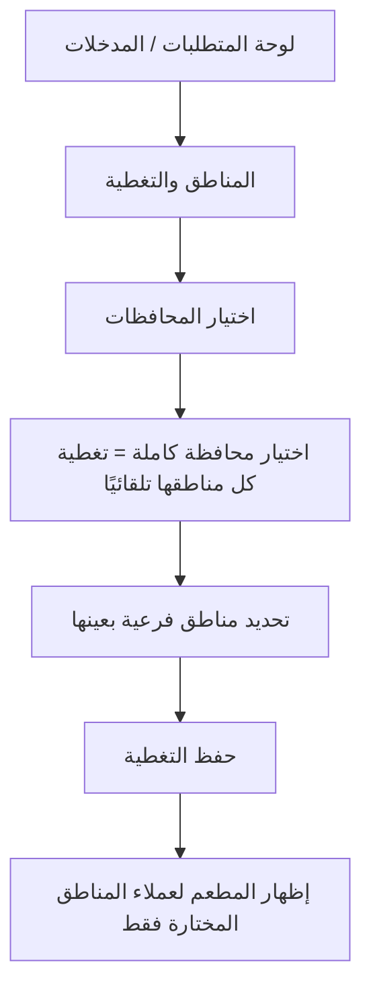

**لوحات — العنوان والمحتويات:**

#### **لوحة المتطلبات / المدخلات** _(مستنتجة)_

1. حساب مطعم معتمد ().
2. قدرة توصيل فعلية للمناطق المختارة.

#### **المناطق والتغطية** _(مستنتجة)_

1. فتح شاشة في اللوحة

#### **اختيار المحافظات** _(مستنتجة)_

1. اختيار المحافظات التي يخدمها المطعم

#### **اختيار محافظة كاملة = تغطية كل مناطقها تلقائيًا** _(مستنتجة)_

1. اختيار محافظة كاملة = تغطية كل مناطقها تلقائيًا

#### **تحديد مناطق فرعية بعينها** _(مستنتجة)_

1. أو تحديد مناطق فرعية بعينها داخل المحافظة

#### **حفظ التغطية** _(مستنتجة)_

1. حفظ التغطية

#### **إظهار المطعم لعملاء المناطق المختارة فقط** _(مستنتجة)_

1. النظام يُظهر المطعم لعملاء المناطق المختارة فقط

**خطوات Workflow:**

1. فتح شاشة «المناطق والتغطية» في اللوحة
2. اختيار المحافظات التي يخدمها المطعم
3. اختيار محافظة كاملة = تغطية كل مناطقها تلقائيًا
4. أو تحديد مناطق فرعية بعينها داخل المحافظة
5. حفظ التغطية
6. النظام يُظهر المطعم لعملاء المناطق المختارة فقط

**حالات واستثناءات:**

1. تقليص التغطية لا يلغي الطلبات المؤكدة القائمة
2. منطقة بلا مطاعم كافية تؤثر على توفر الباقات لعملائها
3. التغطية تحدد المناطق المتاحة للمزايدة الإعلانية

#### **تحديد الطاقة الاستيعابية اليومية و Busy**

**الهدف:** يحدد المطعم حد البوكسات اليومي الأقصى من لوحته، ويراقب النظام الطلبات المؤكدة لحظيًا.
عند بلوغ الحد يتحوّل المطعم إلى حالة Busy في واجهة العميل ويُمنع اختياره لذلك اليوم.

**Flowchart:**

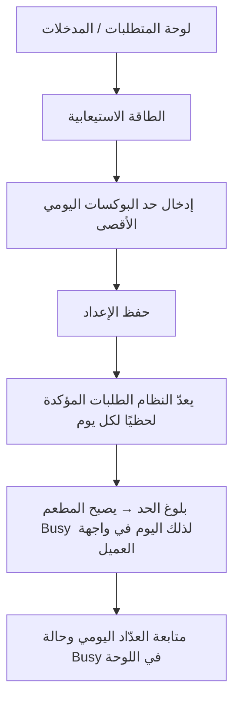

**لوحات — العنوان والمحتويات:**

#### **لوحة المتطلبات / المدخلات** _(مستنتجة)_

1. حساب مطعم معتمد ().
2. تقدير واقعي للطاقة الفعلية للمطبخ.

#### **الطاقة الاستيعابية** _(مستنتجة)_

1. فتح شاشة في اللوحة

#### **إدخال حد البوكسات اليومي الأقصى** _(مستنتجة)_

1. إدخال حد البوكسات اليومي الأقصى

#### **حفظ الإعداد** _(مستنتجة)_

1. حفظ الإعداد

#### **يعدّ النظام الطلبات المؤكدة لحظيًا لكل يوم** _(مستنتجة)_

1. يعدّ النظام الطلبات المؤكدة لحظيًا لكل يوم

#### **بلوغ الحد → يصبح المطعم Busy لذلك اليوم في واجهة العميل** _(مستنتجة)_

1. عند بلوغ الحد → يصبح المطعم Busy لذلك اليوم في واجهة العميل

#### **متابعة العدّاد اليومي وحالة Busy في اللوحة** _(مستنتجة)_

1. متابعة العدّاد اليومي وحالة Busy في اللوحة

**خطوات Workflow:**

1. فتح شاشة «الطاقة الاستيعابية» في اللوحة
2. إدخال حد البوكسات اليومي الأقصى
3. حفظ الإعداد
4. يعدّ النظام الطلبات المؤكدة لحظيًا لكل يوم
5. عند بلوغ الحد → يصبح المطعم Busy لذلك اليوم في واجهة العميل
6. متابعة العدّاد اليومي وحالة Busy في اللوحة

**حالات واستثناءات:**

1. في يوم مزدحم (أغلب المطاعم Busy) قد يتيح النظام اختيار مطعم تجاوز حدّه لضمان توفر بدائل
2. خفض الحد بعد استقبال طلبات لا يلغي الطلبات المؤكدة سابقًا
3. بلوغ الطاقة الكلية لكل المطاعم يمنع استقبال مشتركين جدد

#### **إدارة سائقي المطعم (إضافة/تعديل/تفعيل/تعطيل)**

**الهدف:** يدير المطعم سائقيه الخاصين (التابعين للمطعم) بإضافة بياناتهم ووثائقهم والتحقق المبدئي منها.
لا يُفعّل أي سائق إلا بعد موافقة الأدمن النهائية، ولا يُسند طلب لسائق غير معتمد.

**Flowchart:**

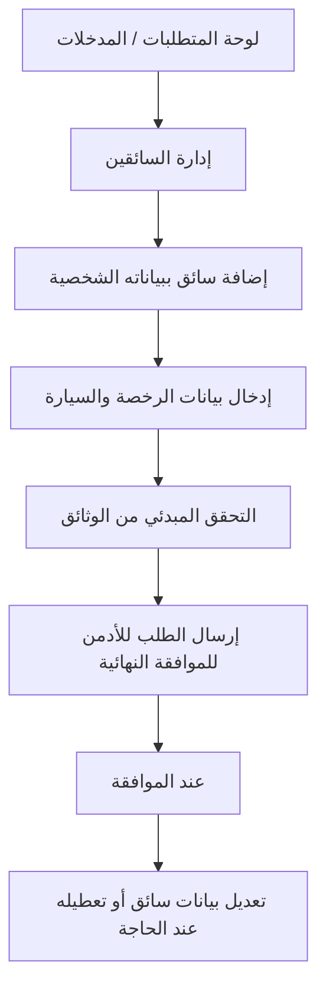

**لوحات — العنوان والمحتويات:**

#### **لوحة المتطلبات / المدخلات** _(مستنتجة)_

1. حساب مطعم معتمد ().
2. بيانات السائق ووثائقه كاملة.

#### **إدارة السائقين** _(مستنتجة)_

1. فتح شاشة في اللوحة

#### **إضافة سائق ببياناته الشخصية** _(مستنتجة)_

1. إضافة سائق ببياناته الشخصية (اسم
2. هاتف
3. بريد)

#### **إدخال بيانات الرخصة والسيارة** _(مستنتجة)_

1. إدخال بيانات الرخصة (رقم
2. انتهاء
3. صورة) والسيارة (نوع
4. لون
5. لوحة
6. رقم محرك
7. وثيقة
8. صور)

#### **التحقق المبدئي من الوثائق** _(مستنتجة)_

1. التحقق المبدئي من الوثائق

#### **إرسال الطلب للأدمن للموافقة النهائية** _(مستنتجة)_

1. إرسال الطلب للأدمن للموافقة النهائية

#### **عند الموافقة** _(مستنتجة)_

1. تفعيل السائق ليصبح قابلًا لاستلام الطلبات

#### **تعديل بيانات سائق أو تعطيله عند الحاجة** _(مستنتجة)_

1. تعديل بيانات سائق أو تعطيله عند الحاجة

**خطوات Workflow:**

1. فتح شاشة «إدارة السائقين» في اللوحة
2. إضافة سائق ببياناته الشخصية (اسم، هاتف، بريد)
3. إدخال بيانات الرخصة (رقم، انتهاء، صورة) والسيارة (نوع، لون، لوحة، رقم محرك، وثيقة، صور)
4. التحقق المبدئي من الوثائق
5. إرسال الطلب للأدمن للموافقة النهائية
6. عند الموافقة: تفعيل السائق ليصبح قابلًا لاستلام الطلبات
7. تعديل بيانات سائق أو تعطيله عند الحاجة

**حالات واستثناءات:**

1. لا إسناد أي طلب لسائق غير معتمد ومفعّل
2. اقتراب/انتهاء الرخصة → مراقبة مستمرة وإيقاف عند اللزوم
3. رفض الأدمن → إعادة استكمال/تصحيح الوثائق

---

### المرحلة 3: **استقبال الطلبات** — 3 ميزة | 22 لوحات

**الميزات:** استقبال اختيارات التقويم كطلبات يومية · نافذة الطلبات 72 ساعة والتحضير النهائي · طباعة الفواتير والباركود وملصقات الوجبات

#### ملخص المرحلة

1. طلبات من التقويم
2. قفل 48h واستلام الطلبات
3. طباعة فواتير/باركود/ملصقات → تحضير

#### Flowchart شامل للمرحلة

```mermaid
flowchart TD
 p3_f05_s1["لوحة المتطلبات / المدخلات"]
 p3_f05_s2["اليوم والمطعم والبوكس من تطبيقه"]
 p3_f05_s3["−72h"]
 p3_f05_s4["24 ساعة"]
 p3_f05_s5["إذا لم يُؤكَّد"]
 p3_f05_s6["−24h"]
 p3_f05_s7["يعرض المطعم الطلب"]
 p3_f05_s8["يبدأ التحضير النهائي ويُصدر الفواتير والملصقات"]
 p3_f05_s1 --> p3_f05_s2
 p3_f05_s2 --> p3_f05_s3
 p3_f05_s3 --> p3_f05_s4
 p3_f05_s4 --> p3_f05_s5
 p3_f05_s5 --> p3_f05_s6
 p3_f05_s6 --> p3_f05_s7
 p3_f05_s7 --> p3_f05_s8
 p3_f06_s1["لوحة المتطلبات / المدخلات"]
 p3_f06_s2["المطعم"]
 p3_f06_s3["24 ساعة"]
 p3_f06_s4["لم يُؤكَّد"]
 p3_f06_s5["−24h"]
 p3_f06_s6["تتولّد الفواتير + الباركود + ملصقات الوجبات ويبدأ"]
 p3_f06_s7["تجهيز البوكسات للتسليم للسائق"]
 p3_f06_s1 --> p3_f06_s2
 p3_f06_s2 --> p3_f06_s3
 p3_f06_s3 --> p3_f06_s4
 p3_f06_s4 --> p3_f06_s5
 p3_f06_s5 --> p3_f06_s6
 p3_f06_s6 --> p3_f06_s7
 p3_f05_s8 --> p3_f06_s1
 p3_f12_s1["لوحة المتطلبات / المدخلات"]
 p3_f12_s2["المطعم"]
 p3_f12_s3["عرض الفاتورة"]
 p3_f12_s4["توليد ملصق منفصل لكل وجبة"]
 p3_f12_s5["طباعة الفواتير والملصقات باللغتين"]
 p3_f12_s6["لصق الملصق على كل بوكس"]
 p3_f12_s7["تسليم البوكسات للسائق الذي يمسح الباركود"]
 p3_f12_s1 --> p3_f12_s2
 p3_f12_s2 --> p3_f12_s3
 p3_f12_s3 --> p3_f12_s4
 p3_f12_s4 --> p3_f12_s5
 p3_f12_s5 --> p3_f12_s6
 p3_f12_s6 --> p3_f12_s7
 p3_f06_s7 --> p3_f12_s1
```

#### تفاصيل كل ميزة

#### **استقبال اختيارات التقويم كطلبات يومية**

**الهدف:** يستقبل المطعم ناتج اختيارات العملاء كطلبات يومية عند **−72h** من التوصيل، مع **تأكيد خلال 24 ساعة**، وإشعار **−24h** بالطلبات المقرّر توصيلها خلال 24h القادمة.

**Flowchart:**

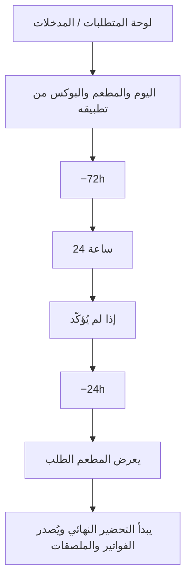

**لوحات — العنوان والمحتويات:**

#### **لوحة المتطلبات / المدخلات** _(مستنتجة)_

1. حساب معتمد وقوائم معتمدة ().
2. تحديد الطاقة الاستيعابية اليومية ().
3. دخول الطلب عند −72h قبل التوصيل (بعد قفل تعديل العميل).

#### **اليوم والمطعم والبوكس من تطبيقه** _(مستنتجة)_

1. يختار العميل اليوم والمطعم والبوكس من تطبيقه (قبل −72h)

#### **−72h** _(مستنتجة)_

1. يتثبّت الاختيار ويُرسَل كطلب للمطعم

#### **24 ساعة** _(مستنتجة)_

1. يؤكّد المطعم الطلب خلال من الاستلام

#### **إذا لم يُؤكَّد** _(مستنتجة)_

1. إذا لم يُؤكَّد → إشعار للأدmin → قد يُعاد توجيه الطلب لمطعم آخر في 24h المتبقية قبل التوصيل

#### **−24h** _(مستنتجة)_

1. إشعار بكل الطلبات المقرّر توصيلها خلال 24h القادمة

#### **يعرض المطعم الطلب** _(مستنتجة)_

1. عدد البوكسات
2. نوعها
3. وقت التوصيل
4. الموقع العام فقط

#### **يبدأ التحضير النهائي ويُصدر الفواتير والملصقات** _(مستنتجة)_

1. يبدأ التحضير النهائي ويُصدر الفواتير والملصقات ()

**خطوات Workflow:**

1. يختار العميل اليوم والمطعم والبوكس من تطبيقه (قبل −72h)
2. عند **−72h**: يتثبّت الاختيار ويُرسَل كطلب للمطعم
3. يؤكّد المطعم الطلب خلال **24 ساعة** من الاستلام
4. إذا لم يُؤكَّد → إشعار للأدmin → قد يُعاد توجيه الطلب لمطعم آخر في 24h المتبقية قبل التوصيل
5. عند **−24h**: إشعار بكل الطلبات المقرّر توصيلها خلال **24h القادمة**
6. يعرض المطعم الطلب: عدد البوكسات، نوعها، وقت التوصيل، الموقع العام فقط
7. يبدأ التحضير النهائي ويُصدر الفواتير والملصقات

**حالات واستثناءات:**

1. قبل −72h لا تظهر طلبات مؤكدة (العميل قد يغيّر)
2. قد يصل طلب من اختيار تلقائي — يُعامل كطلب عادي
3. إعادة توجيه من مطعم لم يؤكّد → طلب جديد بمهلة تأكيد 24h

#### **نافذة الطلبات 72 ساعة والتحضير النهائي**

**الهدف:** استقبال الطلبات عند **−72h** من التوصيل مع **تأكيد خلال 24 ساعة**، ثم التحضير النهائي عند **−24h** بعد إشعار التوصيل القادم — دون أي تعديل من العميل بعد القفل.

**Flowchart:**

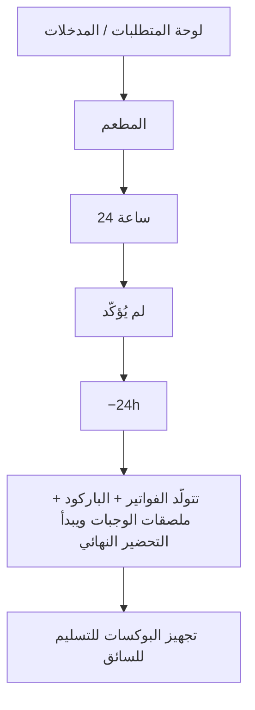

**لوحات — العنوان والمحتويات:**

#### **لوحة المتطلبات / المدخلات** _(مستنتجة)_

1. طلبات عملاء مختارة عبر التقويم ().
2. قوائم معتمدة وطاقة استيعابية ().

#### **المطعم** _(مستنتجة)_

1. تُقفل اختيارات العميل ويُرسَل الطلب إلى لوحة المطعم

#### **24 ساعة** _(مستنتجة)_

1. يؤكّد المطعم الطلب خلال (زر تأكيد في اللوحة)

#### **لم يُؤكَّد** _(مستنتجة)_

1. إشعار للأدmin → قد يُعاد توجيه الطلب لمطعم آخر في 24h المتبقية

#### **−24h** _(مستنتجة)_

1. إشعار بكل الطلبات المقرّر توصيلها خلال 24h القادمة

#### **تتولّد الفواتير + الباركود + ملصقات الوجبات ويبدأ التحضير النهائي** _(مستنتجة)_

1. تتولّد الفواتير
2. الباركود
3. ملصقات الوجبات () ويبدأ التحضير النهائي (📦)

#### **تجهيز البوكسات للتسليم للسائق** _(مستنتجة)_

1. تجهيز البوكسات للتسليم للسائق ()

**خطوات Workflow:**

1. عند **−72h**: تُقفل اختيارات العميل ويُرسَل الطلب إلى لوحة المطعم
2. يؤكّد المطعم الطلب خلال **24 ساعة** (زر تأكيد في اللوحة)
3. إذا **لم يُؤكَّد**: إشعار للأدmin → قد يُعاد توجيه الطلب لمطعم آخر في 24h المتبقية
4. عند **−24h**: إشعار بكل الطلبات المقرّر **توصيلها خلال 24h القادمة**
5. تتولّد الفواتير + الباركود + ملصقات الوجبات ويبدأ التحضير النهائي (📦)
6. تجهيز البوكسات للتسليم للسائق

**حالات واستثناءات:**

1. تأكيد متأخر بعد 24h → يُعامل كعدم تأكيد (مسار الأدmin/البديل)
2. استثناء أدmin طارئ داخل النافذة → إعادة إصدار فاتورة/ملصق إن لزم
3. طلب يُعاد توجيهه من مطعم آخر → يظهر كطلب جديد مع مهلة تأكيد 24h

#### **طباعة الفواتير والباركود وملصقات الوجبات**

**الهدف:** عند بلوغ −24h يستقبل المطعم فاتورة احترافية بتفاصيل الطلب + باركود قابل للقراءة مخصص للسائق + ملصق لكل وجبة.
يطبع المطعم هذه المستندات لتسهيل التحضير والاستلام والتسليم.

**Flowchart:**

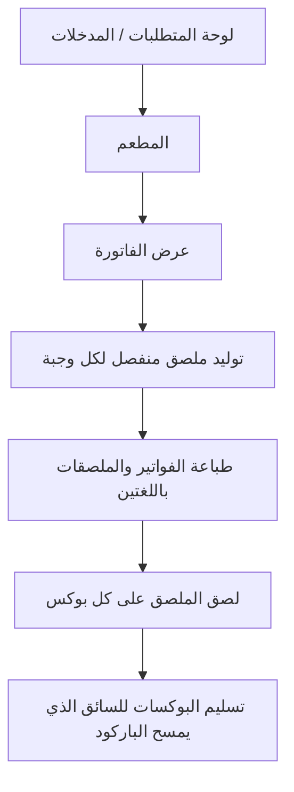

**لوحات — العنوان والمحتويات:**

#### **لوحة المتطلبات / المدخلات** _(مستنتجة)_

1. طلبات مؤكدة دخلت نافذة 24 ساعة ( — بعد تأكيد المطعم).
2. بيانات الوجبات الغذائية باللغتين (/).
3. لوجو المطعم لإدراجه على الملصق.

#### **المطعم** _(مستنتجة)_

1. عند −24h تتولّد الفواتير تلقائيًا في لوحة المطعم

#### **عرض الفاتورة** _(مستنتجة)_

1. تفاصيل الوجبات
2. باركود مخصص للسائق

#### **توليد ملصق منفصل لكل وجبة** _(مستنتجة)_

1. توليد ملصق منفصل لكل وجبة

#### **طباعة الفواتير والملصقات باللغتين** _(مستنتجة)_

1. طباعة الفواتير والملصقات باللغتين

#### **لصق الملصق على كل بوكس** _(مستنتجة)_

1. لصق الملصق على كل بوكس

#### **تسليم البوكسات للسائق الذي يمسح الباركود** _(مستنتجة)_

1. تسليم البوكسات للسائق الذي يمسح الباركود ()

**خطوات Workflow:**

1. عند −24h تتولّد الفواتير تلقائيًا في لوحة المطعم
2. عرض الفاتورة: تفاصيل الوجبات + باركود مخصص للسائق
3. توليد ملصق منفصل لكل وجبة
4. طباعة الفواتير والملصقات باللغتين
5. لصق الملصق على كل بوكس
6. تسليم البوكسات للسائق الذي يمسح الباركود

**حالات واستثناءات:**

1. فشل الطباعة → إعادة توليد المستند من اللوحة
2. باركود تالف → إعادة طباعة قبل التسليم
3. استثناء أدمن طارئ داخل النافذة → إعادة إصدار الفاتورة المتأثرة

---

### المرحلة 4: **التسليم** — 2 ميزة | 12 لوحات

**الميزات:** تسليم الطلب للسائق وتحديث الحالة · متابعة تقييمات المطعم والوجبات

#### ملخص المرحلة

1. تسليم للمندوب + باركود
2. متابعة تقييمات العملاء

#### Flowchart شامل للمرحلة

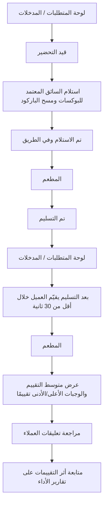

#### تفاصيل كل ميزة

#### **تسليم الطلب للسائق وتحديث الحالة**

**الهدف:** يحضّر المطعم البوكسات ويسلّمها لسائق معتمد، فتنعكس حالة الطلب لحظيًا لدى جميع الأطراف (العميل، المطعم، الأدمن).
المطعم يتابع تقدّم التوصيل من لوحته دون رؤية بيانات العميل الشخصية.

**Flowchart:**

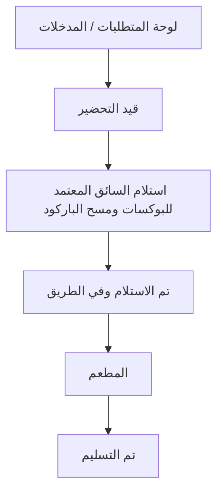

**لوحات — العنوان والمحتويات:**

#### **لوحة المتطلبات / المدخلات** _(مستنتجة)_

1. بوكسات جاهزة بملصقات وباركود ().
2. سائق معتمد ومفعّل من الأدمن ().

#### **قيد التحضير** _(مستنتجة)_

1. تجهيز البوكسات وتحويل حالتها من إلى «جاهز»

#### **استلام السائق المعتمد للبوكسات ومسح الباركود** _(مستنتجة)_

1. استلام السائق المعتمد للبوكسات ومسح الباركود

#### **تم الاستلام وفي الطريق** _(مستنتجة)_

1. تحديث حالة الطلب إلى

#### **المطعم** _(مستنتجة)_

1. متابعة حالة الطلب لحظيًا في لوحة المطعم

#### **تم التسليم** _(مستنتجة)_

1. عند وصول السائق وتسليمه → تتحدّث الحالة إلى

**خطوات Workflow:**

1. تجهيز البوكسات وتحويل حالتها من «قيد التحضير» إلى «جاهز»
2. استلام السائق المعتمد للبوكسات ومسح الباركود
3. تحديث حالة الطلب إلى «تم الاستلام وفي الطريق»
4. متابعة حالة الطلب لحظيًا في لوحة المطعم
5. عند وصول السائق وتسليمه → تتحدّث الحالة إلى «تم التسليم»

**حالات واستثناءات:**

1. لا تسليم إلا لسائق معتمد من الأدمن؛ النظام يمنع إسناد طلب لسائق غير مفعّل
2. تأخر السائق → المطعم يتابع الحالة في اللوحة
3. حالة Hold عند عدم رد العميل (تخص المندوب/العميل) تنعكس كحالة في الطلب

#### **متابعة تقييمات المطعم والوجبات**

**الهدف:** يطّلع المطعم على تقييمات العملاء لجودة الوجبة والمطعم عمومًا بعد التسليم، لتحسين الأداء وجودة القوائم.
يرى المطعم تقييماته الخاصة فقط دون بيانات العملاء الشخصية.

**Flowchart:**

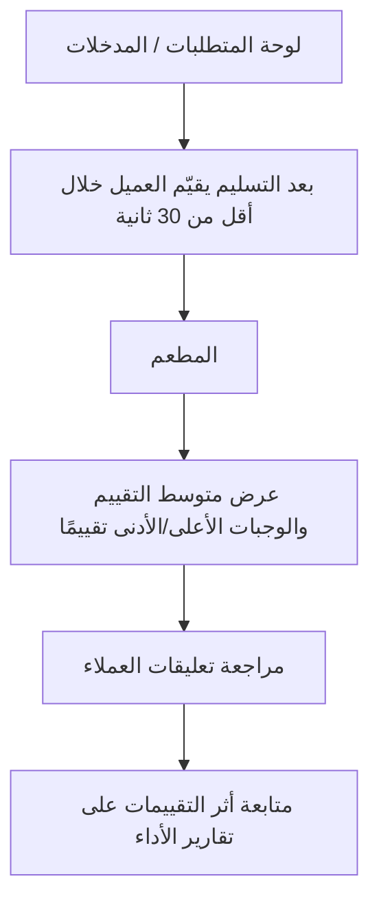

**لوحات — العنوان والمحتويات:**

#### **لوحة المتطلبات / المدخلات** _(مستنتجة)_

1. طلبات مُسلّمة وقابلة للتقييم.
2. حساب مطعم معتمد.

#### **بعد التسليم يقيّم العميل خلال أقل من 30 ثانية** _(مستنتجة)_

1. بعد التسليم يقيّم العميل (نجوم
2. تعليق) خلال أقل من 30 ثانية

#### **المطعم** _(مستنتجة)_

1. تظهر التقييمات في لوحة المطعم

#### **عرض متوسط التقييم والوجبات الأعلى/الأدنى تقييمًا** _(مستنتجة)_

1. عرض متوسط التقييم والوجبات الأعلى/الأدنى تقييمًا

#### **مراجعة تعليقات العملاء** _(مستنتجة)_

1. مراجعة تعليقات العملاء لتحسين الجودة

#### **متابعة أثر التقييمات على تقارير الأداء** _(مستنتجة)_

1. متابعة أثر التقييمات على تقارير الأداء ()

**خطوات Workflow:**

1. بعد التسليم يقيّم العميل (نجوم + تعليق) خلال أقل من 30 ثانية
2. تظهر التقييمات في لوحة المطعم
3. عرض متوسط التقييم والوجبات الأعلى/الأدنى تقييمًا
4. مراجعة تعليقات العملاء لتحسين الجودة
5. متابعة أثر التقييمات على تقارير الأداء

**حالات واستثناءات:**

1. تكرار التقييم المنخفض لوجبة قد يرتبط بشكاوى
2. لا تظهر بيانات العميل الشخصية مع التقييم
3. تقييم سرعة التوصيل يخص المندوب لا المطعم

---

### المرحلة 5: **المالية** — 4 ميزة | 27 لوحات

**الميزات:** التعامل مع الشكاوى وخصم قيمة البوكس · التسويات والمستحقات المالية · المزايدة على الأماكن الإعلانية · طلب إنهاء التعاقد والالتزامات

#### ملخص المرحلة

1. شكوى وخصم | تسوية
2. إعلانات | Exit Policy
3. ↺ طلبات جديدة

#### Flowchart شامل للمرحلة

```mermaid
flowchart TD
 p5_f16_s1["لوحة المتطلبات / المدخلات"]
 p5_f16_s2["يقدّم العميل شكوى بصور"]
 p5_f16_s3["يطّلع المطعم على تفاصيل الشكوى والصور في لوحته"]
 p5_f16_s4["الشكوى ويؤكد صحتها من عدمها"]
 p5_f16_s5["عند الصحة"]
 p5_f16_s6["متابعة الخصم ضمن كشف التسويات"]
 p5_f16_s1 --> p5_f16_s2
 p5_f16_s2 --> p5_f16_s3
 p5_f16_s3 --> p5_f16_s4
 p5_f16_s4 --> p5_f16_s5
 p5_f16_s5 --> p5_f16_s6
 p5_f26_s1["لوحة المتطلبات / المدخلات"]
 p5_f26_s2["يعدّ النظام عدد البوكسات المُسلّمة فعليًا"]
 p5_f26_s3["حساب صافي كل بوكس = سعر البوكس −"]
 p5_f26_s4["إجمالي المستحقات = − رسوم اشتراك المطعم"]
 p5_f26_s5["خصم قيمة بوكسات الشكاوى المحقّة"]
 p5_f26_s6["عرض كشف التسوية في اللوحة"]
 p5_f26_s7["استلام المستحقات حسب الدورة المتفق عليها"]
 p5_f26_s1 --> p5_f26_s2
 p5_f26_s2 --> p5_f26_s3
 p5_f26_s3 --> p5_f26_s4
 p5_f26_s4 --> p5_f26_s5
 p5_f26_s5 --> p5_f26_s6
 p5_f26_s6 --> p5_f26_s7
 p5_f16_s6 --> p5_f26_s1
 p5_f20_s1["لوحة المتطلبات / المدخلات"]
 p5_f20_s2["الإعلانات والمزايدات"]
 p5_f20_s3["اختيار المنطقة المستهدفة"]
 p5_f20_s4["المنطقة (مزايدة)"]
 p5_f20_s5["تقديم قيمة المزايدة"]
 p5_f20_s6["انتظار نتيجة المزايدة"]
 p5_f20_s7["عند الفوز"]
 p5_f20_s1 --> p5_f20_s2
 p5_f20_s2 --> p5_f20_s3
 p5_f20_s3 --> p5_f20_s4
 p5_f20_s4 --> p5_f20_s5
 p5_f20_s5 --> p5_f20_s6
 p5_f20_s6 --> p5_f20_s7
 p5_f26_s7 --> p5_f20_s1
 p5_f25_s1["لوحة المتطلبات / المدخلات"]
 p5_f25_s2["إنهاء التعاقد"]
 p5_f25_s3["طلب إنهاء تعاقد"]
 p5_f25_s4["مراجعة الأدمن للطلب"]
 p5_f25_s5["والمجدولة ≥ 30 يومًا"]
 p5_f25_s6["اختفاء المطعم تدريجيًا من خيارات العملاء الجدد"]
 p5_f25_s7["إغلاق الحساب بعد انقضاء فترة الالتزام وتسوية المست"]
 p5_f25_s1 --> p5_f25_s2
 p5_f25_s2 --> p5_f25_s3
 p5_f25_s3 --> p5_f25_s4
 p5_f25_s4 --> p5_f25_s5
 p5_f25_s5 --> p5_f25_s6
 p5_f25_s6 --> p5_f25_s7
 p5_f20_s7 --> p5_f25_s1
```

#### تفاصيل كل ميزة

#### **التعامل مع الشكاوى وخصم قيمة البوكس**

**الهدف:** يطّلع المطعم على شكاوى الوجبات المقدّمة بصور إلزامية، ويتابع نتيجة مراجعة الأدمن لها.
عند تأكيد صحة الشكوى يُخصم مبلغ البوكس من مستحقات المطعم في كل الأحوال.

**Flowchart:**

```mermaid
flowchart TD
 f16_s1["لوحة المتطلبات / المدخلات"]
 f16_s2["يقدّم العميل شكوى بصور"]
 f16_s3["يطّلع المطعم على تفاصيل الشكوى والصور في لوحته"]
 f16_s4["الشكوى ويؤكد صحتها من عدمها"]
 f16_s5["عند الصحة"]
 f16_s6["متابعة الخصم ضمن كشف التسويات"]
 f16_s1 --> f16_s2
 f16_s2 --> f16_s3
 f16_s3 --> f16_s4
 f16_s4 --> f16_s5
 f16_s5 --> f16_s6
```

**لوحات — العنوان والمحتويات:**

#### **لوحة المتطلبات / المدخلات** _(مستنتجة)_

1. طلب مُسلّم محل شكوى.
2. صور إلزامية مرفقة من العميل (نقص مكونات، وجبة خاطئة...).

#### **يقدّم العميل شكوى بصور** _(مستنتجة)_

1. يقدّم العميل شكوى بصور → تظهر فورًا للأدمن وللمطعم المعني

#### **يطّلع المطعم على تفاصيل الشكوى والصور في لوحته** _(مستنتجة)_

1. يطّلع المطعم على تفاصيل الشكوى والصور في لوحته

#### **الشكوى ويؤكد صحتها من عدمها** _(مستنتجة)_

1. يراجع الأدمن الشكوى ويؤكد صحتها من عدمها

#### **عند الصحة** _(مستنتجة)_

1. يُخصم مبلغ البوكس من مستحقات المطعم

#### **متابعة الخصم ضمن كشف التسويات** _(مستنتجة)_

1. متابعة الخصم ضمن كشف التسويات ()

**خطوات Workflow:**

1. يقدّم العميل شكوى بصور → تظهر فورًا للأدمن وللمطعم المعني
2. يطّلع المطعم على تفاصيل الشكوى والصور في لوحته
3. يراجع الأدمن الشكوى ويؤكد صحتها من عدمها
4. عند الصحة: يُخصم مبلغ البوكس من مستحقات المطعم
5. متابعة الخصم ضمن كشف التسويات

**حالات واستثناءات:**

1. شكوى بلا صور إلزامية لا تُقبل
2. خصم مبلغ البوكس يقع في كل الأحوال عند صحة الشكوى
3. تكرار الشكاوى يؤثر على معادلة التوزيع العادل للمطعم

#### **التسويات والمستحقات المالية**

**الهدف:** يتابع المطعم تسوياته ومستحقاته المالية المبنية على عدد البوكسات الفعلية المُسلّمة، بعد خصم العمولة الديناميكية ورسوم الاشتراك.
يعرض النظام كشف تسوية واضحًا في لوحة المطعم.

**Flowchart:**

```mermaid
flowchart TD
 f26_s1["لوحة المتطلبات / المدخلات"]
 f26_s2["يعدّ النظام عدد البوكسات المُسلّمة فعليًا"]
 f26_s3["حساب صافي كل بوكس = سعر البوكس −"]
 f26_s4["إجمالي المستحقات = − رسوم اشتراك المطعم"]
 f26_s5["خصم قيمة بوكسات الشكاوى المحقّة"]
 f26_s6["عرض كشف التسوية في اللوحة"]
 f26_s7["استلام المستحقات حسب الدورة المتفق عليها"]
 f26_s1 --> f26_s2
 f26_s2 --> f26_s3
 f26_s3 --> f26_s4
 f26_s4 --> f26_s5
 f26_s5 --> f26_s6
 f26_s6 --> f26_s7
```

**لوحات — العنوان والمحتويات:**

#### **لوحة المتطلبات / المدخلات** _(مستنتجة)_

1. بوكسات مُسلّمة موثّقة عبر التتبع ().
2. نسبة العمولة الديناميكية للمطعم () ورسوم الاشتراك إن وُجدت.

#### **يعدّ النظام عدد البوكسات المُسلّمة فعليًا** _(مستنتجة)_

1. يعدّ النظام عدد البوكسات المُسلّمة فعليًا

#### **حساب صافي كل بوكس = سعر البوكس −** _(مستنتجة)_

1. حساب صافي كل بوكس = سعر البوكس − (سعر البوكس × نسبة العمولة)

#### **إجمالي المستحقات = − رسوم اشتراك المطعم** _(مستنتجة)_

1. إجمالي المستحقات = (صافي البوكس × عدد البوكسات المُسلّمة) − رسوم اشتراك المطعم (إن استُحقت)

#### **خصم قيمة بوكسات الشكاوى المحقّة** _(مستنتجة)_

1. خصم قيمة بوكسات الشكاوى المحقّة ()

#### **عرض كشف التسوية في اللوحة** _(مستنتجة)_

1. عرض كشف التسوية في اللوحة

#### **استلام المستحقات حسب الدورة المتفق عليها** _(مستنتجة)_

1. استلام المستحقات حسب الدورة المتفق عليها

**خطوات Workflow:**

1. يعدّ النظام عدد البوكسات المُسلّمة فعليًا
2. حساب صافي كل بوكس = سعر البوكس − (سعر البوكس × نسبة العمولة)
3. إجمالي المستحقات = (صافي البوكس × عدد البوكسات المُسلّمة) − رسوم اشتراك المطعم (إن استُحقت)
4. خصم قيمة بوكسات الشكاوى المحقّة
5. عرض كشف التسوية في اللوحة
6. استلام المستحقات حسب الدورة المتفق عليها

**حالات واستثناءات:**

1. رسوم اشتراك المطعم (مبلغ ثابت شهري/سنوي) تُحصّل مباشرة أو تُخصم من المستحقات
2. خصومات الشكاوى المحقّة تظهر بندًا في الكشف
3. تسوية نهائية عند إنهاء التعاقد

#### **المزايدة على الأماكن الإعلانية**

**الهدف:** يزايد المطعم على أماكن إعلانية محددة داخل المناطق التي يخدمها لزيادة ظهوره أمام العملاء.
لكل منطقة 3 أماكن إعلانية للفائزين، وتظهر الإعلانات دون إخفاء المعلومات الأساسية.

**Flowchart:**

```mermaid
flowchart TD
 f20_s1["لوحة المتطلبات / المدخلات"]
 f20_s2["الإعلانات والمزايدات"]
 f20_s3["اختيار المنطقة المستهدفة"]
 f20_s4["المنطقة (مزايدة)"]
 f20_s5["تقديم قيمة المزايدة"]
 f20_s6["انتظار نتيجة المزايدة"]
 f20_s7["عند الفوز"]
 f20_s1 --> f20_s2
 f20_s2 --> f20_s3
 f20_s3 --> f20_s4
 f20_s4 --> f20_s5
 f20_s5 --> f20_s6
 f20_s6 --> f20_s7
```

**لوحات — العنوان والمحتويات:**

#### **لوحة المتطلبات / المدخلات** _(مستنتجة)_

1. حساب معتمد يخدم مناطق محددة ().
2. ميزانية مخصصة للمزايدة.

#### **الإعلانات والمزايدات** _(مستنتجة)_

1. فتح شاشة في اللوحة

#### **اختيار المنطقة المستهدفة** _(مستنتجة)_

1. اختيار المنطقة المستهدفة (ضمن مناطق خدمة المطعم)

#### **المنطقة (مزايدة)** _(مستنتجة)_

1. الرئيسية (بانر)
2. قائمة المطاعم (Sponsored)
3. صفحة المنطقة (مزايدة)
4. تفاصيل المطعم (Highlight)

#### **تقديم قيمة المزايدة** _(مستنتجة)_

1. تقديم قيمة المزايدة

#### **انتظار نتيجة المزايدة** _(مستنتجة)_

1. انتظار نتيجة المزايدة (الفائزون = 3 أماكن لكل منطقة)

#### **عند الفوز** _(مستنتجة)_

1. يظهر المطعم كـ Banner / Sponsored Card في المكان المحدد

**خطوات Workflow:**

1. فتح شاشة «الإعلانات والمزايدات» في اللوحة
2. اختيار المنطقة المستهدفة (ضمن مناطق خدمة المطعم)
3. اختيار المكان الإعلاني: الرئيسية (بانر)، قائمة المطاعم (Sponsored)، صفحة المنطقة (مزايدة)، تفاصيل المطعم (Highlight)
4. تقديم قيمة المزايدة
5. انتظار نتيجة المزايدة (الفائزون = 3 أماكن لكل منطقة)
6. عند الفوز: يظهر المطعم كـ Banner / Sponsored Card في المكان المحدد

**حالات واستثناءات:**

1. خسارة المزايدة → لا يظهر المطعم في المكان المدفوع
2. لا تظهر الإعلانات إلا لعملاء يخدمهم المطعم في تلك المنطقة
3. الإعلان لا يُخفي معلومات أساسية ولا يسبب إزعاجًا

#### **طلب إنهاء التعاقد والالتزامات**

**الهدف:** يقدّم المطعم الراغب في التوقف «طلب إنهاء تعاقد» للأدمن من لوحته.
يلتزم المطعم بتوفير كل الطلبات القائمة والمجدولة لمدة لا تقل عن 30 يومًا من تاريخ الطلب لضمان عدم تعطّل العملاء.

**Flowchart:**

```mermaid
flowchart TD
 f25_s1["لوحة المتطلبات / المدخلات"]
 f25_s2["إنهاء التعاقد"]
 f25_s3["طلب إنهاء تعاقد"]
 f25_s4["مراجعة الأدمن للطلب"]
 f25_s5["والمجدولة ≥ 30 يومًا"]
 f25_s6["اختفاء المطعم تدريجيًا من خيارات العملاء الجدد"]
 f25_s7["إغلاق الحساب بعد انقضاء فترة الالتزام وتسوية المستحقات"]
 f25_s1 --> f25_s2
 f25_s2 --> f25_s3
 f25_s3 --> f25_s4
 f25_s4 --> f25_s5
 f25_s5 --> f25_s6
 f25_s6 --> f25_s7
```

**لوحات — العنوان والمحتويات:**

#### **لوحة المتطلبات / المدخلات** _(مستنتجة)_

1. حساب مطعم معتمد ونشط.
2. معرفة الطلبات القائمة والمجدولة قبل التقديم.

#### **إنهاء التعاقد** _(مستنتجة)_

1. فتح شاشة في اللوحة

#### **طلب إنهاء تعاقد** _(مستنتجة)_

1. تقديم مع التاريخ والسبب

#### **مراجعة الأدمن للطلب** _(مستنتجة)_

1. مراجعة الأدمن للطلب

#### **والمجدولة ≥ 30 يومًا** _(مستنتجة)_

1. الالتزام بتوفير كل الطلبات القائمة والمجدولة ≥ 30 يومًا

#### **اختفاء المطعم تدريجيًا من خيارات العملاء الجدد** _(مستنتجة)_

1. اختفاء المطعم تدريجيًا من خيارات العملاء الجدد

#### **إغلاق الحساب بعد انقضاء فترة الالتزام وتسوية المستحقات** _(مستنتجة)_

1. إغلاق الحساب بعد انقضاء فترة الالتزام وتسوية المستحقات ()

**خطوات Workflow:**

1. فتح شاشة «إنهاء التعاقد» في اللوحة
2. تقديم «طلب إنهاء تعاقد» مع التاريخ والسبب
3. مراجعة الأدمن للطلب
4. الالتزام بتوفير كل الطلبات القائمة والمجدولة ≥ 30 يومًا
5. اختفاء المطعم تدريجيًا من خيارات العملاء الجدد
6. إغلاق الحساب بعد انقضاء فترة الالتزام وتسوية المستحقات

**حالات واستثناءات:**

1. لا يُسمح بالتوقف الفوري قبل خدمة الطلبات القائمة
2. يُمنح العملاء فرصة اختيار مطاعم بديلة للأيام القادمة
3. المستحقات المتبقية تُسوّى قبل الإغلاق النهائي

---

## 4. معادلات أساسية

- **متوسط القروب (غير تراكمي):** Basic من Basic فقط | Platinum من Platinum فقط (بدون Basic) | Elite من Elite فقط
- **متوسط البوكس** = متوسط القروب (لتصنيف الاشتراك) ÷ 26
- **commission** = max − ((max−min)/25)×(days−1) · إذا days≥26 → min
- **سعر العميل** = (متوسط البوكس × أيام) × (1 + commission/100)
- **كوتا** = ⌈أيام ÷ عدد المطاعم المتاحة للاختيار⌉
- **استرداد** = (سعر ÷ أيام) × (متبقي − 2)
- **صافي المطعم** = سعر البوكس − (سعر × % عمولة)

---

## 5. القواعد المشتركة

القواعد دي بتأثر على أكثر من دور، ومذكورة هنا مرّة واحدة كمرجع. كل ملف بيشير إليها.

### 4.1 نافذة الطلبات: 72 ساعة — تأكيد المطعم — إشعار التوصيل

#### 4.1.1 قفل تعديل العميل (72 ساعة)
- لازم العميل يختار أو يعدّل البوكس **قبل 72 ساعة على الأقل** من تاريخ التوصيل.
- **الجمود التشغيلي:** عند دخول نافذة 72 ساعة، **لا يحق للعميل تغيير الطلب** من التطبيق.
- **استثناء الأدمن:** الأدمن وحده يملك صلاحية التغيير في الحالات الطارئة عبر واتساب.

#### 4.1.2 تأكيد المطعم (24 ساعة من الاستلام)
- عند إرسال الطلب للمطعم (بعد قفل 72 ساعة): يجب على المطعم **تأكيد** الطلب خلال **24 ساعة**.
- إذا **لم يُؤكَّد** خلال 24 ساعة:
 1. يُرسَل **إشعار للأدمن** للتواصل مع المطعم **أو** فتح خيار للعميل لاختيار مطعم جديد.
 2. نافذة اختيار مطعم بديل للعميل = **24 ساعة فقط**.
 3. في **24 الساعة المتبقية** قبل التوصيل: يُرسَل الطلب للمطعم الجديد (إن تغيّر).

**الجدول الزمني (من موعد التوصيل):**

| المرحلة | التوقيت | ماذا يحدث |
|---------|---------|-----------|
| اختيار حر | قبل −72h | العميل يختار/يعدّل بحرية |
| قفل + إرسال | −72h | قفل تعديل العميل → إرسال للمطعم |
| تأكيد المطعم | −72h → −48h | المطعم يؤكّد خلال 24 ساعة |
| بديل (إن لزم) | −48h → −24h | أدمن + عميل يختار مطعمًا جديدًا (24h) |
| تحضير نهائي | −24h | إشعار التوصيل القادم + فواتير/ملصقات + تحضير |

#### 4.1.3 إشعار التوصيل القادم (24 ساعة)
- **قبل التوصيل بـ 24 ساعة:** يُشعَر المطعم بكل الطلبات المقرّر **توصيلها خلال الـ24 ساعة القادمة**.
- يبدأ المطعم التحضير النهائي وتُولَّد الفواتير والباركود والملصقات ().

### 4.2 تصنيف مطاعم التلقائي (Categorization) — **ديناميكي بدون تدخل بشري**

> **المرجع الكامل:** [`00_restaurant_classification_algorithm.md`](00_restaurant_classification_algorithm.md) | **Excel:** [`MealMate_restaurant_classification.xlsx`](MealMate_restaurant_classification.xlsx)

- كل مطعم يُصنَّف **تلقائيًا** إلى Basic / Platinum / Elite حسب سعر بوكسه اليومي ضمن **نفس البرنامج والباقة**.
- **سعر البوكس اليومي** = سعر اشتراك 26 يوم ÷ 26.

#### 4.2.1 خوارزمية تصنيف (μ و σ)

| الخطوة | المعادلة |
|--------|----------|
| المتوسط **μ** | `AVERAGE` لأسعار البوكس اليومي لكل مطاعم (≥1) |
| الانحراف **σ** | `STDEV.P` (≥2 مطاعم) |
| **≥2 مطاعم** | Basic إذا ≤ μ−0.5σ · Elite إذا ≥ μ+0.5σ · وإلا Platinum |
| **مطعم واحد** | Basic < **4.5** · Platinum 4.5–6 · Elite ≥ **6** (د.ك/يوم — قابل للضبط) |

- عند إضافة/تعديل أي سعر → **إعادة تصنيف فورية** لكل مطاعم في نفس البرنامج/الباقة.

#### 4.2.2 وصول العميل للمطاعم (هرمي — للتقويم والاختيار)
- **Basic:** يرى ويختار من مطاعم **Basic** فقط.
- **Platinum:** يرى مطاعم **Basic + Platinum** (تغطية أوسع).
- **Elite:** يرى **جميع** المطاعم (Basic + Platinum + Elite).

> ⚠️ **الهرمية أعلاه للوصول والاختيار فقط** — لا تُستخدم في حساب متوسط السعر (انظر 4.3).

### 4.3 معادلات التسعير والاشتراك

#### 4.3.1 متوسط القروب (Group Average) — **لكل تصنيف على حدة**
**لا يُحسب متوسط جميع المطاعم المتاحة في التصنيف.** 
يُحسب المتوسط بناءً على المطاعم التي تمثل **المستوى الفعلي** للتصنيف فقط (نفس البرنامج والباقة):

| تصنيف اشتراك العميل | متوسط القروب (26 يوم) |
|---------------------|------------------------|
| **Basic** | متوسط أسعار مطاعم **Basic** فقط |
| **Platinum** | متوسط أسعار مطاعم **Platinum** فقط — **لا تُدخل Basic** |
| **Elite** | متوسط أسعار مطاعم **Elite** فقط |

#### 4.3.2 عمولة MealMate (استيفاء خطي — ديناميكي)

> **المرجع:** [`00_commission_interpolation_algorithm.md`](00_commission_interpolation_algorithm.md) | **Excel:** [`MealMate_commission_interpolation.xlsx`](MealMate_commission_interpolation.xlsx)

**التدخل الوحيد للأدmin:** ضبط **max_commission** (عند يوم 1) و **min_commission** (عند 26 يومًا).

```
إذا days ≥ 26 → commission = min_commission
وإلا → commission = max_commission − ((max−min)/(26−1)) × (days−1)
```

| أيام (مثال 30%→15%) | العمولة |
|---------------------|---------|
| 1 | 30.00% |
| 6 | 27.00% |
| 12 | 23.40% |
| 26 | 15.00% |

#### 4.3.3 سعر اشتراك العميل

> **المرجع الكامل:** [`00_accounting_requirements.md`](00_accounting_requirements.md) §4

- **متوسط التكلفة اليومية** = متوسط سعر القروب (للتصنيف المختار) ÷ 26.
- **سعر اليوم** = متوسط التكلفة × (1 + R).
- **السعر الأساسي** = `round_up`(سعر اليوم × المدة) — تقريب لأعلى لأقرب عدد صحيح.
- **بعد خصم المشترك** (إن وُجد كود): السعر_الأساسي × (1 − d) حيث d = **10%** افتراضياً.
- **عمولة المطاعم الثابتة (داخلي):** 10% من تكلفة الوجبات → تكلفة صافية = السعر_اليومي × 0.9.

#### 4.3.4 تغيير أسعار الاشتراكات
- أي تعديل لأسعار الاشتراك أو نسب العمولة يُطبَّق **فورًا على الاشتراكات الجديدة** فقط.
- **الاشتراكات النشطة الحالية لا تتأثر** بأثر رجعي عند تغيير الأسعار.
- **الفاتورة الشهرية** للعميل توضّح:
 - الأسعار المعدّلة (إن وُجدت) للفترة أو للاشتراك الجديد.
 - **تاريخ اشتراك العميل** الأصلي لتفادي أي لبس.

### 4.4 منطق التنويع (اللمت — Fair Distribution & Quota)

> **المرجع:** [`00_accounting_requirements.md`](00_accounting_requirements.md) §5

**N** = عدد المطاعم المتاحة للاختيار (تراكمي حسب التصنيف: Basic فقط · Basic+Platinum · الكل لـ Elite).

```
Limit = max( round_up(N ÷ المدة), 2 )
```

- لا يمكن اختيار نفس المطعم بعد بلوغ **Limit** طالما توجد بدائل.
- **الحد الأدنى = 2** حتى في الاشتراكات الطويلة.
- **تجاوز الكوتا الذكي:** عند Busy لكل المطاعم أو بعد شكوى محقّقة.

### 4.5 الطاقة الاستيعابية (Capacity / Busy)
- كل مطعم يحدد حد البوكسات اليومي الأقصى. عند الوصول له يظهر **Busy** ويُمنع اختياره لذلك اليوم.

### 4.6 الاختيار التلقائي (Auto-Selection)
- لو العميل ماختارش يدويًا قبل 72 ساعة، النظام يختار له بوكس تلقائيًا مع احترام: الحساسية، عدم الإعجاب، الكوتا، والتوزيع العادل، مع Fallback لو مفيش مطعم مطابق.

### 4.8 الإلغاء والاسترداد (مع رسوم تصاعدية)

> **المرجع:** [`00_accounting_requirements.md`](00_accounting_requirements.md) §6

```
الأيام_المتبقية = max(إجمالي − مستخدم − 3, 0)
المبلغ_المستحق = (المدفوع ÷ إجمالي) × الأيام_المتبقية
F = 10% إذا متبقي ≥ 23 · وإلا تصاعدي من 3% إلى 10%
المسترجع = المستحق − (المستحق × F)
```

### 4.9 الإنذار المبكر للربحية (داخلي — الأدمن)

> **المرجع:** [`00_accounting_requirements.md`](00_accounting_requirements.md) §7 · 

- يختبر أسوأ سيناريو (أعلى تكلفة + أقل مدة) لكل برنامج/باقة.
- **تحذير** إذا صافي الربح < 10% من التكلفة الصافية.

### 4.10 حالات اليوم في التقويم
| الحالة | اللون | الرمز | الوصف |
|--------|-------|-------|-------|
| مكتمل الاختيار | أخضر | ✅ | تم اختيار البوكس والمطعم |
| لم يتم الاختيار | رمادي/أحمر | ⚠ | لم يُختر بعد |
| مقفل (72h) | برتقالي | 🔒 | داخل 72 ساعة — لا تعديل من العميل |
| بانتظار تأكيد | أصفر | ⏳ | المطعم لم يؤكّد بعد (خلال 24h من الاستلام) |
| قيد التحضير | برتقالي | 📦 | أقل من 24 ساعة — تحضير نهائي + توصيل قادم |
| مجمّد | أزرق | ❄ | ضمن فترة التجميد |
| تم التسليم | أخضر | ✔ | يمكن التقييم |

### 4.11 الخصوصية والاتصال الآمن (3 كم)
- زر الاتصال يظهر فقط عند وصول المندوب إلى **3 كم أو أقل**.
- الاتصال داخل التطبيق فقط، بأرقام مقنّعة ورسائل مشفّرة.
- إظهار رقم العميل الحقيقي = **حالة استثنائية** بعد فشل محاولتين + تحويل Hold + إشعار الأدمن.

> **إحصائيات:** 17 ميزة | 120 لوحات

> `python workflows/_build_lifecycle_flowcharts.py`
